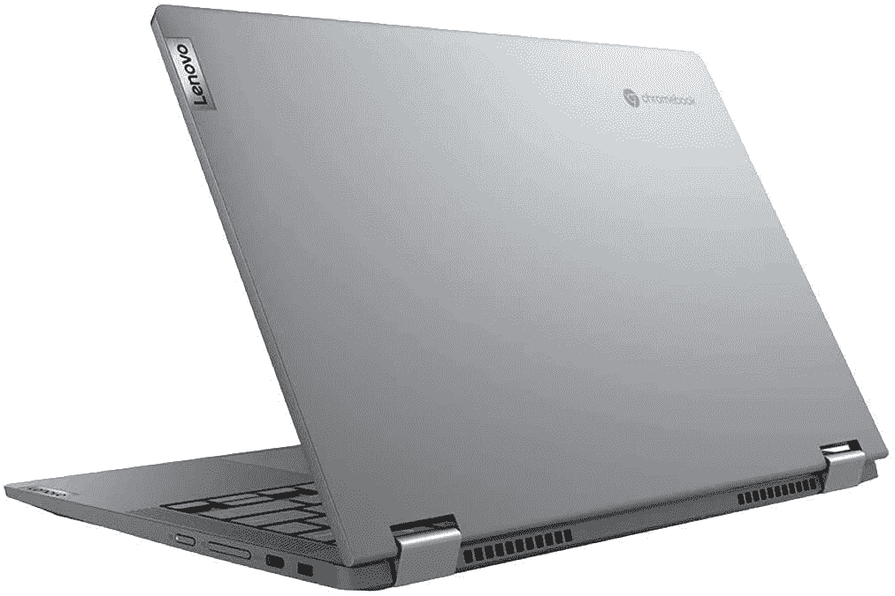

# 这款搭载酷睿 i3 处理器的联想 Chromebook 目前仅售 300 美元

> 原文：<https://www.xda-developers.com/lenovo-chromebook-flex-5-deal-2/>

# 这款配备酷睿 i3 和 1080p 屏幕的联想 Chromebook 目前仅售 300 美元

联想 Chromebook Flex 5 售价 300 美元，配备英特尔酷睿 i3 处理器、4GB 内存和 64GB 存储空间。

Chromebooks 是最受欢迎的电脑之一，这要归功于其简单的设计、与谷歌服务的集成以及广泛的 Android 应用支持。目前较好的中端机型之一是联想 Chromebook Flex 5，配有第 10 代英特尔处理器和 1080p 大触摸屏，现在你可以以 299.99 美元的价格买到酷睿 i3 机型。

这款在售的特定型号拥有英特尔酷睿 i3-10110U 处理器、4GB DDR 4 内存、64GB eMMC 固态存储和 13 英寸 1080p 触摸屏。Flex 5 是一款 2 合 1 笔记本电脑，因此您可以旋转显示屏，像使用一个巨大的平板电脑一样使用笔记本电脑。你还可以获得大量的连接选项，包括两个 USB Type-C 端口(也用于充电)，一个 USB Type-A 连接器，一个 3.5 毫米音频插孔，Wi-Fi 6 和蓝牙 5.0。

 <picture></picture> 

Lenovo Chromebook Flex 5 ($60 off)

##### 联想 Chromebook Flex 5

这款配备酷睿 i3 CPU 和 4GB RAM 的 Chromebook 售价 300 美元，非常划算。

像所有现代的 Chromebooks 一样，Flex 5 可以在虚拟化的容器中运行 Chrome 的 web 应用程序、大多数 Android 应用程序和一些 Linux 软件。谷歌表示，Flex 5 最早将在 2028 年 6 月之前继续接收 Chroem 操作系统更新[。](https://support.google.com/chrome/a/answer/6220366?hl=en#zippy=%2Clenovo)

如果这款 Chromebook 不是你想要的，看看我们的[最佳 chrome book](https://www.xda-developers.com/best-chromebooks/)综述。我们已经在每个价格范围内挑选了最佳选项，所以无论你是为自己还是为节日礼物购物，你都应该能够找到理想的 Chromebook。