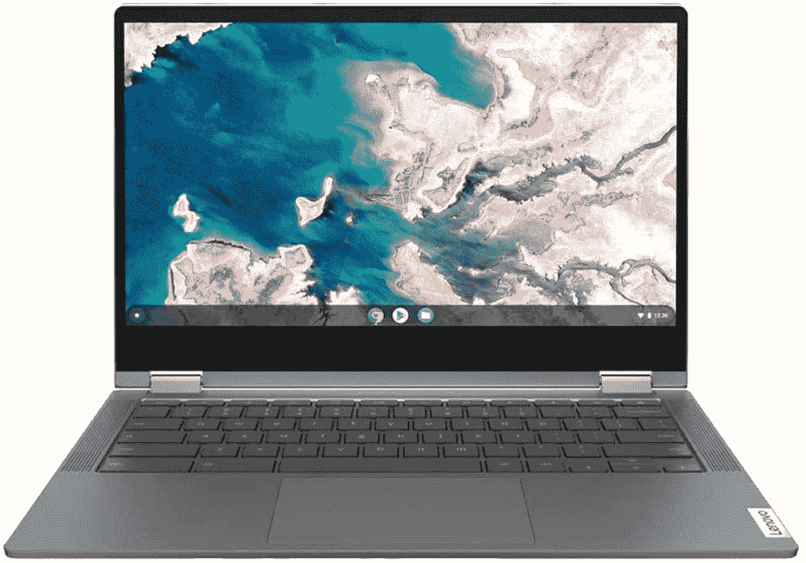

# 联想 Chromebook Flex 5 现在在亚马逊上便宜 120 美元！

> 原文：<https://www.xda-developers.com/lenovo-chromebook-flex-5-prime-day/>

# 联想 Chromebook Flex 5 现在在亚马逊上便宜 120 美元！

联想 Chromebook Flex 5 目前在亚马逊上的折扣价仅为 310 美元。按照帖子中的链接，在交易到期前获得一个。

如果你想买一台新的 Chromebook，那么你很幸运。联想 Chromebook Flex 5 目前在亚马逊的 Prime Day 销售中以 120 美元的折扣出售，这个价格非常划算。Chromebook 配备了 13 英寸 FHD (1920 x 1080)触摸屏，英特尔第十代酷睿 i3 处理器，4GB 内存和 64GB 存储空间。请继续阅读，了解有关 Chromebook Flex 5 的更多信息。

尽管其硬件似乎不够强大，但联想 Chromebook Flex 5 足以顺利运行 Chrome OS。它的英特尔酷睿 i3-1011 处理器足以处理大多数任务，4GB RAM 足以满足日常使用，尽管 64GB 的板载存储并不多，但 Chromebook 提供了一个不错的端口选择，可供进一步扩展。它包括两个 USB 3.1 Gen 1 Type-C 端口、一个 USB 3.1 Gen 1 Type-A 端口和一个 3.5 毫米耳机/麦克风组合插孔。

顾名思义，联想 Chromebook Flex 5 还配备了 360 度转轴，可以作为平板电脑使用。这对于学生来说是一个很好的选择，他们想要一个方便的设备，可以用来在课堂上做笔记。Chromebook 甚至包括一个相当大的电池，一次充电可使用长达 10 小时，这使它成为一个更好的大学伴侣。其他连接选项包括 Wi-Fi 6 和蓝牙 5.0。

点击下面的链接，你可以在亚马逊上以 310 美元的价格买到 Chromebook Flex 5。然而，该交易仅适用于 Prime 会员。如果你没有 prime 会员资格，你可以看看我们的最佳 Chromebooks 列表。

 <picture></picture> 

Lenovo Chromebook Flex 5

##### 联想 Chromebook Flex 5

联想 Chromebook Flex 5 在亚马逊 Prime Day 销售期间以 120 美元的折扣出售。以折扣价，这是你现在能买到的最物有所值的 Chromebooks 之一！