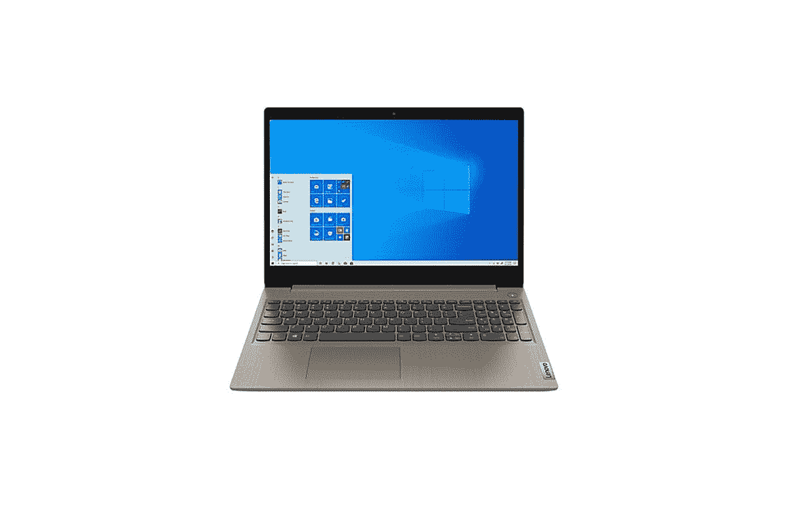
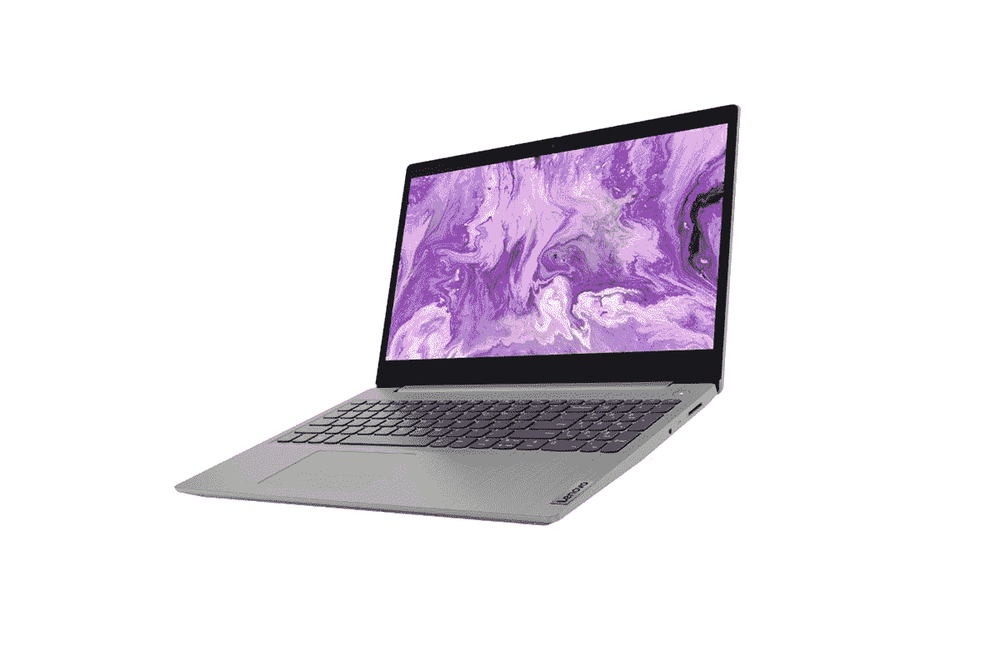

# 在这个黑色星期五，联想 IdeaPad 3 是一款非常棒的第一台或入门级笔记本电脑，仅售 230 美元

> 原文：<https://www.xda-developers.com/lenovo-ideapad-3-black-friday-sale-staples-best-buy/>

# 在这个黑色星期五，联想 IdeaPad 3 是一款非常棒的第一台或入门级笔记本电脑，仅售 230 美元

如果你正在为你的基本工作寻找一台新的笔记本电脑，那么联想将在这个黑色星期五以折扣价出售 IdeaPad 3。

个人电脑和笔记本电脑市场见证了今年需求的强劲增长，这都是由于冠状病毒疫情。随着组织和学校转向在家工作/学习协议，越来越多的人开始投资在家中建立自己的办公室/书房。如果你也打算这样做，但还没有设法购买一台[大笔记本](https://www.xda-developers.com/best-laptops/)，那么联想 IdeaPad 3 将在这个黑色星期五以折扣价出售。

 <picture></picture> 

Lenovo IdeaPad 3

##### 联想 IdeaPad 3

这是联想 IdeaPad 3 的入门级版本，应该适合基本的办公和学校工作。保持你的期望，你会有惊喜。

配备英特尔奔腾处理器的笔记本电脑基本型号在 Staples 上的售价为 230 美元，而配备第 10 代英特尔酷睿 i5 处理器的更强大型号在百思买上的售价为 250 美元。联想的 IdeaPad 3 是一款日常笔记本电脑，适合您的基本办公或学校工作。基本型号采用主频为 2.4GHz 的英特尔奔腾黄金 6405U 双核处理器，配有 1TB 硬盘存储和 4GB DDR 4 RAM。15.6 英寸的显示屏配有全高清 1920 x 1080 分辨率，电池据说可以持续约 9 小时。该笔记本预装了 Windows 10 Home。

 <picture></picture> 

Lenovo IdeaPad 3

##### 联想 IdeaPad 3

IdeaPad 3 的这一特定型号适合想要比基本笔记本电脑更多的消费者。酷睿 i5 处理器以及 256GB 固态硬盘和 12GB 内存应该可以为日常任务提供一些不错的性能。

如果您需要更高的性能，请选择酷睿 i5 型号。这款电脑配备了英特尔酷睿 i5-1035G1 CPU，12GB 的 DDR4 内存，256GB 的固态硬盘存储，据称电池续航时间为 7.5 小时。如果你想超越仅仅浏览和观看视频，这台机器肯定会运行得更快，提供更好的性能。虽然它也有相同的 15.6 英寸显示屏，但分辨率较低，为 1366 x 768 像素。这一款预装了 Windows 10 Home S，但可以免费切换到普通的 Windows 10 Home。

两款笔记本电脑都配有 Wi-Fi、蓝牙、一个 HDMI 端口、一个 SD 卡插槽、一个耳机麦克风插孔组合、一个 USB 2.0 Type-A 端口和两个 USB 3.0 Type-A 端口。你可以根据你的需要和预算来选择。