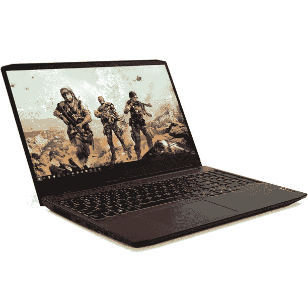

# 这款配有 RTX 3050 的联想游戏笔记本目前仅售 749 美元

> 原文：<https://www.xda-developers.com/lenovo-ideapad-3-deal-december-2021/>

联想出售一些最好的游戏笔记本电脑，即使你不想花很多钱。IdeaPad 3 是该公司的预算选项之一，现在一款配备锐龙 5 处理器和 RTX 3050 显卡的型号在沃尔玛售价为 749.00 美元。这比原价节省了 100 美元。

在售的型号有一个 [AMD 锐龙 5 5600H 处理器](https://www.amd.com/en/products/apu/amd-ryzen-5-5600h)，有 6 个核心，12 个线程，最大加速时钟为 4.2GHz。你还可以获得一个 15.6 英寸 120Hz IPS 屏幕，用于超级流畅的游戏，8GB 内存和 512GB PCIe 固态硬盘。联想没有说明显卡是普通的 RTX 3050 还是 RTX 3050 Max-Q(后者功率更低)，但无论哪种方式，它都应该可以在原生 1080p 分辨率下处理大多数游戏，没有太大问题。不过，您可能需要降低图形选项，以达到 144Hz 的最大刷新率。

 <picture></picture> 

Lenovo IdeaPad 3 Gaming Laptop

##### 联想 IdeaPad 3

这款经济型游戏笔记本电脑售价 749 美元，是一个不错的选择。

这款笔记本电脑只有 8GB 的内存，这有点令人恼火，但它至少可以升级到 32GB，这样你就可以添加更多的内存。你还可以获得大量的连接选项，包括 HDMI 2.0 连接器，以及带 1.5 毫米按键行程的背光(但不是 RGB)。

如果这不是你想要的笔记本电脑，看看我们的[最佳游戏笔记本电脑](https://www.xda-developers.com/best-gaming-laptops/)综述。我们测试了来自联想、雷蛇、惠普、技嘉、雷蛇、外星人和其他制造商的选项，以找到各自价位的最佳笔记本电脑。无论您是在寻找像 IdeaPad 3 这样的经济型电脑，还是能够与桌面游戏电脑竞争的更强大的笔记本电脑，我们都能满足您的需求。