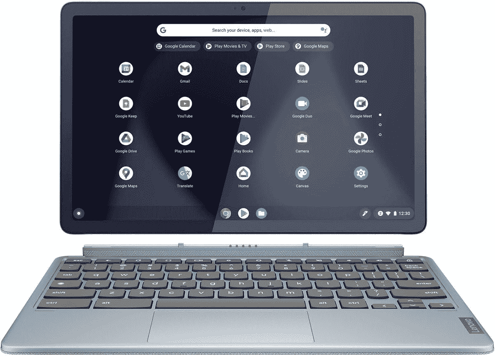

# 点评:出色的联想 IdeaPad Duet 3 Chromebook 平板电脑

> 原文：<https://www.xda-developers.com/lenovo-ideapad-duet-3-chromebook-review/>

最初的[联想 Chromebook Duet](https://www.xda-developers.com/lenovo-chromebooks-ideapad-duet-ideapad-flex-5/) 是一款有趣的设备。我买了一个，我很喜欢。基于平板电脑的便携式外形和专为笔记本电脑设计的操作系统是一大亮点。因为我可以在平板电脑上使用我真正想用的几个 Android 应用程序。硬件很棒，显示器真的很好，键盘虽然小，但很适合打字。它只有一个问题:它真的很慢。ChromeOS 在基本硬件上表现得足够好，但 Duet 中的联发科 CPU 真的没有达到标准。

。bestawarddiv {

浮动:对；

宽度:20%；

边距:1em

边距-顶部:0；

}

但联想并没有放弃，事实上还翻倍了。后续，其实还有两款 Duet Chromebook 平板可以选择。我们已经是[联想 IdeaPad Duet 5 Chromebook](https://www.xda-developers.com/lenovo-ideapad-duet-5-chromebook-review/) 的忠实粉丝，但现在是时候看看这两款中较小的一款，以及第一代的直接继任者了。联想 IdeaPad Duet 3 Chromebook 除了有点拗口之外，还是一款运行 ChromeOS 的 11 英寸平板电脑，保持了最初的想法。

看起来，这些变化可能很难被发现。这是一个公平的说法。联想最重要的升级是内部升级，升级到了高通的骁龙 7c。二重唱不再缓慢。这款更容易推荐，也不需要添加警告，是你现在能买到的最好的 Chromebooks 之一。

 <picture></picture> 

Lenovo IdeaPad Duet 3 Chromebook

##### 联想 Chromebook Duet 5

联想最新的小型 ChromeOS 平板电脑基本保持不变，但做出了一些重大改进。

**浏览此评论:**

## 联想 IdeaPad Duet 3 Chromebook:盒子里是什么？

购买联想 IdeaPad Duet 3 Chromebook 时，包装盒中包括:

*   联想 IdeaPad Duet 3 Chromebook。
*   带支架的卡扣式后盖。
*   可拆卸键盘。
*   30W USB-C 电源适配器。

*本次评测使用的是联想提供的联想 IdeaPad Duet 3 Chromebook 样品。联想从未对这篇文章的内容发表过任何意见。*

## 定价和可用性

在美国，联想 IdeaPad Duet 3 Chromebook 现在可以从百思买订购，价格为 379 美元。这是针对 128GB/4GB 版本的(与我们的评测样本相同)。国际可用性，例如，英国，似乎还没有开始。

在撰写本文时，联想自己的商店也没有发货，因为它缺货，但将来会再次在那里上市。

与 IdeaPad Duet 3 Chromebook 配合使用的联想 USI Pen 2 在 Lenovo direct 上的售价为 34 美元，但在本次评测时仍被列为即将上市。

## 联想 IdeaPad Duet 3 规格

| 

规格

 | 

联想 IdeaPad Duet 3

 |
| --- | --- |
| **显示** | 

*   10.95 英寸 2K 液晶触摸屏
*   5:3 宽高比

 |
| **处理器** | 

*   高通骁龙 7c 第二代计算平台

 |
| **公羊** | 

*   高达 8GB LPDDR4 (4GB 型号已测试)

 |
| **储存** |  |
| **电池** | 

*   长达 12 小时
*   支持 45W 充电(含 30W 充电器)
*   快速充电

 |
| **摄像机** | 

*   500 万像素前置网络摄像头
*   800 万像素后置摄像头

 |
| **端口** | 

*   2 个 USB-C 3.0 Gen 1，带电源传输
*   弹簧针

 |
| **连通性** | 

*   802.11ac 无线
*   蓝牙 5.1

 |
| **音频** |  |
| **尺寸和重量** | 

*   258.04 毫米 x 164.55mm 毫米 x 7.90mm 毫米/ 10.16 x 6.48 x 0.31 英寸
*   516 克起

 |
| **其他功能** | 

*   USI 2.0 笔支持(不含)
*   包括支架和可拆卸键盘

 |

## 设计和特点:如果它没有坏，就不要修理它

*   带可拆卸支架的 11 英寸平板电脑。
*   包括一个可拆卸的键盘。
*   支持 USI 2.0 数字笔输入。

IdeaPad Duet 3 Chromebook 背后的基本概念与其前身相同。大小差不多，它还有一个支架(如果你想要的话)和一个可拆卸的键盘。但是最初的设计肯定是经过改进的。边框更窄，因此 Duet 3 的屏幕比其前身多 15.8%。支架也有所改进，与平板电脑背面的连接更加牢固。它现在还拥有一个切口，如果你选择购买一支笔，你可以在那里用磁力夹住你的笔。

挡板现在更窄了，所以在不增大平板电脑的情况下，屏幕更大了。

虽然这次支架感觉好了一点，但键盘并没有真正改变。使用弹簧针的连接非常牢固，但事实上它有一个薄的织物铰链，仍然不太理想。首先，你不能像微软的 Surface Type cover 那样提高键盘的角度。它是平的还是平的，那是你的选择。这不会完全破坏体验，但如果有机会，我会随时尝试。

另一个可能更大的问题是，织物铰链至少在这个审查样本中，平板电脑部分从来没有感觉到它与键盘正确对齐。它快把我逼疯了。显示屏似乎总是与水平面成一个小角度。太让人沮丧了。它让我在最初的时候感到沮丧，现在仍然让我感到沮丧。

尽管打字没问题，但这仍然更重要。ChromeOS 的搜索按钮相当小，这是我喜欢的，因为它更难被意外击中，而触控板对于这种类型的东西来说出奇的好。尽管受到小外形的限制，但它带有完整的 ChromeOS 键盘布局和光标键。

你现在只能在 Duet 3 上使用联想的 USI 2.0 笔。

该显示器是一个不足 11 英寸的头发，但还不够远，我们不能称之为。对于那些喜欢它的人来说，装饰它的边框很好，很薄，虽然 5:3 不是最常见的长宽比，但也不会觉得奇怪。它略低于 16:9，但媒体填充得很好，2K 分辨率意味着文本清晰，一切看起来都很可爱。与大多数触摸显示屏一样，尽管它非常光滑，虽然它足够亮，可以在阳光明媚的日子里在户外使用，但你仍然会看到更多自己的脸。支架可以精确调整，所以你至少可以把它调整到最佳角度，以减轻环境光的干扰。

该显示器还支持数字笔，但有一个警告。它似乎只支持联想自己的 USI 2.0 数字笔，没有任何形式的向后兼容面板。在 [*Chrome Unboxed*](https://chromeunboxed.com/lenovo-usi-pen-2-chromebook-duet) 的团队对此进行了深入研究(我们的样本没有带笔)，所以如果你对 Duet 3 感兴趣，值得一试。无论如何，你可能会想要联想的笔，因为它会整齐地附着在支架背面的小切口上。

其他值得注意的事情包括连接。这是对原来 Duet 的升级，现在有一对 USB-C 端口，两者都有供电功能。每侧各有一个，充电既舒适又方便。耳机插孔的粉丝会失望，因为没有一个。盒子里也没有电子狗，所以如果你想使用有线耳机，你必须自己提供。

不过，扬声器很不错。没有什么突破性的，它们很小，但你得到了一对和适当的立体声。它让即兴观看陌生事物变得非常愉快。

### 将联想 IdeaPad Duet 3 Chromebook 用作平板电脑

你会购买其中一款的明显原因是它是一款功能强大的便携式 Chromebook。但 ChromeOS 也支持来自 Play Store 的 Android 应用程序，这意味着你可以非常容易地将它用作兼职 Android 平板电脑。

Duet 3 是 Android 平板电脑的一个引人注目的替代品。

但事实是，这款**是一款紧凑的平板电脑，值得像平板电脑一样使用。因为骁龙 7c Gen 2(下面会详细介绍)比联想以前使用的联发科 CPU 好得多，所以你实际上可以做到。整体表现相当不错。谷歌也有一些功劳，因为 ChromeOS 在这样的触摸屏上使用越来越舒适。**

在上一代 Duet 上，只是滑动到 home 是一种神经过敏的混乱，但在这一款上，它很平滑，流畅，正是你想要的那种体验。该设备的尺寸非常适合手机游戏，尤其是阅读。因为它非常小巧，你可以随身携带，在任何地方使用。游戏有点混杂，但对于阅读、观看视频、浏览等来说，它非常棒。

## 性能和电池寿命

*   最新的高通 CPU 是对原来二重奏的巨大改进。
*   体面但不突出的电池寿命。
*   4GB 内存有时仍会影响 ChromeOS。

如果说联想在 Duet 3 中升级了 CPU，这是一种保守的说法。骁龙 7c Gen 2 是一个巨大的改进。它实际上比第一代 7c 更上一层楼，所以在像 Duet 3 这样的紧凑设备中拥有它令人印象深刻。没有风扇，所以它总是很安静，而且由于键盘不是 Chromebook 的一部分，即使在负载下，你也不会感觉到任何温暖。平板电脑的金属背面可以升温，但不会比你从骁龙驱动的智能手机上体验到的更多。

那就去基准吧。我们对 IdeaPad Duet 3 进行了一系列 ChromeOS 友好的基准测试。为了便于比较，我们列出了运行第一代 7c 的宏碁 Chromebook Spin 513 和当前性能最佳的惠普 Elite 蜻蜓 Chromebook 的一些可比数据。

| 

基准

 | 

联想 IdeaPad Duet 3

 | 

宏碁 Chromebook Spin 513

 | 

惠普精英蜻蜓 Chromebook

 |
| --- | --- | --- | --- |
| **北海巨妖 Javascript(越低越好)** | 1,865 | 2,342 | 524 |
| **Jetstream 2(越高越好)** | 没有完成 | 没有完成 | 201 |
| **辛烷值 2.0(越高越好)** | 20,970 | 18,101 | 79,782 |
| **WebGL 水族馆(万条鱼)** | 29 FPS | 不适用的 | 60 FPS |
| **WebGL 水族馆(15000 条鱼)** | 20 帧/秒 | 不适用的 | 60 FPS |
| **WebGL 水族馆(20，000 条鱼)** | 16 FPS | 不适用的 | 34 FPS |

就纯粹的速度而言，IdeaPad Duet 3 无法与大击球手竞争，但它也不应该这样。它确实对其前身进行了重大改进，骁龙 7c Gen 2 实际上感觉像是属于 Chromebook 的 ARM CPU。

即使在使用 Linux 时，性能也令人惊讶地好，但 4GB 的 RAM 仍然不够。

除了合成测试，Duet 3 使用起来很愉快，甚至可以处理最令人生畏的测试，打开一堆 Chrome 标签。它有一点不足的地方是有 4GB 的 RAM，就像这个评测示例一样。一方面，它有助于压低价格，而且在很多情况下，它是充足的。但越多越好，ChromeOS 越来越倾向于 8GB 应该是最低要求。这不一定是联想的错，但作为组装硬件的公司，联想将承担不满。如果你能得到 8GB 内存的版本，那就一定要得到。这适用于所有的 Chromebooks。尤其是如果你打算使用 Android 应用和 Linux 的话。

Duet 3 上的 Linux 性能对于这种性质的设备来说也是不错的。你必须确保你使用的是 ARM 版本的软件，例如，微软 VS Code，但这个小小的 Chromebook 平板电脑做得还不错。与我自己的 Chromebook 相比，它感觉并不挣扎，我在编写这篇评论的整个过程中一直在 GIMP 中编辑照片。

不过，游戏就没那么令人印象深刻了。使用 Play Store 的 Android 游戏时，似乎仍然存在兼容性问题。表演也不是我想要的。即使像《奥拓历险记》这样简单的游戏也不是特别流畅。你可以明显地看到游戏在你面前晃动。对于 ARM Chromebook 来说，这令人失望，尽管它可能指向 7c 平台仍未解决的一些问题。我过去也有过类似的混合时间，使用的是第一代 7c 处理器的 Chromebook。然而，云游戏是完美的，在我使用它的整个时间里，Duet 3 一直是一个特别好的谷歌 Stadia 伴侣。

电池寿命是你可能期望比你实际得到的更多的地方。最初的二重奏内部有一个相当节俭的 CPU。这个没有。然而，它很容易离开充电器一整天。待机时间非常好，我从来没有带着 Duet 3 离开过家，需要充电器。在现实世界中，你可能会得到长达 10 个小时的混合使用，但对我来说，它更像是 8 或 9 个小时。但是如果需要的话，你也可以用和手机一样的充电器给它充电。

## 谁应该购买联想 IdeaPad Duet 3？

*   IdeaPad Duet 3 是安卓平板电脑的绝佳替代品。
*   小巧的尺寸和实惠的价格非常适合学生。
*   在联想的数码笔更容易买到之前，它不是数码笔爱好者的最佳选择。

人们对 ChromeOS 平板电脑进行了多次尝试，但最终感觉我们真的做到了。它实际上是一款你最终可以推荐的产品，如果你想要更大的显示屏，联想有 Duet 3 和 Duet 5。仍然有可以改进的地方，其中一些需要来自谷歌。但总的来说联想 IdeaPad Duet 3 是一款值得推荐的 Chromebook。

联想 IdeaPad Duet 3 是你能买到的最好的 Chromebook 平板电脑。

首先，它是安卓平板电脑的理想替代品。小到足以便携，并能舒适地与你最喜欢的 Android 应用程序一起使用，但 ChromeOS 更适合实际的计算机使用。在一台设备中同时拥有笔记本电脑和平板电脑的多功能性是不容忽视的。这也是它成为学生的绝佳选择的原因。如果笔是你的关键需求之一，那么它可能不是现在的最佳选择，但当联想的更容易获得时，它是为这款设备量身定制的，而且非常实惠。

作为备受喜爱的 Chromebook 的后续产品，这无疑是一部值得一看的续集。原始二重唱的所有魅力仍然存在，但最大的缺点得到了显著改善。如果你想在市场上购买一款 Chromebook，同时也是一款小型平板电脑，那么联想 IdeaPad Duet 3 是一款不错的选择。这也可以说是它自己和 Duet 5 之间的更好选择，提供非常相似的硬件。除非有机发光二极管或更大的显示屏真的很吸引人，否则这是你现在能得到的最好的 Chromebook 平板电脑。

 <picture></picture> 

Lenovo IdeaPad Duet 3 Chromebook

##### 联想 Chromebook Duet 3

联想对紧凑型 ChromeOS 平板电脑的第二次尝试非常成功，如果你想要一台 Chromebook 兼平板电脑，这是目前的最佳选择。