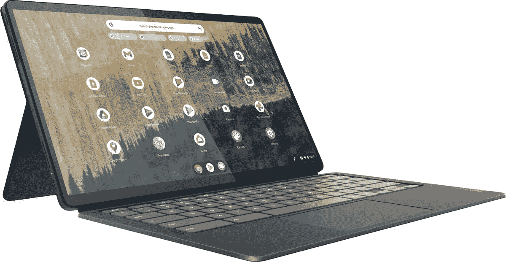

# 立即以 50 美元的价格购买全新的联想 IdeaPad Duet 5 Chromebook

> 原文：<https://www.xda-developers.com/lenovo-ideapad-duet-5-deal-jan-2022/>

最初的联想 Chromebook Duet 是一款非常受欢迎的 Chrome OS 平板电脑，得益于其低廉的价格和体面的性能，联想去年推出了一款新型号。升级后的型号拥有更快的硬件、更大的显示屏和其他有益的改进，现在你可以在百思买的易贝商店以 449 美元的价格买到它。这比通常的建议零售价低了 50 美元。

联想 IdeaPad Duet 5 Chromebook(好名字！)拥有 13.3 英寸 1080p 有机发光二极管触摸屏，8 核高通骁龙 7c 计算平台 Gen 2 芯片组，128GB 内部 eMMC 存储，谷歌的 Titan C 安全芯片和 8GB 内存。整个包装重 2.2 磅，厚度仅为 0.27 英寸。联想还在包装盒中包括一个可拆卸的键盘盖，但尽管这款平板电脑支持 USI 笔输入，但没有手写笔。

 <picture></picture> 

Lenovo IdeaPad Duet 5 Chromebook

##### 联想 Chromebook Duet 5

百思买在其易贝官方商店出售联想最新的 Chrome OS 平板电脑，售价低 50 美元。

谷歌表示，联想 IdeaPad Duet 5 Chromebook 最早将在 2029 年 6 月之前获得新的 Chrome OS 更新[，因此在你准备替换它之前，你可能不必担心该软件被淘汰。](https://support.google.com/chrome/a/answer/6220366?hl=en#zippy=%2Clenovo)

[去年 12 月，我们回顾了联想 IdeaPad Duet 5 Chromebook](https://www.xda-developers.com/lenovo-ideapad-duet-5-chromebook-review) ，发现 Duet 5 可能是目前你能买到的最好的 Chrome OS 平板电脑。显示器是高质量的，骁龙芯片组提供了更长的电池寿命和体面的性能，可拆卸键盘可以随时将二重奏变成笔记本电脑。更大的内存将会受到欢迎，尽管 8GB 对于 Chrome OS 来说仍然足够了，只要你不试图同时处理几十个 Chrome 标签和几个 Linux/Android 应用程序。缺少包含的 styus 也是一个遗憾，但 USI 是一个行业标准，所以有很多第三方笔可以购买。

如果你想要一台 Chromebook，但 IdeaPad Duet 5 并不是你想要的，那么看看我们对最佳 chrome book 的综述。