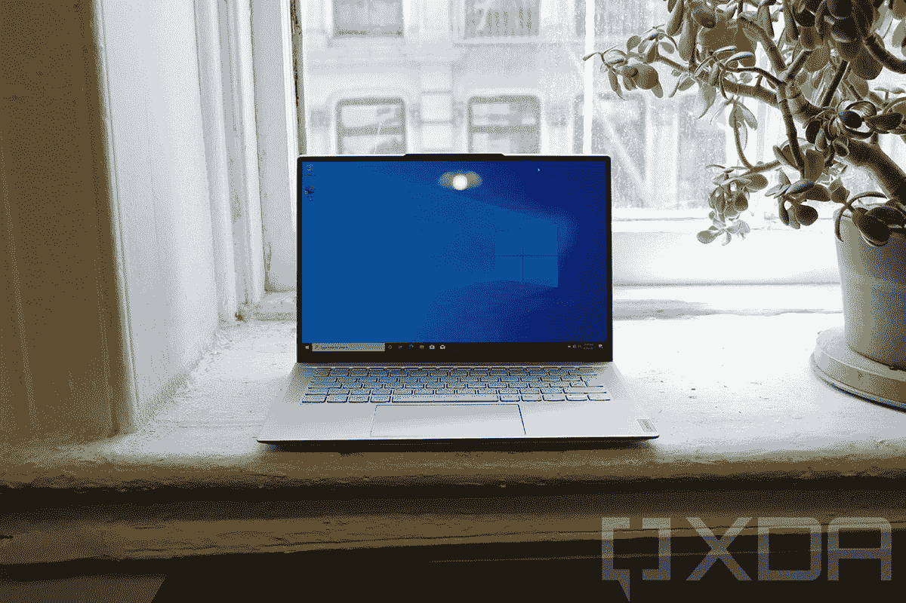

# 联想 IdeaPad Slim 7 Carbon 评测:甜蜜的有机发光二极管

> 原文：<https://www.xda-developers.com/lenovo-ideapad-slim-7-carbon-review/>

联想 IdeaPad Slim 7 Carbon 说起来有些拗口，但它也是一款[杀手级笔记本电脑](https://www.xda-developers.com/best-laptops/)。它始于重量不到 2.5 磅的机箱，但你可以在此基础上添加漂亮的 90Hz 有机发光二极管显示屏。凭借 AMD 锐龙 5000 的性能和 1，239.99 美元的价格，它开始感觉像一个便宜货。

。bestawarddiv {

浮动:对；

宽度:20%；

边距:1em

边距-顶部:0；

}

正如你所料，有一些缺点。它仍然有一个 720p 的网络摄像头，而不是今年将变得更加普遍的 1080p 传感器。此外，由于有机发光二极管显示器的 3K 分辨率和 90Hz 的刷新率，电池寿命不是很长。

尽管如此，IdeaPad Slim 7 Carbon 还是令人欣喜。这是一款大多数用户绝对会喜欢的超极本。

 <picture></picture> 

Lenovo IdeaPad Slim 7 Carbon

##### 联想 IdeaPad 超薄 7 碳

联想的 IdeaPad Slim 7 Carbon 绝对是一种享受。它有一个 90Hz 的有机发光二极管显示器，AMD 锐龙处理器，重量不到 2.5 磅。

**浏览此评论:**

## 联想 IdeaPad Slim 7 Carbon 定价和供货情况

*   联想 IdeaPad Slim 7 Carbon 现已上市，这款设备售价 1239.99 美元
*   Lenovo.com 上有另一个单元，增加了 MX450 图形和更多的存储空间。

联想 IdeaPad Slim 7 Carbon 是去年宣布的首批搭载 Windows 11 的电脑之一，现已上市。联想发给我的型号包括 AMD 锐龙 7 5800U、16GB 内存和 512GB 固态硬盘。从上面的链接可以在亚马逊上买到。

我能找到的其他配置只有一个，那就是 Lenovo.com[的](https://shop-links.co/link/?exclusive=1&publisher_slug=xda&article_name=Lenovo+IdeaPad+Slim+7+Carbon+Review%3A+An+OLED+screen+in+a+laptop+that+weighs+under+2.5+pounds&article_url=https%3A%2F%2Fwww.xda-developers.com%2Flenovo-ideapad-slim-7-carbon-review%2F&u1=UUxdaUeUpU139&url=https%3A%2F%2Fwww.lenovo.com%2Fus%2Fen%2Fp%2Flaptops%2Fideapad%2Fideapad-700-series%2Fideapad-slim-7-%2814%E2%80%9D%2C-amd%29-laptop%2Flen101i0024)。它配备了相同的处理器和内存，但有一个 1TB 的固态硬盘和一个 NVIDIA GeForce MX450 专用 GPU。

所有型号都配有 14 英寸 2，880x1，800 90Hz 有机发光二极管显示屏，这是您应该购买这款笔记本电脑的真正原因。

## 联想 IdeaPad 超薄 7 碳纤维规格

| 

处理器

 | AMD 锐龙 7 5800U 1.9GHz，4.4GHz(最大值) |
| 

制图法

 | AMD 镭龙显卡(集成) |
| 

身体

 | 14.9 x 313 x 214.5 毫米(0.59 英寸 x 12.32 英寸 x 8.44 英寸)，1.1 千克(2.43 磅) |
| 

显示

 | 14 英寸(16:10)有机发光二极管 2.8K (2880x1800)，100% DCI-P3，400 尼特，杜比视界，多点触控 |
| 

记忆

 | 16GB 双通道 LPDDR4x-4266 |
| 

储存；储备

 | 512GB M.2 2280 固态硬盘 |
| 

连通性

 | Realtek Wi-Fi 6 802.11ax (2 x 2) +蓝牙 5.1 |
| 

港口

 | 1 个 USB-C 3.2 Gen 1(仅支持数据传输)2 个 USB-C 3.2 Gen 2(支持数据传输、电源传输 3.0 和显示端口 1.4)1 个耳机/麦克风组合插孔(3.5 毫米) |
| 

声音的

 | 2 个 3W(侧面低音扬声器)，2 个 2W(前置高音扬声器)，杜比品牌，杜比全景声优化 |
| 

键盘

 | 6 排多媒体 Fn 键，LED 背光 |
| 

触摸屏设备

 | 无按钮玻璃表面多点触控触摸板，精密触摸板 |
| 

电池

 | 61 瓦时，支持快速充电(充电 15 分钟可运行 3 小时) |
| 

照相机

 | IR & 720p，带 TOF 传感器，定焦，电子相机快门 |
| 

材料

 | 顶部:碳纤维底部:镁-铝 |
| 

颜色

 | 云灰色 |
| 

操作系统（Operating System）

 | Windows 11 主页 |
| 

价格

 | $1,239.99 |

## 设计:联想 IdeaPad Slim 7 Carbon 的重量不到 2.5 磅

*   它太轻了，你会忘记它在你的包里。
*   云灰色是一种浅银色。
*   USB Type-C 端口受到限制。

IdeaPad Slim 7 Carbon 由镁铝和碳纤维制成，重量为 2.43 磅，对于消费者笔记本电脑来说轻得令人难以置信。由于盖子是由碳纤维制成的，它不像许多超轻镁基笔记本电脑那样感觉廉价和可塑。

重量对携带的感觉有很大的影响，即使它和三磅的笔记本电脑只有半磅的区别。当它在你的包里时，感觉那里什么都没有。太棒了。

当 IdeaPad Slim 7 Carbon 放在你的包里，感觉那里什么都没有。

它有一种联想称之为云灰色的颜色，而不是更像青铜色的风暴灰色。云灰色更像是一种浅银色，我很确定它之所以这么叫是因为联想喜欢把东西叫做灰色，并以天气来命名这种颜色。这有点像惠普过去用“暗灰银”作为黑色的一种奇特说法。就我个人而言，我认为云灰色非常时尚，因为我经常发现风暴灰色的暗色调有点沉闷。如果你要在两者之间选择，那就选云灰色吧。

至于品牌，联想仍然把它的标志放在角落里，它是唯一一个没有在中间放一个大而性感的标志的主要 OEM 厂商。它给了该公司的消费者笔记本电脑一个基本的外观。

至于端口，都是 USB Type-C，我不是在抱怨。然而，我将抱怨港口的选择。显然，没有迅雷，这是基于 AMD 的笔记本电脑的预期。如果是锐龙 6000，联想可能要等几个月才能买到，那么它可能就是 USB4。

这不是我真正抱怨的。问题是左边的两个 USB Type-C 端口与右边的非常不同。左边的两个是 USB 3.2 Gen 2，支持 10Gbps 数据传输速度，DisplayPort 和电源传输。右边的是*只是* 5Gbps 的数据传输。

这肯定是一个痛点，因为你要求用户知道三个看起来相同的端口之间的区别，只有右边的一个被标记为超高速；另外两个根本没有真正的标签。我个人是把右边的端口留在充电器上才发现它的局限性，没充电。

右边还有一个相机隐私开关。这使用了我以前在一些惠普笔记本电脑上见过的方法，它实际上从内部断开了摄像头。我确实喜欢隐私卫士的这种方法，因为它非常简单，但它确实存在一些问题。

首先，相机上没有任何物体。甚至当惠普在几代之前在其 Spectre 系列产品上使用该功能时，它在下一代产品中添加了物理防护。对于一个围绕不信任设计的功能，我不认为用户希望信任相机内部断开连接。除了信任之外的另一个问题是，没有办法知道相机是断开的。我曾经接到一个电话，电话里说找不到我的相机，我不知道为什么。我后来意识到我把这个开关打开了。

总的来说，这是一个设计良好的笔记本电脑，我真的想把它携带起来有多轻锤回家。重量为 2.43 磅，令人欣喜，但真正让它脱颖而出的是有机发光二极管显示器。

## 展示:那个可爱的有机发光二极管

*   14 英寸 2.8K 90Hz 有机发光二极管显示器绝对华丽。
*   网络摄像头还是 720p。

这是你在笔记本电脑上能找到的最好的显示器之一，是的，那是因为它是有机发光二极管的。它是 14 英寸，分辨率为 2，880x1，800，宽高比为 16:10。它还有 90Hz 的刷新率，所以动画非常流畅。不过默认情况下这是不打开的，所以你必须确保它在设置中是打开的。

有机发光二极管的展示绝对是华丽的。

因为它在屏幕上使用了有机发光二极管技术，这意味着黑色更黑，颜色更鲜艳。这是一个令人惊叹的显示器，它是标准配置，这真的很酷。对于大多数有机发光二极管笔记本电脑来说，你不得不选择一些超级昂贵的超高端型号。这款笔记本电脑的售价刚刚超过 1200 美元，是有机发光二极管价格最低的笔记本电脑之一。

正如你所看到的，色域测试结果尽善尽美，支持 100% sRGB、96% NTSC、98% Adobe RGB 和 100% P3。

亮度达到 401.2 尼特，刚好超过承诺的 400 尼特。对比度最大值为 27，300:1，远远超过非有机发光二极管笔记本电脑的 1000:1 左右。事实上，它可能远远高于 27，300:1，因为黑人尽可能接近真正的黑人。

坏消息是。虽然边框很窄，但网络摄像头仍然很小，只有 720p。显然，如果你考虑在家工作，你会寻找一个 FHD 摄像头。此外，在反向凹槽中还有一个红外摄像头和一个 TOF 传感器，用于 Windows Hello 和联想所谓的零接触登录。这个想法是，当你在笔记本电脑前时，它会感应到，醒来，使用 Windows Hello 知道它是坐在那里的*你*，并让你登录，所有这些都不需要你触摸任何东西。

## 键盘:联想消费设备的标准配置

*   键盘背光，触摸板大。
*   音频质量非常好，这是一个优秀的流媒体盒。

就输入而言，这里真的没有什么可看的。这是一个非常标准的键盘，这很好。

联想的键盘真的很好，这是它在 ThinkPads 上的声誉，但它也适用于像这样的消费者个人电脑。正如你所料，它是背光的，坦率地说，规格表上关于键盘的那一行是联想的评论指南中关于它的所有内容，所以我们将保留它。

我非常喜欢的一点是，Precision touchpad 既漂亮又大，充分利用了大部分可用空间。它给你更多的活动空间。

优秀的扬声器结合有机发光二极管显示器使这成为一个伟大的流媒体盒。

键盘两侧是立体声扬声器，听起来非常棒。有两个 3W 低音扬声器和两个 2W 高音扬声器，所以如果你对音频质量感兴趣，它们非常强大。这也意味着这是一个非常棒的流媒体盒子。有了漂亮的显示器和出色的音频，在这里看电影是令人愉快的。

## 性能:联想 IdeaPad Slim 7 Carbon 配备 AMD 锐龙 5000 处理器

*   AMD 锐龙 5000 处理器是伟大的，但有一个大的性能打击时，他们运行在电池上。

联想 IdeaPad Slim 7 Carbon 配有一台 AMD 锐龙 7 5800U，联想发给我的这台设备有集成显卡。如果你想提高性能，可以使用 NVIDIA GeForce MX450 的另一种配置，但你可能不需要这样的笔记本电脑来做什么。这是一台生产力机器。

AMD 锐龙处理器有好有坏。好处是，你可以用这个价格获得大量的性能。看到像这样的包装以 1，239.99 美元的价格出售，真的令人印象深刻。这些天来，任何时候我觉得我们看到的高级笔记本电脑仍然有很多价值，它有一个 AMD 芯片在里面。

当电源线断开时，AMD 锐龙 5000 处理器的性能损失超过 20%。

坏消息是，AMD 锐龙笔记本电脑在没有插上电源的情况下会损失很多性能。即使您将电源滑块设置为最佳性能，也会有差异。如果你在做照片编辑之类的事情，你会切实感受到不同，所以这是值得注意的。在我的测试中，这款笔记本电脑在 PCMark 10 上的得分为 5，621，超过了英特尔提供的任何 U 系列笔记本电脑 400 多分。然而，在电池寿命方面，它的得分为 4295，接近英特尔第八代(威士忌湖)酷睿 i7。这对于一台高效的机器来说还是不错的，也就是说，如果你在浏览器或微软办公软件中工作。

对于基准测试，我使用了 PCMark 10、3DMark、Geekbench 和 Cinebench。请注意，所有这些测试都是在笔记本电脑接通电源的情况下进行的。

|  | 

IdeaPad 超薄 7 CarbonRyzen 7 5800U

 | 

[Surface Laptop Studio](https://www.xda-developers.com/surface-laptop-studio-review/) 酷睿 i7-11370H，RTX A2000

 | 

[ThinkPad X1 Carbon Gen 9](https://www.xda-developers.com/lenovo-thinkpad-x1-carbon-review/) 酷睿 i7-1185G7

 |
| --- | --- | --- | --- |
| 

PCMark 10

 | 5,621 | 5,573 | 5,168 |
| 

3DMark:时间间谍

 | 1,323 | 5,075 |  |
| 

极客工作台

 | 1,412 / 6,347 | 1,546 / 5,826 | 1,489 / 5,280 |
| 

电影院长凳

 | 1,377 / 8,222 | 1,504 / 6,283 | 1,303 / 4,224 |

您可以看到，在三台笔记本电脑中，IdeaPad 的 PCMark 10 总分最高。然而，当谈到单核性能时，两种英特尔处理器都做得更好，而 AMD 处理器上的额外内核使其在多核性能上更胜一筹。此外，由于专用图形，Surface Laptop Studio 在 3DMark 测试中表现得更好。

对于电池寿命，我能得到的最一致的结果是大约 4 小时 40 分钟。为了完全清楚，我把屏幕设置为 90Hz，电源滑块设置为最佳性能。就像我说的，锐龙处理器确实会因为电池寿命耗尽而损失相当多的性能，所以我不想降低功率滑块。至于刷新率，如果给你一个更高的刷新率，你会想要使用它。显然，如果你调整这些事情，你可以得到更好的电池寿命。

## 谁应该购买联想 IdeaPad Slim 7 Carbon？

联想 IdeaPad Slim 7 Carbon 是一款非常容易推荐的笔记本电脑。但一如既往，它并不适合所有人。

**谁应该买:**

*   想要一台高生产力笔记本电脑并且经常在旅途中的客户
*   希望获得出色流媒体体验的人

**谁不该买:**

*   需要高质量视频通话的人
*   需要专用显卡的创意专业人士或游戏玩家

这台笔记本电脑真是太棒了。它有一个漂亮的 90Hz 有机发光二极管显示器，AMD 锐龙 5000 电源，所有这些都在一个重量不到 2.5 磅的包中。

最大的缺点是高清网络摄像头。如果你经常进行视频通话，你会有这种感觉。此外，那个漂亮的显示器确实使用了大量的电池。

尽管如此，IdeaPad Slim 7 Carbon 还是那么容易让人爱上。