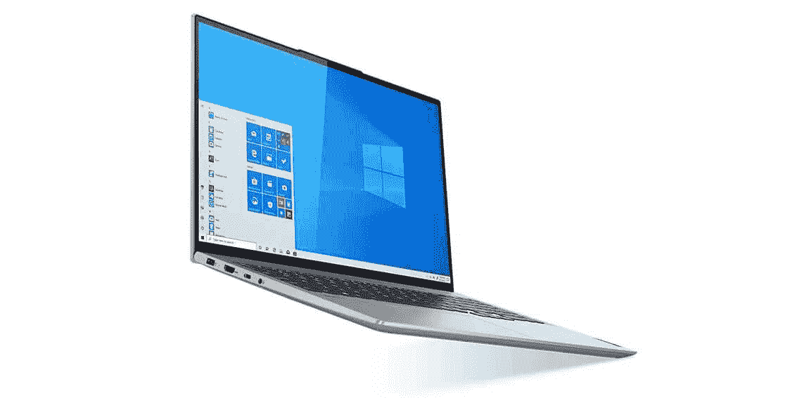

# 联想 IdeaPad Slim 7 Pro 16 评测:坚实的价值，共同的承诺

> 原文：<https://www.xda-developers.com/lenovo-ideapad-slim-7-pro-16-review/>

关于笔记本电脑中的 AMD 锐龙处理器的一个伟大的事情是，给定正确的用例，你可以以相对低廉的价格获得一些真正优质的性能。事实上，售价略高于 1200 美元的[联想](https://www.xda-developers.com/best-lenovo-laptops/) IdeaPad Slim 7 Pro 16 配备了 QHD+ 120Hz 显示屏、锐龙 7、英伟达 GeForce RTX 3050 GPU、16GB 内存和 1TB 固态硬盘。真是太贴心了。

当然，锐龙处理器也有很大的妥协，主要是当不连接电源时，性能会受到很大影响。此外，看到联想超越设计的极限真的很棒，因为它的笔记本电脑感觉有点乏味。

尽管如此，你真的不能击败这里的价值。对于一台 [creator 笔记本电脑](https://www.xda-developers.com/best-creator-laptops/)，它提供了你想要的东西，比如性能、出色的显示屏等等。

 <picture></picture> 

Lenovo IdeaPad Slim 7 Pro 16

##### 联想 IdeaPad Slim 7 Pro 16

联想的 IdeaPad Slim 7 Pro 提供了锐龙 7 处理器、RTX 显卡、120Hz 屏幕等等，非常便宜。

*关于此次评测:联想出于此次评测的目的，将 IdeaPad Slim 7 Pro 16 借给了 XDA 开发者。它对这篇文章的内容没有任何贡献。*

**浏览此评论:**

## 联想 IdeaPad Slim 7 Pro 16 价格和供货情况

*   联想 IdeaPad Slim 7 Pro 16 只在 Lenovo.com 销售，这款机型售价 1232 美元。

联想 IdeaPad Slim 7 Pro 16 于 2021 年 9 月发布，自去年年底开始上市。当然，“可用”这个词在这里是一个棘手的问题，因为即使在我审查它的时候，你似乎也买不到它。

联想发给我的这款产品售价为 1232 美元，在 Lenovo.com 有现货时出售。联想已经向我证实，它不会通过任何其他供应商销售这款笔记本电脑，所以如果你在 Lenovo.com 看不到它，就没有地方可以买到它。

有趣的是，当联想宣布这款产品时，它说它的起价为 1449 美元，所以它的售价低于这个价格。

## 联想 IdeaPad Slim 7 Pro 16 规格

| 

处理器

 | AMD 锐龙 7 5800H |
| 

制图法

 | 英伟达 GeForce RTX 3050 |
| 

显示

 | 16 英寸(16:10)有机发光二极管 WQXGA (2560x1600)，100% sRGB，500 尼特，显示器 HDR400，120Hz 刷新率，触摸屏 |
| 

身体

 | 17.4-19.99 毫米 x 247.42 毫米 x 356.81mm 毫米(. 69-.79 英寸 x 9.74 英寸 x 14.05 英寸)，起始重量为 2.08 千克(4.59 磅) |
| 

储存；储备

 | 1TB M.2 PCIe 固态硬盘 |
| 

记忆

 | 16GB 双通道 DDR4-3200 |
| 

电池

 | 75Wh，支持快速充电 |
| 

港口

 | 1 个 USB 3.2 Gen 11 个 USB 3.2 Gen 1(始终开启)1 个 USB-C 3.2 Gen 2(支持数据传输、电源传输 3.0 和 display port 1.4)1 个 HDMI 1.4b1x 读卡器 1 个耳机/麦克风组合插孔(3.5 毫米)1 个电源连接器 |
| 

连通性

 | Wi-Fi 6，802.11ax 2x2 Wi-Fi +蓝牙 5.1 |
| 

声音的

 | 2 x 2W 面向用户的杜比 Atmos 扬声器系统 |
| 

键盘

 | 6 排多媒体 Fn 键，LED 背光 |
| 

照相机

 | 红外照相机& 720p，带 ToF 传感器，定焦 |
| 

颜色

 | 云灰色或风暴灰色 |
| 

材料

 | 顶部/底部:铝 |
| 

操作系统（Operating System）

 | Windows 11 专业版 |
| 

价格

 | $1,232 |

## 设计:联想 IdeaPad Slim 7 Pro 16 是银色的，坦率地说，平淡无奇

*   这款笔记本电脑是银色的，在风格上没有什么区别。
*   没有霹雳或者 USB4。

联想 IdeaPad Slim 7 Pro 有两种颜色:云灰和风暴灰。虽然这些听起来很相似，都被称为灰色，并以天气命名，但它们不是。云灰只是银色的别称，完全正常，而风暴灰更多的是一种铜灰色。

个人觉得设计太平淡无奇了。它是银色的，又大又无聊。公平地说，有很多人希望从笔记本电脑中得到同样的东西，我理解。我要说的是，市场上有一些笔记本电脑，当你把它们带进星巴克时，它们会吸引一些眼球，而 IdeaPad Slim 7 Pro 16 不是其中之一。

它由全铝制成，重量刚刚超过 4.5 磅。对于这样的机器来说这是很标准的。毕竟，这是一台 16 英寸的笔记本电脑，配有 45W 处理器和专用显卡。你肯定会在包里感受到。它也很大，尽管对于 16 英寸的笔记本电脑来说这是不言而喻的。

没有 Thunderbolt 或者 USB4，你可能要等下一代了。

此外，正如您所期望的，像这样的大型产品有很多端口。在左侧，你会发现一个看起来像 USB Type-A 端口的电源端口，但它不是。还有 HDMI 1.4b、USB 3.2 Gen 2 Type-C 和一个耳机插孔。那个 USB 端口确实支持 DisplayPort 1.4，但很遗憾 HDMI 端口是 1.4b，因为 HDMI 1.4b 不支持 4K 显示器上的体面刷新率。如果没有 Thunderbolt 或 USB4，在输出方面，您的选择会受到限制。

这也值得记住。新锐龙 6000 笔记本电脑包括 USB4，和雷电 3 差不多；在此之前，你几乎可以得到标准的 USB 端口。换句话说，这是锐龙 5000 和更早版本中的一个真正的缺点，但在未来几代中已经得到了解决。

另一方面，有两个 USB 3.2 Gen 1 Type-A 端口，所以你只能获得 5Gbps 的速度，还有一个全尺寸的 SD 读卡器。就我个人而言，我是全尺寸 SD 卡读卡器的忠实粉丝，我很高兴看到这么多公司省略了它。

最终，设计是...好吧。它没有任何突出之处，因为它只是一台平淡无奇的铝制银色笔记本电脑。它有您需要的端口，但是有一些限制，如上所述。当然，正如我一开始就提到的，这里的价格很有价值。

## 显示屏:联想 IdeaPad Slim 7 Pro 16 拥有 120Hz QHD+屏幕

*   120Hz 的刷新率有助于流畅的动画。
*   网络摄像头还是 720p。

联想 IdeaPad Slim 7 Pro 16 拥有 16 英寸 16:10 QHD+ 120Hz 显示屏，所以相当不错。它在 16 英寸时更大，虽然它听起来只比 15.6 英寸大一点，但它是对角测量的，现在是 16:10。这意味着它更高，表面积更大。

120Hz 的刷新率很好看，但是影响电池寿命。

就个人而言，我认为 QHD 是解决问题的最佳地点，至少在大多数情况下是如此。它不会像 4K 显示器那样消耗能量，同时，你也不会得到 FHD 屏幕上的像素效果。我想大多数人都会同意，FHD 像素对于这么大的屏幕来说是不够的。

刷新率是 120 赫兹，这很好，有利于流畅的动画。问题是，如果你打开这个，它确实会影响电池寿命。这是在其他具有动态刷新率的产品中已经解决的问题，我希望在 PC 领域看到这一点，这样你就不必在漂亮、流畅的动画和无聊的旧 60Hz 屏幕之间进行选择。

测试结果不错，但不是很好。正如你所看到的，它支持 100%的 sRGB，这很好，但它支持 72%的 NTSC，77%的 Adobe RGB 和 78%的 P3，正如我所说，这很好，但不如戴尔 XPS 15。

在我的测试中，亮度达到了 465.4 尼特，比联想承诺的 500 尼特略低。不过，我不得不说，我对这个屏幕的亮度印象深刻。在一些照明条件下，我发现在全亮度下使用很不舒服，这是一件好事。这也使得它非常适合户外使用。

正如你所料，所有尺寸都有窄边框。顶部的反向凹槽和用于 Windows Hello 的红外摄像头，以及 720p 网络摄像头。事实上，在在家工作的时代，你可能会希望你有 1080p。这是我期望在下一代产品中看到的变化。

## 键盘:如果你想要一个数字键盘，联想可以满足你

联想又一次推出了优质背光键盘，既准确又舒适。由于尺寸的原因，它在主 QWERTY 键盘的右侧还有一个数字键盘。显然，这有点两极化。你要么想要号码簿，要么不想要，但它就在那里。

按键比你在 ThinkPad 上看到的要浅，但对于消费者笔记本电脑来说，它们是非常标准的，这很好。

它配有微软 Precision 触摸板，就像你对任何现代笔记本电脑的期望一样。这意味着它速度快，反应快，并支持您习惯的手势。

在键盘上方，你会发现杜比全景声系统，它由双 2W 扬声器组成。它们听起来棒极了，无论是打电话还是在办公桌上听音乐。

## 性能:AMD 锐龙 5000 插上电源后很棒，但电池寿命不行

*   同样，当机器没有连接到电源时，锐龙的性能会受到影响。
*   联想 IdeaPad Slim 7 Pro 16 的电池续航时间已经足够糟糕，以至于你总是需要带一个充电器。

联想 IdeaPad Slim 7 Pro 16 配备了锐龙 7 H 系列处理器和 NVIDIA GeForce RTX 3050 形式的专用显卡，考虑到它的其他好处(它甚至配备了 Windows 11 Pro)，它的价格仅为 1200 多美元。正如我一开始就提到的，使用 AMD Ruyzen 处理器是以更合理的价格提供优质性能的一种好方法。

只需要插上电源。我现在就告诉你，PCMark 10 的分数从插电时的 5，956 下降到没插电时的 4，193。性能下降了 29.6%。请注意，这两个测试都是在电源滑块设置为最佳性能的情况下进行的。我在 Photoshop 和 Lightroom 中编辑了很多照片，无论是连接电源还是不连接电源，你都可以感受到其中的差异。

当笔记本电脑没有插上电源时，性能下降了 29%。

电池寿命也有待提高。当屏幕设置为 120 赫兹时，我只花了两到三个小时，当屏幕设置为 60 赫兹时，也许我可以延长到四个小时，但这仍然不太可能。续航简直不行。没有充电器，你不能带着这台笔记本电脑去任何地方。

但就像我说的，当它插上电源时，性能是惊人的。对于基准测试，我使用了 PCMark 10、3DMark、Geekbench 5 和 Cinebench R23。所有这些都是插在笔记本电脑上的。

|  | 

IdeaPad 超薄 7 Pro 16 ryzen 7 5800h RTX 3050

 | 

戴尔 XPS 15 9510 酷睿 i7-11800H，RTX 3050 Ti

 | 

Surface 笔记本电脑 StudioCore i7-11370H，RTX A2000

 |
| --- | --- | --- | --- |
| 

PCMark 10

 | 5,956 | 5,988 | 5,573 |
| 

3DMark:时间间谍

 | 4,299 | 4,801 | 5,075 |
| 

极客工作台

 | 1,423 / 7,368 | 1,538 / 7,514 | 1,546 / 5,826 |
| 

电影院长凳

 | 1,371 / 10,587 | 1,491 / 9,399 | 1,504 / 6,283 |

正如您所看到的，当笔记本电脑接通电源时，基准测试分数与英特尔的第 11 代处理器相当。

## 谁应该购买联想 IdeaPad Slim 7 Pro 16？

显然，联想 IdeaPad Slim 7 Pro 16 并不适合所有人。事实上，这是针对创作者，或者至少是需要专用图形功能的人。

**谁应该购买联想 IdeaPad Slim 7 Pro 16:**

*   需要为他们的钱得到很多的创作者
*   大部分时间都与电源相连的人，或者至少在执行高耗电任务时与电源相连的人

**谁不应该购买联想 IdeaPad Slim 7 Pro 16:**

*   大部分时间依靠电池供电的用户
*   创作者可以不做太多的妥协
*   经常进行视频通话并关心网络摄像头质量的人

是这样的。如果你正在寻找一台面向创作者的笔记本电脑，你必须考虑你想花多少钱。如果你是一名专业人士，能够负担得起多花一点钱，你应该购买采用英特尔处理器的产品。如果你是一个业余爱好者或刚刚起步，AMD 公司锐龙可能更适合你。要考虑的一件大事是，当你没有连接到电源时，性能会下降近 30%。