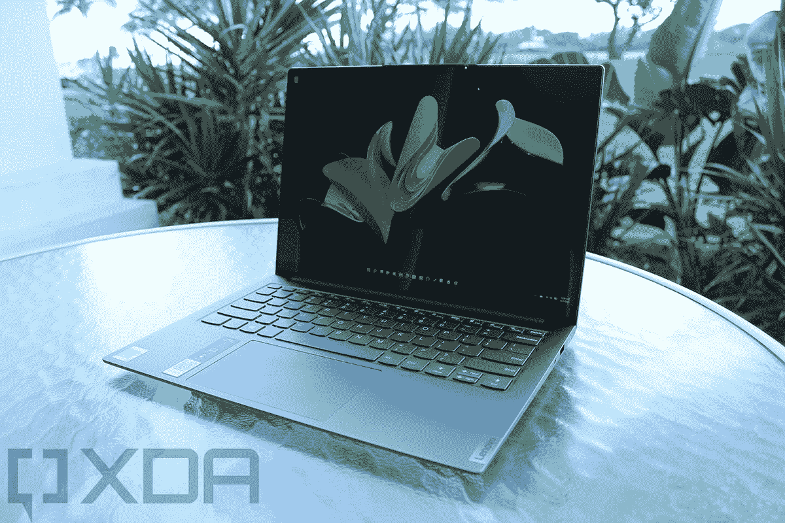

# 联想 IdeaPad Slim 7i Pro 评测:主流电脑的高端特性

> 原文：<https://www.xda-developers.com/lenovo-ideapad-slim-7i-pro-review/>

联想的新 IdeaPad Slim 7i Pro 是首批搭载 [Windows 11](https://www.xda-developers.com/windows-11/) 的笔记本电脑之一，如果你看看新笔记本电脑功能的一些趋势，这款笔记本电脑会选择正确的选项。首先，它有 90Hz 的显示屏，这一点我们在[华为的 MateBook 14s](https://www.xda-developers.com/huawei-matebook-14s-review/) 中也看到过，但微软在 [Surface Laptop Studio](https://www.xda-developers.com/surface-laptop-studio-review/) 和 [Surface Pro 8](https://www.xda-developers.com/surface-pro-8-review/) 中也使用了高刷新率。

除了屏幕，这里还有很多要说的。它有一个英特尔 Tiger Lake-H35 CPU，这是一个强大的四核芯片，但由于这里没有任何专用图形，它仍然以生产力为目标。

**浏览此评论:**

### 联想 IdeaPad Slim 7i Pro 规格

| 

中央处理器

 | 第 11 代英特尔酷睿 i7-11370H 处理器(3.30 GHz，睿频加速可达 4.80 GHz，4 个内核，8 个线程，12 MB 高速缓存) |
| 

制图法

 | 英特尔 Iris Xe |
| 

显示

 | 14.0 英寸(16:10) 2.8K (2880 x 1800) IPS，光滑，触摸屏，400 尼特，90Hz，100% sRGB，杜比视界，243ppi，仅玻璃，91% AAR |
| 

身体

 | 312.4 x 221.4 x 14.6-16.9 毫米 x 12.29 英寸 x8.72 英寸 x0.57-0.67 英寸，1.3 千克(2.87 磅) |
| 

记忆

 | 16 GB LPDDR4x 4266MHz |
| 

储存；储备

 | 1TB M.2 PCIe 固态硬盘 |
| 

声音的

 | 2 个 2W 哈曼卡顿扬声器，带杜比全景声 |
| 

照相机

 | 720p 高清+红外摄像头 |
| 

港口

 | 

*   USB-A 3.2 Gen 1(始终开启)
*   2 个 USB-C(USB 4.0+Thunderbolt 4+DP+PD)
*   耳机/麦克风插孔

 |
| 

键盘

 |  |
| 

连通性

 | 

*   802.11 像素(2 x 2)
*   蓝牙 5.1

 |
| 

电池寿命

 | 

*   长达 19 小时(MM14)
*   长达 21.6 小时(本地视频播放)

 |
| 

颜色

 | 鼠灰色 |
| 

操作系统（Operating System）

 | Windows 10 主页 |
| 

价格

 | $1,419.99 |

## 设计:还是一样的石板灰

虽然我一直是联想笔记本电脑的粉丝，但我总是发现它在消费类设备上的设计有所欠缺。例如，在 IdeaPad Slim 7i Pro 上，这是一款非常棒的全能笔记本电脑，但它看起来太单调了。

它有着和我们以前见过的相同的老石板灰色，我甚至不用描述它。盖子只是平面的灰色，在角落里有一个微妙的联想标志。我真的想知道为什么这家公司没有更突出的品牌特征；通常情况下，它会更加华丽，同时也给原始设备制造商一些免费的广告。

端口的选择正是你对这种主流消费者[笔记本电脑](https://www.xda-developers.com/best-laptops/)的期望。左侧有两个 Thunderbolt 4 接口，可以用来充电，连接外接 GPU，连接 8K 显示器等等。

事实上，Thunderbolt 在这样的设备上的巧妙之处在于，外部 GPU 可能真的有意义。有时当我将外部 GPU 连接到超极本时，感觉 CPU 是瓶颈。这实际上有一个可以在[游戏笔记本电脑](https://www.xda-developers.com/best-gaming-laptops/)中使用的 CPU，因此连接一个外部显卡可以将其变成一个实际的游戏装备。

在右侧，你会发现电源按钮，USB 3.2 Gen 1 Type-A 端口和 3.5 毫米音频插孔。看到 USB 3.2 Gen 1 仍然有点难过，它获得了 5Gbps，而不是更新的东西。虽然我喜欢看到更新的规格，但我还没有看到任何人抱怨不能拥有 10Gbps USB 3.2 Gen 2。

## 显示屏:联想 IdeaPad Slim 7i Pro 拥有 2.8K 90Hz 显示屏

联想 IdeaPad Slim 7i Pro 的显示屏相当不错，你现在可能已经猜到了。这是该设备的关键特性之一，也是它与市场上其他大多数产品的区别之一。这很重要，因为显示器和键盘是你接触最多的两个东西。

锐利的图像和流畅的动画让联想 IdeaPad Slim 7i Pro 脱颖而出。

它有一个 14 英寸的 2，880x1，800 屏幕，长宽比为 16:10。事实上，它是高分辨率的，比你的平均 16:9 显示器高，所以这是一个很好的开始。它还拥有 90Hz 的刷新率，这是它的优势所在。

在电脑领域，高刷新率通常是游戏电脑的专利。然而，正如我们从几乎所有主要 OEM 厂商的智能手机中看到的那样，这些更流畅的动画为每个人带来了更愉快的体验。它就像黄油一样光滑。出于某种原因，你必须在设置中打开它，因为它默认设置为 60Hz。可悲的是，它确实对电池寿命造成了影响。

测试结果也很好。屏幕支持 100% sRGB、76% NTSC、81% Adobe RGB 和 84% P3。

峰值亮度略低于规格表上的 400 尼特，1，490:1 没问题，尽管 1，500:1 可能是所承诺的。0.26 对于黑色峰值来说已经很不错了，至少在非有机发光二极管显示器上是这样。

坏消息是，顶部边框中的网络摄像头仍然是 720p。对于一台几乎完美适合在家工作的机器来说，这是一个很大的失望，因为网络摄像头已经成为一个非常重要的组件。

## 键盘:大同小异，但这很好

关于键盘没有太多要说的，这很好。无论是在消费笔记本电脑上还是在 ThinkPad 上，联想都制造了很棒的键盘。这没有什么不同，尽管当然，按键比 ThinkPad 上的要浅。

最终，键盘既舒适又准确；它也很安静，这可能是我们在评论键盘时谈论得不够多的东西。我很喜欢它，我也喜欢 Precision touchpad，它利用了键盘面板上的可用空间，形成了一个超大的触摸板。

不过，没什么好说的了。键盘很棒，仅此而已。

## 性能和电池寿命:联想 IdeaPad Slim 7i Pro 拥有强大的 CPU，但它会影响电池

我这里有好消息和坏消息。好消息是，Core i7-11370H 是一款非常高效的处理器，对于照片编辑来说，它甚至非常可靠。坏消息是电池寿命很糟糕，没有理由不应该如此。屏幕的刷新率提高了 50%，分辨率也高得多。更多的像素加上更多的刷新意味着更多的功耗。

使用 35W CPU，如果连接外部 GPU 并将联想 IdeaPad Slim 7i Pro 用作游戏笔记本电脑，您可以获得适当的 CPU 性能。

当然，它有一个 35W 的处理器。Core i7-11370H 是 Tiger Lake 芯片的一个特殊组的一部分，它是四核和 35W。事实上，特别是因为 Iris Xe 图形是相同的，它们就像 U 系列芯片一样，但 TDP 提高了。一个合适的 H 系列处理器是 45W，可以有八个核心左右，但这些是为更薄更轻的设备制造的。然而，你通常会期望一个专用的 GPU 与这样的 CPU 配对，这就更加令人困惑了。

所以当你把所有这些加起来的时候，它会消耗很多能量。我真的不明白为什么这台机器不会使用标准的 15W CPU，或者即使那个 CPU 被提升到 20W 什么的。我在任何时候的电池寿命都只有三个小时多一点，我把它带到了骁龙峰会，所以我经常用电池。

是的，你可以更改电源设置以节省电池寿命，你可以将刷新率更改为 60Hz。我什么都没做，也不应该做。和往常一样，电源设置为推荐，亮度设置为中等。刷新率被设置为 90Hz，因为坦率地说，这是关键特性之一。想象一下，买了这个，以为你会有和手机一样的丝滑体验，然后意识到你必须关机以节省电池。

对于基准测试，我使用了 PCMark 10、3DMark、Geekbench 和 Cinebench。

|  | 

联想 IdeaPad 超薄 7i Pro 酷睿 i7-11370H

 | 

戴尔 XPS 15 9500 酷睿 i7-10875H，GTX 1650 Ti

 | 

联想 Yoga C940 15 核 i7-9750H，GTX 1650

 | 

联想 ThinkBook 14s Yoga Core i7-1165G7

 |
| --- | --- | --- | --- | --- |
| 

PCMark 10

 | 5,106 | 5,136 | 5,144 | 5,105 |
| 

3DMark:时间间谍

 | 1,915 | 3,742 | 3,511 |  |
| 

极客工作台

 | 1,586 / 6,078 |  |  | 1,534 / 4,831 |
| 

电影院长凳

 | 1,532 / 5,667 |  |  | 1,455 / 4,820 |

我知道基准部分看起来有点不完整，但这是因为我比较了一些旧的单元，从我没有运行很多测试的时候开始。这些产品在 PCMark 10 评分中彼此最接近，值得看看我们有什么。勉强击败 IdeaPad Slim 7i Pro 的是最新一代的戴尔 XPS 15 和上一代的 Yoga C940 15。这两款产品都有 45W CPUs 和专用显卡，所以这也是我们要比较的。它的正下方是 ThinkBook 14s Yoga，它拥有 U 系列处理器和集成显卡，因此电池续航时间更长。

所以问题是，为什么？我真的不想抨击这款产品，因为 Tiger Lake-H35 处理器提供了强大的性能，但如果没有专用的 GPU，我不确定它是否能提供你想要的超过标准 15W 芯片的现实增益。

## 结论:该不该买联想 IdeaPad Slim 7i Pro？

联想 IdeaPad Slim 7i Pro 是一款非常好的笔记本电脑，有优点也有缺点。大多数情况下，显示器很漂亮。是高分辨率，高刷新率。我认为我们会在 Windows 世界中看到更多的高刷新率屏幕，但目前来看，这还很少见。至少，值得一查；我想你会惊讶于自己有多喜欢它。

我想你会惊讶于你有多喜欢联想 IdeaPad Slim 7i Pro。

不过，它也有缺点。高分辨率和刷新率确实会影响电池，结合 35W 处理器，您会想要随身携带充电器。它还有一个 720p 的网络摄像头，这在在家工作的时代是不可接受的。

但是整体体验就是这么好。它有一个非凡的键盘，一个漂亮的显示屏，坚实的构建质量，和适当的端口。借助 35W 处理器，您可以连接外部 GPU，而不会感觉到 CPU 性能的滞后。非常棒。

 <picture></picture> 

Lenovo IdeaPad Slim 7i Pro

##### 联想 IdeaPad Slim 7i Pro

联想的 IdeaPad Slim 7i Pro 是该公司第一款搭载 Windows 11 的产品，它拥有一些新功能。