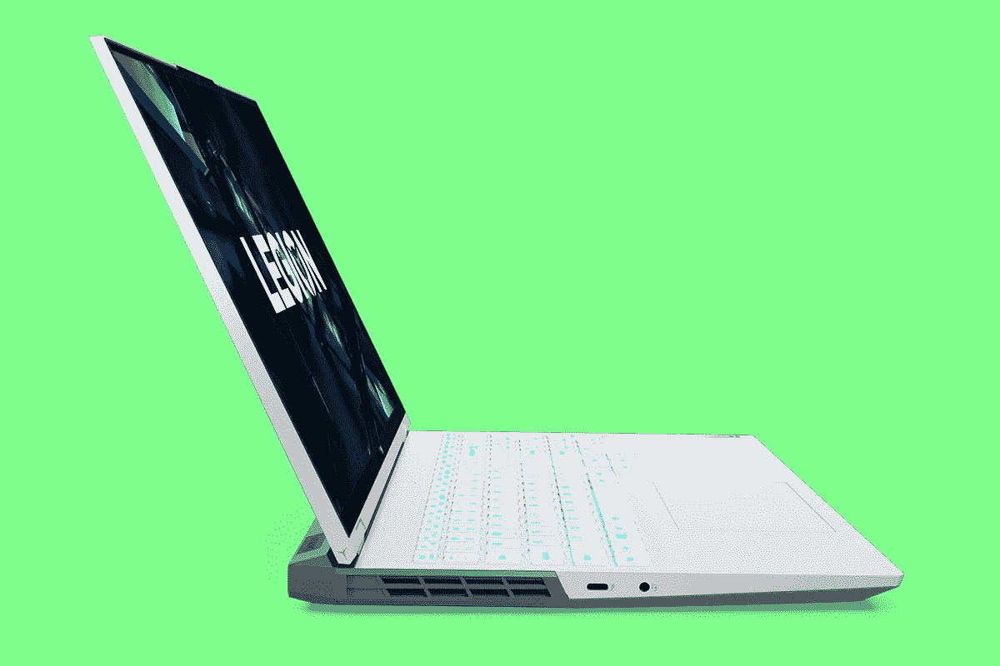

# 联想军团 5i Pro (2022)回顾:坚固的主流游戏笔记本电脑

> 原文：<https://www.xda-developers.com/lenovo-legion-5i-pro-2022-review/>

如果你正在寻找主流游戏，联想军团 5i Pro 似乎肯定涵盖了所有的基础。它不仅拥有强大的内部功能，还拥有 16:10 的 165-240Hz 可变刷新率显示屏。这使得它非常适合游戏，但凭借其宽高比和 QHD+分辨率，它也非常适合工作。

它配备了联想的 TrueStrike 键盘，速度很快，摸起来也很柔软。如果你正在寻找既能在家玩游戏又能带到工作中的东西，这是一个很好的选择。

当然，如果你参加锦标赛，这并不完全是为你设计的，你可能已经知道了。

 <picture></picture> 

Lenovo Legion 5i Pro

##### 联想军团 5i Pro

联想的 Legion 5i Pro 拥有 16:10 165Hz VRR 显示屏、强大的内部功能等，可提供出色的主流游戏体验。

**浏览此评论:**

## 联想军团 5i Pro (2022):价格和供货情况

*   联想军团 5i Pro 起价 1569 美元，本应于 2 月份上市。
*   它还没有上市，但是你可以买 AMD 锐龙 6000 型号。

联想军团 5i Pro，以及 AMD 驱动的军团 5 Pro，在 1 月份的 CES 上宣布。它应该在一个月后开始发货，但我们在这里，没有找到任何清单。[联想](https://www.xda-developers.com/best-lenovo-laptops/)告诉我，我们现在应该随时可以看到它，但如果你想要一个英特尔驱动的模型，你现在必须去第 11 代。

AMD 驱动的型号使用锐龙 6000，而英特尔驱动的型号使用第 12 代“Alder Lake”，所以无论你选择哪个，都是最新一代。显卡方面，最高可配 Nvidia GeForce RTX 3070 Ti。

虽然英特尔型号尚未上市，但你可以在百思买买到 AMD 锐龙型号。英特尔机型起价 1569 美元，AMD 机型起价 1429 美元。

## 联想军团 5i Pro (2022)规格

| 

处理器

 | 英特尔酷睿 i7-12700H (2.3GHz，24MB 高速缓存) |
| 

制图法

 | NVIDIA GeForce RTX 3070 Ti(8GB gddr 6)，150 瓦 |
| 

记忆

 | 16GB DDR5-4800 |
| 

显示

 | 16.0 英寸 16:10 WQXGA (2560x1600)，IPS，500 尼特，杜比视界 165-240 赫兹 VRR |
| 

储存；储备

 | 多达两个驱动器，2 个 M.2 SSDM.2 2242 SSD 高达 512GB，M.2 2280 SSD 高达 1TB |
| 

连通性

 | 最高支持 Wi-Fi 6E、802.11ax 2x2 Wi-Fi +蓝牙 5.1、M.2 卡 |
| 

港口

 | 3 个 USB-A 3.2(一个始终开启)2 个 USB-C 3.2 Gen 2(一个 135 瓦电源输出)1 个 Thunderbolt 4、USB4 40Gbps1x HDMI 2.11x 以太网(RJ-45)1 个耳机/麦克风组合插孔(3.5 毫米)1 个电源连接器 |
| 

声音的

 | 立体声扬声器，2W x2，nahimicaudio 双阵列麦克风 |
| 

照相机

 | 720p，定焦，带电子相机快门 |
| 

键盘

 | 6 行多媒体 Fn 键、数字键盘、黑色键盘可选:白色、蓝色或 4 区 RGB LED 背光 |
| 

电池

 | 80 瓦时，超快速充电(30 分钟 80%) |
| 

尺寸和重量

 | 359.9 x 264-264.2 x 19.9-26.6 毫米(14.17 x 10.41 x 0.78-1.05 英寸)2.49 千克(5.49 磅) |
| 

颜色

 | 风暴灰(上)，黑色(下) |
| 

材料

 | 铝金属 |
| 

价格

 | 起价 1569 美元 |

## 设计:既实用又时尚

*   军团 5i Pro 看起来比它的前辈更“游戏化”
*   总共有六个 USB 端口、HDMI、以太网等等

联想军团[笔记本电脑](https://www.xda-developers.com/best-creator-laptops/)的设计从产品二代开始真的没有太大变化；不过，这个有点不一样。联想在其评论指南中称这种设计“咄咄逼人”。我没有那种感觉，但它*比过去几年我们从联想军团看到的*更咄咄逼人。

军团笔记本电脑的原始系列——军团 Y520、Y720 和 Y920(它是唯一的 9 系列军团，所以它得到了提及)——非常华丽。如果你把其中一个带进房间，它显然是一台[游戏笔记本电脑](https://www.xda-developers.com/best-gaming-laptops/)。第二代带来了重大的重新设计，平顶，更少的亮色，总的来说，只是更微妙。整个想法是，你可以在家里玩游戏，但仍然可以在早上把它带到工作中。

联想军团 5i Pro 带回了一点以游戏玩家为中心的设计。沿着盖子有对角线-这显然使游戏更快-和一个居中的军团标志。在军团 7 系列上，该标志位于角落。

然而，一个很大的区别是，这个单元上没有外部 RGB 照明。事实上，RGB 照明长期以来一直是联想区分 5 系列和 7 系列的一种方式。键盘上有一些 RGB 灯光，但仅此而已。

至于港口，有很多。在右侧，有一个 USB Type-A 端口，一个 3.5 毫米音频插孔和一个相机快门开关。这个 USB 端口是您插入不常使用的外围设备的地方。此外，摄像头保护开关在内部断开摄像头，因此没有实际的物理指示器显示它是打开的。当你拨动开关时，你会看到一个图标，但仅此而已。在某些时候，你无疑会去解决变焦或其他什么东西找不到你的相机的问题，你会意识到开关被翻转了。

左侧有两个 USB Type-C 口，一个是 Thunderbolt 4，一个是 USB 3.2 Gen 2。像往常一样，我不喜欢看起来一样但提供不同功能的端口，尤其是因为它们在同一侧。我想你不会插入外部图形卡或任何东西，尽管你可能想要双显示器。

笔记本电脑的背面是大多数端口所在的位置。它们位于那里，用于电缆管理，您可以将它们用于您一直需要插入的东西，如电源、HDMI 和以太网。你还会发现两个 USB A 型端口，和另一个 USB C 型端口。USB-C 端口实际上支持电力传输，所以你可以用它来给笔记本电脑充电，尽管*非常*慢。

你会注意到风扇在角落里，所以它们可以从两边和后面吹出空气。吹出两倍的空气是一个小小的设计技巧。联想还表示，其 ColdFront 4.0 冷却系统更加安静，风扇叶片薄了 40%。它还可以使用双刻录功能将 CPU 和 GPU 推向更高的水平。如果这还不够，您可以按 Fn + Q 在性能、静音和平衡模式之间切换。

## 显示器:高分辨率，高刷新率，以及正确的宽高比

*   联想军团 5i Pro 拥有 16 英寸 16:10 屏幕，165-240Hz 可变刷新率

我们从游戏笔记本电脑市场看到的一个很酷的东西是分辨率更高、刷新率更高的显示器。以前如果你想要 60Hz 以上，你必须妥协，获得 1080p 分辨率。事实上，我经常说竞技游戏是丑陋的，为了帧率而牺牲一切。但幸运的是，QHD 165Hz 面板越来越普遍，联想军团 5i Pro 拥有 16 英寸 165-240Hz 可变刷新率屏幕。

自然，由于动画更流畅，更高的刷新率让您在游戏中占据优势。这绝对能让你比对手领先几毫秒。

我就要猜测你在这样的机器上还在乎色域。正如我所说，竞技游戏是丑陋的，但对于一个军团 5 系列类型的设备，你可能仍然关心屏幕至少有点漂亮。它支持 99%的 sRGB、72%的 NTSC、77%的 Adobe RGB 和 77%的 P3。对于高级显示器来说，这是相当普通的。

它的最大值为 520.9 尼特，超过了联想承诺的 500 尼特。对比度是 1，310:1，没有我想要的那么高。从我们在这里看到的数字来看，这对于主流游戏笔记本电脑来说无疑是不错的。如果你是作为一台创作型笔记本电脑购买的，你可能会想要一台色域更广、对比度更高的电脑。

网络摄像头位于顶部挡板，采用联想的反向凹槽设计。不幸的是，在 1080p 迅速成为标准的时代，网络摄像头仍然是 720p。

## 键盘:联想的 TrueStrike 键盘是合法的

我非常喜欢联想在其 Legion 笔记本电脑上使用的键盘，这种键盘被称为 TrueStrike。它们是为更柔和的着陆而制造的，但也有敏捷的输入。对我来说，这意味着很多。快速输入使它非常适合游戏，但同时，更软的着陆使它更舒适，甚至更安静，这是我在写文章时喜欢的东西。

正如你所看到的，它还配有一个完整的数字键盘，如果你喜欢的话，这很好。还有四区 RGB 照明。就像我前面提到的，联想为军团 7 系列保留了很多 RGB 照明，所以如果你想要每个按键的 RGB 照明，那就是你需要去的地方。

触摸板被加大了。联想不再生产物理按键，这一功能似乎正在笔记本电脑上消失。当然，我还是希望它能更大一些，充分利用所有可用的房地产。

## 性能:笔记本电脑应有尽有

*   它拥有英特尔酷睿 i7-12700H 和 Nvidia GeForce RTX 3070 Ti 显卡，但这是你能得到的最多的
*   电池寿命是你对这种东西的期望

正如您所料，联想军团 5i Pro 配备了英特尔第 12 代 H 系列处理器和 NVIDIA GeForce RTX 30 系列 GPU。“I”代表英特尔，因此军团 5 Pro 是配备 AMD 锐龙 6000 H 系列处理器的产品。

这款机型配备了酷睿 i7-12700H 和 GeForce RTX 3070 Ti。虽然这绝对是一个坚实的配置，但它仍然是主流。如果你想更有竞争力，你会想要一个 RTX 3080 或 3080 Ti。但正如我在这篇评论的其他地方提到的，在那个时候，你应该考虑更高层次的游戏笔记本电脑。

对于基准测试，我使用了 PCMark 10、3DMark、Geekbench、Cinebench 和 VRMark。我将它与去年 AMD 驱动的型号进行了比较，同时还与今年阵容中的 MSI Raider GE76 进行了比较。

|  | 

军团 5i ProCore i7-12700H，RTX 3070 Ti

 | 

第五军团职业队(2021)锐龙 7 5800H，RTX 3070

 | 

微星突袭机 ge 76 core i9-12900 香港，RTX 3080 Ti

 |
| --- | --- | --- | --- |
| 

PCMark 10

 | 7,076 | 6,800 | 7,820 |
| 

3DMark:时间间谍

 | 10,391 | 9,963 | 12,287 |
| 

极客工作台

 | 1,787 / 9,209 | 1,475 / 7,377 | 1,774 / 12,630 |
| 

电影院长凳

 | 1,714 / 9,549 | 1,423 / 11,729 | 1,833 / 14,675 |
| 

VRMark(橙色/青色/蓝色)

 | 13,593 / 9,480 / 3,176 | 12,249 / 9,093 / 3,027 | 11,472 / 11,542 / 3,815 |

我只测试了去年的 AMD 型号，对于可比的配置，我很惊讶两者之间的差异如此之小。当然，AMD 处理器因不连接电源时性能下降而臭名昭著。当然，如果你想买超值的，微星突袭机差不多是最特别的。

根据 3DMark 测试，这台电脑应该能够实现以下帧速率。

| 

比赛

 | 

1080p 超高

 | 

1440p 超高

 |
| --- | --- | --- |
| 

战场

 | 125fps | 100fps |
| 

Apex 英雄

 | 115fps | 140fps |
| 

GTA V

 | 95fps | 60fps |
| 

《堡垒之夜》

 | 125fps | 85fps |
| 

RDR2

 | 50fps | 40fps |

电池寿命和你预期的差不多。我将功率滑块设置为平衡，并将刷新率设置为 60Hz，但我最多只能做到 3 小时 52 分钟。最坏的情况，我只有两个小时。这不是在玩游戏或类似的时候。它刚刚工作。很自然，我认为你应该为游戏充电。

## 该不该买联想军团 5i Pro (2022)？

显然，联想军团 5i Pro 并不适合所有人。如果是的话，这将是联想制造的唯一产品。

**你应该买联想军团 5i Pro 如果:**

*   您正在寻找主流游戏笔记本电脑的巨大价值
*   您想要一台游戏笔记本电脑，同时也能胜任其他任务

**你不应该买联想军团 5i Pro 如果:**

*   您需要一台发烧友级游戏笔记本电脑
*   你在为创造性工作寻找这种力量

如果你正在寻找一台 [creator 笔记本电脑](https://www.xda-developers.com/best-creator-laptops/)，有更好的选择。我会说，去与一些有有机发光二极管显示器，然后有类似的内部军团 5i 专业。如果您正在寻找发烧友级别的游戏，请查看军团 7i。