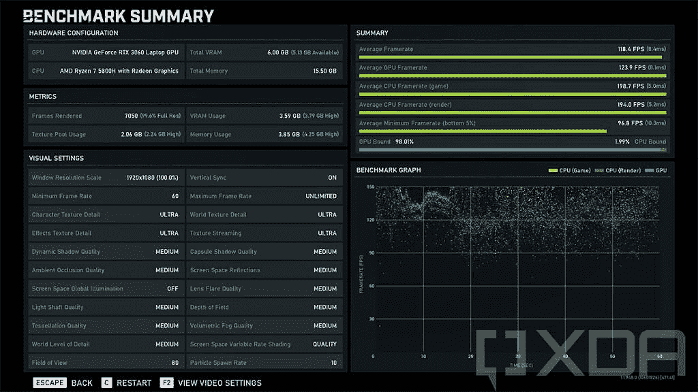
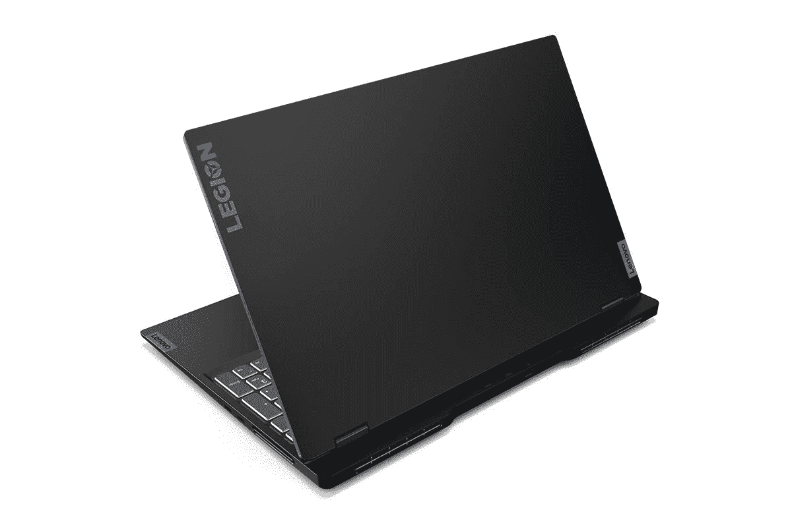

# 联想军团超薄 7 回顾:在一个漂亮的包装性能

> 原文：<https://www.xda-developers.com/lenovo-legion-slim-7-review/>

显然，我这辈子评测过很多[游戏 PC](https://www.xda-developers.com/best-gaming-laptops/)，包括笔记本电脑和塔式机。事实上，自从联想军团这个品牌推出以来，我可能已经查看了每一台笔记本电脑，还有一些台式机。不过，联想 Legion Slim 7 是另一回事，它是一款让我着迷的产品。

。bestawarddiv {

浮动:对；

宽度:20%；

边距:0.75em

边距-顶部:0；

}

首先，这是一台[游戏笔记本电脑](https://www.xda-developers.com/best-gaming-laptops/)，配备强大的 AMD 锐龙 7 5800H 处理器，16GB 快速 DDR4-3200 内存，NVIDIA GeForce RTX 3060 显卡。但它没有传统游戏笔记本电脑那么大、厚、笨重。它的厚度不到四分之三英寸，重量刚刚超过四磅，因此被称为“超薄”。

但这款笔记本电脑不仅仅是为了纤薄。远不止这些。

**浏览此评论:**

### 联想军团超薄 7 规格

| 

处理器

 | AMD 锐龙 7 5800H |
| 

制图法

 | 英伟达 GeForce RTX 3060 6GB GDDR6，TGP 100W |
| 

身体

 | 14.02x9.92x0.63-0.74 英寸(356 x 252 x 15.9-18.9 毫米)，4.19 磅(1.9 千克) |
| 

显示

 | 15.6 英寸 FHD (1920x1080) IPS，300 尼特，165 赫兹，100% sRGB，杜比视界 |
| 

随机存取存储

 | 16GB SO-DIMM DDR4-3200 |
| 

储存；储备

 | 512GB 固态硬盘 M.2 2280 PCIe NVMe |
| 

港口

 | 2 个 USB-A 3.2 Gen 2 (1 个始终开启)(2 个 Type-C USB 3.2 Gen 2(1 个)4 合 1 读卡器(1 个)耳机/麦克风插孔 3.5 毫米(1 个)电源连接器 |
| 

电池

 | 71Wh，快速充电快车 |
| 

声音的

 | 2 个 2W·哈曼扬声器，Nahimic Audio |
| 

连通性

 | 最高可配英特尔 Wi-Fi 6 802.11ax 2x2 +蓝牙 5.1 |
| 

安全性

 | 电源按钮指纹识别器、网络摄像头隐私快门 |
| 

键盘

 | 带 Corsair iCUE 的背光、可选 RGB 照明 |
| 

颜色

 | 阴影黑/石板灰 |
| 

材料

 | 铝金属 |
| 

操作系统（Operating System）

 | Windows 10 主页 |
| 

价格

 | $1,499.99 |

## 设计:联想军团 Slim 7 可以做到这两点

联想军团 Slim 7 由铝制成，重量为 4.19 磅，这东西很性感。大多数游戏笔记本电脑都比这个重得多；事实上，就在几年前，我还见过一些体重超过 10 磅的。这比戴尔 XPS 15 的某些型号更轻。真的让人印象深刻。

这种纤薄的设计为游戏笔记本电脑开启了一个新的维度，因为它现在不仅仅是这样。就功能强大的个人电脑而言，这是超便携的。这意味着它也是一台具有创造力和生产力的出色电脑。

它也有一个圆滑的设计，在阴影黑色。设计语言本身与我们过去见过的联想 Legion 笔记本电脑并没有太大的不同，平顶在更大的底座上，从后面伸出一点。我们在《军团 7》系列中看到的一点 RGB 灯光被移除了，但它有点工作。

[sc name = " pull-quote-right " quote = " The Legion Slim 7 时尚性感，游戏性能卓越"]这真的很难拍照，但印在盖子上的 Legion 徽标在其反光中具有微妙的颜色，根据光线照射的方式而变化。铰链后面的后部区域也有这种效果。这是一种很好的触摸，还有很多类似的东西让联想军团 Slim 7 感觉很性感，但以一种更微妙的方式。这是我如何定位该产品的关键。这是你可以随身携带的东西，但以后在上面玩游戏时仍然感觉很好。

显然，我们首先想到的是散热，这对于任何游戏笔记本电脑都至关重要，尤其是像这种轻薄的笔记本电脑。它使用联想的 ColdFront 3.0 技术，包括允许 PC 同时推动 CPU 和 GPU 的双刻录功能。

还有一个双风扇系统，可以通过角落的四个通风口吸入和排出空气。通过将风扇放在角落里，并将通风口从两个改为四个，Legion Slim 7 可以排出两倍的空气。还有一个名为 Q Control 4.0 的功能，允许用户将电源配置从高性能模式调整到静音模式。

现在，让我们谈谈港口。在右侧，您有两个 USB 3.2 Gen 2 Type-C 端口。显然，由于这是一台 AMD 驱动的笔记本电脑，所以没有[雷电](https://www.xda-developers.com/best-thunderbolt-4-laptops/)。不过，我不知道你在这样的机器上需要 Thunderbolt 做什么。它们都支持 DisplayPort，因此您可以连接到外部显示器。

在左侧，有一个全尺寸的 SD 读卡器和一个组合音频插孔。感觉这年头笔记本电脑里全尺寸 SD 卡读卡器很少见了，能看到一个真好。它正好符合我对这款机器的看法，既适合游戏，也适合视频编辑。

背面也有端口，联想已经在游戏笔记本电脑上做了几年了。虽然乍一看它们看起来一样，但其中一个是用于电源的，而另外两个是 USB 3.2 Gen 2 Type A。换句话说，你永远不会在第一次尝试时将电源插入正确的端口。

此外，虽然我喜欢电缆管理的后部端口，但感觉联想在这里做了一些奇怪的选择。侧面的端口应便于快速访问；例如，如果我想在那里插一张 SD 卡，那是最好的地方。但我更有可能插入 USB Type-A 耳机、鼠标或其他东西，而不是 USB Type-C 外设。我要说的是，我希望联想在旁边放一个 USB Type-A 端口。

## 显示屏:联想 Legion Slim 7 拥有 165Hz 杜比视界屏幕

关于联想军团 Slim 7 的屏幕，我有一些好消息和一些坏消息。好消息是 165Hz，坏消息是只有 300 尼特。这并不是说你会在户外使用游戏笔记本电脑或任何东西，但如果你想，你会有一个问题。

[sc name = " pull-quote-left " quote = " Legion Slim 7 看起来足够酷，适合玩游戏，但也足够精致，适合工作。"]分辨率为 1920x1080，因此您无法获得 Legion 5 Pro 的 16:10 宽高比，也无法获得其他游戏笔记本电脑的 QHD 分辨率。这完全是因为 FHD 的刷新率更高。

虽然屏幕看起来真的很好，支持杜比视觉，不管你是这款还是 4K 60Hz 的。在我的测试中，它支持 100%的 sRGB、72%的 NTSC、77%的 Adobe RGB 和 78%的 P3。

我真的很喜欢它三面都有窄边框，让我有更身临其境的体验。可惜网络摄像头还是 720p。在 2021 年，1080p 网络摄像头仍然非常罕见，但这并没有降低它们的必要性。

这台机器上也没有 [Windows Hello](https://www.xda-developers.com/best-laptops-with-windows-hello/) 面部识别，不幸的是，这在游戏笔记本电脑中很常见。但你不会在顶部挡板找到任何红外摄像头。

键盘上方是双 2W 扬声器。他们实际上变得非常强大，比我想象的还要强大。我不认为它们是为听音乐而设计的，这不是问题。这些都是为游戏性而优化的。

## 键盘:TrueStrike 游戏键盘

联想 Legion Slim 7 拥有该公司所谓的 TrueStrike 游戏键盘，该键盘使用 Corsair iCUE 软件，具有完整的每键 RGB 照明。它有一个新的软着陆开关，在橡胶圆顶键盘上有一个改进的力曲线。这不仅意味着反应更灵敏，而且更舒适。

触摸板也更大，而且仍然可以点击。联想还指出，通过在结构中使用铝，它可以减少掌托和机箱的磨损。

有一件事有点奇怪，那就是键盘照明有问题。有时我会启动笔记本电脑，它会亮，有时它会以蓝色亮，而不是我如何设置它，有时它根本不会亮。可以用键盘快捷键打开，也可以用 iCUE app。

正中央是电源按钮，它兼作指纹传感器。当您按下它时，它会扫描您的指纹传感器，因此当电脑启动时，您不必再次触摸它。

## 性能:AMD 锐龙 5000 和 RTZ 3060

联想发给我的 Legion Slim 7 包括 AMD 锐龙 7 5800H 处理器、16GB DDR4-3200 内存和 NVIDIA GeForce RTX 3060 显卡。非常棒。

你应该知道，如果你正在寻找最好的游戏，这不是它。这不应该是它；这不是它的设计目的。事实上，它在 RTX 3060 达到了最大值，所以你不可能得到比这更高的价格。

正如我前面提到的，有一种叫做 Q Control 的东西，可以让你通过按 Fn + Q 来控制性能。在大多数情况下，它会改变功率滑块。如果你将它设置为静音模式，它似乎只会在 Windows 中打开电池节电模式。当然，还有性能模式，它可以最大限度地发挥所有功能。

 <picture></picture> 

Gears 5 benchmark

我玩过的一个游戏是 *Gears 5* ，我喜欢玩这个游戏，因为这是我非常熟悉的东西，所以我可以很容易地感觉到什么时候有性能问题，或者什么时候事情特别好或者特别坏。这就是为什么我也玩像 *Forza Horizon 4* 和*Halo:The Master Chief Collection*这样的游戏。我运行了上面你可以看到的 *Gears 5* 基准测试，它很好地说明了这一点。这款笔记本电脑非常适合玩游戏，但它仍然不是 RTX 3080。

对于其他基准，我使用了我的常用工具，包括 PCMark 8、PCMark 10、3DMark、VRMark、Geekbench 和 Cinebench。

|  | 

联想军团 Slim 7Ryzen 7 5800H，RTX 3060

 | 

戴尔 XPS 17 9710 酷睿 i7-11800h RTX 3060

 | 

RTX 3070 普罗里森 7 军团 5800H

 |
| --- | --- | --- | --- |
| 

PCMark 8:主页

 | 5,322 | 4,037 | 5,291 |
| 

PCMark 8:创意

 | 6,223 | 6,100 | 6,199 |
| 

PCMark 8:工作

 | 4,504 | 3,564 | 4,102 |
| 

PCMark 10

 | 6,428 | 6,379 | 6,800 |
| 

3DMark:时间间谍

 | 8,316 | 7,158 | 9,963 |
| 

极客工作台

 | 1,446 / 7,335 | 1,561 / 8,775 | 1,475 / 7,377 |
| 

电影院长凳

 | 1,415 / 11,833 | 1,515 / 11,652 | 1,423 / 11,729 |

我挑选了两台机器与一个匹配的零件进行比较。[联想军团 5 Pro](https://www.xda-developers.com/lenovo-legion-5-pro-review/) 拥有相同的处理器和更强大的 GPU，而戴尔 XPS 17 拥有相同的 GPU 和不同的处理器。

正如你可能猜到的，电池寿命不是很长。屏幕亮度为 75%,电源滑块比省电模式高一档，我最多只能用四个小时。在最坏的情况下，我得到了不到两个小时。你会想要随身携带它附带的 230 瓦充电器。

## 结论:该不该买联想军团 Slim 7？

这是我刚刚爱上的那些机器之一。它对于现实世界的东西来说是超级强大的，并且它有一个圆滑和性感的设计。我个人的使用案例各不相同。有时我在编辑照片或视频，有时我在写文章和打字，有时我只想玩一些游戏。我想要的是最适合各种使用环境的笔记本电脑。联想军团 Slim 7 似乎选择了正确的选项。

尽管它并不完美，因为没有一台笔记本电脑是真正完美的。它仍然有一个 720p 的网络摄像头，所以如果你喜欢流媒体，这是值得注意的，坦率地说，显示器太暗了。你用 4K 模式得到 500 尼特，但这意味着你必须在 4K 60Hz 的体面亮度或 1080p 165Hz 的 300 尼特之间进行选择。

如果您只是在寻找一台功能强大的笔记本电脑，这就是它。对于照片和视频编辑，它是梦幻般的。它有一个漂亮的设计，看起来很酷，但在工作中也足够微妙。它还很轻，可以放在背包里，重量超过 4 磅。坦率地说，如果你需要的不仅仅是军团 7 Slim 所提供的，你可能已经知道了。

在撰写本文时，该产品实际上在百思买便宜 150 美元。

 <picture></picture> 

Lenovo Legion Slim 7

##### 联想军团 Slim 7

联想 Legion Slim 7 的重量刚刚超过 4 磅，但它配备了 AMD 锐龙 45W 处理器和 RTX 3060 显卡，功能非常强大。