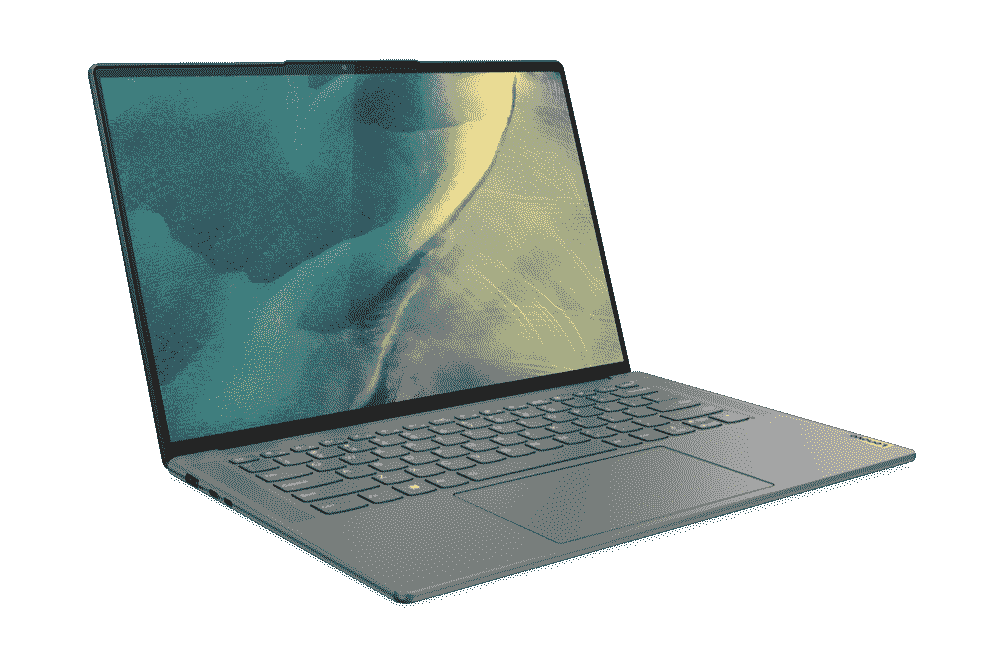

# 联想 Slim 7 Pro X 评测:一款有一些缺点的时尚 creator 笔记本电脑

> 原文：<https://www.xda-developers.com/lenovo-slim-7-pro-x-review/>

联想 Slim 7 Pro X 是一款为内容创作者设计的[笔记本电脑，提供稳定的性能和非常清晰、色彩准确的显示，采用 Delta E < 1。与此同时，它仍然能够提供可靠的电池寿命，并且它包裹在一个坚固而光滑的机箱中，看起来非常好。它提供了全面的良好体验，但它不是一台完美的机器。](https://www.xda-developers.com/best-creator-laptops/)

值得注意的是，如果你大量投资于专业的创造性工作，网络摄像头不是最好的，显示器也不是最好的。尽管如此，这是一台非常有能力的机器，有足够的能力进行基本的创造性工作，甚至是一些游戏。

 <picture></picture> 

Lenovo Slim 7 Pro X

##### 联想 Slim 7 Pro X

联想 Slim 7 Pro X 是一款面向内容创作者的笔记本电脑，配备强大的 AMD 处理器和时尚的机箱。

**浏览此评论:**

## 联想超薄 7 Pro X:定价和可用性

*   联想 Slim 7 Pro X 于 2022 年 6 月推出，正式起价为 1499 美元
*   它可以直接从联想买到，但你也可以在其他零售商那里买到

联想在 5 月份发布了 Slim 7 Pro X，以及 Slim 系列中的其他笔记本电脑，并于 6 月正式推出。这款机型的官方起价为 1499 美元，不过也有英特尔版本的价格稍高。

本次评测使用的配置更加高端，基于联想的定制构建配置器，售价 1765 美元。如果有更多预建配置可用，价格可能会有所不同。

## 联想 Slim 7 Pro X:规格

| 

中央处理器

 | AMD 锐龙 9 6900 高速(35 瓦，8 个内核，16 个线程，最高 4.9GHz，16MB 三级高速缓存) |
| 

制图法

 | **独立:**英伟达 GeForce RTX 3050(最大显卡功率:55W) **集成:** AMD 镭龙显卡 680M |
| 

显示

 | 14.5 英寸 IPS，3K (3072 x 1920)，250 DPI，120Hz 刷新率，高达 400 尼特，眼睛安全，10 点多触点康宁大猩猩玻璃 |
| 

规模

 | 328.2 x 221.4 x 15.9 毫米(12.92 x 8.72 x 0.63 英寸)1.45 千克(3.2 磅) |
| 

记忆

 | 32GB LPDDR5(焊接) |
| 

储存；储备

 | 1TB NVMe PCIe 4 固态硬盘 |
| 

电池

 | 70 瓦时电池 |
| 

港口

 | 

*   2 个 USB 3.2 Gen 2 Type-C 端口(支持电源传输和显示端口 1.4)
*   2 个 USB 3.2 Gen 1 Type-A(一个始终打开用于充电)
*   3.5 毫米耳机插孔

 |
| 

声音的

 | 双 2W 立体声扬声器带降噪功能的双阵列麦克风 |
| 

连通性

 | Wi-Fi 6，802.11ax 蓝牙 5.1 |
| 

照相机

 | 全高清 1080p RGB 和 IR 混合摄像头，电子隐私快门 |
| 

颜色

 | 缟玛瑙灰 |
| 

材料

 | 铝金属 |
| 

操作系统（Operating System）

 | Windows 11 主页 |
| 

价格

 | $1,765 |

## 设计:全铝结构，双色外观

*   联想 Slim 7 Pro X 采用铝制机箱，感觉坚固而高端
*   HDMI 端口对于这样一台功能强大的笔记本电脑来说是有意义的

就制造质量而言，联想 Slim 7 Pro X 是最优质的。这款笔记本电脑完全由铝制成，拿在手中感觉很结实。它只有 3.2 磅，比典型的超极本重一点，但这也是因为它有强大的规格，15.9 毫米的厚度对于这样的机器来说已经很不错了。

我也觉得很好看。联想在这里采用了微妙的双色调外观，盖子是接近黑色的深灰色，笔记本电脑的下半部分是略浅的灰色。我一直很欣赏双色调设计，因为它经常让人觉得笔记本电脑的外观有点陈旧，而这给市场带来了一丝清新的空气。不过，这仍然是一款非常低调的笔记本电脑，所以它在公共场合不会有任何怪异的外观。我觉得如果色差再醒目一点就好了，但是这个还是好看的。

我希望更精致一点的是铰链。很紧很僵硬，一般来说是好事，但是这里有点过了。在不抬起整个机箱的情况下，很难单手打开笔记本电脑，即使它很重。我希望它更灵活，但最好有一个坚硬的铰链，而不是过于宽松的铰链。

我认为还可以改进的是这里的端口选择。笔记本电脑左侧有两个 USB Type-C 口，都不支持 USB4。由于这是一款高端笔记本电脑，我认为 USB4 支持是合适的，但考虑到笔记本电脑的价格非常合理，我想说这不是一个明显的疏忽。您仍然可以通过这些端口获得显示输出和充电。

除此之外，你有两个 USB 类型 A 端口和一个耳机插孔，这使得一个体面的设置。不过，我确实觉得奇怪的是，专注于内容创作的笔记本电脑没有 HDMI 端口。创意专业人士可能会欣赏使用大屏幕的能力，但就目前情况而言，你需要一个适配器来做到这一点。对我来说，用 HDMI 替换其中一个 USB Type-A 端口会更有意义。笔记本电脑的左侧还有一个电子快门，如果你担心隐私，它可以关闭网络摄像头。

## 显示和声音:它看起来很棒，但你不会

*   具有 3K 分辨率和 120 赫兹刷新率的 14.5 英寸显示器看起来绝对棒极了
*   网络摄像头是 1080p，但实际上并没有那么好

这是一款专注于内容创作的笔记本电脑，显示屏是一大焦点，联想在这方面做得很好。这是一个 14.5 英寸的 IPS 面板，它具有非常清晰的 3K 分辨率，0r 3072 x 1920。不仅如此，它还配备了 120Hz 的刷新率，这开始在日常使用中增加了一个非常好的体验。该屏幕的亮度高达 400 尼特，因此户外能见度非常好，尽管反射玻璃罩可能会有所影响。这款笔记本电脑还包括一个环境光传感器，因此它可以根据你周围的照明情况调整显示器亮度，这总是很好的。

但对于内容创作者来说，这一切都与颜色有关，联想宣称 100%覆盖 sRGB，或许更重要的是，硬件校准证明颜色准确度评级为 Delta E < 1。联想没有提到更受欢迎的色域，如 DCI-P3 或 Adobe RGB，看看我们自己的测试结果，原因很明显。对于内容创作者来说，DCI-P3 或 Adobe RGB 的良好覆盖将是理想的，但这仍然是一个实心面板，它看起来确实很棒。

然而，这只是在更高的亮度水平下才是真的。联想的亮度调节根本就不平衡，Windows 中 50%的设置实际上给了你接近 12%的峰值亮度。这意味着对比度值也会下降，如果亮度降低到 50%以下，就更难看到屏幕上的某些元素。值得联想称赞的是，这款显示器确实达到并略微超过了广告中的 400 尼特亮度。

如你所料，在显示屏上方是网络摄像头。像今年联想的大多数高端笔记本电脑一样，它使用了 1080p 传感器，但坦率地说，我对这个网络摄像头的图像质量有点失望。这是一个带有红外的混合传感器，可以实现 Windows Hello 面部识别。但拥有混合传感器会极大地影响图像质量，这似乎是这里的情况，因为这款 1080p 相机看起来远没有我预期的那么好。它是有用的，但不是很好。

至于声音，联想 Slim 7 Pro X 配备了一对 2W 扬声器，位于键盘的两侧。顶置扬声器总是受欢迎的，这些扬声器可以发出相当大的声音而没有明显的失真，所以我觉得它们非常适合媒体消费和通话。我在 Dynabook Portégé X40L-K 旁边评测了这款笔记本电脑，那款有四扬声器系统，声音肯定有点大，但这仍然很好。

## 键盘和触摸板:联想真的很擅长这个

*   联想制造了一些最好的笔记本电脑键盘，这个感觉很棒
*   触摸板非常大，用起来很舒服

如果你阅读了很多联想笔记本电脑的评论，这不会感到惊讶，但该公司制造了一些你会在笔记本电脑上找到的最好的键盘。而联想 Slim 7 Pro X 也不例外。标志性的弧形键帽和左上对齐的标签还在，但真正重要的是打字的舒适度，联想钉钉做到了。这些键的行程和驱动力恰到好处，不会剧烈地触底，所以打字感觉很棒。

我确实评测了这款笔记本电脑旁边的 Dynabook Portégé X40L-K，我觉得这款笔记本电脑的键盘稍微好一点，特别是在布局方面。但是在这个阶段，你看到的是两个非凡的笔记本电脑键盘，没有什么是坏的选择。联想的键盘需要更少的压力，这可能是你更喜欢的。

不仅仅是键盘，联想还钉了触摸板。当谈到触摸板时，您通常希望它们尽可能大，这大约是您可以从这个机箱中获得的最大尺寸。但表面的光滑度同样重要，联想也做对了。我的手指在触摸板上滑动毫不费力，而且非常容易使用。我真的不想在这里改变什么。

顺便说一句，这台笔记本电脑没有指纹识别器，这对我来说完全没问题。反正我觉得面部识别可靠多了，也快多了。

## 性能:稳定，但还可以更好

*   AMD 锐龙 9 6900HS 和 Nvidia GeForce RTX 3050 显卡带来了稳定的性能，但奇怪的是，它的性能有限
*   尽管联想 Slim 7 Pro X 具有强大的规格，但它仍然能够保持稳定的电池续航时间

无论你为联想 Slim 7 Pro X 选择什么配置，就性能而言，你都将获得一台相当高端的机器。它以 AMD 锐龙 7 6800HS 开始，默认情况下包括 Nvidia GeForce RTX 3050 显卡。我的评测单元有一个更强大的 AMD 锐龙 9 6900HS，它还配有 32GB 的内存，因此在日常任务中的性能与你预期的一样好。一切都很快很顺利，你真的不会有理由抱怨日复一日的表现。

但是，看看基准测试，事情有点奇怪。在许多测试中，35W CPU 的总体性能低于我的预期，实际上也落后于英特尔的一些 P 系列处理器，后者的 TDP 为 28W。这些分数也非常一致，所以这不是一次性的。当然，在更依赖 GPU 的测试中，如 3DMark，笔记本电脑的分数要比只有集成显卡的笔记本电脑好得多。

|  | 

联想超薄 7 Pro XRyzen 9 6900HS，RTX 3050

 | 

[戴尔 XPS 15](https://www.xda-developers.com/dell-xps-15-2022-review/) 酷睿 i7-12700H，RTX 3050 Ti

 | 

[宏碁 Swift 3](https://www.xda-developers.com/acer-swift-3-2022-review/) 酷睿 i7-1260P

 |
| --- | --- | --- | --- |
| 

PCMark 10

 | 5,658 | 6,640 | 5,621 |
| 

3DMark:时间间谍

 | 4,091 | 4,535 | 2,021 |
| 

Geekbench 5(单/多)

 | 1,341 / 8,296 | 1,774 / 11,580 | 1,755 / 10,554 |
| 

Cinebench R23(单/多)

 | 1,293 / 10,581 | 1,797 / 11,695 | 1,739 / 10,276 |
| 

交叉标记(总体/生产力/创造力/响应时间)

 | 1,306 / 1,298 / 1,409 / 1,059 | 1,855 / 1,735 / 2,053 / 1,671 | 1,684 / 1,584 / 1,911 / 1,386 |

看到它输给像戴尔 XPS 15 这样的笔记本电脑是有道理的-毕竟，它配备了 45W 处理器，也有稍微更强大的显卡。但在许多情况下，联想 Slim 7 Pro X 与英特尔酷睿 i7-1260P 竞争，后者甚至不是英特尔最好的 28W P 系列处理器。在许多情况下，像 Geekbench 5 和 CrossMark，它正在失去，有时是显着的。在浏览网页或编写文档时，您不会注意到这一点，但如果您正在经历视频编辑等繁重的工作，这些差异会变得更加明显。

考虑到其规格，联想 Slim 7 Pro X 的电池续航时间很长。

另外值得一提的是，联想 Slim 7 Pro X 有一个 MUX 开关，这对游戏很有用。一个简单的解释是，通常情况下，带有一个集成 GPU 和一个独立 GPU 的笔记本电脑将始终依赖集成 GPU 来驱动显示器。独立 GPU 可以处理程序中的渲染，但显示信息仍然必须通过 iGPU 才能到达屏幕，这可能会成为性能瓶颈并增加一些延迟。通过 MUX 开关，笔记本电脑以物理方式改变连接，以便独立 GPU 直接为显示器供电，从而以牺牲电池寿命为代价获得更高的性能。这对合成基准测试分数没有影响，但它确实在 *Forza Horizon 5* 基准测试中产生了更好的结果。

我还测试了这款 SSD 的性能，非常不错，顺序读取时读取速度超过 6500 MB/s，写入速度接近 5000 MB/s。

联想 Slim 7 Pro X 让我惊讶的一个地方是电池续航时间。在我的测试中，我总是设法使用至少 5 个小时，最短大约 5 小时 12 分钟，最长接近 6 小时 36 分钟。这是真正的工作，用我的浏览器在 WordPress 中写作，打开多个标签，外加偶尔的图像编辑。自动亮度打开，通常在 30%到 50%之间。大多数时候，我的工作时间非常接近 6 个小时，对于一台配备 35W 处理器和独立显卡的笔记本电脑来说，这是非常令人印象深刻的。如果考虑到 3K 分辨率和 120Hz 刷新率，就更是如此了。

部分原因是因为 [AMD 驱动的笔记本电脑](https://www.xda-developers.com/best-amd-ryzen-laptops/)在电池电量上确实损失了不少性能。在电池电源和平衡电源设置下运行 PCMark 10 基准测试时，我得到了 4，474 分，比我在交流电源上得到的 5，658 分低了很多。

## 该不该买联想 Slim 7 Pro X？

归根结底，联想 Slim 7 Pro X 是一款出色的笔记本电脑，适合日常使用和一些较轻的创造性工作。AMD 锐龙处理器和独立 Nvidia 显卡提供了相当多的性能，尽管它们比预期的要差一些。如果您希望为创造性工作负载提供最大的能力，您可能会找到更好的选择。但是联想 Slim 7 Pro X 确实有一个非常棒的显示屏，颜色非常准确，清晰，平滑，而且考虑到它的规格，它的电池寿命很长。

**您应该购买联想 Slim 7 Pro X，如果您:**

*   想要一个漂亮且色彩准确的显示器吗
*   经常远离电源插座工作，需要稳定的电池续航时间
*   重视舒适的键盘和触摸板

**如果你:**你不应该购买联想 Slim 7 Pro X

*   需要顶级性能来处理繁重的创造性工作负载
*   计划经常使用内置网络摄像头
*   需要 P3 或 Adobe RGB 的大范围覆盖

根据您日常工作负载的要求，Lenovo Slim 7 Pro X 的性能可能不是您所能获得的最佳性能，类似戴尔 XPS 15 的产品可能更适合类似的价格。同样令人失望的是，这个 1080p 网络摄像头并没有更好。但你仍然可以通过这种方式获得稳定的性能，对于照片编辑来说，这里有足够的性能和漂亮的显示屏。

 <picture></picture> 

Lenovo Slim 7 Pro X

##### 联想 Slim 7 Pro X

联想 Slim 7 Pro X 是一款面向内容创作者的笔记本电脑，配备强大的 AMD 处理器和时尚的机箱。