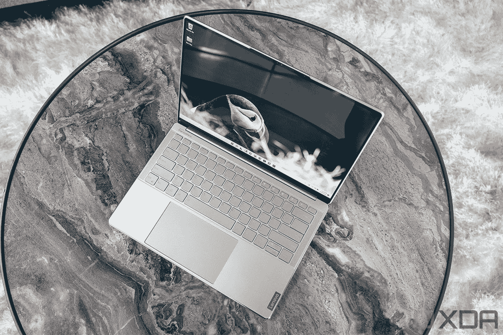

# 联想 Slim 9i 评测:一款带点珠光宝气的笔记本电脑

> 原文：<https://www.xda-developers.com/lenovo-slim-9i-review/>

今年我最喜欢的笔记本电脑是 T2 的联想 Yoga 9i T3，所以当公司推出它的非敞篷版时，我完全投入了。自然，在公布的时候我已经亲自看过了，所以我知道两者的区别。除了闪亮的金色(出于某种原因，也被称为燕麦片)柔软的触摸边缘，这个单元还有一个玻璃覆盖的盖子。

它给人的感觉绝对是顶级的，当然，它拥有你想要的顶级笔记本电脑的所有功能。它拥有 28W 英特尔处理器、32GB 内存、1TB 固态硬盘和 UHD+ [有机发光二极管显示屏](https://www.xda-developers.com/best-oled-laptops/)。就像 Yoga 9i 一样，有机发光二极管屏幕也有 2.8K 90Hz 的版本。

我确实有几个问题，比如用键盘打字。此外，有一些奇怪的基准异常，足以使联想实际上给我送来了第二个单位，尽管它并没有任何改善。当然，更强大的 28W 处理器确实会消耗更多的电池寿命。

但这只是一台优秀的笔记本电脑。它很漂亮，感觉很高档，而且功能强大。不工作时，您可以在漂亮的有机发光二极管显示屏上观看内容，在杜比全景声扬声器上聆听。这是一次很棒的经历。我们将不得不研究联想如何将黄金笔记本电脑称为“燕麦片”。

 <picture></picture> 

Lenovo Slim 9i

##### 联想超薄 9i

联想 Slim 9i 是该公司最高端的笔记本电脑，配有玻璃盖、金色表面和英特尔的 28W 处理器。

**浏览此评论:**

## 联想超薄 9i 定价和供货情况

*   联想 Slim 9i 从今年夏天开始上市，起价 1799.99 美元

虽然你现在可以买到联想 Slim 9i，但可用性似乎很低。Lenovo.com 只出售少数几种配置。它配备了酷睿 i7-1280P，32GB 内存，512GB 或 1TB 存储空间，以及 4K 有机发光二极管显示屏。起价 2070 美元。

当然，应该有其他的模型。没有一台电脑，即使是最高档的电脑，也是从 32GB 内存开始的。事实上，在某个地方应该有配备 2.8K 90Hz 有机发光二极管显示屏的型号，有可能它们只是不在 Lenovo.com 上。

官方起价为 1799 美元，随着时间的推移，您可以期待其他配置的出现。

## 联想超薄 9i 规格

| 

处理器

 | 英特尔酷睿 i7-1280 处理器 |
| 

制图法

 | 英特尔 Iris Xe |
| 

身体

 | 315 x 214.4 x 薄至 14.9 毫米/ 12.40 x 8.44 x 薄至 0.59 英寸，起始重量:1.37 千克(3.02 磅) |
| 

显示

 | 14 英寸 4K (3840 x 2400)触摸有机发光二极管，16:10，400 尼特，100% DCI-P3，60Hz，杜比视界，TUV 低蓝光认证 |
| 

记忆

 | 32GB 焊接 LPDDR5-5600 |
| 

储存；储备

 | 1TB 固态硬盘 M.2 2242 PCIe 4.0x4 NVMe |
| 

连通性

 | WiFi 6E +蓝牙 5.1 |
| 

港口

 | 3 个 USB Type-C(全功能/ Thunderbolt 4.0) 1 个 3.5 毫米音频插孔 |
| 

照相机

 | 1080p FHD MIPI 红外照相机 |
| 

声音的

 | 2x2W + 2x3W Bowers & Wilkins 扬声器系统，杜比 Atmos |
| 

触摸屏设备

 | 无按钮玻璃表面多点触控触摸板，支持精密触摸板 |
| 

电池

 | 75 瓦时，快速充电(15 分钟，2 小时使用) |
| 

材料

 | 3D 玻璃+铝 |
| 

颜色

 | 燕麦片 |
| 

操作系统（Operating System）

 | Windows 11 主页 |
| 

价格

 | $2,140 |

## 设计:闪亮的金色和玻璃表面

*   它采用了联想的软触摸设计
*   所有三个 USB 端口都是 Thunderbolt 4

正如我前面提到的，2022 年我最喜欢的笔记本电脑是联想 Yoga 9i，其中一个很大的原因是它的设计。我喜欢笔记本电脑上有趣漂亮的设计。经典的银铝设计出道已经这么久了。我们可以做得更好，有一段时间，我认为惠普 Spectre x360 是性感的笔记本电脑之王，但今年，惠普将其设计得更加微妙。这也是联想将其提升一个档次的时候。

联想超薄 9i 的设计是一个会回头的设计。

首先，联想所有的新笔记本电脑都有其舒适边缘设计。这意味着所有的边都是圆的。在 9i 系列上，边缘经过抛光和抛光，让它有一点点金光闪闪。然而，让 Slim 9i 特别性感的是它还有一个玻璃盖。感觉超溢价。如果你曾经想从包里拿出一台笔记本电脑，并对它感到非常满意，那么联想的 Slim 9i 就是合适的选择。

虽然颜色是淡金色，但联想出于某种原因称之为燕麦片。我不知道公司是怎么回事，试图为颜色找到奇怪的名字，但我们在这里。

联想 Slim 9i 上只有三个 USB 口，而且今年都不是 USB Type-A。三个都是霹雳 4，我不是在抱怨。左边有两个，右边有一个。

Thunderbolt 4 端口适合 40Gbps 的数据传输速度，但这可能不是你在使用它们时所想的。更具体地说，你可以连接一个 Thunderbolt dock 和两个 4K 显示器，或者你可以连接一个外部 GPU，为已经强大的 CPU 增加一些图形功能。

左侧还有一个 3.5 毫米音频插孔。在右边，有一个电源按钮和一个相机快门按钮。如果你扳动开关，照相机就不工作。您将在屏幕上看到一个指示器，指示摄像机已断开连接，但没有物理障碍阻挡摄像机。

最终，在金属金色舒适边缘设计和 3D 玻璃盖之间，这种设计将会引人注目。

## 展示:这是可爱有机发光二极管

*   14 英寸的有机发光二极管显示器采用 4K 60Hz 或 2.8K 90Hz 的频率
*   它有一个 FHD 网络摄像头

联想 Slim 9i 上的屏幕绝对好看。你有两个选择。它来自 4K 60Hz 或 2.8K 90Hz。联想发给我的设备是 4K 的，这似乎是目前 Lenovo.com 唯一的设备。想必其他配置别处有卖，或者联想根本没货。

我实际上认为 2.8K 是更好的选择。我已经使用了两个面板，我没有注意到两者在分辨率方面有任何视觉差异。当 2.8K 面板设置为 60Hz 时，你将获得比 4K 面板更好的电池寿命。然后，如果你想要那些平滑的动画，你可以把它提高到 90 赫兹。

根据我的测试，4K 有机发光二极管显示器支持 100%的 sRGB、95%的 NTSC、97%的 Adobe RGB 和 100%的 P3。你可能知道，这些数字真的很好，但也是我对有机发光二极管笔记本电脑的期望。你会得到丰富、鲜艳的颜色，你会得到真正的黑色。

正如你所看到的，黑电平不会随着亮度的变化而变化。这是有机发光二极管显示器的典型行为，它不像传统的 LCD 那样有背光。有趣的是，亮度下降到了 377.5 尼特，低于承诺的 400 尼特，尽管我没有注意到任何问题。

网络摄像头是 1080p，这是一个升级，在今天这个在家工作的时代是必要的。正如我上面提到的，笔记本电脑的侧面有一个开关，用于摄像头的隐私保护，但摄像头上没有物理屏障。你只是得到一个摄像头无法工作的视觉指示，如果你打开摄像头应用程序，它会说摄像头被阻止了。

它实际上没有从内部断开相机，因为不像其他实现那样，传感器上有开关但没有视觉指示器，例如惠普的 Spectre x360，当关闭时，相机仍然会显示在设备管理器中。事实上，相机应用程序不会说相机被阻止；它会说没有找到相机。

## 键盘:没有黑暗模式按钮

*   全尺寸背光键盘两侧是强大的杜比全景声扬声器

正如我对联想键盘的期望，在上面打字非常舒服。不幸的是，我确实经历了很多双重打字，这是一种痛苦。如果我不加修改就发表这篇评论，你很难写出几个没有拼写错误的句子。

键盘两侧各有一个杜比 Atmos 扬声器，笔记本电脑底部还有另外两个。就像 Yoga 9i 一样，有两个 3W 低音扬声器和两个 2W 高音扬声器，所以音频非常强大。主要区别在于，与瑜伽不同，扬声器不在铰链上。

漂亮的有机发光二极管显示屏和强大的扬声器使超薄 9i 成为流媒体的完美之选。

但是由于键盘两侧的扬声器，没有空间容纳 Yoga 9i 上的那些特殊按键。那台机器有专门的按钮，用于在暗主题和亮主题之间切换，用于模糊视频背景，等等。我认为这是 Yoga 9i 更具思想性的特点。

触摸板很好，很大，所以这总是一个优点。总的来说，这是一个很好的体验，除了双重打字。

## 性能:它拥有英特尔的 P 系列处理器

*   联想超薄 9i 配备了酷睿 i7-1280P
*   与 U 系列相比没有太大优势

联想 Slim 9i 的实际性能很好。这是一款配备 28W 处理器的生产力笔记本电脑，因此不会有太多问题。如果你看一下 Lenovo.com 的配置，唯一的内存选项是 32GB。

英特尔的第 12 代 CPU 有助于提高工作效率。

的确，英特尔的新 P 系列处理器很棒，但我仍然没有找到合适的用例。与 15W U 系列相比，它们确实以额外的电池寿命为代价，这就是为什么这台机器有如此巨大的 75 瓦时电池。为了延长电池寿命，您可以获得更高的 TDP 和更多的 P 内核，从而提高性能。但具体来说，这与 CPU 性能有关。英特尔最新的集成显卡并没有真正改变一代又一代产品，15W 部件上的 Iris Xe 与 28W 部件上的 Iris Xe 之间的差异并不显著。

但是就像我说的，性能没问题。如果我们在谈论一台不太好的笔记本电脑中的最新一代酷睿 i7，那将会非常奇怪。

*奇怪的是*我遇到的一些基准测试异常。事实上，联想最终给了我一个新的单元来尝试解决这个问题，但这没有帮助。你会注意到 Geekbench 5 单核分数极低。我通过运行三次并平均分数来获得我的 Geekbench 分数，所以其中两次在 700 分左右。澄清一下，酷睿 i7-1280P 在 Geekbench 的单核测试中的得分应该在 1，700 左右。

有时分数是正确的；的确，多核是对的。虽然 PCMark 10 分数在它应该在的地方，但我可以在其他时间运行它，得到接近 4000 的分数。我试着在 Vantage 中关闭联想的所有设置，但没有用。显然，这确实与联想自己的软件有关，但我无法解决这个问题。

需要注意的是，基准并不真正代表真实世界。使用 Slim 9i 毫无意义，因为它感觉像是一台在 Geekbench 5 中能获得 700 分的机器。

|  | 

联想超薄 9i 酷睿 i7-1280P

 | 

[联想 Yoga 7i](https://www.xda-developers.com/lenovo-yoga-7i-2022-review/) Corre i7-1255U

 | 

[戴尔 Inspiron 灵越 14 二合一](https://www.xda-developers.com/dell-inspiron-14-2-in-1-review/)锐龙 7 5800U

 |
| --- | --- | --- | --- |
| 

PCMark 10

 | 5,310 | 5,453 | 5,320 |
| 

3DMark:时间间谍

 | 2,122 | 1,774 | 1,256 |
| 

Geekbench 5(单/多)

 | 840 / 11,153 | 1,694 / 8,370 | 1,151 / 6,091 |
| 

Cinebench R23(单/多)

 | 1,624 / 11,194 | 1,763 / 7,315 | 1,233 / 7,768 |

我喜欢加入一些 U 系列基准测试，因为在某些情况下，它们实际上会获得更好的分数。虽然我们看到了采用 9W、15W、28W 和 45W 处理器的超极本，但赢家似乎总是传统的 15W 处理器。这些笔记本电脑真的不是为如此强大的 CPU 设计的，所以它们也不能维持性能。

说到电池续航时间，我能做到的绝对最好成绩是 5 小时 17 分钟，平均成绩约为 4 小时 17 分钟。我真的很感动。虽然这对于笔记本电脑整体来说不是很好的电池续航时间，但我预计 4K 有机发光二极管的显示屏和 28W 处理器会让它更慢。75 瓦时的电池救了它。

为了清楚起见，电池寿命是通过在 Vivaldi、Slack、Skype、OneNote、Microsoft To Do 和其他生产力应用程序中正常工作来记录的。电源滑块处于平衡状态，屏幕亮度为中等。

## 谁应该购买联想 Slim 9i？

**您应该购买联想 Slim 9i，如果:**

*   你想要一台时尚的笔记本电脑
*   你流式传输很多媒体

**您不应该购买联想 Slim 9i，如果:**

*   你用了很多 use a 型外设
*   你需要持续 5 小时以上的电池续航时间

联想超薄 9i 是一款出色的笔记本电脑。我喜欢它，尽管它的键盘很小。我喜欢联想 9i 产品的一点是，它为已经很棒的音频添加了有机发光二极管屏幕，所以如果你用它来看电影或其他东西，这只是一个巨大的体验。

 <picture></picture> 

Lenovo Slim 9i

##### 联想超薄 9i

联想 Slim 9i 是该公司最高端的笔记本电脑，配有玻璃盖、金色表面和英特尔的 28W 处理器。