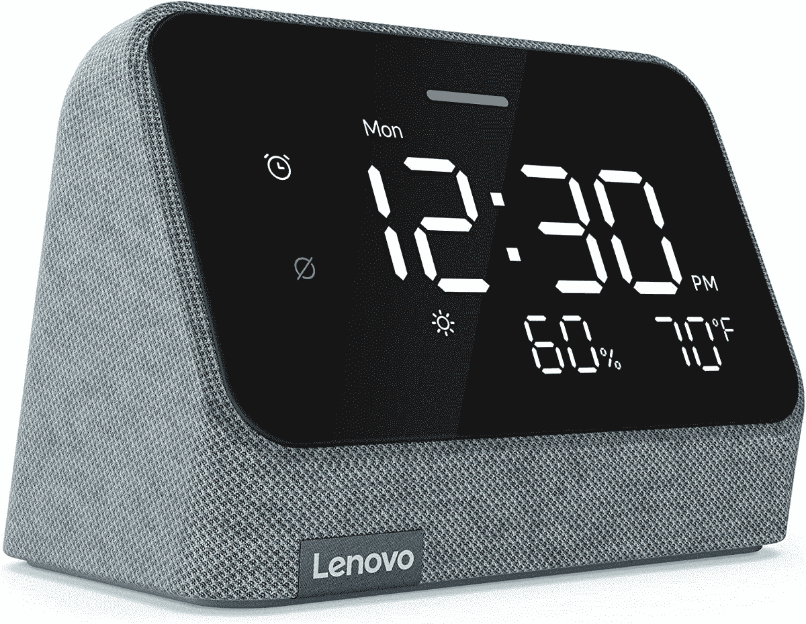

# 联想智能时钟必不可少的 Alexa 审查:最好的智能扬声器放在你的床边

> 原文：<https://www.xda-developers.com/lenovo-smart-clock-essential-alexa-review/>

在一个智能手机在每个床头柜上充电的世界里，不起眼的闹钟有点过时了。或者是？联想当然不这么认为，它现在第二次尝试智能时钟，这是智能扬声器的一部分。第一个，智能时钟 Essential，是 Google Assistant 自带的。续集将切换到[亚马逊的 Alexa 语音助手](https://www.xda-developers.com/best-alexa-skills/)。

这使得它不太像是一部真正的续集，更像是一部衍生作品。如果你拥有并且喜爱原版，并且使用谷歌助手，你不一定想要得到这一个。你也不需要。尽管有了更新的设计，这两款设备仍然非常相似。但如果你像我一样更喜欢 Alexa 而不是 Google Assistant，它就变成了一个更有吸引力的命题。

显而易见的使用案例是在卧室里，这是对经典闹钟的现代演绎。但本质上，这是一款[亚马逊的翻版](https://www.xda-developers.com/amazon-echo-4th-gen-review/)，尽管是由联想制造的。所以你可以在任何你喜欢的地方使用它，而不仅仅是报时。

 <picture></picture> 

Lenovo Smart Clock Essential with Alexa

##### 联想智能时钟必备

传统闹钟的现代版，增加了 Alexa 的功能。没有摄像头，所以非常适合放在卧室。

**浏览此评论:**

## 联想智能时钟必不可少的 Alexa 规格

| 

规格

 | 

Alexa 必备的联想智能时钟

 |
| --- | --- |
| **处理器** |  |
| **操作系统** |  |
| **闸板** |  |
| **显示** | 

*   数字 LED(单色、非触摸)

 |
| **连通性** | 

*   WiFi 5 802.11 b/g/n
*   蓝牙 5.1

 |
| **重量** |  |
| **尺寸** | 

*   93.3 毫米 x 113.48mm 毫米 x 71.33mm 毫米/ 3.67 英寸 x 4.46 英寸 x 2.80 英寸

 |
| **颜色** |  |

***关于这篇评测:**这篇评测是用联想提供的智能时钟 Essential with Alexa 编写的。联想从未对这篇文章的内容发表过任何意见。*

* * *

## 定价和可用性

带有 Alexa 的联想智能时钟 Essential 现在可以从联想直接购买，也可以从亚马逊等第三方购买。正常价格是 69.99 美元，尽管经常会有降价 25 美元的交易。

它有两种颜色:薄雾蓝和粘土红。

* * *

## 设计和功能

*   和它的前身一样简单的方法。
*   用谷歌助手代替 Alexa。
*   带有附加简略信息的明亮显示。
*   音质有点跟不上回声点。

我买了原装的联想智能时钟 Essential 住在一起。太棒了。这正是我一直想放在床头柜上的智能设备。关键是没有摄像头或全显示屏。我希望能够通过半睁的眼睛看时间，播放音乐，并询问常见的基本智能扬声器问题。对我来说，唯一的缺点是对 Alexa 的偏好。结果，我没有在同一个房间里使用两个助手，而是用带时钟的亚马逊 Echo Dot 代替了它。作为一个床头柜设备，我喜欢 Echo Dot 不如喜欢联想智能时钟 Essential。

这种新型智能时钟最重要的部分是所有好的部分都保留了下来。你选择它放在床头柜上的所有理由都还在。这个钟很大，睡眼惺忪的人也很容易看清。没有摄像头，物理控制很容易感觉到，也没有触摸屏。很简单。谢天谢地，联想保持了这种简单性。

尽管没有全触摸显示屏，但智能时钟 Essential 比带时钟的 Echo Dot 更先进一些。你得到了更多的简略信息，包括当前的天气状况温度和湿度，为 Alexa 节省了一个早上的问题。它甚至有一个简单的分贝仪。这款显示器还具有自动调光功能，所以晚上你不会点亮你的卧室。在这个版本中，显示屏被重新设计的外壳修饰，使其比旧款略大，但几乎没有大。它在床头柜上占据的空间仍然比 Echo Show 5 或 Google Nest Hub 少。它有两种颜色，蓝色或红色，用织物装饰。

硬件控制都生活在顶部边缘，这是通常的费用。你有硬件音量控制，一个触发 Alexa 的动作按钮，和一个警报按钮。这是从最初的模型中保留下来的一个重要特征，毕竟它是一个闹钟。你可以用你的电话或者你可以用按钮。用你的声音让闹钟静音和亚马逊 Echo 上的一样。唯一不在顶部的硬件控制是静音开关，它笨拙地放在电源输入的后面。至少，你不会不小心激活它，但你不能只是滚动和点击它。

音质很好，尽管如果你使用了最新一代的 Echo Dot，你可能会有点失望。尽管它并不坏，而且声音大到足以用你最喜欢的音乐叫醒你。作为一款 Alexa 设备，它使用 Alexa 应用程序的设置过程与亚马逊 Echo 相同，大多数好处也相同。这种设置并不完全无缝，也不能马上看出你必须选择“时钟”而不是扬声器。还有一点令人失望的是，一些定制的亚马逊 Alexa 闹钟，如 [The Grand Tour](https://www.xda-developers.com/amazon-echo-dot-grand-tour-alarm/) ，没有提供给智能时钟 Essential。

Alexa 必备的智能时钟也没有音频输出。对于这种设备来说，这不是一个交易破坏者，但它不是一个为现有家庭音频设置添加一些智能的选项。也许更令人恼火的是，它似乎不支持 Apple Music。Spotify 似乎没问题，但当我试图在 Apple Music 上听一首歌时，我被告知这项服务在这款设备上不可用。因此，如果你是苹果音乐的订户，它可能不适合你。

* * *

## 谁应该购买配备 Alexa 的联想智能时钟 Essential

*   想要一个没有摄像头的智能设备放在床头柜上的人。
*   如果你更喜欢 Alexa 而不是 Google Assistant。
*   如果你想找一个比 Echo Dot 更好的时钟。

配备 Alexa 的联想智能时钟 Essential 是一款简单的设备，是亚马逊 Echo Dot with Clock 的可靠替代品。作为床头柜甚至办公桌的设备，在你真正想要一个简略时钟的地方，它是更好的选择。显示屏为您提供重要信息，而不会分散您的注意力。

如果更好的音质很重要，那么联想就有点落后了，但这几乎不是一个巨大的差异。两者的麦克风都有很好的音域。当然，如果你更喜欢 Alexa 而不是谷歌助手，这是克服联想另一种模式的一种方法。

 <picture></picture> 

Lenovo Smart Clock Essential with Alexa

##### 联想智能时钟必备

联想的智能时钟将 Alexa 驱动的智能、体面的声音、有吸引力的设计和优惠的价格打包到一个整洁的小盒子中，放在床头柜上。

乍看之下，你可能不会对这种设备感到太兴奋，但这样做是有害的。作为一个负担得起的智能扬声器，它是最优秀的，特别是如果你一直在寻找一个没有摄像头的完美床头柜设备。