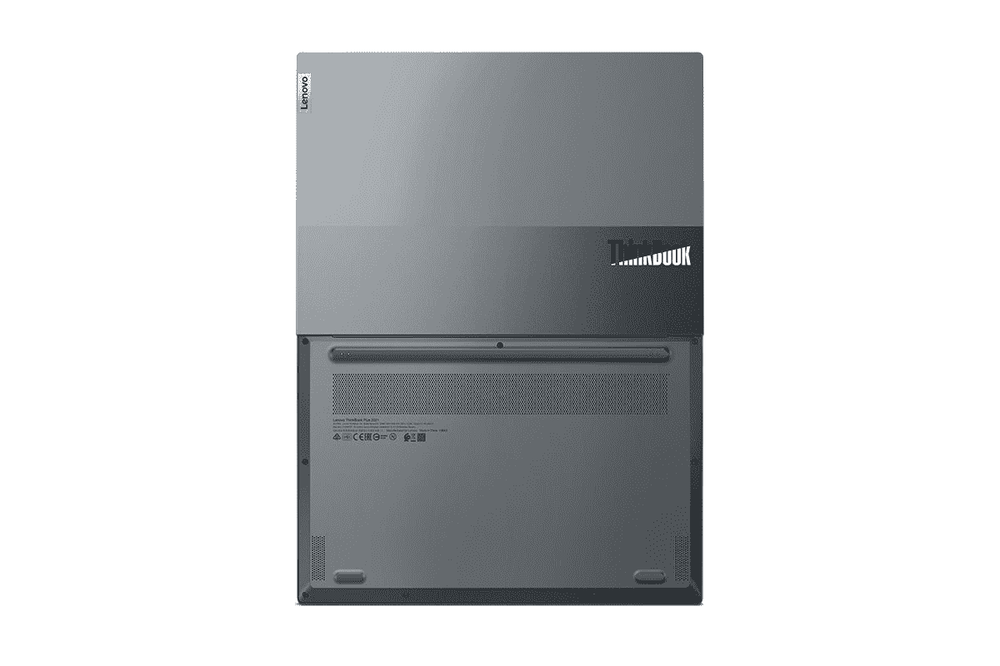

# 联想 ThinkBook 13x 评测:价格低于应有水平的轻薄笔记本电脑

> 原文：<https://www.xda-developers.com/lenovo-thinkbook-13x-review/>

。bestawarddiv {

浮动:对；

宽度:20%；

边距:1em

边距-顶部:0；

}

当[联想](https://www.xda-developers.com/best-lenovo-laptops/)把 ThinkBook 13x 发给我评测的时候，我并没有抱太大的期望。我期待另一款 13 英寸的 ThinkBook，这意味着它将是一款坚固的[笔记本电脑](https://www.xda-developers.com/best-laptops/)，可能会有一两个有趣的功能，但总体而言，它不会有任何性感之处。

但真的，这感觉就像是比其他人高了一步。它非常轻，重量不到 2.5 磅。它拥有出色的 QHD+ 16:10 显示屏，出色的键盘，以及英特尔 UP4 处理器的稳定性能。哦，现在大概要花 1000 美元，这太贵了。

注意，就像 Think 保护伞下的所有东西一样，这是一台[商用 PC](https://www.xda-developers.com/best-business-laptops/) 。ThinkBook 面向可能会根据风格和价格购买消费型笔记本电脑，但需要一些商务功能的中小型企业。

***关于本次评测:**联想给我们发来了 ThinkBook 13x 进行评测。该公司对此次审查的内容没有任何意见。*

**浏览此评论:**

### 联想 ThinkBook 13x 规格

| 

中央处理器

 | 英特尔酷睿 i5-1130G7 |
| --- | --- |
| 

制图法

 | 虹膜 Xe |
| --- | --- |
| 

身体

 | 11.73 x 8.23 x 0.51 英寸(298 x 209 x 12.9 毫米)，2.49 磅(1.13 千克) |
| --- | --- |
| 

显示

 | 13.3 英寸 16:10 杜比视界，WQXGA (2560 x 1600)，IPS，400 尼特，光滑，多点触控 |
| --- | --- |
| 

记忆

 | 16GB DDR4-4266 |
| --- | --- |
| 

储存；储备

 | 512GB M.2 2280 固态硬盘 |
| --- | --- |
| 

连通性

 | 英特尔 Wi-Fi 6 11ax，2x2 + BT 5.2 |
| --- | --- |
| 

港口

 | 2 个 Thunderbolt 4 / USB4 40Gbps(支持数据传输、电源传输 3.0 和显示端口 1.4)1 个耳机/麦克风组合插孔(3.5 毫米) |
| --- | --- |
| 

网络摄像头

 | 720p，带 ThinkShutter 隐私快门 |
| --- | --- |
| 

键盘

 | 6 排防溅多媒体 Fn 键、LED 背光、一体式精密触摸板 |
| --- | --- |
| 

声音的

 | 立体声扬声器，2W x2，杜比音频，哈曼品牌，四个阵列麦克风 |
| --- | --- |
| 

安全性

 | 开机密码、硬盘密码、管理员密码、自我修复 BIOS 分立 TPM 2.0、TCG 认证、侧面智能电源按钮上的触摸式指纹识别器。 |
| --- | --- |
| 

电池

 | 53Wh 电池，支持专业快速充电(30 分钟内充电 50%) |
| --- | --- |
| 

材料

 | 顶部:铝，底部:镁-铝 |
| --- | --- |
| 

颜色

 | 云灰色，风暴灰色 |
| --- | --- |
| 

操作系统（Operating System）

 | Windows 11 专业版 |
| --- | --- |
| 

价格

 | $1,029.81 |
| --- | --- |

这一定价是基于联想提交审查的 SKU。这是 Lenovo.com 的，需要说明的是，联想的价格经常波动。根据清单，这种配置的正常价格为 1999 美元，尽管该公司几乎从未以全价出售其商务笔记本电脑。

## 设计:联想 ThinkBook 13x 采用双色机箱，轻薄小巧

我真的很喜欢联想目前对 ThinkBooks 的设计理念。盖子有双色设计，这是目前联想 ThinkBook 的标准设计，也是其他人没有做到的。我非常喜欢它。

联想 ThinkBook 13x 感觉超值，同时超级轻便。

它有云灰色和风暴灰色。我很确定联想送去审查的设备是云灰色的，但我只能称之为双色银。只是如果非要在云或者风暴之间选一个来形容的话，肯定是比较轻的那个。从现在开始，我将称它为银色，也就是说，这是为数不多的我真正喜欢的银色笔记本电脑之一。有那么多银色 PC 只是平淡无奇；这不是那个。

它还非常轻，重量不到 2.5 磅。这是一件大事。它便于携带，而且很小巧。联想选择使用铝合金盖子和镁合金底座。这使得它很轻，但由于顶部有铝，它仍然感觉很高级。很多全镁合金的笔记本电脑给人的感觉都像塑料。

在设备的左侧，有两个 Thunderbolt 4 端口。您可以将它们用于 40Gbps 的数据传输速度、连接 8K 显示器、连接外部 GPU 等。即使你对 Thunderbolt 没有特别的需求，它也是你应该在笔记本电脑中寻找的东西。这是现在港口的黄金标准。侧面还有一个 3.5 毫米的音频插孔。

在右侧，只有一个电源按钮，兼作指纹传感器。

我非常喜欢联想 ThinkBook 13x 的设计。很圆滑，很独特但是很含蓄，而且超级轻薄。真的是精雕细琢。

## 显示屏:联想 ThinkBook 13x 配备了 QHD 16:10 触摸屏

联想 ThinkBook 13x 的显示屏非常坚固。它的尺寸为 13.3 英寸，长宽比为 16:10，因此比 13.3 英寸的 16:9 显示器更高，表面积更大。它还支持杜比视觉 HDR。

我喜欢我们在 ThinkBook 系列中看到更多的 QHD 显示器。出于某种原因，早期的模型坚持 FHD，我总是觉得 QHD 是甜蜜点。

在我的测试中，屏幕支持 100%的 sRGB、71%的 NTSC、77%的 Adobe RGB 和 77%的 P3。所有这些都非常可靠，因此您可以购买 ThinkBook 13x，因为您知道您将获得合适的色域。

亮度达到 405.8 尼特，刚好符合联想 400 尼特的承诺。它还可以达到 1，460:1 的对比度。

顶部挡板有联想常用的反向凹槽，其中装有一个 720p 网络摄像头和一个物理摄像头防护装置。显然，720p 摄像头不是最佳选择，因为 FHD 摄像头更适合在任何地方工作。事实上，今年我们将会看到更多配备 FHD 相机的笔记本电脑。

## 键盘:它更像是一台消费类笔记本电脑，不过没关系

我认为联想 ThinkBook 13x 的关键在于，虽然它没有任何疯狂的花哨功能，但它是一款出色的全能笔记本电脑。这再一次通过键盘质量表现出来。

ThinkBook 13x 具有 ThinkPad 的质量，但感觉像一台现代消费笔记本电脑。

这台笔记本电脑有一个很棒的键盘，这是特意设计的。ThinkBook 品牌的目标客户是那些可能不会投资购买合适的商用笔记本电脑的中小型企业。它基本上是一台感觉像消费类笔记本电脑的商用笔记本电脑。这意味着它拥有与 ThinkPad 一样的优质键盘质量，但按键更浅，就像消费笔记本电脑一样。打字很舒服。

当然，它缺少了 ThinkPad 的传统元素，比如红色的 TrackPoint，这是精密触摸板出现之前的遗留物。Fn 和 Ctrl 键也在正确的位置。

说到精密触摸板，这个单元有一个，现在每台现代笔记本电脑都有。这意味着它支持你习惯的所有手势，速度快，反应快，等等。它是中等大小的，因为我希望看到联想为更大的触摸板使用更多的可用空间。

## 性能和电池寿命:Tiger Lake UP4 在这台笔记本电脑上演唱

联想发给我的 ThinkBook 13x 包括英特尔酷睿 i5-1130G7、16GB 内存和 512GB 固态硬盘。该规格中最值得注意的部分是 Core i5-1130G7，它来自 Tiger Lake UP4 系列。

UP4 是 U 系列的低功耗变体，以前称为 Y 系列。说的轻一点，Y 系列的口碑并不好。太可怕了。不仅变得更好了，而且真的变好了。借助四核处理器和 Iris Xe 显卡，您实际上可以编辑照片和视频，或者运行其他要求苛刻的应用程序。

然而，使用低功耗处理器对电池寿命没有帮助。我平均只用了大约四个小时，使用平衡设置和中等亮度。事实上，Windows 电池报告估计，根据使用后的电源周期，它将获得 3 小时 59 分钟的电池寿命。

对于基准测试，我使用了 PCMark 10、Geekbench、Cinebench 和 3DMark。

|  | 

联想 ThinkBook 13xCore i5-1130G7

 | 

联想 ThinkPad Titanium yoga core i7-1160 G7

 | 

戴尔 XPS 13 9300 酷睿 i7-1065G7

 |
| --- | --- | --- | --- |
| 

PCMark 10

 | 4,418 | 4,488 | 4,402 |
| 

极客工作台

 | 1,342 / 4,875 | 1,333 / 4,055 |  |
| 

电影院长凳

 | 1,281 / 3,780 | 1,127 / 2,597 |  |
| 

3DMark:时间间谍

 | 1,295 | 1,334 |  |

值得注意的是，在 PCMark 10 测试中，第 11 代 UP4 处理器的性能优于戴尔 XPS 13 9300 中的第 10 代 U 系列酷睿 i7 处理器。它显示了 UP4 有多好，以及为什么它不再存在于单独的 Y 系列层中。

## 结论:该不该买联想 ThinkBook 13x？

考虑到这个东西在这种配置下的价格不超过 1000 美元，它是一个值得购买的东西。联想 ThinkBook 13x 就是这么好。它轻薄小巧，便于随身携带。它的双色银色很时尚。

最大的缺点是 720p 网络摄像头和电池寿命并不突出。只要你能忍受这些，我不知道你还在寻找什么。

问题是，这一切都很棒。它没有一些华而不实的新功能或类似的东西。它只是完成工作，对核心体验至关重要的事情都很棒。

对我来说，这似乎是 ThinkBook 品牌的关键。如果你是一家小型企业，无法为一栋挤满员工的大楼购买 500 台 ThinkPads，你可能会看到这样的情况。如果是，它会检查正确的框。

 <picture></picture> 

Lenovo ThinkBook 13x Gen 1

##### 联想 ThinkBook 13x Gen 1

联想 ThinkBook 13x 是一款面向中小型企业的轻薄笔记本电脑，采用第 11 代处理器等。