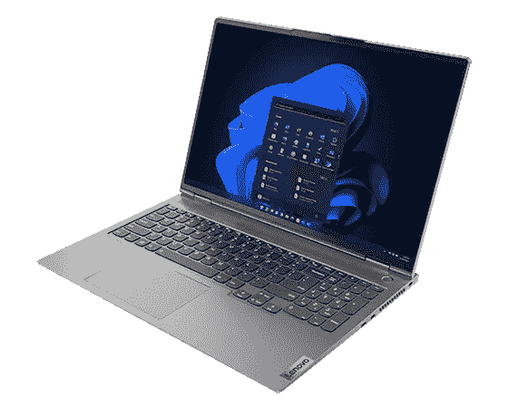

# 联想 ThinkBook 16p Gen 3 评测:时尚强大

> 原文：<https://www.xda-developers.com/lenovo-thinkbook-16p-gen-3-review/>

最近出现了一波新的 16 英寸笔记本电脑，我喜欢称之为“日常创造者”。我最近评论的惠普 Envy 16 T1 就是一个很好的例子，甚至还有在新一轮浪潮之前推出的 T2 戴尔 XPS 17 T3。就规格而言，这些都是很棒的笔记本电脑，但当你考虑到整体设计时，它们似乎很无聊。它们也由英特尔 CPU 驱动。该公司发给我的新款联想 ThinkBook 16p Gen 3 根本不是这样的。

这款笔记本电脑采用 AMD 锐龙 9 6900HX CPU、32GB 内存和 Nvidia GeForce RTX 3060 显卡，试图撼动创造者笔记本电脑市场。它有一个真正独特的石板状设计，灵感来自[联想的军团游戏笔记本电脑](https://www.xda-developers.com/best-lenovo-laptops/)。此外，联想没有选择英特尔的 H 系列 CPU，而是选择了 AMD 锐龙 6000 HX 系列 CPU，事实证明这种 CPU 效率更高，电池续航时间更长。

再加上 16 英寸 2.5K 分辨率 IPS 显示屏，这是我长期以来使用的最好的 creator 笔记本电脑之一。虽然仍然有一些问题，包括触控板的定位，但对于一台笔记本电脑来说，这些都是很小的问题，我真的很难放弃，并在我的审查期后寄回。我向任何想要 16 英寸 AMD 驱动的笔记本电脑的人推荐这款笔记本电脑，这不仅仅是为了游戏。

 <picture></picture> 

Lenovo ThinkBook 16p Gen 3

##### 联想 ThinkBook 16p Gen 3

联想 ThinkBook 16p Gen 3 是一款完美的笔记本电脑，拥有出色的显示屏、惊人的性能和电池续航时间，以及时尚的设计

**浏览此评论:**

## 联想 ThinkBook 16p Gen 3 定价和供货情况

*   在这篇评论发表时，联想没有向我提供具体的价格和供货情况
*   联想 ThinkBook 16p Gen 3 有一个产品页面，上面显示该系统“即将推出”，但联想澳大利亚公司有该产品出售

在撰写这篇评论的时候，联想还没有为我提供这款联想 ThinkBook 16p Gen 3 的定价或可用性。我要求该公司确认价格，并将在收到回复后更新此评论。联想澳大利亚[的产品列表页面可用](https://shop-links.co/1786640657557855227?u1=f0d5ab87-ed83-4e19-a4fe-366d9d9f263a)，但价格不以美元计算。

## 联想 ThinkBook 16p Gen 3 规格

| 

规范

 | 

附加说明

 |
| --- | --- |
| **CPU** | AMD 锐龙 9 6900HX (8 核、16 线程、4.9GHz 睿频、4MB L2 / 16MB L3) |
| **图形** | 集成:AMD 镭龙显卡独立:NVIDIA GeForce RTX 3060 6GB GDDR6 |
| **显示** | 16 英寸，2560 x 1600，500 尼特，100% sRGB，165 赫兹，HDR400，颜色校准，X-Rite Pantone 认证，TUV 莱茵低蓝光，TUV 眼睛安全认证，杜比视觉，环境光传感器 |
| **尺寸&重量** | 13.96 x 9.92 x 0.73 英寸/ 4.38 磅 |
| **记忆** | 32GB 焊接 LPDDR5-6400 |
| **储存** | 1TB 固态硬盘 M.2 2280 PCIe 4.0x4 NVMe |
| **电池** | 71 瓦时，230 瓦超薄适配器，支持专业快速充电(30 分钟内充电 50%) |
| **端口** | 1 个 USB Type-C 1 个 USB4 2 个 USB-A 3.2 Gen 2 1 个组合音频插孔 1 个 HDMI 2.1 1 个 SD 读卡器 |
| **音频&麦克风** | 2x2W Harman 品牌扬声器，带杜比 Atmos |
| **连通性** | 最高支持 Wi-Fi 6、蓝牙 5.0 |
| **摄像机** | 高达 FHD +红外摄像头 |
| **颜色** | 矿物灰色 |
| **材料** | 三面金属结构。钻石切割电源按钮和触摸板 |
| **OS** | Windows 11 专业版 |

## 设计:时尚又与众不同

*   它有着石板般的外观
*   笔记本电脑的后部装有端口，这些端口也有背光指示灯
*   对于一台 16 英寸的笔记本电脑来说，它非常小巧便携

如果你[看看我们的列表](https://www.xda-developers.com/best-creator-laptops/)，你会发现许多 creator 笔记本电脑最终看起来都一样，都是一种通用颜色的全铝机箱。这就是为什么我的笔记本电脑评论的设计部分倾向于关注重量或端口。诚然，这款联想 ThinkBook 16p Gen 3 保持了与去年的 Gen 2 型号相同的设计，但它仍然不同于市场上任何其他同级别的 creator 笔记本电脑，原因有三，你一拆箱就会注意到。

开球是双色调的颜色。虽然许多笔记本电脑都有单色选项，但这款 ThinkBook 却有不同的亮点。顶部铝盖采用双色矿物灰外观，非常时尚。盖子的一半比另一半暗。联想在其他产品中也做到了这一点，比如最初的 Chromebook Duet，这确实使这款 ThinkBook 从竞争对手中脱颖而出——首先推出的产品是只有一种银色的 HP Envy 16。

这款笔记本电脑的设计在三个方面非常突出，你一打开包装就会注意到这一点。

这款笔记本电脑的第二个令人印象深刻的地方是屏幕与底座的连接方式。联想没有坐在最后面，而是将两个铰链放在石板状表面的顶部，使它们更靠近键盘。这个表面将铰链与键盘面板融合在一起。联想过去在 Legion 5i 等 Legion 游戏笔记本电脑上使用过这种独特而简洁的外观，我也很高兴在 creator 笔记本电脑上看到这种外观。它确实很别致，从视觉上将这款笔记本电脑与 XPS 17 等最好的 Windows 笔记本电脑区分开来。

传统的 creator 笔记本电脑在左右两侧都有端口，但联想的这款在背面也有端口。得益于石板式设计，这是一个设计选择，也是这款笔记本电脑的特别之处。左侧有一个全尺寸 SD 卡插槽和一个耳机插孔。右侧有一个 USB-C Gen 2 端口和一个 USB4 端口，还有一个 Kensington 安全锁。

背面是聚会的地方，尽管有一个 USB 3.2 Gen 2 端口，一个永远在线的 USB 3.2 Gen 2 端口，HDMI 2.1 和一个电源连接器。这些端口的指示灯有背光，因此您可以在黑暗中找到它们。我真的很喜欢后面的端口，因为乱七八糟的电缆不需要跑到我桌子的左边或右边。我的线缆和配件总是背对着我，在我的视线之外。

就其尺寸而言，这甚至是一台真正的便携式笔记本电脑。整体尺寸为 13.96 x 9.92 x 0.73 英寸，重量为 4.83 磅。与惠普的 Envy 16 相比，它的外形略小。惠普的笔记本电脑略大，重得多，为 14.07 x 9.94 x 0.78 英寸，重 5.91 磅。联想的笔记本电脑更加便携。我甚至带着它去参加一个新闻发布会，它不会弄乱我的后背，也不会让我觉得放在书包里太重。

联想告诉我，这种设计选择有助于高效散热。通风口在笔记本电脑的侧面。铝制底盖可以让笔记本电脑保持凉爽。与 HP Envy 16 不同，我从未感觉到这台笔记本电脑变热，也几乎没有听到风扇启动的声音。即使在玩游戏时，这也是一个通风良好的系统。

## 显示:高刷新，彩色，准确，由 X-Rite 调谐

*   2560 x 1600 分辨率 165 Hz 16 英寸 16:10 宽高比屏幕，多任务处理空间很大
*   显示屏明亮，由 X-rite 调节，并具有各种颜色配置文件模式
*   显示屏顶部有一个 FHD 网络摄像头

说到 creator 笔记本电脑的显示器，我总是认为有机发光二极管显示器是最好的。色彩精度是无与伦比的，但这项技术往往会大大消耗电池寿命。这就是为什么你会看到许多笔记本电脑制造商采用传统的 IPS 或更高刷新率的 LCD 面板，或者只是与合作伙伴合作开发可以提高色彩准确度的技术。(例如，惠普有一款 DreamColor 显示器。)联想在这里就是这么做的。这块 2560 x 1600 分辨率 165 Hz 的屏幕真的让我印象深刻。

在这台笔记本电脑上查看日常事物是一种享受。这款显示器的刷新率为 165Hz，Windows 11 的动画看起来栩栩如生。16:10 的宽高比也意味着我能够舒适地并排堆叠我的窗口，并在 Microsoft Edge 和其他打开的应用程序中进行多任务处理，而无需连接到显示器。甚至多媒体体验也很棒。我调出了一段展示旧金山地标的视频，当我看到金门大桥的镜头时，它看起来就像我去年 12 月去那里旅行时一样栩栩如生。如果你看看我在色度计上得到的结果，你就会明白为什么了。

从网页到 YouTube 视频，在这台笔记本电脑上观看日常事物是一种享受。

我在 X-Rite 设置的“默认”模式下测试了显示器，因为联想笔记本电脑开箱后就采用了这种模式，我认为大多数人都会使用这种模式。Rec 709、sRGB 和“未校准”的其他内容创建者优先配置文件也可用，并改进了数字以覆盖色谱的更高部分。sRGB 模式达到了 100%的 sRGB、80%的 NTSC、90%的 Adobe RGB 和 80%的 P3。否则的话，标准结果如下。它取得了一些非常好的成绩:Adobe RGB 的 69%，NTSC 的 64%，P3 的 70%，sRGB 的 91%。这在大多数消费者笔记本电脑的范围内，正如我所说的，调整其他显示器配置文件有助于为创作者增加更多的颜色配置文件。

在亮度方面，联想表示这款面板可以达到 500 尼特。在我的测试中，我得到了大约 493 尼特。这有助于提高对比度，这确实使笔记本电脑非常适合在户外或您认为可能有大量眩光的情况下使用。

显示屏顶部是一个 FHD 网络摄像头，带有 Windows Hello 传感器。与 HP Envy 16 上的 500 万像素网络摄像头相比，这个网络摄像头的质量并不算高，但它高于大多数笔记本电脑的 720p 标准。这也与 AI 会议管理器软件配对，该软件可以进行实时口译和翻译，语音听写和翻译的字幕，以帮助克服网络通话的语言障碍。网络摄像头还有一个隐私快门。

## 键盘和触控板:打字很舒服，但点击就不舒服了

*   键盘是全尺寸的，非常棒
*   触控板似乎在错误的位置，并不完全是最好的

联想在 ThinkPads 上制造了最好的键盘，所以对我来说，ThinkBook 上的键盘也很棒并不奇怪。键帽是弧形的，在速度绑定时与我的手指完美吻合。键帽进入机箱的动作也很流畅。右边还有一个数字键盘，它在功能行中有媒体控制。我真的很喜欢这个附加功能，因为我经常在工作时听音乐，所以这些按键意味着我不需要摆弄应用内的控制来跳过歌曲。

不过，触控板并不是最好的。它更靠近笔记本电脑的左侧，因为联想必须为箭头键和数字键盘留出空间。这意味着我有时在打字时不小心触发了它。触控板还会发出很大的咔哒声，并且按下时没有那么柔软。XPS 笔记本电脑用这个比较好。我经常发现自己在办公桌前用鼠标操作这台笔记本电脑。

不过，我确实认为触控板的存在是有原因的。键盘上方有一个扬声器条，因此联想必须将触控板进一步向下推，靠近笔记本电脑的边缘。扬声器条是一个很好的触摸，因为我发现它有助于使音频感觉更身临其境，特别是在语音会议期间。在其他笔记本电脑上，如 XPS 17 或 HP Envy 16，扬声器位于键盘的右侧。这是一个伟大的设计改变，有助于将笔记本电脑与其他电脑区分开来。

## 性能:我真的很喜欢新的 AMD 锐龙 CPU

*   这台笔记本电脑上的 AMD 锐龙 CPU 是强大和高效的电源
*   在电池方面，AMD 锐龙 CPU 的性能有所下降

我是一个非常喜欢采用英特尔芯片的笔记本电脑的人。英特尔新的第 12 代酷睿 i7 H 级处理器的运行功率高达 45 瓦，14 核处理器的主频高达 4.7Ghz，令人惊叹。这是一个很大的原始功率，但我发现采用这些 CPU 的笔记本电脑(如 HP Envy 16)散热不佳，电池续航时间也很长。这些在联想 ThinkBook 16p Gen 3 上都不是问题。这就是为什么我很高兴联想再次选择 AMD CPUs。去年的型号不是锐龙 5 5600H 就是锐龙 7 5800H。

这台笔记本电脑上的 CPU 是 AMD 为创作者提供的最佳移动 CPU。它没有我评测的最后一台笔记本电脑(Envy 16)上的英特尔 H 级 CPU(由于性能和效率核心的组合，它有 14 个)那么多核心，但它不需要它们。无论如何，这款联想的 AMD CPU 最终会更加节能。8 核和 16 线程帮助 ThinkBook 中的 AMD CPU 在多核测试中的表现与 creator 笔记本电脑中的任何酷睿 i7 英特尔 H 级处理器一样好，如 XPS 17 和 HP Envy 16。不过，英特尔机器上的单核性能更好，这一直是英特尔的优势。

我们模拟生产力任务的 PCMark 10 基准测试可以支持这一点，CrossMark 和 Cinebench 多核也可以支持这一点，因为它们会对 CPU 造成压力。Geekbench 的分数可能看起来更低，可能会欺骗你，但在 3DMark 中，测试 GPU 和 CPU 结合起来玩游戏的能力，AMD 处理器的 ThinkBook 表现出色。

| 

试运转

 | 

联想 ThinkBook 16p Gen 3

 | 

[惠普 Envy 16(英特尔酷睿 i7-12700H，RTX 3060)](https://www.xda-developers.com/hp-envy-16-review/)

 | 

[戴尔 XPS 17](https://www.xda-developers.com/dell-xps-17-2022-review/#DellXPS17Performance) 酷睿 i7-12700h RTX 3060

 | 

[宏碁 Predator Triton Core i9-12900H，RTX 3080 Ti](https://www.xda-developers.com/acer-predator-triton-500-se-review/)

 | 

[ThinkPad Z13 锐龙 7 PRO 6850U](https://www.xda-developers.com/lenovo-thinkpad-z13-review/#LenovoThinkPadZ13Performance)

 |
| --- | --- | --- | --- | --- | --- |
| **电脑标志 10** | 6,336 | 6,829 | 6,789 | 6,955 | 6,281 |
| **3DMark:时间间谍** | 7,078 | 6,729 | 6,250 | 11,192 | 2,357 |
| **3DMark:时间间谍极限** | 3,418 | 3,311 | 自然资源部 | 5,270 | 自然资源部 |
| **VR 标志(橙色/青色/蓝色)** | 8,610/6,515/1,989 | 9,331/2,750/2,097 | 8,689/2,752/1,902 | 12,758 / 9,361 / 3,207 | 自然资源部 |
| **Geekbench 5(单/多)** | 1,554/9,206 | 1,712/10,848 | 1,753/12,992 | 1,881 / 12,938 | 1,507/8,697 |
| **Cinebench R23(单/多)** | 1,556/13,064 | 1,814/12,149 | 1,767/11,714 | 1,815 / 12,886 | 1,504/10,092 |
| **十字标记(总体/生产力/创造力/响应能力)** | 1,494/1,465/1,635 | 1,731/1,608/1,981/1,444 | 1,871/1,702/2,157/1,624 | 2,001 / 1,854 / 2,196 / 1,901 | 1,499 / 1,466 / 1,636 / 1,233 |

与配备英特尔酷睿 i7 H 级 CPU 的笔记本电脑相比，配备 Nvidia 显卡的 AMD CPU 表现同样出色，但散热性能更好

不过，这些只是一般的基准。在我的实际使用中，我对性能非常满意。连接到 4K 显示器上，在这台笔记本电脑上完成我每天在大量微软 Edge 标签页之间周旋的工作流程没有任何问题。另一方面，游戏是非常流畅的。我最喜欢的游戏，*微软飞行模拟器 2020* 在这台笔记本电脑上以高设置和原生分辨率运行得非常棒。我从来没有出现过掉帧或者冻结的情况，搭配 165Hz 的显示屏，游戏超级流畅，感觉自己就在驾驶舱里。在 1440p 设置上，我其他喜欢的游戏如 *GTA V* 也表现流畅，没有问题。同样，与 HP Envy 16 非常相似，这不是一款游戏笔记本电脑，但如果你愿意，它可以用于游戏，并超出视频编辑或照片编辑的预期，因为 GPU 在游戏中也可以表现良好。

联想 ThinkBook 16p Gen 3 上的这款 AMD CPU 还有两个很棒的地方。首先是热气流。我从未注意到在采用英特尔处理器的系统上运行性能指标评测时最终会出现的散热问题。这种 CPU 能够在重负载下输出功率，这就是 Cinebench multi 得分如此之高的原因，也是 CrossMark 中整体响应能力如此之高的原因。二是风扇噪音。即使在负载很重的情况下，该系统上的风扇也不会发出很大的声音。

请注意，我确实注意到了一些人在使用 CPU 时遇到的常见电池节流现象。在电源方面，PCMark 基准测试得分为 6，336。在电池方面，同样的测试下降了 1，008 点，至 5328 点。在像 HP Envy 16 这样的英特尔笔记本电脑上，差异不太明显，大约为 608 点。这款笔记本电脑的电量测试为 5482，电池测试为 4874。

这就是为什么联想 ThinkBook 16p Gen 3 超过了我的预期。即使有如此明亮的显示屏和耗电的显卡，我还是设法为我的日常任务延长了 7 小时的电池寿命，包括浏览网页和玩游戏(不到一小时)。)真厉害。即使连接到 4K 显示器，我也有 4 小时的电池，这超过了我通常预期的 3 小时。当然，这是以牺牲一些 CPU 能力为代价的。

## 该不该买联想 ThinkBook 16p Gen 3？

没错，联想 ThinkBook 16p Gen 3 是一款正经的笔记本电脑。它拥有强大的电力，令人惊叹的显示屏，以及非常好的电池续航时间。

**谁应该购买联想 ThinkBook 16p Gen 3**

*   任何人都在寻找具有精确色彩显示的笔记本电脑
*   你想要一台真正出色的 16 英寸笔记本电脑，配有 RTX 显卡和强大的原始功能
*   您想要一台电池续航时间长的笔记本电脑
*   你是一个休闲游戏玩家

**谁不应该购买联想 ThinkBook 16p Gen 3**

*   有人将花费大量时间使用脱离显示器的笔记本电脑。触控板不是最好的。

虽然我真的不喜欢这台笔记本电脑上的触控板，但它的其他一切都超出了完美，我发现自己使用它的次数超过了我应该使用的次数。显示屏令人惊讶地明亮和丰富多彩，电池寿命超出了我的预期，游戏和照片编辑的原始功率非常完美。

 <picture></picture> 

Lenovo ThinkBook 16p Gen 3

##### ThinkBook 16P 第三代

联想 ThinkBook 16p Gen 3 是一款完美的笔记本电脑，拥有出色的显示屏、惊人的性能和电池续航时间，以及时尚的设计