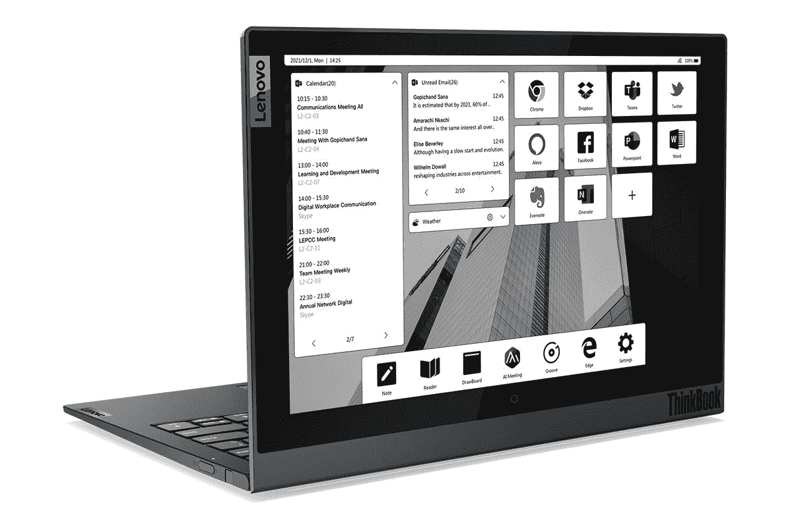

# 联想 ThinkBook Plus 点评:如果 Kindle 和笔记本电脑有了宝宝

> 原文：<https://www.xda-developers.com/lenovo-thinkbook-plus-gen-2-review/>

。bestawarddiv {

浮动:对；

宽度:20%；

边距:1em

边距-顶部:0；

}

你有没有想过拥有一台盖子上内置电子墨水屏幕的笔记本电脑会是什么样子？大部分人大概都没有，但是联想有。ThinkBook Plus 恰恰做到了这一点，而第二代正在被推荐给评论者。

就我个人而言，我对此很兴奋。我是亚马逊 Kindle 电子阅读器的忠实粉丝，任何了解我的人都知道，我一直在寻找一款可以做任何事情的设备。我希望看到不需要额外设备的设备，但要智能、实用、方便。三星的 Galaxy Z Fold 3 很好地实现了这一点，这款设备可以展开成平板电脑大小，不再需要电子阅读器或迷你平板电脑。

那么，是联想 ThinkBook Plus 做到了这一点，还是 E Ink 屏幕以某种新的方式增加了价值？答案是...算是吧。请继续阅读了解更多信息。

**浏览此评论:**

### 联想 ThinkBook Plus 第二代规格

| 

中央处理器

 | 英特尔酷睿 i7-1160G7 |
| 

制图法

 | 英特尔 Iris Xe |
| 

身体

 | 298 x 209 x 13.9 毫米(11.73 x 8.22 x 0.54 英寸)，1.16 千克(2.55 磅) |
| 

显示

 | 

*   液晶显示屏:13.3 英寸 WQXGA (2560 x 1600) IPS、400 尼特、光滑、100% sRGB、杜比视界触摸屏
*   电子墨水显示屏:12 英寸 WQXGA (2560 x 1600)单色触摸屏

 |
| 

记忆

 | 16 GB LPDDR4x 4266MHz(焊接) |
| 

储存；储备

 | 512 GB PCIe 固态硬盘第四代 |
| 

安全性

 | 

*   离散可信平台模块 2.0 (dTPM)
*   智能开机(集成了电源按钮的触摸指纹识别器)
*   思考快门

 |
| 

声音的

 | 

*   2 个 2W 哈曼卡顿立体声扬声器
*   杜比大气
*   4 个阵列话筒，近场和远场

 |
| 

连通性

 | 

*   802.11 像素(2 x 2)
*   蓝牙 5.2

 |
| 

照相机

 | 带隐私快门的 720p 高清摄像头 |
| 

投入

 | 

*   背着光的
*   VoIP 热键
*   精密触摸板
*   联想集成笔

 |
| 

端口/插槽

 | 

*   2 x 雷电 4
*   耳机/麦克风组合

 |
| 

在盒子里

 | 

*   ThinkBook Plus 第二代
*   65W 交流适配器
*   53 瓦时内置电池(支持快速充电)
*   快速入门指南

 |
| 

颜色

 | 风暴灰色 |
| 

材料

 | 铝+玻璃(顶部)，镁-铝(底部) |
| 

操作系统（Operating System）

 | Windows 10 专业版 |
| 

价格

 | $2,609.00 |

所列价格是在 Lenovo.com 上配置的。还有一款售价 2429 美元的酷睿 i5。

## 设计:联想 ThinkBook Plus 与任何其他笔记本电脑一样，只是盖子上有一个大的 E Ink 显示屏

ThinkBook Plus Gen 2 看起来就像任何其他的[联想笔记本电脑](https://www.xda-developers.com/best-lenovo-laptops/)，除了，你知道，盖子上的巨型电子墨水显示屏。它的颜色是风暴灰，这是一种我从来都不喜欢的铜灰色。事实上，灰色笔记本电脑对我来说看起来很沉闷，但话说回来，整个 ThinkBook 品牌都是针对中小型企业的，我想你不会太想在这些企业中脱颖而出。

联想 ThinkBook Plus 重 2.5 磅，非常容易操作。

它也真的很轻，两磅半，真的很酷。虽然 ThinkBook Plus 的一切都只是为了谈论 E Ink 显示屏，但绝对值得注意的是这方面的工程有多酷。它配备了 Tiger Lake UP4 处理器，因此可以做得更薄、更轻、更省电。你不会想到具有这种特性的东西会这么轻。

这意味着你不会为了获得额外的特性而做出这种妥协。你得到了电子墨水显示屏，它仍然比普通的超极本轻。就我个人而言，我在加州参加联发科高管峰会时发现它是一个极好的旅行伴侣。如果我没有其他单元要复习的话，我下次旅行也会带着它。当我使用笔记本电脑并说我会再次使用它时，这是一种认可。

就端口而言，这里没有 USB Type-A。在设备的左侧，有两个 Thunderbolt 4 端口，所以没错，这是一个英特尔 Evo 认证的设备。这意味着，如果 UP4 CPU 对你来说不够，你可以继续连接一个外部显卡，或者你可以使用其中一个端口来连接两个 4K 显示器。在那一侧还有一个 3.5 毫米的音频插孔。

在右侧，你会发现电源按钮，它兼作指纹传感器。它实际上非常好，如果我必须在两者之间做出选择的话，这是我实际上比红外相机更喜欢它的少数几次之一。这与你不希望指纹传感器出现在键盘面板上的原因是一样的。如果你只是使用盖子上的电子墨水显示屏，你必须能够解锁电脑。

说到使用 E Ink 显示屏，右边的设备中还内置了一个笔库。如果你打算在电子墨水屏幕上做笔记之类的事情，你可以这样做，笔会一直伴随着你。

## 笔记本电脑盖子、Windows 11 和 Android 应用程序上的 E Ink 显示屏；说出一个更具代表性的三重奏

显然这款设备的亮点是，联想 ThinkBook Plus 的盖子上有一个 12 英寸的 QHD+ 16:10 E 墨水显示屏。你实际上可以用它做很多事情，因为它支持触摸和用内置在设备中的笔输入。你可以做任何事情，从白板，只是镜像什么会在你的屏幕上，如果盖子是打开的。没错；你可以把它当作一台普通的触摸屏电脑，配有电子墨水显示屏。

当然，我最期待的是 Kindle 应用程序。多年来，我一直呼吁在 Windows 上开发一个合适的触摸友好的 Kindle 应用程序，这是自 Windows 8 时代以来我们从未见过的。随着 [Windows 11](https://www.xda-developers.com/windows-11/) 的推出，我们将通过亚马逊应用商店获得 Android 应用支持，这意味着我们不仅仅获得一个触摸友好的 Kindle 应用；我们从亚马逊本身获得了好东西。

谁没有梦想过在 Windows 上使用 Android 应用程序阅读 Kindle 书籍，并在笔记本电脑的盖子上显示 E Ink？

当微软宣布 Windows 上的 Android 应用时，我说我想要两个 Android 应用:Kindle 和 Comixology。最近几个月，亚马逊终于开始让用户在 Kindle 应用中看到他们的漫画库，所以这真的是我唯一需要的应用了。而且很神奇。

于是，我坐在机场等待航班，从笔记本电脑盖子上的电子墨水显示器上阅读 Windows 11 上的 Android 应用程序中的一本书。没什么大不了的，对吧？

对我来说，这确实是一件大事。在我的职业中，我经常乘坐公共交通工具，无论是火车还是飞机。能够在我的笔记本电脑上工作，合上盖子，然后看书，这真的很好。它消除了携带专用阅读器的需要。对于这样的东西来说，两磅半并不太不舒服，但这是专用设备的一个缺点。尽管如此，如果我花一个半小时在火车上，这是一个很小的代价。

尽管有大量的生产力用例。正如你所看到的，有一个完整的仪表盘，可以显示天气、Outlook、应用程序的快捷方式等等。您可以将应用程序添加到快捷方式中，因此所有这些都是可定制的。

还有一个完整的设置菜单，让你自定义一切。事实上，当 PC 处于睡眠状态时，它会在 E Ink 显示屏上显示一幅图像；那个屏幕不只是一片空白。所以，你可以自定义，也可以自定义合上盖子时的行为。

毕竟也是安全设置。当我合上盖子，我可以继续使用电脑，这需要一点时间来适应。如果你不注意，你不会意识到笔记本电脑没有上锁。当然，你可以设置它，这样当你关闭它的时候它就会锁定。

## 显示器和键盘:哦，对了，联想 ThinkBook Plus 也有普通屏幕

联想 ThinkBook Plus Gen 2 拥有 13.3 英寸 16:10 QHD+显示屏，比第一代机型的 16:9 FHD 显示屏有所改进。该公司认为，16:10 是笔记本电脑的完美纵横比，笔记本电脑中更高的屏幕越来越常见。

该屏幕还支持杜比视觉 HDR，所以你消费的内容在它上面看起来很棒。总的来说，触摸屏非常棒。这不是敞篷车。据推测，联想认为没有必要将 E Ink 屏幕放在外面。

在我的测试中，它是一款非常坚固的显示器，支持 100%的 sRGB、72%的 NTSC、77%的 Adobe RGB 和 78%的 P3。

我还发现亮度超过了规格表上的 400 尼特，对比度达到了 1660:1。

网络摄像头内置了隐私保护，这总是很好的。可惜还是 720p 的网络摄像头。在这个在家工作的时代，这是不可接受的。如前所述，那里也没有红外摄像机。

键盘很坚固，这是我对 ThinkBook 的期望。ThinkBook 是一个相当新的品牌，面向中小型企业，但它也是 ThinkPad 的现代化版本。例如，你不会发现 ThinkPad 的键盘中间没有红色的跟踪点，或者触摸板上方没有物理按钮。ThinkBooks 也有更浅的键盘，让它们感觉更现代。

但是当然，你仍然可以从联想的[商用个人电脑](https://www.xda-developers.com/best-business-laptops/)中获得你所期望的质量。打字很舒服也很准确。

## 性能和电池寿命:E Ink 屏幕消耗了过多的电能

当我第一次收到这款设备时，我意识到它使用了英特尔酷睿 i7-1160G7，我不确定为什么。我现在明白了。如果它使用标准的 UP3 处理器，它不可能在携带和使用舒适的同时保持体面的电池寿命。正如我稍后将解释的那样，这并不能维持像样的电池寿命，但如果是 UP3 芯片，情况会更糟。

但首先，这里有一些背景知识。酷睿 i7-1160G7 来自虎湖 UP4 家族。对于第 10 代芯片，我们有 U 系列和 Y 系列，但现在，Y 系列已经足够好，可以被视为 U 系列，但在一个略低的层上，称为 UP4。UP3 是我们在笔记本电脑中常见的 U 系列芯片。简而言之，UP4 是 Y 系列的继任者。

y 系列的口碑真的很差，但是就我所见，UP4 其实很好。我不觉得我错过了这台机器的任何东西，至少在生产力性能方面。它还拥有英特尔 Iris Xe 的出色图形处理能力，因此使用 Photoshop 和 Illustrator 等应用程序也非常流畅。我做梦也不会想到用 Y 系列芯片来使用这些应用程序，所以这里有很大的不同。

但是就像我说的，我无法想象为什么这台电脑用 UP4 而不是 UP3。毕竟联想 ThinkPad X1 Carbon 更轻，依然有 UP3 芯片。我真的认为这归结于电池寿命，因为坦率地说，我不喜欢这台机器的电池寿命。

总的来说，我发现正常使用情况下电池寿命约为三小时，这意味着屏幕处于中等亮度和推荐的电源设置。这可不好。我最多只有 3 小时 47 分钟。

我更大的问题是，即使你只是使用电子墨水显示器，它也会消耗太多的能量。如果我把它想象成使用亚马逊 Kindle，我会想到一种电池寿命长达数周的设备，但即使只是这样使用，你也不会超过五六个小时。这是一种不和谐的体验，我不禁认为，如果有 ARM 处理器，这东西会更好。

回到性能，我使用 PCMark 10、3DMark、Geekbench 和 Cinebench 作为基准。

|  | 

联想 ThinkBook Plus Gen 2Core i7-1160G7

 | 

惠普 Spectre x360 酷睿 i7-1165G7

 | 

联想 ThinkPad X12 可拆卸核心 i5-1130G7

 |
| --- | --- | --- | --- |
| 

PCMark 10

 | 4,633 | 4,705 | 4,286 |
| 

3DMark:时间间谍

 | 1,514 |  |  |
| 

极客工作台

 | 1,408 / 4,797 | 1,414 / 4,470 | 1,299 / 4,446 |
| 

电影院长凳

 | 1,336 / 3,352 | 1,314 / 4,039 | 1,147 / 2,860 |

## 结论:该不该买联想 ThinkBook Plus Gen 2？

尽管有一些缺陷，我真的很喜欢联想 ThinkBook Plus Gen 2。我敢肯定，很多人会认为盖子上的 E Ink 显示屏是一个噱头，但自从联想在第一代产品发布之前首次为我演示这一功能以来，我一直对它感到兴奋。其实挺实用的。

如果电子墨水显示器看起来有用，联想 ThinkBook Plus 是一个很好的选择。

要是电池寿命更好就好了。这才是真正的问题。我倾向于坐在咖啡店里写评论，只是为了对我正在评论的笔记本电脑有最后的感觉，但有了这台，我觉得我好像在看着电池耗尽。谈到这台机器，我不能自信地说没有充电器你可以去任何地方。电子墨水显示器也是如此。如果你有六个小时的飞行时间，并且你打算读一本关于这方面的书，你可能不能只靠电池。

不过还是很酷。你可以在电子墨水显示屏上画画、做笔记、阅读或做任何你想做的事情。最重要的是，这一切都不会影响它成为一款出色的笔记本电脑。它有一个像你期待的联想那样的坚固键盘，还有一个 QHD 显示屏。如果你不看背面，你永远也不会知道这台机器有这么一个疯狂的新功能。

一句话:如果你对电子墨水显示器感兴趣，并且不打算离充电器太远，那就去买吧。

 <picture></picture> 

Lenovo ThinkBook Plus Gen 2

##### 联想 ThinkBook Plus 第二代

联想的 ThinkBook Plus 完善了笔记本电脑的概念，在盖子上安装了 E Ink 屏幕，封装了第 11 代处理器等。