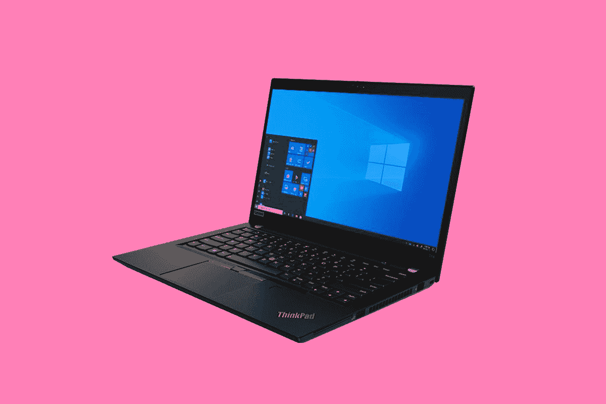

# 联想 ThinkPad T14 Gen 2 评测:ThinkPad 家族的主力

> 原文：<https://www.xda-developers.com/lenovo-thinkpad-t14-gen-2-review/>

众所周知，联想的 ThinkPad T14 是 ThinkPad 系列中最畅销的产品。这意味着检查正确的框，而不是在你需要的时候让你失望。它是可靠的，它具有 MIL-STD-810G 耐用性，等等。事实上，联想 ThinkPad T14 Gen 2 是最终的主流[商务笔记本电脑](https://www.xda-developers.com/best-business-laptops/)，也是粉丝们的最爱。今年的主要新功能是英特尔的第 11 代处理器，所以它主要是一个规格的提升。

**导航本页**

## 规范

| 

中央处理器

 | 英特尔第 11 代酷睿 i5-1145G7 (1.6GHz) |
| 

制图法

 | 英特尔 Iris Xe 显卡 |
| 

身体

 | 329 x 227 x 17.9 毫米(12.95x8.94x0.70 英寸)，1.47 千克(3.23 磅) |
| 

显示

 | 14.0 英寸 FHD (1920x1080)，IPS，400 尼特，防眩光，72% NTSC，低功耗 |
| 

随机存取存储

 | 16GB DDR4-3200(焊接) |
| 

储存；储备

 | 512GB M.2 2280 PCIe NVMe 固态硬盘 |
| 

港口

 | 2 个 USB 3.2 Gen 1(一个始终开启)2 个 Thunderbolt 4/USB 40 Gbps(数据、电源、显示器)1 个侧面坞站连接器 1 个 HDMI 2.0 1 个耳机/麦克风组合插孔(3.5 毫米)1 个 Micro-SD 卡插槽 |
| 

连通性

 | 英特尔无线 6E AX210 +蓝牙 5.2 |
| 

照相机

 | IR & 720p，带隐私快门，定焦 |
| 

投入

 | 6 排防溅多媒体 Fn 键、LED 背光跟踪点指示设备和聚酯薄膜表面多点触控触摸板 |
| 

声音的

 | 立体声扬声器，2W x2，杜比音频，双阵列麦克风 |
| 

安全性

 | 分立 TPM 2.0，TCG 认证，片上匹配 FPR |
| 

电池

 | 50Wh，支持快速充电(1 小时 80%) |
| 

材料

 | 顶部:PPS / 50% GF 底部:PC + ABS +镁合金(键盘盖)，PA / 50% GF |
| 

颜色

 | 黑色 |
| 

操作系统（Operating System）

 | Windows 10 专业版 |
| 

价格

 | $1,691.40 |

所列价格是在[Lenovo.com](https://shop-links.co/link/?exclusive=1&publisher_slug=xda&article_name=Lenovo+ThinkPad+T14+Gen+2+Review%3A+The+workhorse+of+the+ThinkPad+family&article_url=https%3A%2F%2Fwww.xda-developers.com%2Flenovo-thinkpad-t14-gen-2-review%2F&u1=UUxdaUeUpU4214&url=https%3A%2F%2Fwww.lenovo.com%2Fus%2Fen%2Flaptops%2Fthinkpad%2Fthinkpad-t-series%2FT14-G2-Intel%2Fp%2F22TPT14T4N2)上配置的。也有很多选择。它以酷睿 i5-1135G7 开始，有五种显示器选择。有两个 300 尼特的 FHD 面板，分别是触摸和非触摸，还有一个 500 尼特的 FHD 隐私显示器和一个 UHD 选项，带杜比视觉 HDR。您可以为它配置蜂窝网络、可选的 NVIDIA MX450 显卡等等。这是万能的个人电脑。

## 联想 ThinkPad T14 看起来和你想象的一模一样

这些年来，ThinkPad T 系列变得越来越小，越来越薄，就像所有的笔记本电脑一样。但老实说，这里没有惊喜，尤其是如果你已经使用了这台电脑的前辈之一。事实上，它们在野外并不难找到。

联想发给我的型号是黑色的，虽然它也有风暴灰色。它是由聚碳酸酯和镁合金组合而成的，它有着与这种特殊型号相同的盒子形状。重量为 3.23 磅，这台机器的一切都是主流。如果你想要更轻的，就买 ThinkPad T14s，对其他人来说，它有点像 ThinkPad X1 Carbon。

它还有各种各样的端口。在左侧，你会发现两个 Thunderbolt 4 端口。这意味着您可以获得 40Gbps 的速度，并在单个端口上支持双 4K 显示器或一个 8K 显示器。Thunderbolt 4 绝对是你想要的笔记本电脑，它的两个 USB Type-C 端口都有。其中一个还有一个机械对接的插槽。

左侧还有一个用于 5Gbps 速度的 USB 3.2 Gen 1 Type-A 端口、HDMI 2.0、3.5 毫米音频插孔和 microSD 卡插槽。在右侧，您还会发现以太网和另一个 USB 3.2 Gen 1 Type-A 端口。就像我说的，这是万能的电脑。它拥有您需要的所有端口、大量配置选项等等。

## 它有一个 14 英寸 400 尼特的 FHD 显示器，以及杜比音频

就像我说过的，联想 ThinkPad T14 Gen 2 有很多配置选项，这也适用于显示器。两个基本选项是 FHD 300 nit 面板，其中一个是触摸，另一个是非触摸。联想发给我的是低功耗 400 尼特 FHD 面板。其他选项包括带有隐私显示器的 500 尼特 FHD 面板，以及支持杜比视觉 HDR 的 UHD 面板。

屏幕很好。这没什么好吹嘘的，但它完成了任务。视角不是特别令人印象深刻——它不是特别明亮，色域也没有赢得任何奖项。都很一般。

不过，这并不是一件坏事。正确的说法是“功能性”，就像这台电脑的大部分一样。如果你想要一个*是*的屏幕来炫耀，那么你就可以选择 HDR 杜比视界的 UHD 面板。我在过去的模型上评论过它，它相当不错。你最终会为它的电池寿命买单，但这只是笔记本电脑上 4K 显示器的成本。

遗憾的是，联想的 14 英寸 ThinkPads 不再提供 QHD 屏幕，我一直认为这是分辨率和电池寿命之间的完美平衡。

另外要指出的是，可悲的是，屏幕还是 16:9。ThinkPad X1 系列今年达到了 16:10，[联想认为 16:10 是最完美的宽高比](https://www.xda-developers.com/lenovo-thinkpad-x1-titanium-nano-interview/)。特别是因为今年的 T14 主要是一个规格凸起，值得记住的是明年的型号可能是一个完整的重新设计，如果是这样，我们几乎肯定会看到 16:10 的显示屏。

可悲的是，网络摄像头仍然是 720p，这是一个在家工作的时代的问题。似乎只有戴尔真正做好了准备。该产品的直接竞争对手 Latitude 7420 拥有 1080p 网络摄像头。

双 2W 扬声器位于转轴旁边的条形音箱中。他们用杜比音频调谐，就像屏幕一样，很好。可能是因为我评测了那么多 PC，但是这几天真的能分辨出杜比音响和杜比全景声的区别。

## 联想 ThinkPad T14 Gen 2 拥有 1.8 毫米的键盘

我真的希望你喜欢深键盘，因为在现代，ThinkPad T14 的键盘是最深的键盘之一，约为 1.8 毫米。相比之下，ThinkPad X1 Carbon 和 ThinkPad X1 Yoga 的键盘为 1.5 毫米，ThinkPad X1 Nano 和 ThinkPad X1 Titanium 的键盘为 1.35 毫米。虽然它确实感觉像 ThinkPad 键盘，但力曲线应该是一样的。只是距离长了点。

不过，键盘显然是优质的。事实上，这是人们购买 ThinkPad 的部分原因；它是键盘中的凯迪拉克。你会注意到它确实有一些遗留组件，例如 G、H 和 B 键中间的 TrackPoint。短期内不会有任何进展。这是现有的每一台 ThinkPad 的主要特点。也许有一天，联想至少会提供一个没有 TrackPoint 的选项，这是 Windows 触摸板糟糕透顶的时代的遗物。

说到精密触摸板，这个是可点击的，但上面仍然有物理按钮。这些按钮旨在与 TrackPoint 配合使用。但是，虽然联想在触摸板上尽可能多地使用了空间，但这些按钮仍然占据了大量空间。

## 性能:它有一个老虎湖核心 i5，以及 16GB 内存

联想发给我的型号包括英特尔酷睿 i5-1145G7，这是博锐的变体，以及 16GB RAM 和 512GB 的内部存储。虽然大多数消费者可能会选择酷睿 i5/8GB/256GB 或酷睿 i7/16GB/512GB，但这实际上是一种非常常见的商务配置。

对于处理器，唯一需要记住的是，Iris Xe 显卡仍然非常好，但不如酷睿 i7-1185G7。G 旁边的数字表示图形性能，但仅仅因为它们都是“G7”，并不意味着它们是平等的。酷睿 i5 具有更少的执行单元和更低的时钟速度。不过没关系。这是主流笔记本电脑的主流芯片。

就像我说的，这里的一切都很简单。ThinkPad T14 并不是该系列的旗舰产品；它是一匹老黄牛。这是一款可靠的 ThinkPad，它可以提供您想要的任何配置。它可以在您需要时完成工作。这是一个伟大的机器，但对我来说，我想不出一个突出的特点。我甚至不确定我能不能做到。

对于基准测试，我运行了 PCMark 8、PCMark 10、Geekbench 和 Cinebench。

|  | 

ThinkPad T14 第二代酷睿 i5-1145G7

 | 

ThinkPad T14s 第一代锐龙 7 PRO 4750U

 | 

dynabook Portege X30L-G Core i5-10210 u

 |
| --- | --- | --- | --- |
| 

PCMark 8:主页

 | 4,231 | 4,298 | 3,616 |
| 

PCMark 8:创意

 | 4,615 | 4,568 | 3,511 |
| 

PCMark 8:工作

 | 4,108 | 3,857 | 3,679 |
| 

PCMark 10

 | 4,851 | 4,963 | 3,906 |
| 

极客工作台

 | 1,386 / 4,552 |  | 695 / 1,922 |
| 

电影院长凳

 | 1,340 / 5,246 |  | 489 / 1,480 |

正如您所看到的，商用笔记本电脑中的第十代酷睿 i5 处理器有一些重大改进。工艺已经从 14 纳米发展到 10 纳米，UHD 图形已经升级到 Iris Xe。

至于电池寿命，我得到了平均五个小时和变化，这不是非常好。这是在屏幕亮度约为三分之一、电源滑块比节电模式高一档的情况下。根据你如何使用它，你可以获得六到七个小时的时间，但不要计划不带充电器去工作。

## 结论:该不该买联想 ThinkPad T14 Gen 2？

从全局来看，您还必须考虑 HP EliteBook 840 和 Dell Latitude 7420。这三款电脑都非常棒。联想和惠普都有最好的键盘，我认为 ThinkPad T14 的 UHD 选项有最好的屏幕。不幸的是，戴尔为联想和惠普提供了合适的 1080p 网络摄像头。

当您想到联想 ThinkPad T14 Gen 2 时，您应该想到一些久经考验的真理。这种产品没有任何风险。它仍然有 1.8 毫米的键盘，跟踪点，等等。与其他相比，它甚至有相对较大的表圈。但是这里没有惊喜，对于商用笔记本电脑来说，这一点非常重要。T 系列是最畅销的 ThinkPad 是有原因的；你不会后悔为你的生意买了这个。

正如我说过几次，有很多配置选项。您可以使用 HDR 杜比视界获得 UHD 显示屏，您可以获得蜂窝连接，您可以使用英特尔 Tiger Lake 或 AMD 锐龙 5000 PRO CPUs 进行配置，等等。所有这些都包含在一个主流包中。非常棒。

 <picture></picture> 

Lenovo ThinkPad T14 Gen 2

##### 联想 ThinkPad T14 Gen 2

联想 ThinkPad T14 是该系列的主力，今年的型号配备了英特尔 Tiger Lake 处理器。