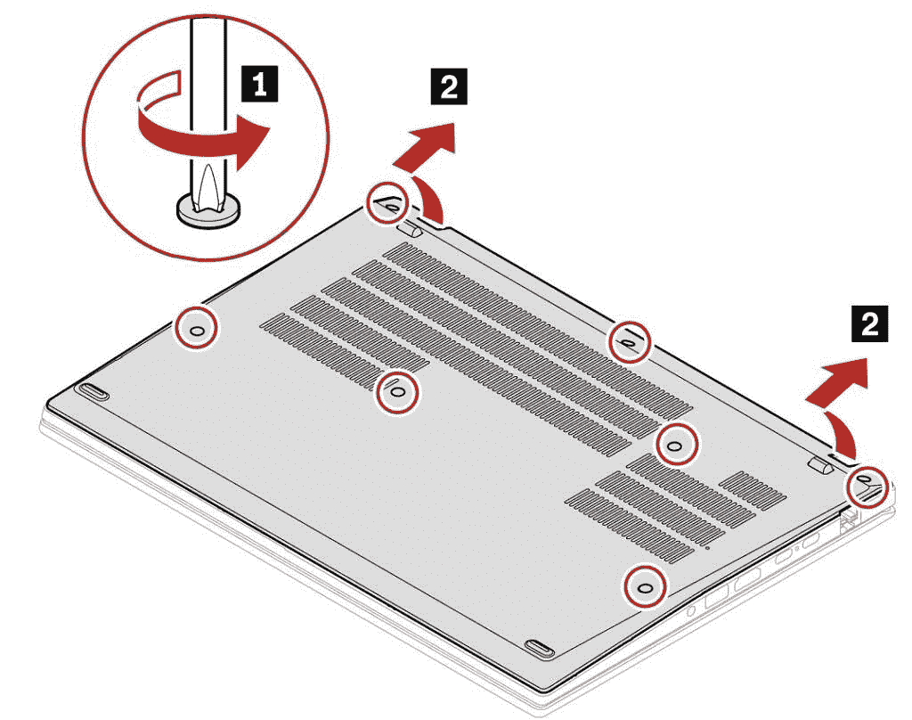
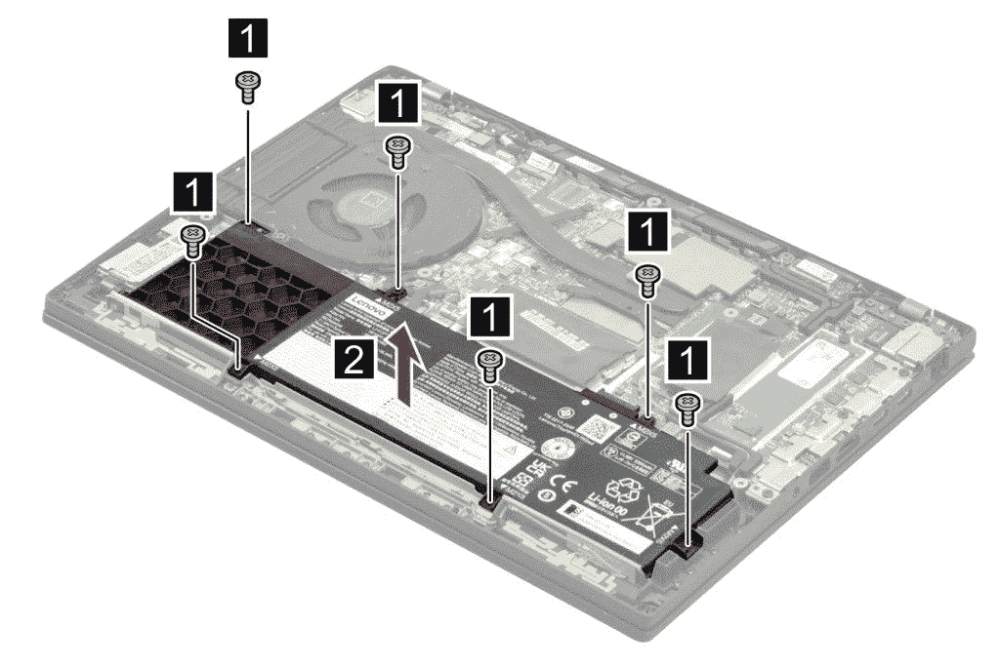

# 联想 ThinkPad T14 Gen 3 可以更换电池吗？

> 原文：<https://www.xda-developers.com/lenovo-thinkpad-t14-gen-3-replace-battery/>

当谈到商用笔记本电脑时，很少有品牌像联想的 ThinkPads 一样广为人知。这些是用于工作的标志性笔记本电脑，它们具备所有的基本功能。2022 年，联想推出了 [ThinkPad T14 Gen 3](https://www.xda-developers.com/lenovo-thinkpad-t14-gen-3/) ，这是其更主流的笔记本电脑系列中的最新产品，它有一些重大升级，包括新的处理器、更高的屏幕和更好的网络摄像头。商务笔记本电脑的可维修性和可维护性也是众所周知的，如果你打算更换联想 ThinkPad T14 的电池，你很幸运。

根据联想的说法，你可以在技术上更换 ThinkPad T14 Gen 3 的电池，尽管这并不意味着最终用户可以更换电池。你需要做的是找到一个兼容的电池，联想还没有列出电池的具体零件号，所以可能很难找到。不过，一旦你这么做了，你可以相对容易地自己替换它。

## 你需要什么

在您开始更换电脑内部的任何东西之前，确保您已经做好安全更换的准备是非常重要的。打开笔记本电脑相当容易，你只需要一把飞利浦螺丝刀，但你可以随时购买 [iFixit 工具包](https://www.amazon.com/iFixit-Essential-Electronics-Toolkit-Smartphone/dp/B0964G2Y7S?tag=xda-13iok85-20&ascsubtag=UUxdaUeUpU41447&asc_refurl=https%3A%2F%2Fwww.xda-developers.com%2Flenovo-thinkpad-t14-gen-3-replace-battery%2F&asc_campaign=Evergreen)来获得更多可能对其他电子产品有用的工具。另一件重要的事情是避免静电放电，因此购买一个[防静电腕带](https://www.amazon.com/Wristband-Bracelet-Grounding-Alligator-Extendable/dp/B08CXQN86W?tag=xda-13iok85-20&ascsubtag=UUxdaUeUpU41447&asc_refurl=https%3A%2F%2Fwww.xda-developers.com%2Flenovo-thinkpad-t14-gen-3-replace-battery%2F&asc_campaign=Evergreen)可能会有所帮助，您可以在此过程中佩戴。您还需要确保在干净的表面上工作，没有会产生静电的布料。

至于电池本身，笔记本电脑自带 39.3 瓦时或 52.5 瓦时的电池，所以你可能想找一个与你原来型号容量相同的电池。您可以留意[联想的零件查找](https://pcsupport.lenovo.com/pt/en/products/laptops-and-netbooks/thinkpad-t-series-laptops/thinkpad-t14-gen-3-type-21ah-21aj/21ah/parts/)页面，找到要查找的正确零件号。这样应该更容易在网上找到。

最后，在开始之前，您需要禁用电池，以避免在工作时有任何电流通过您的系统。你可以这样做:

*   在 Windows 中打开控制面板(更简单的方法是在开始菜单搜索栏中搜索它)。
*   点击**电源选项**，然后点击左侧菜单中的**选择电源按钮**的功能。
*   在这里，点击**显示当前不可用的选项**。您需要有管理员权限才能在出现的提示窗口中点击**是**。
*   取消选中**打开快速启动**框，然后点击**保存更改**。
*   重新启动电脑，当您看到 Lenovo 徽标时，立即按键盘上的 F1 键，以访问 UEFI BIOS 设置。
*   进入**配置**部分，然后选择**电源**，最后**禁用内置电池**。确认您的更改，笔记本电脑将关闭。

一旦这些都完成了，从笔记本电脑上拔下充电器，让它休息几分钟再开始。

## 更换 ThinkPad T14 Gen 3 中的电池

一旦你完成了所有的准备步骤，更换电池实际上是一个非常简单的过程。以下是如何做到这一点:

*   放置笔记本电脑时，盖子朝下，转轴背向您。如果您的型号有 SIM 卡托架，请先将其卸下。
*   使用十字螺丝刀拧下固定基座盖的七颗螺钉。从顶部提起基座盖，将其卸下。<picture></picture>

    形象功劳:联想

*   电池在笔记本电脑的底部。取下固定电池的六颗螺丝。您应该能够从电池盒中取出电池。<picture></picture>

    形象功劳:联想

*   取出新电池，重新插入原来的位置。
*   使用六颗螺丝将电池重新固定到位。注意不要将螺丝拧得过紧，因为这样会损坏主板。
*   将基座盖放回原位，拧紧七颗螺丝将其固定在一起。同样，注意不要过紧。

* * *

关于更换联想 ThinkPad T14 Gen 3 的电池，您需要了解的就是这些。目前最大的挑战是找到合适的电池，因为笔记本电脑非常新，维修零件还没有广泛提供。只要你遵循注意事项，修理过程本身是相当简单的。一旦你完成了整个过程，你会想回到你的 BIOS 设置重新启用电池，否则你不能使用笔记本电脑，除非它被插入到一个插座。

如果你还没有，你可以使用下面的链接购买联想 ThinkPad T14 Gen 3。截至发稿时，只有英特尔型号可供购买，AMD 型号计划于 6 月上市。这两种型号都有各自公司的最新硬件，它们可能是今年你能买到的最好的笔记本电脑，尤其是如果你只是想要一台可靠的笔记本电脑来工作。如果你想看看其他选择，你可以随时查看今天能买到的[最好的 ThinkPad](https://www.xda-developers.com/best-thinkpads/)。

 <picture></picture> 

Lenovo ThinkPad T14 Gen 3

##### 联想 ThinkPad T14 Gen 3

联想 ThinkPad T14 Gen 3 是一款商务笔记本电脑，采用英特尔第 12 代或 AMD 锐龙 6000 处理器。它有一个 16:10 的显示屏，许多端口，它为企业提供了所有的基本功能。