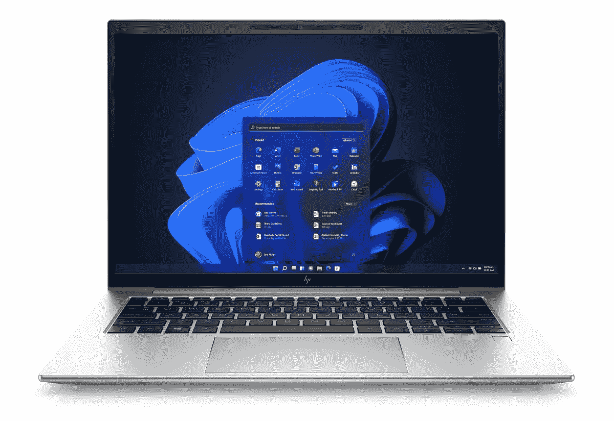

# 联想 ThinkPad T14 Gen 3 vs 惠普 EliteBook 840 G9:买哪个？

> 原文：<https://www.xda-developers.com/lenovo-thinkpad-t14-gen-3-vs-hp-elitebook-840-g9/>

联想 ThinkPad T14 Gen 3 是市场上最新的主流商务笔记本电脑之一，与许多其他优秀的笔记本电脑并驾齐驱。这款笔记本电脑的 2022 新版本有英特尔和 AMD 两种版本，配有 14 英寸 16:10 显示屏。我们已经将 ThinkPad T14 Gen 3 与今年的许多商务笔记本进行了比较，但现在是时候将其与惠普的新 EliteBook 840 G9 进行对比了。如果您正在寻找采用英特尔全新第 12 代 Alder Lake CPUs 的企业，EliteBook 840 G9 也是一个不错的选择。在这篇文章中，我们将看看联想 ThinkPad T14 Gen 3 与惠普 EliteBook 840 G9 的对比，看看哪个更好。

**浏览本文:**

## 联想 ThinkPad T14 Gen 3 与惠普 EliteBook 840 G9:规格

在开始比较之前，让我们先来看看每款笔记本电脑的规格，了解它们各自的特点:

| 

规格

 | 

**联想 ThinkPad T14 Gen 3**

 | 

**惠普 EliteBook 840 G9**

 |
| --- | --- | --- |
| **CPU** | 

*   最高可配第 12 代英特尔酷睿 i7 博锐 P 系列和 U 系列处理器
*   最高可配 AMD 锐龙 6000 PRO 处理器(20W)

 | 

*   基于英特尔 EVO 的第 12 代英特尔酷睿博锐处理器(未指定 SKU)

 |
| **图形** | 

*   **综合**
    *   英特尔 UHD 显卡(酷睿 i3)
    *   英特尔 Iris Xe 显卡(酷睿 i5 和酷睿 i7)
    *   AMD 镭龙显卡 600M (AMD 变体)
*   **离散(可选)**
    *   NVIDIA GeForce MX550
    *   英伟达 GeForce RTX 2050

 |  |
| **闸板** | 

*   高达 48GB DDR4 双通道焊接 chipOne SODIMM 插槽
*   高达 32GB LPDDR5 6400MHz (AMD 变体)

 | 

*   高达 64 GB 2xDDR5 双通道 SODIMM(用户可升级)

 |
| **储存** |  |  |
| **显示** | 

*   14 英寸 16:10 全高清+ (1920 x 1200) IPS，防眩光，300 尼特
*   14 英寸 16:10 全高清+ (1920 x 1200) IPS，防眩光，300 尼特，触控
*   14 英寸 16:10 全高清+ (1920 x 1200) IPS，低功耗，防眩光，400 尼特，100% sRGB
*   14 英寸 16:10 全高清+ (1920 x 1200) IPS，隐私保护，防眩光，500 尼特，100% sRGB
*   14 英寸 16:10 2.2K (2240×1400) IPS，防眩光，300 尼特
*   14 英寸 16:10 超高清+ (3840 x 2400) IPS，防眩光，防反射，防污迹，500 尼特，100% DCI-P3，HDR 400，杜比视觉，触摸(AOFT)

 | 

*   14 英寸对角线 16:10 1920x1200 IPS 防眩光，250 尼特
*   14 英寸对角线 16:10 1920x1200 IPS 防眩光，低功耗，400 尼特，惠普轻松视屏
*   14 英寸对角线 16:10 1920x1200 IPS 防眩光，具有 HP Sure View 反射和 HP Eye Ease

 |
| **电池** | 

*   39.3 瓦时电池(仅限集成显卡)
*   52.5 瓦时电池

 |  |
| **端口** | 

*   2 个 Thunderbolt 4(英特尔变体)/ USB Type-C
*   2 个 USB 类型 A (USB 3.2 第 1 代)
*   1 个 HDMI 2.0b 接口
*   1 个 RJ45 以太网
*   3.5 毫米组合耳机插孔
*   SIM 卡插槽

 | 

*   2 个 Thunderbolt 4，带 USB4 Type-C
*   2 个 USB 类型 A
*   1 个 HDMI 2.0 接口
*   1 个 Nano SIM 卡插槽
*   3.5 毫米组合耳机插孔

 |
| **音频** | 

*   带有杜比语音的杜比音频扬声器系统
*   双麦克风

 |  |
| **网络摄像头** | 

*   720p 高清摄像头
*   1080p 全高清摄像头
*   1080p 全高清摄像头+红外摄像头

 | 

*   具有自动面部取景功能的 500 万像素摄像头

 |
| **安全** | 

*   指纹识别器(在电源按钮中)
*   可选:红外摄像头

 | 

*   指纹识别器(可选)

 |
| **连通性** | 

*   Wi-Fi 6E
*   蓝牙 5.2
*   4G LTE(4 类/16 类/20 类)

 | 

*   Wi-Fi 6E
*   蓝牙 5.2
*   LTE-Advanced Pro(第 16 类)，英特尔 5000 5G

 |
| **尺寸(WxDxH)** | 

*   317.7 x 226.9 x 17.9 毫米(12.51 x 8.93 x 0.70 英寸)

 | 

*   316 x 224 x 19.2 毫米(12.44 x 8.82 x 0.76 英寸)

 |
| **重量** |  |  |
| **价格** | 

*   AMD 变体的起价为 1299.99 美元
*   英特尔变体起价 1399.99 美元

 |  |

## 联想 ThinkPad T14 Gen 3 与惠普 EliteBook 840 G9:性能

有了联想 ThinkPad T14 Gen 3 和惠普 EliteBook 840 G9，您就有了英特尔新的第 12 代 Alder Lake 移动 CPU。惠普尚未宣布其用于 EliteBook 840 G9 的确切 SKU，但我们知道联想 ThinkPad T14 Gen 3 可用于英特尔的第 12 代 P 和 U 系列移动芯片。值得注意的是，你也可以购买配备 AMD 新[锐龙 6000 系列 PRO 处理器](https://www.xda-developers.com/amd-ryzen-6000/)的 ThinkPad T14 Gen 3。因此，如果你想在市场上购买一台基于 AMD 处理器的笔记本电脑，那么你已经知道该选择哪一款了。我们将密切关注惠普的更多公告，了解他们为 EliteBook 840 G9 笔记本电脑使用的处理器。我们预计他们也会使用英特尔新的 P 系列 Alder Lake 移动芯片。这些新处理器的默认 TDP 为 28W。另一方面，U 系列处理器的默认 TDP 为 15W 或 9W。我们建议您查看我们的[英特尔 P 系列与 U 系列处理器对比](https://www.xda-developers.com/intel-12th-gen-p-vs-u-series/)，了解这些芯片之间的性能差异。

还有一个微小的机会，我们可能会看到一些型号的 EliteBook 840 G9 使用英特尔的 U 系列处理器。我们这样说是因为这款笔记本的一些型号配备了相对较小的 38 瓦时电池，而不是较大的 51 瓦时电池。至于图形芯片，联想还为 ThinkPad T14 Gen 3 笔记本电脑的英特尔版本提供了可选的独立图形芯片。除了英特尔的集成图形芯片，您还可以选择 NVIDIA GeForce MX550 和 NVIDIA GeForce RTX 2050。而 EliteBook 840 G9 似乎只有英特尔的集成显卡芯片。

在内存和存储方面，ThinkPad T14 Gen 3 笔记本电脑的英特尔版本可提供高达 48GB 的 DDR4 内存。AMD 变体只能配置高达 32GB 的内存，但您可以获得高达 6400Mhz 频率的 LPDDR5 内存，而不是 DDR4。另一方面，HP EliteBook 840 G9 可以配置高达 64GB 的 DDR5 内存。因此，您不仅可以通过 EliteBook 840 G9 获得更多内存，还可以获得最新的 DDR5 模块。你还可以为 EliteBook 840 G9 配置高达 2TB 的 PCIe NVMe 固态硬盘存储，而 ThinkPad T14 Gen 3 的所有型号都不超过 1TB。

根据 just 的规格，很难判断哪种笔记本电脑的整体性能会更好，但值得一提的是，采用英特尔 P 系列芯片的笔记本电脑肯定会比功率相对较低的 U 系列性能更好。看看英特尔和 AMD 的 ThinkPad T14 Gen 3 变种如何相互竞争会很有趣，因为 AMD 也对其新的锐龙 6000 系列芯片进行了一些改进。

在我们进入下一部分之前，值得指出的是，我们看到的是每台笔记本电脑中容量几乎相同的电池。对于 ThinkPad T14 Gen 3，您可以选择 39.3 瓦时和 52.5 瓦时的电池。如果你选择不带独立显卡芯片的型号，你会得到一个更小的电池。惠普还为 EliteBook 840 G9 提供了 38 瓦时和 51 瓦时电池供您选择。我们预计由 U 系列芯片驱动的变体将有一个更小的电池，尽管还没有官方的确认。

## 显示

再来看显示器，本次对比中的两款笔记本电脑都采用了 14 英寸 16:10 面板。事实上，您可以在这款 14 英寸面板的几种变体之间进行选择。在联想的例子中，你可以选择触摸和非触摸面板。还有一个超高清+版本，配有触摸屏，高达 500 尼特的亮度，支持 HDR400 等。虽然 HP EliteBook 840 G9 也有一些显示器选项，但您只有峰值亮度更高的非触摸选项。我们喜欢这两款笔记本电脑都有更高的 16:10 宽高比面板，因为它们在商务笔记本电脑中更受欢迎，因为它们有更多的垂直屏幕空间，允许您阅读更多的网页或文档。

但如果我们要在显示器选项中选出一个赢家，那么我们认为 ThinkPad T14 Gen 3 更胜一筹，因为它提供了所有选项，尤其是更清晰的 2.2K 和超高清版本。这并不是说惠普 EliteBook 840 G9 的显示效果不好。您可以选择更亮的面板和包括 HP Sure View 在内的附加功能。HP Sure View 允许您启用隐私模式，在某个角度观看时，可减少高达 95%的可见光。这是一个很好的隐私功能，它为企业空间中的笔记本电脑增加了更多价值。

 <picture></picture> 

HP EliteBook 840 G9

至于网络摄像头，联想 ThinkPad T14 Gen 3 带有一个选项，可以选择 720p 高清或 1080p FHD 摄像头。只有 1080p 版本带有可选的红外支持，请记住这一点。这不一定是一个交易破坏者，因为你还可以在电源按钮中嵌入指纹扫描仪。惠普使用的是带有惠普自动取景功能的 500 万像素摄像头，这是一个众所周知的功能，可以确保无论你如何移动，你都在画面中。该公司正在为 EliteBook 840 G9 使用“新”的 500 万像素摄像头，因此与上一代产品相比，它的质量会稍微好一点。虽然它缺乏对红外的支持，但你可以选择指纹识别器进行身份验证。

## 设计和端口

 <picture></picture> 

Lenovo ThinkPad T14 Gen 3

如果您倾向于购买更薄更轻的笔记本电脑，那么我们认为 ThinkPad T14 Gen 3 笔记本电脑是合适的选择。它的厚度为 0.70 英寸，重量不到 1.36 千克。另一方面，惠普 EliteBook 840 G9 略厚，厚度为 0.76 英寸，起始重量为 1.362 千克。至于美观，ThinkPad T14 Gen 3 采用了经典 ThinkPad 的外观和感觉。它有两种配色可供选择——风暴灰和雷霆黑。雷黑色变种是一个可选的抗菌表面处理。HP EliteBook 840 G9 似乎只有银色的外壳。在 EliteBook 系列的其他笔记本电脑中，您可以获得更多的颜色选择，但在这里似乎不是这样。

谈到端口，我们认为这两款笔记本电脑都提供了不错的端口选择。联想 ThinkPad T14 Gen 3 配备了两个 USB 类型的 C 端口(对于英特尔变体为 Thunderbolt 4)、两个 USB 类型的 A 端口、一个 HDMI 2.0b 端口、一个 RJ45 以太网端口、一个 3.5 毫米组合耳机插孔和一个 SIM 卡插槽。HP EliteBook 840 G9 具有两个 Thunderbolt 4 端口、两个 USB Type-A 端口、一个 HDMI 2.0 端口、一个 Nano-SIM 插槽和一个 3.5 毫米组合插孔。您基本上错过了 EliteBook 840 G9 笔记本电脑上用于有线互联网连接的 RJ45 以太网端口。两款笔记本电脑都有 SIM 卡插槽，但 ThinkPad T14 Gen 3 仅支持 4G LTE，而 HP EliteBook 840 G9 也带有 5G 连接。两台机器上的其他连接选项包括 Wi-Fi 6E 和蓝牙 5.2。

## 应该买哪个？

就像许多其他的比较一样，这一次也是势均力敌。当您购买这些新的商务笔记本电脑时，您已经知道您将获得什么-您将获得最新一代的处理器、相对轻薄的外形、一组良好的端口、体面的连接选项等等。这两款笔记本电脑都具备基本的功能，但是在某些方面，一款比另一款更好。例如，ThinkPad T14 Gen 3 也配备了 AMD 处理器和英特尔变种的独立显卡芯片。您还可以获得更多的显示器选项，包括超高清+触摸变体。ThinkPad T14 Gen 3 还配备了一个 RJ45 以太网端口，这也是 EliteBook 840 G9 笔记本电脑所缺少的。

这并不是说 EliteBook 840 G9 无论如何都是一款糟糕的笔记本。这一款还配备了英特尔新的第 12 代 Alder Lake 移动芯片，具有 14 英寸 16:10 的宽高比面板，一组良好的端口，并支持 5G 连接。惠普尚未公布 EliteBook 840 G9 笔记本电脑的定价和可用性细节，但我们知道 ThinkPad T14 Gen 3 的 AMD 版本起价为 1299 美元，Intel 版本起价为 1399 美元。

 <picture></picture> 

Lenovo ThinkPad T14 Gen 3

##### 联想 ThinkPad T14 Gen 3

联想 ThinkPad T14 Gen 3 笔记本配备了英特尔新的第 12 代博锐或 AMD 的锐龙 6000 PRO 系列处理器。

 <picture></picture> 

HP EliteBook 840 G9

##### 惠普 EliteBook 840 G9

HP EliteBook 840 G9 是一款高端商务笔记本电脑，拥有大量配置选项，包括 5G 和 Tile 集成等额外功能。

如果你对这两款笔记本电脑都不感兴趣，那么一定要看看我们的其他文章，包括[最佳 ThinkPad 笔记本电脑](https://www.xda-developers.com/best-thinkpads/)和[最佳惠普笔记本电脑](https://www.xda-developers.com/best-hp-laptops/)，看看你是否能找到其他选择。