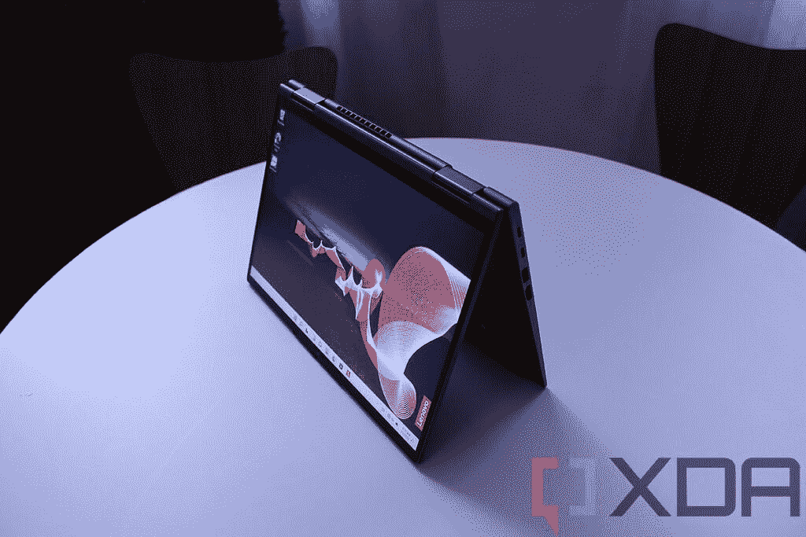
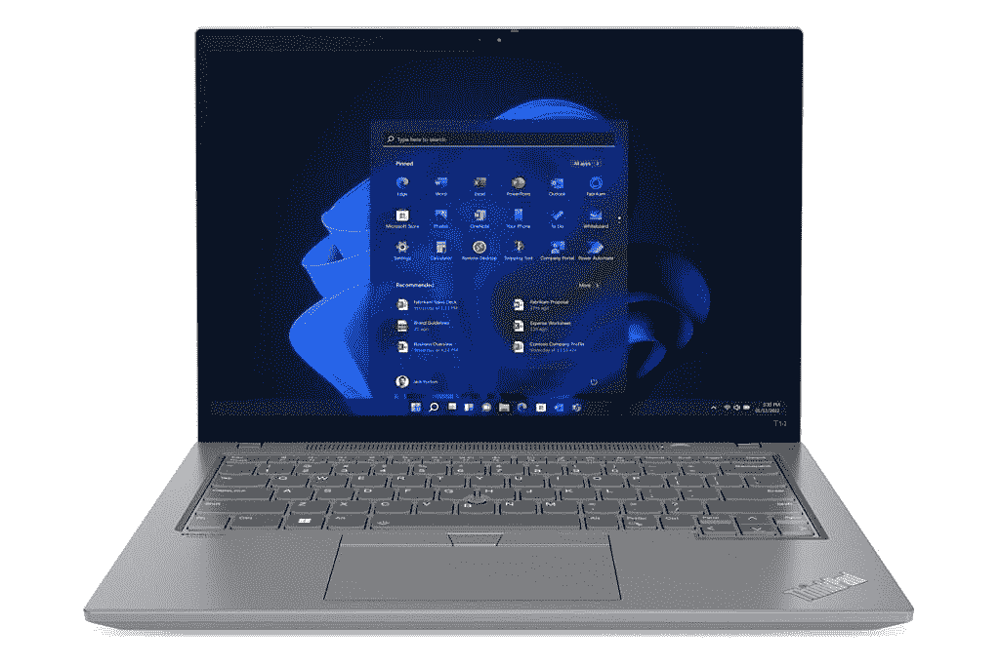
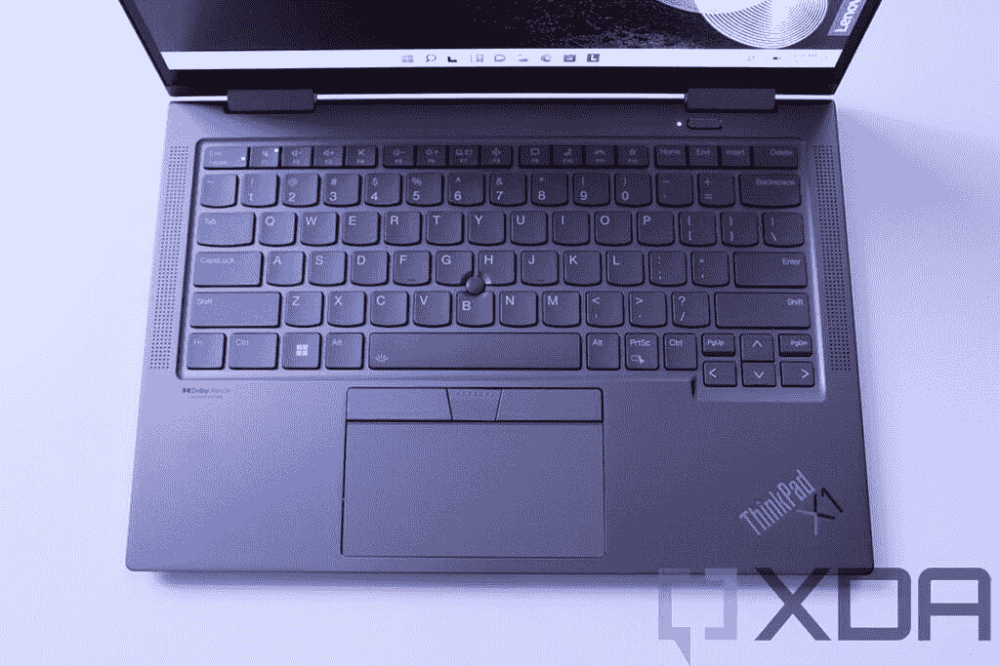
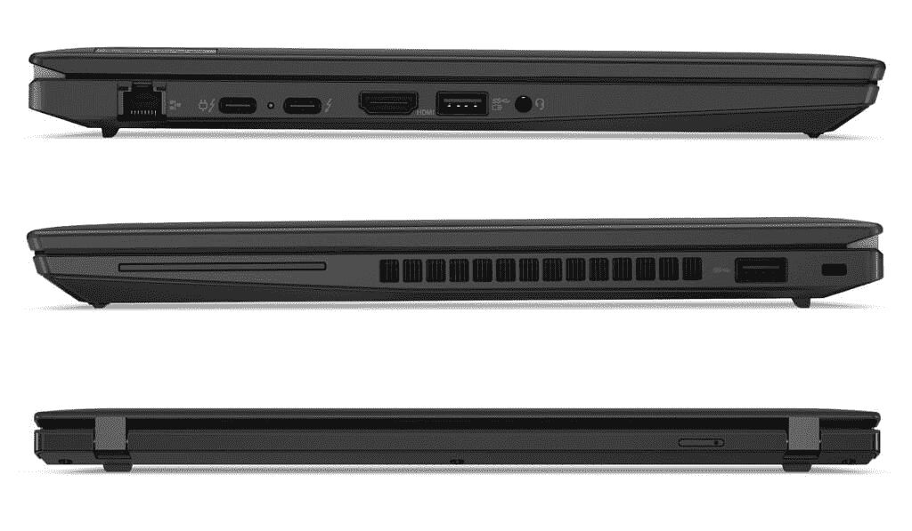

# 联想 ThinkPad T14 Gen 3 vs ThinkPad X1 Yoga Gen 7:哪个更好？

> 原文：<https://www.xda-developers.com/lenovo-thinkpad-t14-gen-3-vs-thinkpad-x1-yoga-gen-7/>

联想已经推出了一系列计划在 2022 年推出的笔记本电脑，其中许多已经上市。其中，[联想 ThinkPad T14 Gen 3](https://www.xda-developers.com/lenovo-thinkpad-t14-gen-3/) 和 [ThinkPad X1 Yoga Gen 7](https://www.xda-developers.com/lenovo-thinkpad-x1-yoga-gen-7/) 是两个绝佳的选择，尽管它们面向的用户类型略有不同。联想 ThinkPad X1 Yoga Gen 7 是联想的高级商务敞篷车，而 ThinkPad T14 Gen 3 更像是一款主流设备，它只是一款翻盖笔记本电脑。

尽管如此，它们有很多共同点，特别是由于联想今年对 ThinkPad T14 进行了一些升级。它们都有 14 英寸的显示屏，长宽比为 16:10，它们采用最新的英特尔处理器(尽管 ThinkPad T14 也有 AMD 型号)，它们自然有用户已经知道并喜欢的标志性的 ThinkPad 设计语言。所以，如果你在这两者之间犹豫不决，我们会帮助你。让我们仔细看看这些笔记本电脑的独特之处，以便您选择适合自己的电脑。

**浏览这篇文章:**

## 联想 ThinkPad T14 Gen 3 vs ThinkPad X1 Yoga Gen 7:规格

|  | 

联想 ThinkPad T14 Gen 3

 | 

联想 ThinkPad X1 Yoga Gen 7

 |
| --- | --- | --- |
| **操作系统** |  |  |
| **CPU** | 

*   **英特尔**
    *   最高可配第 12 代英特尔酷睿 i7 博锐 P 系列和 U 系列处理器
*   **AMD**
    *   最高可配 AMD 锐龙 6000 PRO 处理器(20W)

 | 

*   第 12 代英特尔酷睿 i5-1240P (12 个内核，16 个线程，最高 4.4GHz，12MB 高速缓存)
*   第 12 代英特尔酷睿 i5-1250P (12 个内核，16 个线程，最高 4.4GHz，12MB 高速缓存)
*   第 12 代英特尔酷睿 i7-1260P (12 个内核，16 个线程，最高 4.7GHz，18MB 高速缓存)
*   第 12 代英特尔酷睿 i7-1270P (12 个内核，16 个线程，最高 4.8GHz，18MB 高速缓存)
*   第 12 代英特尔酷睿 i7-1280P (14 个内核，20 个线程，最高 4.8GHz，24MB 高速缓存)

 |
| **图形** | 

*   **英特尔:**
    *   **综合**
        *   英特尔 UHD 显卡(酷睿 i3)
        *   英特尔 Iris Xe(酷睿 i5/酷睿 i7)
    *   **离散**(可选)
        *   NVIDIA GeForce MX550
        *   英伟达 GeForce RTX 2050
*   **AMD**
    *   AMD 镭龙显卡 600M(集成)

 |  |
| **显示** | 

*   14 英寸 16:10 全高清+ (1920 x 1200) IPS，防眩光，300 尼特
*   14 英寸 16:10 全高清+ (1920 x 1200) IPS，防眩光，300 尼特，触控
*   14 英寸 16:10 全高清+ (1920 x 1200) IPS，低功耗，防眩光，400 尼特，100% sRGB
*   14 英寸 16:10 全高清+ (1920 x 1200) IPS，隐私保护，防眩光，500 尼特，100% sRGB
*   14 英寸 16:10 2.2K (2240×1400) IPS，防眩光，300 尼特
*   14 英寸 16:10 超高清+ (3840 x 2400) IPS，防眩光，防反射，防污迹，500 尼特，100% DCI-P3，HDR 400，杜比视觉，触摸(AOFT)

 | 

*   14 英寸 WUXGA 16:10 (1920 x 1200) IPS 低功耗、触摸、防眩光、400 尼特、100% sRGB
*   14 英寸 WUXGA 16:10 (1920 x 1200) IPS 低功耗、触摸、防反光、防污染、400 尼特、100% sRGB
*   14 英寸 WUXGA 16:10 (1920 x 1200) IPS 低功耗、触摸、防眩光、隐私保护、500 尼特、100% sRGB
*   14 英寸 WQUXGA 16:10 (3840 x 2400)有机发光二极管低功耗、触摸、防反光、防污染、500 尼特、100% DCI-P3、杜比视界

 |
| **存储** | 

*   高达 2TB 的 PCIe 第四代 NVMe 固态硬盘

 | 

*   256GB PCIe 第四代固态硬盘
*   512GB PCIe 第四代固态硬盘
*   1TB PCIe 第四代固态硬盘
*   2TB PCIe 第四代固态硬盘

 |
| **公羊** | 

*   **英特尔:**
    *   最高 48GB DDR4 双通道(最高 16GB 焊接+最高 32GB SODIMM)
*   **AMD:**
    *   高达 32GB LPDDR5 6400MHz 双通道(焊接)

 | 

*   8GB LPDDR5 5200MHz(焊接)
*   16GB LPDDR5 5200MHz(焊接)
*   32GB LPDDR5 5200MHz(焊接)

 |
| **电池** | 

*   39.3 瓦时电池(仅限集成显卡)
*   52.5 瓦时电池
    *   65W USB Type-C 电源适配器

 | 

*   57 瓦时电池
    *   高达 65W 的 USB Type-C 电源适配器

 |
| **端口** | 

*   **英特尔:** 2 个迅雷 4 / USB Type-C
*   AMD: 2 个 USB 3.2 Gen 2 Type-C
*   2 个 USB 类型 A (USB 3.2 第 1 代)
*   1 个 HDMI 2.0b 接口
*   1 个 RJ45 以太网
*   3.5 毫米组合耳机插孔
*   SIM 卡插槽

 | 

*   2 个 Thunderbolt 4(USB C 型)
*   2 个 USB 3.2 第 1 代 A 型
*   1 个 HDMI 2.0b 接口
*   3.5 毫米耳机插孔
*   Nano SIM 卡插槽

 |
| **音频** | 

*   带有杜比语音的杜比音频扬声器系统
*   双远场麦克风

 | 

*   带杜比全景声的四声道立体声扬声器(2 个 2W 低音扬声器，2 个 0.8 瓦高音扬声器)
*   带杜比语音的四声道远场麦克风

 |
| **摄像机** | 

*   720p 高清 RGB 网络摄像头
*   1080p 全高清 RGB 网络摄像头
*   1080p 全高清 RGB +红外网络摄像头

 | 

*   1080p 全高清 RGB 网络摄像头
*   1080p 全高清 RGB +红外网络摄像头
*   具有计算机视觉功能的 1080p 全高清 MIPI RGB +红外网络摄像头

 |
| **Windows 你好** | 

*   红外网络摄像头(可选)
*   电源按钮中的指纹识别器

 | 

*   红外网络摄像头(可选)
*   指纹传感器

 |
| **连通性** | 

*   英特尔无线 6E
*   蓝牙 5.2
*   蜂窝选项:

 | 

*   英特尔无线 6E
*   蓝牙 5.2
*   蜂窝选项:
    *   5G sub-6 Cat2o
    *   4G LTE Cat16

 |
| **颜色** | 

*   风暴灰色
*   雷霆黑(**英特尔:**可选抗菌表面处理)

 |  |
| **尺寸(WxDxH)** | 

*   317.7 x 226.9 x 17.9 毫米(12.51 x 8.93 x 0.70 英寸)

 | 

*   314.4 x 222.3 x 15.53 毫米(12.38 x 8.75 x 0.61 英寸)

 |
| **尺寸** | 起始重量为 1.21 千克(2.65 磅) | 起始重量为 1.38 千克(3 磅) |
| **价格** | 起价 1，299 美元(AMD) /(英特尔) | 起价 1749 美元 |

## 性能:英特尔和 AMD 的最新产品

从性能开始，这两款笔记本电脑都配备了英特尔的最新硬件，ThinkPad T14 Gen 3 还提供了 AMD 最新锐龙处理器的选项。这应该意味着它们对于大多数日常任务来说都表现得足够好，但当然也有一些不同。联想 ThinkPad X1 Yoga 配备了英特尔的 P 系列处理器，具有更高的 28W。这是唯一的选择，这些是你今年在最顶级的笔记本电脑上找到的处理器。

联想 ThinkPad T14 Gen 3 也为您提供了英特尔 P 系列处理器的选择，但联想表示，也将有 15W TDP 更低的 U 系列型号。当然，您可以选择具有 20W TDP 的 AMD 处理器，介于两者之间。不幸的是，联想尚未透露 ThinkPad T14 中的具体 SKU，但我们可以比较一些更常见的 SKU 的性能，看看它们如何比较。

|  | 

英特尔酷睿 i7-1280P( [参见测试](https://browser.geekbench.com/v5/cpu/14636789))

 | 

英特尔酷睿 i7-1265U( [参见测试](https://browser.geekbench.com/v5/cpu/12860514))

 | 

AMD 锐龙 7 PRO 6850U( [参见测试](https://browser.geekbench.com/v5/cpu/13560191))

 |
| --- | --- | --- | --- |
| Geekbench 5(单核/多核) | 1,535 / 9,984 | 1,232 / 6,643 | 1,314 / 6,964 |

当然，我们应该提到，Geekbench 5 只是对原始 CPU 性能的测量，这些是早期结果，因此您不应该将这些作为真实性能的最终测量，但它会让您知道会发生什么。

还有图形的问题，联想 ThinkPad T14 Gen 3 实际上是更好的选择。首先，英特尔型号让您可以选择添加英伟达的独立显卡，无论是 GeForce MX550 还是 GeForce RTX 2050。这些不是高端 GPU，但它们可以比集成显卡更好地处理图形渲染，所以你可以使用这款笔记本电脑进行一些轻度游戏或其他 GPU 可能会派上用场的任务。此外，如果您选择 AMD 型号，新锐龙处理器中的集成显卡已经有了重大升级，因此与英特尔处理器中内置的 Iris Xe GPU 相比，您仍然可以获得更好的性能。

ThinkPad T14 Gen 3 的电池寿命可能也更好，这取决于你的配置。首先，它有更大的物理电池，所以这是一个不可否认的优势，但也有一个事实是，你可以通过不太耗电的 U 系列处理器来获得它。您也可以选择 AMD 型号，与英特尔的 P 系列处理器相比，它的 TDP 更低。如果你选择独立显卡，ThinkPad T14 的电池续航时间可能会更长，但这可能是唯一发生这种情况的情况。

ThinkPad T14 Gen 3 可能会给你更好的电池续航时间。

除此之外，ThinkPad T14 Gen 3 在英特尔型号中有高达 48GB 的内存，在 AMD 型号中有 32GB 的内存，而 ThinkPad X1 Yoga Gen 7 也达到了 32GB。AMD 处理器支持更快的内存，因此这是 ThinkPad T14 的潜在优势。在存储方面，两款笔记本电脑都配备了高达 2TB 的 PCIe 第四代固态硬盘存储。

## 显示器:你可以用 ThinkPad X1 Yoga 买一台 OLED 面板

说到显示器，正如我们在上面提到的，这两款笔记本电脑都有一个很大的优势——16:10 的宽高比。这些显示器比你的普通笔记本电脑要高，这对提高工作效率来说是个奇迹。这两款笔记本电脑都以全高清+ (1920 x 1200)分辨率开始，但不同的是升级选项。

 <picture></picture> 

Lenovo ThinkPad X1 Yoga

ThinkPad X1 可以升级为防反射涂层或隐私屏幕，以防止敏感信息被窥探。或者，如果你想要最好的图像质量，你可以购买超高清+ (3840 x 2400) OLED 面板，它看起来简直令人惊叹。除了非常高的分辨率之外，与典型的 LCD 相比，有机发光二极管意味着您可以获得真正的黑色、鲜艳的颜色和非常高的对比度。这是联想 ThinkPad T14 Gen 3 所无法比拟的。当然，因为它是一台平板电脑，所以每个配置都有触摸屏和笔支持。

与此同时，ThinkPad T14 Gen 3 也有一系列基础型号的升级选项，包括增加触摸支持、隐私屏幕或分辨率升级的能力。你可以选择略清晰的 2.2K (2240 x 1400)显示屏，或者一直选择超高清+显示屏，不过，与 ThinkPad X1 Yoga 不同的是，这不是有机发光二极管，而是 IPS。不过，它确实支持触摸。无论哪种方式，联想 ThinkPad X1 Yoga 都提供了最优质的体验，尽管 T14 的显示效果并不差。

 <picture></picture> 

Lenovo ThinkPad T14 Gen 3

在显示屏上方，ThinkPad X1 Yoga 默认设置了一个 1080p 网络摄像头，这是一个像这样的高端笔记本电脑早就应该进行的升级。您还可以选择添加 Windows Hello 面部识别功能，甚至可以选择更先进的带计算机视觉的 MIPI 摄像头，这可以实现智能功能，例如当您靠近笔记本电脑使用它时能够进行检测。与此同时，联想 ThinkPad T14 从更基本的 720p 摄像头开始，尽管你可以选择升级到 1080p 并添加 Windows Hello 支持。不过，这里没有计算机视觉选项，所以 ThinkPad X1 Yoga 在这里领先。

这两款笔记本电脑都有 1080p 网络摄像头，但它默认包含在 X1 Yoga 中。

至于声音，联想 ThinkPad X1 Yoga 有一个四扬声器立体声系统，配有两个 2W 低音扬声器和两个 0.8W 高音扬声器，因此与只有双扬声器系统的 ThinkPad T14 相比，它应该能提供更优质的听觉体验。另外，ThinkPad X1 Yoga 还支持杜比全景声。X1 Yoga 有四个麦克风，而 ThinkPad T14 只有两个。

## 设计:ThinkPad X1 Yoga 更小，功能更丰富

笔记本电脑的高端特性通常在设计部分表现得很明显，这里也是如此。与联想 ThinkPad T14 相比，ThinkPad X1 Yoga 在各个方面都更小，包括厚度，它的厚度仅为 15.53 毫米，而 ThinkPad T14 的厚度为 17.9 毫米。尽管事实上他们有相似的显示器和规格，所以这确实令人印象深刻。

考虑到这一点，ThinkPad X1 Yoga 实际上比 ThinkPad T14 更重——它们分别重 3 磅和 2.65 磅——这很可能是因为它是一款敞篷车。在更复杂的铰链设计和更优质的显示屏玻璃盖之间，可转换笔记本通常比翻盖式笔记本电脑更重，所以这并不奇怪。作为额外重量的交换，你可以将 X1 Yoga 用作平板电脑，从而获得更多的多功能性，它甚至包括一只内置的笔，可以满足你所有的笔记和艺术需求。

 <picture></picture> 

Lenovo ThinkPad X1 Yoga

至于外观，这两款笔记本电脑非常像 ThinkPads。你可以看到两者中标志性的红色口音和功能，如 TrackPoint 和触控板上方的重复鼠标按钮。最值得注意的区别是，ThinkPad X1 Yoga 只有风暴灰色，而 T14 则提供了更能让人想起经典 ThinkPad 的雷黑色涂装。

## 端口和连接:ThinkPad T14 有以太网，X1 Yoga 有 5G

最后，加上端口，这两款笔记本电脑非常相似。它们都有两个 USB Type-C/Thunderbolt 4 端口、两个 USB Type-A 端口、HDMI、一个耳机插孔和一个可选的 SIM 卡插槽。不过，对于 ThinkPad T14 的 AMD 版本，这里有一个很大的警告，因为你不能在 USB-C 端口中获得 Thunderbolt 支持。它们只支持普通的 USB 3.2 Gen 2 速度，所以用处不大。有了 Thunderbolt，你可以使用一个端口连接多个外部显示器，甚至像外部 GPU 这样的东西，而标准的 USB 端口没有这种能力。

 <picture></picture> 

Ports on the Lenovo ThinkPad T14 Gen 3

ThinkPad T114 有一个 RJ45 以太网端口，这是 X1 Yoga 所没有的。有线互联网连接通常比 Wi-Fi 更快更稳定，所以许多人可能会喜欢选择使用它。

两款笔记本电脑都支持蜂窝网络，但 ThinkPad T14 只有 4G LTE。

至于无线连接，这两款笔记本电脑支持 Wi-Fi 6E、蓝牙 5.2 和蜂窝连接。这里的主要区别是，ThinkPad X1 Yoga 将在未来推出 5G 型号，因此您可以为更高的速度和更低的延迟做好准备，尤其是在未来。我们说它将是可用的，因为在撰写本文时，这两款笔记本电脑都只给你 4G LTE 的选项。

## 最终想法和定价

考虑到所有这些因素，很明显联想 ThinkPad X1 Yoga Gen 7 比 ThinkPad T14 Gen 3 更高端，但这不应让你感到惊讶。这里需要记住的重要一点是，联想 ThinkPad T14 Gen 3 版本的起价为 1299 美元，英特尔版本的起价为 1399 美元。与此同时，ThinkPad X1 Yoga 的起价高达 1749 美元。

鉴于起价的差异，你当然可以期待更好的网络摄像头、更紧凑的机箱、可变形的外形和更多优质的显示器选项。如果你想获得顶级的体验，并且你有钱花，联想 ThinkPad X1 Yoga 绝对是你的不二之选。

但如果你选择联想 ThinkPad T14，你仍然会得到一台强大的笔记本电脑，它拥有快速的处理器和大量的配置选项，与 X1 Yoga 相差不远。您仍然可以获得支持触摸的超高清+显示屏、全高清网络摄像头和 Windows Hello 面部识别。它不在同一水平上，但如果你只是需要一个可靠和高性能的笔记本电脑，这是一个伟大的选择。

归根结底，这两个都不会错，这取决于你的预算和需求。ThinkPad X1 Yoga 可能更好，但你必须问问自己，对你来说，它是否值得这个价格差异。你可以使用下面的链接购买联想 ThinkPad X1 Yoga Gen 7 或 ThinkPad T14 Gen 3，但请记住，在撰写本文时，AMD 型号的 T14 尚未上市。否则，你可以看看我们的最佳 ThinkPads 的综述，找到一些其他的选择。

 <picture></picture> 

Lenovo ThinkPad X1 Yoga Gen 7

##### 联想 ThinkPad X1 Yoga Gen 7

联想 ThinkPad X1 Yoga Gen 7 是一款功能强大的敞篷电脑，采用第 12 代英特尔处理器，最高可配超高清+有机发光二极管显示屏。在相对较薄的设计中，您还可以获得 5G 连接和更多功能。

 <picture></picture> 

Lenovo ThinkPad T14 Gen 3

##### 联想 ThinkPad T14 Gen 3

联想 ThinkPad T14 Gen 3 是一款商务笔记本电脑，采用英特尔第 12 代或 AMD 锐龙 6000 处理器。它有一个 16:10 的显示屏，许多端口，它为企业提供了所有的基本功能。