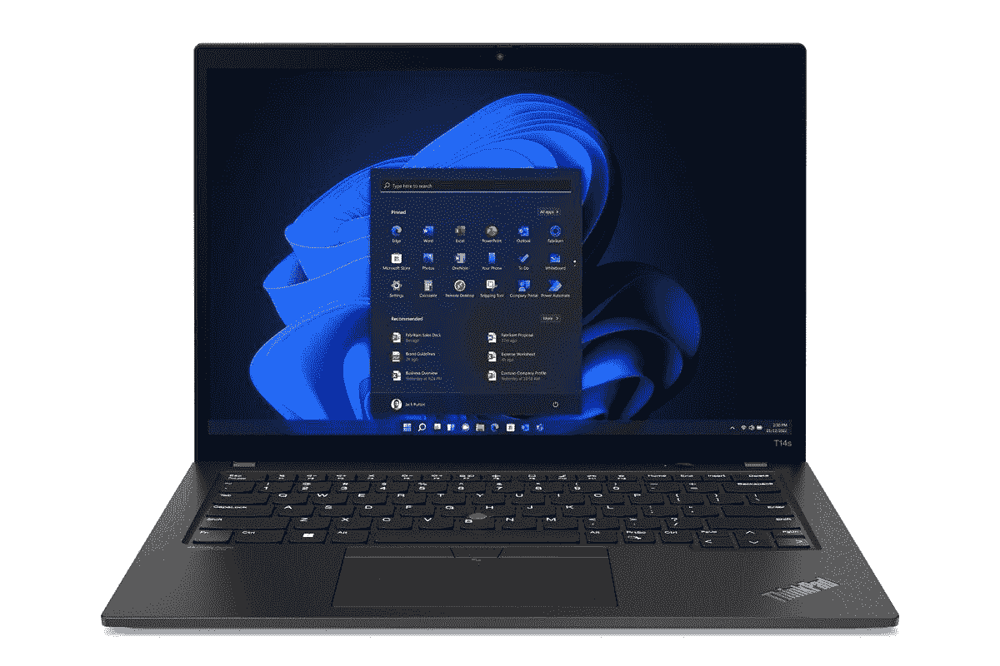

# 联想 ThinkPad T14s Gen 3:发布日期、规格和其他信息

> 原文：<https://www.xda-developers.com/lenovo-thinkpad-t14s-gen-3/>

联想在 2022 年 MWC 展会上更新了许多笔记本电脑，其中包括 ThinkPad T14s 系列。联想 ThinkPad T14s Gen 3 配备了更高的性能，得益于新的英特尔和 AMD 处理器，更高的 16:10 显示屏，以及略薄的设计。以前的型号已经是联想生产的最受欢迎的笔记本电脑的一部分，所以这些改进是建立在已经很棒的个人电脑之上的。

我们收集了您需要了解的关于联想 ThinkPad T14s Gen 3 的所有信息，包括它的完整规格表、发布日期和价格。你可以在下面找到它。

## 规范

### 联想 ThinkPad T14s 规格

|  | 

联想 ThinkPad T14s 第三代(英特尔)

 | 

联想 ThinkPad T14s Gen 3 (AMD)

 |
| --- | --- | --- |
| **CPU** | 

*   英特尔酷睿 i5-1235U (15W，10 个内核，12 个线程，最高 4.4GHz，12MB 高速缓存)
*   英特尔酷睿 i5-1245U (15W，10 个内核，12 个线程，最高 4.4GHz，12MB 高速缓存)
*   英特尔酷睿 i5-1240P (28W，12 个内核，16 个线程，最高 4.4GHz，12MB 高速缓存)
*   英特尔酷睿 i5-1250P (28W，12 个内核，16 个线程，最高 4.4GHz，12MB 高速缓存)
*   英特尔酷睿 i7-1260 处理器(28W，12 个内核，16 个线程，最高 4.7GHz，18MB 高速缓存)
*   英特尔酷睿 i7-1270P (28W，12 个内核，16 个线程，最高 4.8GHz，18MB 高速缓存)
*   英特尔酷睿 i7-1280 处理器(28W，16 个内核，20 个线程，最高 4.8GHz，24MB 高速缓存)

 | 

*   AMD 锐龙 5 PRO 6650 (19W，6 核，12 线程，最高 4.5GHz，16MB 高速缓存)
*   AMD 锐龙 7 PRO 6850 (19W，8 核，16 线程，最高 4-7GHz，16MB 高速缓存)

 |
| **图形** |  | 

*   AMD 镭龙 660M 显卡(锐龙 5)
*   AMD 镭龙 680M 显卡(锐龙 7)

 |
| **储存** | 

*   256GB PCIe 4 x4 固态硬盘
*   512GB PCIe 4 x4 固态硬盘
*   512GB PCIe 4 x4 高性能固态硬盘
*   1TB PCIe 4 x4 固态硬盘
*   1TB PCIe 4 x4 高性能固态硬盘
*   2TB PCIe 4 x4 高性能固态硬盘

 | 

*   256GB PCIe 4 x4 固态硬盘
*   512GB PCIe 4 x4 固态硬盘
*   512GB PCIe 4 x4 高性能固态硬盘
*   1TB PCIe 4 x4 固态硬盘
*   1TB PCIe 4 x4 高性能固态硬盘
*   2TB PCIe 4 x4 高性能固态硬盘

 |
| **撞锤** | 

*   8GB LPDDR5 4800MHz(焊接)
*   16GB LPDDR5 4800MHz(焊接)
*   32GB LPDDR5 4800MHz(焊接)

 | 

*   8GB LPDDR5 6400MHz(焊接)
*   16GB LPDDR5 6400MHz(焊接)
*   32GB LPDDR5 6400MHz(焊接)

 |
| **显示** | 

*   14 英寸 16:10 全高清+ (1920 x 1200) IPS，防眩光，300 尼特，45% NTSC
*   14 英寸 16:10 全高清+ (1920 x 1200) IPS，防眩光，300 尼特，触摸，45% NTSC
*   14 英寸 16:10 全高清+ (1920 x 1200) IPS，低功耗，防眩光，400 尼特，100% sRGB
*   14 英寸 16:10 2.2K (2240x1400) IPS，防眩光，300 尼特，100% sRGB
*   14 英寸 16:10 2.8K (2880 x 1800)有机发光二极管，防眩光，防反射，防污迹，400 尼特，100% DCI-P3，DisplayHDR True Black 500，杜比视觉，90Hz 刷新率

 | 

*   14 英寸 16:10 全高清+ (1920 x 1200) IPS，防眩光，300 尼特
*   14 英寸 16:10 全高清+ (1920 x 1200) IPS，防眩光，300 尼特，触控
*   14 英寸 16:10 全高清+ (1920 x 1200) IPS，低功耗，防眩光，400 尼特，100% sRGB
*   14 英寸 16:10 全高清+ (1920 x 1200) IPS，隐私保护，防眩光，500 尼特，100% sRGB
*   14 英寸 16:10 2.2K (2240x1400) IPS，防眩光，300 尼特
*   14 英寸 16:10 2.8K (2880 x 1800)有机发光二极管，防眩光，防反射，防污迹，400 尼特，100% DCI-P3，DisplayHDR True Black 500，杜比视觉，90Hz 刷新率

 |
| **电池** |  |  |
| **港口** | 

*   2 个 Thunderbolt 4 / USB Type-C
*   2 个 USB 类型 A (USB 3.2 第 1 代)
*   1 个 HDMI 2.0b 接口
*   3.5 毫米组合耳机插孔

 | 

*   1 个 USB Type-C (USB 4.0)
*   1 个 USB Type-C (USB 3.2 第二代)
*   2 个 USB 类型 A (USB 3.2 第 1 代)
*   1 个 HDMI 2.0b 接口
*   3.5 毫米组合耳机插孔

 |
| **音频** | 

*   带有杜比语音的杜比音频扬声器系统
*   双麦克风

 | 

*   带有杜比语音的杜比音频扬声器系统
*   双麦克风

 |
| **网络摄像头** | 

*   720p 高清摄像头
*   1080p 全高清摄像头
*   1080p 全高清摄像头+红外摄像头

 | 

*   720p 高清摄像头
*   1080p 全高清摄像头
*   1080p 全高清摄像头+红外摄像头

 |
| **Windows Hello** | 

*   指纹识别器(在电源按钮中)
*   可选:红外摄像头

 | 

*   指纹识别器(在电源按钮中)
*   可选:红外摄像头

 |
| **连通性** | 

*   Wi-Fi 6E
*   蓝牙 5.2
*   低于 6GHz 的 5G(第 20 类)
*   4G LTE(第 20 类)

 | 

*   Wi-Fi 6E
*   蓝牙 5.2
*   低于 6GHz 的 5G(第 20 类)
*   4G LTE Cat16)

 |
| **颜色** |  |  |
| **尺寸(WxDxH)** | 

*   317.5 x 226.9 x 16.6 毫米(12.50 x 8.93 x 0.65 英寸)

 | 

*   317.5 x 226.9 x 15.85 毫米(12.50 x 8.93 x 0.62 英寸)

 |
| **起始重量** |  |  |
| **价格** | 起价 1399.99 美元 | 起价 1299.99 美元 |

## 联想 ThinkPad T14s Gen 3 发布日期

与许多其他笔记本电脑一样，联想 ThinkPad T14s 在 2 月下旬的 MWC 2022 上发布，但几个月后才推出。AMD 型号在 5 月份首次亮相，英特尔型号在 6 月份推出。

 <picture></picture> 

Lenovo ThinkPad T14s Gen 3

然而，值得注意的是，官方发布日期并不意味着上述所有配置都已经可用。AMD 型号仍然不支持按单生产配置(因此您必须选择一个预设)，即使对于英特尔型号，配置器中也不是每个选项都可用。这并不意外，因为这些提供多种配置的笔记本电脑型号往往会逐步推出，以确保公司能够满足需求。

## 联想 ThinkPad T14s Gen 3 价格

联想笔记本电脑的定价往往差异很大，因为该公司几乎总是在其网站上进行某种促销活动。根据官方说法，AMD 版本的起价为 1，399 美元，而英特尔型号的起价为 1，529 美元。

这些只是基本配置的价格，所以它将在很大程度上取决于你想为你的笔记本电脑配备什么。有大量的配置选项，如处理器、内存、存储和显示器，所以要确定你会花多少钱，最好的方法是查看联想的网站。

## 联想 ThinkPad T14s Gen 3 有什么新功能

正如您所料，联想 ThinkPad T14s Gen 3 比上一代产品有所改进，包括更好的性能和更高的显示屏，这大大提高了工作效率。

### 新的处理器和内存

如果说新一代笔记本电脑有一项升级，那就是升级的处理器。在这种情况下，ThinkPad T14s Gen 3 现在配备了英特尔的第 12 代 Alder Lake 或 AMD 的锐龙 6000 PRO 系列 CPU，具体取决于您选择的型号。

英特尔的 Alder Lake 处理器极大地改变了它们的工作方式。这些 CPU 具有混合架构，混合了性能(P)和效率(E)内核。这使得它们比以前的型号拥有更多的内核，从而带来更好的性能和更长的电池寿命。联想主要使用 P 系列处理器，尽管也有一些入门级型号使用 U15 系列。P 系列 CPU 最多有 14 个内核和 20 个线程，而 U 系列最多只有 10 个内核和 12 个线程。

AMD 锐龙 6000 PRO 系列在 CPU 方面并不具有突破性，因此您仍然可以获得多达 8 个内核和 16 个线程，但它确实对整体性能进行了一些改进。不过，最大的好处是集成的 GPU，AMD 承诺比英特尔 Iris Xe 的图形性能快 3 倍。

AMD 和 Intel 处理器现在都支持新的 LPDDR5 RAM，因此您也可以在这方面期待更好的性能。英特尔型号的 RAM 主频为 4800MHz，而 AMD 版本的主频明显更快，为 6400MHz。

### 16:10 显示屏

这些机型的另一大升级是使用了更高的 16:10 显示屏，而不是过去的 16:9 显示屏。越来越多的高端笔记本电脑采用了更高的显示屏，所以很高兴看到它们出现在联想更主流的设备上。更高的外形意味着您可以获得更大的表面积，额外的空间对于阅读大型页面、处理 Excel 表格或照片编辑器等更复杂的应用程序中的 UI 元素非常有用。

除了更高的长宽比之外，显示器现在还带有一些新的配置。首先，有一个 2.2K (2240 x 1400) IPS 面板，亮度为 300 尼特，适合那些想要稍微清晰一点的图像而不喜欢 4K 面板或任何太花哨的用户。然后，英特尔型号有一个独有的 2.8K (2880 x 1800) OLED 面板，刷新率为 90Hz。这几乎是最好的整体面板，结合了清晰度和平滑的刷新率与有机发光二极管的好处，如真正的黑色和生动的颜色。

## 在哪里购买联想 ThinkPad T14s Gen 3

如果你有兴趣购买联想 ThinkPad T14s Gen 3，最好的地方是联想自己的网站。商务笔记本电脑通常不会出现在百思买或亚马逊等传统零售商手中，即使出现，也只是一些配置。从联想购买产品为您提供了最多的选择，因此您可以买到最适合自己的产品。你可以在下面查看英特尔和 AMD 的型号。

 <picture></picture> 

Lenovo ThinkPad T14s Gen 3

##### 联想 ThinkPad T14s Gen 3

联想 ThinkPad T14s Gen 3 配备了第 12 代英特尔处理器或 AMD 锐龙 6000 系列，另外它还有一个 16:10 的高显示屏。

* * *

对其他选择感兴趣还是不想等那么久？如果你想要一台出色的商务笔记本电脑，我们有一份最好的 ThinkPads 清单。否则，请查看我们的[最佳笔记本电脑](https://www.xda-developers.com/best-laptops/)综合报道，了解更多选项。