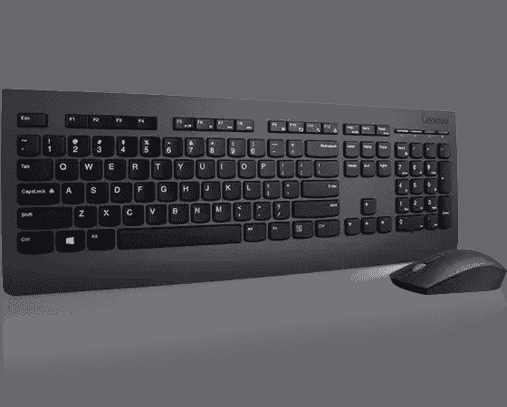
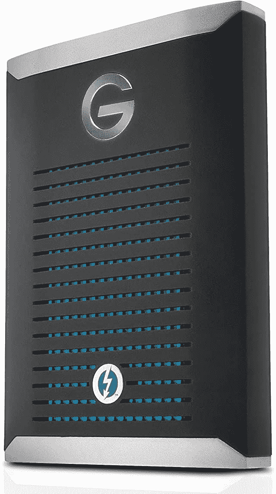

# 联想 ThinkPad X1 Carbon Gen 10 的最佳配件

> 原文：<https://www.xda-developers.com/lenovo-thinkpad-x1-carbon-accessories/>

联想最近推出了 ThinkPad X1 Carbon Gen 10(T1)，这是其历史最悠久(也是最受欢迎)的 ThinkPad 系列的最新版本。升级了第 12 代英特尔处理器，新的显示选项和更好的网络摄像头，这很可能是 2022 年[最佳商务笔记本电脑](https://www.xda-developers.com/best-business-laptops/)之一。但是，不管笔记本电脑有多好，它也不能做所有的事情——至少它自己不能。这就是为什么我们收集了你能为联想 ThinkPad X1 Carbon Gen 10 购买的最佳配件。

我们将讨论各种附件，从显示器到坞站、外部 GPU 等等。当然，大多数人不需要所有这些，但是如果你对这些类别中的任何一个感兴趣，我们都有适合你的。说完这些，让我们直接进入列表。

**浏览这篇文章:**

## 联想 ThinkPad X1 Carbon 显示器

联想为 ThinkPad X1 Carbon 的显示器提供了所有配置选项，很难对此有所抱怨。唯一真正的问题是，你只有一个屏幕，如果你是一个多任务者，有一个双显示器设置是很好的。外部显示器可能是提高您工作效率的最重要的附件，我们为 ThinkPad X1 Carbon 收集了几个选项。

*   <picture></picture>

    华硕 ProArt pa 328 cgv

    ##### 华硕 ProArt PA328CGV 32 英寸 4K 显示器

    这款华硕 ProArt 显示器提供了价格和功能的完美平衡。这是一个 32 英寸的四高清面板，95%的 DCI-P3 和 Delta E < 2 覆盖率。此外，它支持 DisplayHDR 600，并且具有 165Hz 的刷新率，这使得它非常通用。

*   <picture></picture>

    LG 超宽 34wn 80 c-B

    ##### LG 34wn 80 c-B

    超宽显示器因其多任务处理能力而非常受欢迎，这是一个很好的选择。凭借 21:9 的宽高比和 WQHD 分辨率，这是一款出色的生产力显示器。它覆盖了 sRGB 99%的地区，通过 USB Type-C 连接，功率为 60W。

*   <picture></picture>

    HP 24MH

    ##### HP 24MH FHD 显示器

    并不是每个人都需要最新最棒的，虽然它并不完全是新的，但这款 HP 显示器在预算上是一个很棒的选择。它是一个 24 英寸的 IPS 面板，具有全高清分辨率和 75Hz 的刷新率。除了屏幕很棒之外，它甚至还配有内置扬声器，这在这个价位很少见。它还支持 HDMI、DisplayPort 和 VGA 输入。

*   <picture></picture>

    LG 超细 27ep 950-B

    ##### LG 超细 27EP950-B

    我们不一定会向大多数用户推荐这款，但如果你想要一款有机发光二极管显示器，这是目前最好的选择之一。这款 27 色面板具有 4K 分辨率，覆盖 99%的 Adobe RGB 和 DCI-P3，并且支持 HDR 400 真黑。它内置扬声器，支持 90W 功率传输的 USB-C 连接。

*   <picture></picture>

    联想 ThinkVision M14t

    ##### 联想 ThinkVision M14t

    如果你想让你的双显示器设置随身携带，该怎么办？联想的 ThinkVision M14t 是一款 14 英寸便携式显示器，具有全高清分辨率和触摸支持，无论您走到哪里，都可以更轻松地保持工作效率。它通过 USB Type-C 连接，提供显示和电源。

如果您想要更多选择，请查看我们对[最佳显示器](https://www.xda-developers.com/best-monitors/)的汇总。

## 联想 ThinkPad X1 Carbon 的坞站和适配器

作为一台商务笔记本电脑，ThinkPad X1 Carbon 整体上有一个坚实的端口设置，但仍然需要一些额外的端口是完全合理的。无论您想要连接更多显示器还是其他外围设备，坞站都是不错的选择。一个 [Thunderbolt dock](https://www.xda-developers.com/best-thunderbolt-docks/) 可以让你使用一个端口将所有外围设备连接到笔记本电脑，而且你可以一次连接所有设备。它们可能很贵，但它们是非常棒的配件，我们为 ThinkPad X1 Carbon Gen 10 收集了一些选项。

*   <picture></picture>

    Belkin Thunderbolt 4 Dock Pro

    ##### Belkin Connect Pro Thunderbolt 4 Dock

    Belkin Connect Pro 为您提供了丰富的端口，如四个 USB Type-A 端口、两个 HDMI 输出、以太网、USB Type-C 和 Thunderbolt 菊花链，以及内置的 SD 读卡器。它还可以以高达 90W 的功率为您的笔记本电脑充电，并且所有这些都采用现代时尚的包装。

*   <picture></picture>

    可插拔 14 合 1 雷电 3 坞

    ##### 可插拔 14 合 1 雷电 3 坞

    这种可插拔坞是最通用的坞站之一，因为它有一吨的端口。六个 USB Type-A 端口，两个 HDMI 和两个 DisplayPort 连接(总共两个同步输出)，千兆以太网和 SD 读卡器都在这里，它甚至可以以高达 96W 的功率为您的笔记本电脑充电。

*   <picture></picture>

    Anker Apex 12 合 1 Thunderbolt 4 坞站

    ##### Anker 777 Thunderbolt 坞站

    Anker 777 是另一款高级 Thunderbolt 坞站，这款坞站采用了酷炫的全金属设计，看起来和感觉都很耐用。它有许多端口，包括四个 USB Type-A、Thunderbolt 菊花链、USB-C、以太网和两个 HDMI 输出，以及一个 SD 读卡器。它能以 90W 的功率给你的笔记本充电。

*   <picture></picture>

    联想 USB-C 迷你坞

    ##### 联想 USB-C 迷你坞

    不需要迅雷坞的大容量或功能？这种标准的 USB-C 坞站可能会做到这一点。它为您提供了两个 USB 类型 A 端口、HDMI VGA、以太网和另一个 USB 类型 C 端口。它还可以为你的笔记本电脑提供 45 瓦的电力——它不是一个快速充电器，但它可以让笔记本电脑保持运行。

*   <picture></picture>

    Mokin USB-C Hub

    ##### Mokin 5 合 1 USB Hub

    想要在移动中拥有更多端口而不占用太多空间？这款 Mokin hub 为您提供了三个 USB Type-A 端口、SD 和 microSD 读卡器，以及一个 HDMI 端口，所有这些都在一个绝对微小的机箱中。如果你需要更多的港口，它非常适合旅行。然而，它不能以任何方式给你的笔记本电脑充电。

## 鼠标和键盘

尽管笔记本电脑很好，但当你购买一台便携且易于携带的设备时，你必须做出一些权衡。虽然我们大多数人都习惯于笔记本电脑的键盘和触摸板，但如果你在办公桌前工作，最好还是有一个合适的键盘和鼠标。这些都是非常重要的附件，尤其是如果你打算将更多的显示器连接到你的 ThinkPad X1 Carbon。例如，拥有独立的键盘和鼠标意味着你可以合上笔记本电脑，专注于大屏幕。以下是我们推荐的一些选项。

*   <picture></picture>

    Kensington Pro Fit Ergo

    ##### Kensington Pro Fit 符合人体工程学的无线键盘

    如果你整天都在电脑前工作，一个符合人体工程学的键盘会是你的设置中重要的一部分。扭曲的设计使得触摸每个按键更加容易，腕托提供了更好的支撑，确保您不会扭伤手腕。

*   <picture></picture>

    Das Kay board 4 Professional

    ##### Das 键盘 4 Professional

    如果你看重机械开关超过薄膜板的手感，这款键盘就是给你的。Das Keyboard 4 采用全尺寸布局，使用 Cherry MX 棕色开关，此外它还具有包括音量旋钮在内的媒体控制功能。

*   <picture></picture>

    联想专业无线键鼠二合一

    ##### 联想专业无线键鼠二合一

    如果你想一气呵成地抓起键鼠，这个套装也许适合你。它包含了这两者，作为奖励，它们遵循了标志性的 ThinkPad 设计。键盘采用全尺寸超薄设计，而鼠标采用双手通用设计。

*   <picture></picture>

    罗技 MX Master 3S

    ##### 罗技 MX Master 3

    关于 MX Master 3 已经没有太多的说法，但这确实是市场上最好的鼠标之一。凭借 MagSpeed 滚轮、甚至可以在玻璃上工作的高分辨率传感器以及优质的人体工程学设计，您别无所求。

*   <picture></picture>

    微软现代移动鼠标

    ##### 微软现代移动鼠标

    不需要太花哨的东西？微软现代移动鼠标有一个非常圆滑和干净的设计，有八种不同的颜色。它使用金属滚轮进行精确滚动，并使用 BlueTrack 传感器，几乎可以在任何表面上工作。此外，它价格实惠。

## 耳机和耳塞

使用笔记本电脑上的扬声器并不总是一个理想的解决方案。无论你是在家里还是在公共场所工作，用某种方式控制自己的声音通常是个好主意。这就是耳机和耳塞发挥作用的地方。这些都是很棒的配件，无论你是对小耳塞还是头戴式耳机感兴趣，我们都有一些关于 ThinkPad X1 Carbon 的建议。

*   <picture></picture>

    Surface 耳塞

    ##### 微软 Surface 耳塞

    另一个与 PC 配合使用的绝佳选择是 Surface 耳塞，也可以通过 Surface app 轻松定制。耳塞的大表面支持轻击和滑动触摸控制，不仅适用于音乐，还适用于 PowerPoint 演示等内容。它们针对微软 365 进行了优化。

*   <picture></picture>

    LG Tone Free FP9

    ##### LG Tone Free FP9

    LG Tone Free FP9 拥有你所期待的 ANC 和高品质声音等功能，但它们也有独特的功能。UVnano 技术可以在耳塞处于外壳中时对其进行消毒，此外，您甚至可以使用 Plug &无线功能在不支持蓝牙的设备上使用耳塞。

*   <picture></picture>

    Bose QuietComfort 700

    ##### Bose 降噪耳机 700

    Bose 在音频产品方面颇有名气，quiet comfort 700 是其迄今为止最好的耳机之一。11 个级别的噪音消除、触摸控制和超薄设计，非常适合任何人。此外，您还可以获得一个 USB 加密狗，使它们更可靠地与您的 PC 配合工作。

*   <picture></picture>

    索尼 WH-1000XM4(121 美元起)

    ##### 索尼 WH-1000XM4

    索尼是音频领域另一个极其受欢迎的品牌，WH-1000 xm4 绝对不会错。它们具有诸如带双噪声传感器技术的 ANC、对话模式、佩戴检测等功能。它们也有三种高级外观的款式。

*   <picture></picture>

    Anker Soundcore Life Q35

    ##### Anker Soundcore Life Q35

    如果你想要价格更合理的东西，Soundcore Life Q35 是另一款价格低得多的耳机。它支持主动噪声消除和高质量的 LDAC 编解码器，此外它们还有 40 小时的电池寿命。它们还有时尚的设计和三种颜色可供选择。

## ThinkPad X1 Carbon 的网络摄像头

凭借 ThinkPad X1 Carbon，联想让你可以选择配备 1080p 网络摄像头，如果你想要更高级的东西，它甚至还提供了一个具有计算机视觉的模型。然而，如果你发现升级太贵或者你不认为你会需要它，你可能会最终想要购买一个外部网络摄像头。我们已经收集了过去的[最佳网络摄像头](https://www.xda-developers.com/best-webcams/)，但这里有一些建议:

*   <picture></picture>

    微软现代网络摄像头

    ##### 微软现代网络摄像头

    如果你不需要那种高端的东西，微软现代网络摄像头是全高清分辨率的绝佳替代品。它仍然具有 HDR 和面部修饰等功能，所以你总是保持最佳状态，还有一个内置的隐私快门，以防你担心被监视。

*   <picture></picture>

    联想性能 FHD 网络摄像头

    ##### 联想性能 FHD 网络摄像头

    你后悔没有用笔记本电脑获得 Windows Hello 支持吗？这款联想网络摄像头可以解决这个问题，而且价格相当低。除了面部识别之外，它还有一个 1080p 网络摄像头和一个灵活的 deesign，因此您可以确保自己在帧中。

## 外部 GPU 外壳

正如你对大多数商务笔记本电脑的预期，联想 ThinkPad X1 Carbon 没有非常强大的 GPU。说实话，大多数目标受众不需要独立的 GPU，集成的 Iris Xe 显卡就足够了。但如果你想要额外的能力——无论是为了玩游戏还是因为你有一些要求苛刻的创造性工作负载——外部 GPU 是一个很好的解决方案。这些是你能为 ThinkPad X1 Carbon 买到的最昂贵的配件，但它们可以极大地扩展它的功能。

*   <picture></picture>

    冷却器主控器 EG200

    ##### 冷却器主控器 EG200

    冷却器主控器 eg 200 没有最好的规格，但它有 550 瓦的 PSU，可以为您的笔记本电脑提供 60 瓦的功率。它有三个 USB 端口和一个 SATA 驱动器插槽，另外它还可以兼作笔记本电脑支架，因此您可以有一个更整洁的设置。

*   <picture></picture>

    Razer Core X

    ##### Razer Core X

    Razer Core X 是最受欢迎的外部 GPU 机箱之一，它配备了 650W 的 PSU，最多可安装三插槽宽的卡，此外它还可以为您的笔记本电脑提供高达 100W 的功率。它有两种颜色，如果你想美化你的设置，还有一个版本是 Razer Chroma RGB。

如果你想看看其他选项，我们在[最佳外部 GPU 附件](https://www.xda-developers.com/best-external-gpus-for-your-laptop/)列表中有更多推荐。

## 联想 ThinkPad X1 碳纤维外壳

像 ThinkPad X1 Carbon 这样昂贵的笔记本电脑是你想要保护的东西，而电脑包是实现这一点的完美配件。用一个漂亮的盒子包装你的笔记本电脑可以让它更容易携带，更安全，它甚至可以成为一件时尚物品。

*   <picture></picture>

    Inateck 笔记本电脑套

    ##### inate CK 笔记本电脑套

    这款 inate CK 套也是一个很棒的选择。它有光滑的黑色，提供多层保护，加上柔软的内部保护您的笔记本电脑安全。外部也是防泼溅的。

*   <picture></picture>

    Tomtoc 360 保护套

    ##### Tomtoc 360 保护型笔记本电脑单肩包

    Tomtoc 360 包外观整洁，可以随身携带，但它提供的保护比您想象的更多。边角经过加固，内部有大量缓冲。

## 外部存储器

你可以为联想 ThinkPad X1 Carbon 配置高达 2TB 的 SSD 存储，坦率地说，这对大多数人来说应该足够了。但是，升级到这些更高的存储层可能会很昂贵，所以不是每个人都会这样做。另外，尽管 2TB 很多，但肯定有可能用光。如果您需要一些额外的空间来存放文件，外部固态硬盘或硬盘是 ThinkPad X1 Carbon 非常重要的附件。以下是我们目前推荐的最佳选择:

*   <picture></picture>

    可插拔的雷电 3 SSD

    ##### 可插拔的雷电 3 外置 SSD

    如果你有丢失电缆的不良记录，这款可插拔的 Thunderbolt SSD 可能对你有好处。线缆是内置的，所以你不会丢失它，固态硬盘本身的容量高达 2TB。它还提供高达 2，400MB/s 的速度，因此仍然非常快。

*   <picture></picture>

    三星 T7

    ##### 三星 T7 便携式固态硬盘

    那些迅雷固态硬盘对你来说是不是有点太贵了？三星 T7 是一款更标准的固态硬盘，容量高达 2TB，有三种颜色可供选择。它支持高达 1，050MB/s 的速度，因此它一点也不慢，而且它支持密码保护。

*   <picture></picture>

    SanDisk G-Drive Pro SSD

    ##### SanDisk G-Drive Pro SSD

    如果你需要你的 SSD 能够承受打击，这款可能适合你。除了支持迅雷速度(高达 2，800MB/S)，它还可以承受高达 3 米的跌落和 1000 磅的压碎力。它的容量高达 2TB，不过价格可能会相当昂贵。

*   <picture></picture>

    WD Elements 台式机硬盘

    ##### WD Elements 外置硬盘

    固态硬盘速度当然很快，但如果你想要大的固态硬盘存储，你就得掏不少钱。有了这样的硬盘，你可以以低廉的价格获得海量存储空间，非常适合存储你不需要经常访问的所有文件。

*   <picture></picture>

    SanDisk Ultra Dual Drive Luxe

    ##### SanDisk Ultra Dual Drive Luxe

    大多数外置固态硬盘都相当便携，但放在口袋里仍然不理想。如果你想要一个可以随身携带的东西，这个闪存盘就是你想要的。它通过 USB Type-C 或 Type-A 连接，因此它可以与 PC、平板电脑和手机兼容，另外它的容量高达 1TB。

## 电光队

我们希望大多数用户近期内不需要为他们的笔记本电脑购买新的充电器，但是意外还是会发生。无论你是放错了笔记本电脑的充电器，还是它停止了工作，你都需要一个替代品，我们已经收集了一些选项。

*   <picture></picture>

    Nekteck 100 w 充电器

    ##### Nekteck 100 w GaN USB-C 充电器

    还需要更多电量吗？这款 Nekteck 充电器也采用了 GaN 技术，但它可以提供 100W 的功率。它可以更快地为你的笔记本电脑充电，你甚至可以在未来将它用于更耗电的笔记本电脑。

*   <picture></picture>

    Hyphen-X 100 w 4 端口 USB 充电器

    ##### Hyphen-X 100 w 4 端口 PD GaN 充电器

    如果您想要一个充电器为您的所有设备供电，这款 Hyphen-X 充电器可能是您的解决方案。它有两个 USB-C 和两个 USB-A 端口，因此您可以同时为笔记本电脑、手机等充电。

## 多方面的

至此，我们可能已经涵盖了您可能想要的 ThinkPad X1 的大多数配件。然而，还有几件事我们想提一下。这些并不真正适合某个特定的类别，所以我们会把它们留在下面，以防你觉得它们有趣。

*   <picture></picture>

    雷蛇 Anzu 智能眼镜

    ##### 雷蛇 Anzu 智能眼镜

    雷蛇 Anzu 是一款独特的眼镜，配有两副镜片，可以在电脑前使用，也可以在外出时使用，此外它还配有内置扬声器，让你在听音乐的同时还能听到周围发生的事情

*   <picture></picture>

    屏幕妈妈屏幕清洁剂套件

    ##### 屏幕妈妈屏幕清洁剂

    保持笔记本电脑的清洁对很多人来说都是一件再熟悉不过的事情，但这款屏幕清洁剂或许能帮到你。包装包括清洁液和超细纤维布，这样你就有了你需要的所有东西，而且应该能用很长时间。

* * *

联想 ThinkPad X1 Carbon 的配件就这些了。正如我们已经说过的，不太可能有人需要或想要清单上的所有东西，但是对于那些确实需要它们的人来说，选项是存在的。这些都是有用的产品，它们可能会满足你的特殊需求。

如果你还没有，你可以使用下面的链接购买联想 ThinkPad X1 Carbon Gen 10。在撰写本文时，只有几种配置可用，但更多配置应该会很快推出。否则，你可以看看你现在能买到的最好的 ThinkPads。

 <picture></picture> 

Lenovo ThinkPad X1 Carbon Gen 10

##### 联想 ThinkPad X1 碳第 10 代

联想 ThinkPad X1 Carbon Gen 10 配备了第 12 代英特尔酷睿处理器、新的有机发光二极管显示屏和全高清网络摄像头。