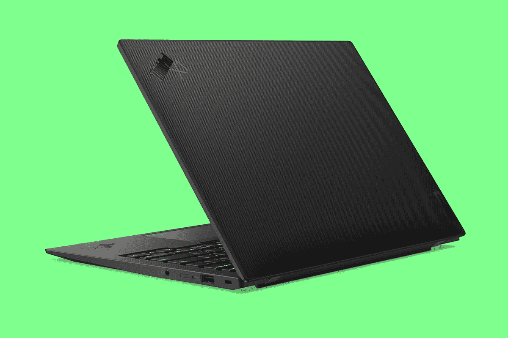

# 联想 ThinkPad X1 Carbon Gen 10 评测:提高企业生产力

> 原文：<https://www.xda-developers.com/lenovo-thinkpad-x1-carbon-gen-10-review/>

ThinkPad 作为商务笔记本电脑值得信赖的品牌已经有很长很长的历史了，X1 是旗舰产品。ThinkPad X1 Carbon 现在已经是第 10 代了，重量不到 2.5 磅，为了达到这个目标，它没有做出任何妥协。它由碳纤维制成，并以此命名，它有一个完整的 1.6 毫米键盘。

我对它最大的问题有点微不足道。首先，触摸板上方的按钮意味着触摸板本身占用的空间更少，但这是 ThinkPad 设计的一部分。TrackPoint 是每台 ThinkPad 的必备设备，而且必须配备按钮。此外，电池寿命有些不稳定，有时很好，有时就不好。

但总的来说，这是一台非凡的笔记本电脑。这是你能得到的最好的生产力之一。有新的显示选项，包括 2017 年以来的第一个有机发光二极管选项，所以这是一个受欢迎的回归。此外，它采用英特尔第 12 代处理器，让客户可以选择 28W P 系列或 15W U 系列。我的单元有一个 P 系列处理器，所以 U 系列在电池寿命上会更好一点。

 <picture></picture> 

Lenovo ThinkPad X1 Carbon Gen 10

##### 联想 ThinkPad X1 碳第 10 代

联想 ThinkPad X1 Carbon 的重量不到 2.5 磅，是商用笔记本电脑中的顶级产品。

## 联想 ThinkPad X1 Carbon Gen 10 价格和供货情况

*   截至目前，联想 ThinkPad X1 Carbon Gen 10 的起价为 1，319 美元，但这个价格会有波动

目前，基本型号的价格为 1，319.45 美元，但这一切都变得超级混乱(甚至比平时更多)。首先那个配置包括酷睿 i5-1240P，8GB LPDDR5，256GB SSD，全高清非触控显示屏，Windows 11 Home。你可以配置高达酷睿 i7-1280P、16GB 内存、2TB 固态硬盘，屏幕的有机发光二极管选项今年甚至有所回报。你也可以选择 Windows 10 作为操作系统。

奇怪的是。作为一台商用电脑，价格会波动。[联想](https://www.xda-developers.com/best-lenovo-laptops/)在自己的网站上几乎从不收取 ThinkPads 的全价，所以折扣价经常变化。然而，其网站上目前只有两个选项打折，其中之一是“自建”选项。是的，您可以定制比预配置便宜得多的配置，如下面的规格部分所述。

遗憾的是，并非所有预配置的型号都可以定制。联想 ThinkPad X1 Carbon 配备了英特尔的第 12 代 P 系列和 U 系列处理器，但 U 系列芯片——功能较弱，但电池续航时间更长——仅在预配置型号中提供。这意味着在这个时候，15W 的 CPU 实际上比 28W 的 CPU 更贵。当然，所有这些都是可以改变的。

## 联想 ThinkPad X1 Carbon Gen 10 规格

| 

中央处理器

 | 第 12 代英特尔酷睿 i7-1260 处理器，16 个线程，4 个 P 内核，8 个 E 内核，18MB 高速缓存 |
| 

国家政治保卫局。参见 OGPU

 | 英特尔 Iris Xe 显卡 |
| 

身体

 | 15.36 毫米 x 315.6mm 毫米 x 222.5mm 毫米(0.60 英寸 x 12.43 英寸 x 8.76 英寸)，1.12 千克(2.48 磅) |
| 

显示

 | 14 英寸(16:10)、WUXGA* (1920 x 1200)低功耗、触控 IPS、400 尼特、Eyesafe 认证的低蓝光辐射、防眩光 |
| 

记忆

 | 16GB LPDDR5 5200Mhz(焊接双通道) |
| 

储存；储备

 | 512GB PCIe 固态硬盘第四代 |
| 

港口

 | 2 个 USB-C Thunderbolt 4 2 个 USB-A 3.2 第 1 代耳机/麦克风组合 HDMI 2.0b 可选:Nano SIM 插槽 |
| 

电池

 | 57 瓦时，支持快速充电 |
| 

连通性

 | 英特尔 AX211 WiFi 6E (2 x 2)，蓝牙 5.2 |
| 

照相机

 | 带网络摄像头隐私快门的 FHD RGB |
| 

键盘

 | 背光键盘，带 TrackPoint 和 110 毫米玻璃触控板，防溅设计，进气按键 |
| 

声音的

 | 带杜比语音的杜比 Atmos 扬声器系统，4 个 360 度四阵列麦克风 |
| 

安全性

 | 分立可信平台模块(dTPM) 2.0、集成了电源按钮的智能开机指纹读取器(片上匹配)、磁贴就绪、网络摄像头隐私快门、Kensington 锁插槽、安全内核 |
| 

材料

 | 碳纤维(上)、镁合金(下) |
| 

操作系统（Operating System）

 | Windows 11 专业版 |
| 

价格

 | $1,713.80 |

有趣的是，在 Lenovo.com 上有一个看起来一样的预配置模型，价格超过 3000 美元，但事情是这样的。ThinkPads 在 Lenovo.com 几乎从来都不是全价的，即使是全价的，你也可以通过商业渠道以更低的价格买到。此时，自己配置的选项实际上比预配置的要便宜得多，这只是因为现在设置折扣的方式。

## 设计:这是碳纤维，它是黑色的

*   像往常一样，声称它的重量不到 2.5 磅
*   它是黑色的，并且有一系列的端口

一代又一代，整体设计变化很小。底盘有适度的变化-这里或那里一毫米-但它看起来是一样的。正如亨利·福特会说的，它有你想要的任何颜色，只要是黑色的。然而，有两种黑色的变体，其中一种更像是碳纤维织物。联想发给我的是标准的黑色单元。

它的重量为 2.48 磅，这确实是 ThinkPad X1 Carbon 的成名之作。它由碳纤维制成，非常轻，而且，像所有 ThinkPads 一样，它通过了十几项 MIL-STD-810G 测试，所以它也很坚固。虽然它不是市场上最轻的笔记本电脑——即使 ThinkPad X1 Nano 更轻——但它是最轻的一款，我称之为全功能笔记本电脑。这意味着它有一个顶级的英特尔处理器，它有一个完整的端口阵列，它不是由塑料制成的，它有一个合适的键盘。一旦你的体重开始低于 2.5 磅，许多个人电脑将由镁制成，如果做得不好，会感觉很便宜，而且它们的键盘很浅，不舒服。

ThinkPad X1 Carbon 的可靠性和制造质量由来已久。

你很难找到任何妥协来满足 ThinkPad X1 Carbon 的重量。到了第十代，这个品牌已经久经考验。这是市场上最值得信赖的产品之一，理由很充分。ThinkPad 代表质量，X1 代表最好的质量。

伴随着 X1 品牌的是一个特殊的 ThinkPad 标志，印在盖子上。它是黑色的，上面写着 X1，所以星巴克的所有其他顾客都知道你对笔记本电脑很有品味。

自第 9 代以来，端口选择没有改变。事实上，你可能无法通过观察来区分这两种机箱。在左侧，你会发现两个 Thunderbolt 4 端口，一个 USB 3.2 Gen 1 Type-A 端口和一个 HDMI 2.0b 端口，而在右侧，有一个耳机插孔和另一个 USB 3.2 Gen 1 Type-A 端口。

这里没有太多要评论的。双 Thunderbolt 端口是我所期望的，当然，这两个 USB Type-C 端口是你能得到的最好的。USB Type-A 端口是 5Gbps USB 3.2 Gen 1 端口，而不是较新的 10Gbps 或 20Gbps 标准，但您可能不会知道其中的区别。有两个 USB 型端口真好，尤其是在一台商用笔记本电脑中。

最终，ThinkPad X1 Carbon Gen 10 的设计堪称经典。没有太大变化，也不太可能。ThinkPad X1 Yoga 在几年前得到了重大改变，当时联想转向了铝制机箱，但 X1 Carbon 不可能真正发生这种情况，因为材料就在名称中。

## 显示器:又有一个有机发光二极管选项！

*   14 英寸 16:10 显示屏比以往拥有更多的选择
*   自 2017 年以来，它拥有第一个有机发光二极管选项

联想 ThinkPad X1 Carbon Gen 10 有七种不同类型的显示器，四种不同的分辨率。事实上，这是很多不同的配置。可惜联想没有给我发一个有意思的。它寄给我的是普通的老式 FHD+触摸屏型号。

以下是完整列表:

*   14 英寸 WUXGA 16:10(1920 x 1200)IPS LP AG(400 尼特，100% sRGB，眼睛安全)
*   14 英寸 WUXGA 16:10 (1920x1200) IPS LP AG 触摸屏(400 英寸，100% sRGB，眼睛安全)
*   14 英寸 WUXGA 16:10(1920 x 1200)IPS LP AG Touch，带隐私保护(500 尼特，100% sRGB，TUV 电子隐私认证)
*   14 英寸 2.2K 16:10(2240 x 1400)IPS AG(300 尼特，100% sRGB)
*   14 英寸 2.8K 16:10 英寸(2880x1800)有机发光二极管 AGARAS(400 尼特，100% DCI-P3，眼睛安全)
*   14 英寸 WQUXGA 16:10 (3840x2400) IPS LP 眩光(500 尼特，100% DCI-P3，HDR400，杜比视界，Eyesafe)
*   14 英寸 WQUXGA 16:10(3840 x2400)IPS LP AOFT Touch AGARAS(500 尼特，100% DCIP3，HDR400，杜比视界，Eyesafe)

这是自 2017 年以来的第一个有机发光二极管选项。

真正令人兴奋的是 2.8K 的 OLED 面板，这标志着有机发光二极管回归 ThinkPad X1 碳 PC，因为自 2017 年以来就没有有机发光二极管型号。这才是真正的故事。但就像我说的，联想发给我的是名单上的第二个，FHD+触摸屏，这和我们看到的它的前任完全一样。

对于这款机型，它支持 100%的 sRGB、73%的 NTSC、78%的 Adobe RGB 和 79%的 P3，这是相当平均的水平。大多数有机发光二极管面板在每个类别中都获得了 90 多分，但我不想承诺一些我没有测试过的东西。

亮度为 445.6 尼特，超过了承诺的 400 尼特，对比度为 1，380:1，相当不错。同样，有机发光二极管可能会更好。

除了新的显示选项，网络摄像头也是新的，因为 FHD 相机是标准配置。用于面部识别的红外摄像头是一个选项，不包括在联想发给我的设备中，但 FHD 摄像头成为标准是绝对必须发生的事情。这是一个旗舰产品，绝对没有人应该能够买到一个较小的相机。

摄像头质量非常好，尽管我们正在比较网络摄像头，但惠普仍然凭借其 Elite 蜻蜓、EliteBook 1000 系列、Spectre x360 和其他几款实际配备 500 万像素网络摄像头的机型摘得桂冠。一个标准的 FHD 网络摄像头是 210 万像素，因此在 500 万像素的情况下，它有更多的空间来提供特殊功能，如在你四处走动时跟随你。

## 键盘:ThinkPads 仍然提供键盘中的凯迪拉克

*   按键还是 1.6 毫米
*   一如既往，联想 ThinkPads 拥有优质键盘
*   键盘中间有一个跟踪点，触摸板上方有按钮

联想 ThinkPad 以拥有一些最好的键盘而闻名，ThinkPad X1 Carbon 上的键盘也不例外。它有 1.6 毫米的按键，这与我们已经看到有一段时间了。有趣的是，有些键的设计是不同的。

正如你所看到的，大多数按键下面都有一个弯曲的边缘，在这一代之前，所有的按键都有。现在，一串钥匙已经摆好了。这很奇怪，但对我来说确实有点不同。我不确定联想为什么要做出这样的改变。

它仍然拥有笔记本电脑中最好的键盘。

在 G 键、H 键和 B 键之间仍然有一个轨迹点，这可能在很长一段时间内都不会消失。这是 Windows 笔记本电脑触摸板不佳时代的遗物，但一些 ThinkPad 忠实用户仍在使用它们。不幸的是，它确实占用了触摸板的空间，因为它上面有物理按钮，是为了与 TrackPoint 一起使用。

联想确实有一些解决方案。在新的 ThinkPad Z 系列中，该公司使用了触觉触摸板，其顶部区域可以用作按钮或触摸板。当然，ThinkPad 团队确实行动缓慢，而且是故意这样做的，以免匆忙实施变革。如果 ThinkPad X1 系列真的能做到这一点，那还需要一段时间。

## 性能:CPU 性能的大幅提升

*   联想提供英特尔 P 系列和 U 系列两种选择
*   P 系列的电池寿命时好时坏

显然，今年机型的一大变化是它采用了英特尔的第 12 代处理器。实际上，你可以在 28W 的 P 系列和 15W 的 U 系列之间进行选择，联想发给我的型号包括一个 Core i7-1260P，这是一个我已经在一些评测单元中看到的芯片。

根据我的经验，P 系列的性能确实更好，但它会影响电池寿命。英特尔第 12 代采用了全新的混合架构，具有高性能内核和高效率内核。我认为，有了新的效率核心，电池应该很容易达到芯片功率可以提高一点的程度。当然，你仍然可以从 15W 的 U 系列中获得更好的电池寿命。

我也有不同的结果。正如您将在我的基准测试分数中看到的，戴尔 Inspiron 灵越 14 二合一设备使用 15W 处理器的表现实际上比 ThinkPad X1 Carbon 使用 28W 处理器的表现要好。老实说，我认为对于这种工作效率用例来说，使用酷睿 i7-1255U 或酷睿 i7-1265U 可能会更好。

|  | 

联想 ThinkPad X1 Carbon Gen 10 酷睿 i7-1260P

 | 

[联想 ThinkPad X1 Carbon Gen 9](https://www.xda-developers.com/lenovo-thinkpad-x1-carbon-review/) 酷睿 i7-1185G7

 | 

[戴尔 Inspiron 灵越 14 二合一](https://www.xda-developers.com/dell-inspiron-14-2-in-1-2022-review/)酷睿 i7-1255U

 |
| --- | --- | --- | --- |
| 

PCMark 10

 | 5,178 | 5,168 | 5,305 |
| 

3DMark:时间间谍

 | 1,761 | 1,489 / 5,280 | 1,507 |
| 

Geekbench 5 单/多

 | 1,622 / 8,207 | 1,303 / 4,224 | 1,711 / 6,700 |
| 

Cinebench R23 单/多

 | 1,309 / 7,115 |  | 1,724 / 6,797 |
| 

交叉标记整体/生产力/创造力/响应能力

 | 1,547 / 1,436 / 1,771 / 1,292 |  | 1,428 / 1,450 / 1,464 / 1,265 |

至于电池寿命，我得到的最好成绩是 4 小时 49 分钟，如果设置正确，你可能会延长到 5 小时以上。虽然不一致。有很多次，当我使用它时，风扇会启动一秒钟然后关闭，或者屏幕亮度会调整一秒钟，就好像它得到了一个功率的提升。在这段时间里，我的电池寿命只有三个小时。

## 该不该买联想 ThinkPad X1 Carbon Gen 10？

ThinkPad X1 Carbon 是联想旗舰 X1 系列的高端笔记本电脑，但它*是*全系列，所以让我们确保你选择了正确的产品。

**谁应该购买联想 ThinkPad X1 Carbon Gen 10？**

*   想要一台功能齐全且轻便的商用笔记本电脑的人
*   任何想要长期保持可靠性和质量的笔记本电脑的人
*   经常进行视频通话的人

**谁不应该购买联想 ThinkPad X1 Carbon Gen 10？**

*   需要敞篷车的客户
*   任何需要专用图形的人

如果你想要一个可以变成平板电脑的东西，那就看看 ThinkPad X1 Yoga 吧。但如果你想超越生产力，还有 ThinkPad X1 Extreme。联想有适合每个人的东西。