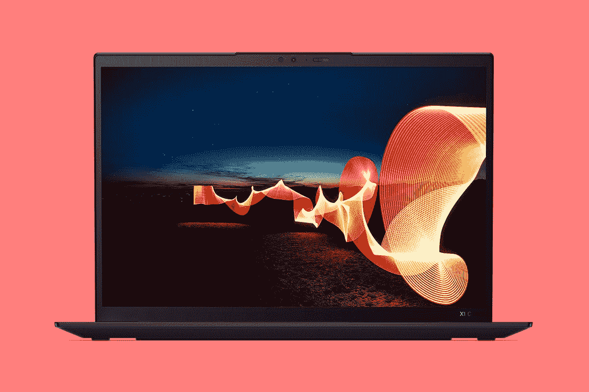
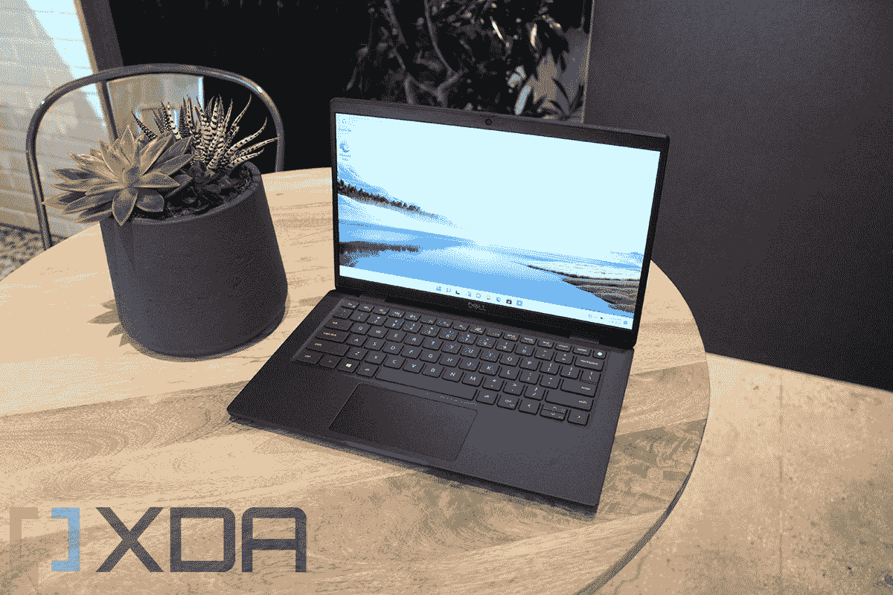
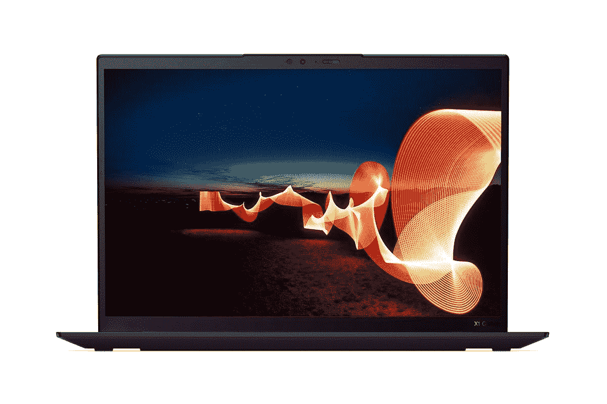

# 联想 ThinkPad X1 Carbon Gen 10 与戴尔 Latitude 7330 笔记本电脑

> 原文：<https://www.xda-developers.com/lenovo-thinkpad-x1-carbon-gen-10-vs-dell-latitude-7330/>

戴尔最近在市场上推出了一批新的 Latitude 笔记本电脑。所有新的 Latitude 笔记本电脑现在都采用了新的英特尔第 12 代 Alder Lake 芯片，它们都改进了设计、显示等。这些新笔记本电脑与市场上的许多其他商务笔记本电脑相比，包括一系列 ThinkPad 笔记本电脑，都有很好的表现。在本文中，我们将看一看[联想 ThinkPad X1 Carbon Gen 1](https://www.xda-developers.com/lenovo-thinkpad-x1-carbon-gen-10/) 0 与戴尔 Latitude 7330 的对比，以找出 2022 年哪一款是更好的商务笔记本电脑。

**浏览本文:**

## 联想 ThinkPad X1 Carbon Gen 10 与戴尔 Latitude 7330:规格

在我们开始比较之前，让我们快速浏览一下规格表，看看这些笔记本电脑都有哪些特点:

| 

规格

 | 

**联想 ThinkPad X1 Carbon Gen 10**

 | 

**戴尔 Latitude 7330**

 |
| --- | --- | --- |
| **CPU** | 

*   最高可配第 12 代英特尔酷睿 i7 博锐处理器、U 和 P 系列处理器，最高可配 14 个内核

 | 

*   第 12 代英特尔酷睿处理器，最高可配 i7 U15 博锐处理器

 |
| **图形** | 

*   英特尔 Iris Xe 显卡(最高 96 个欧洲单位)

 |  |
| **闸板** |  | 

*   最高 32 GB DDR4 3200 MHz 集成双通道

 |
| **存储** | 

*   高达 2TB 的 PCIe 第四代 NVMe 固态硬盘

 | 

*   高达 1 TB，M.2 PCIe NVMe 固态硬盘

 |
| **显示** | 

*   14 英寸 WUXGA 16:10 (1920×1200) IPS 低功耗、防眩光、400 尼特、100%sRGB
*   14 英寸 WUXGA 16:10 (1920×1200) IPS 低功耗、防眩光、触控、400 尼特、100%sRGB
*   14 英寸 WUXGA 16:10 (1920×1200) IPS 低功耗、防眩光、触摸、隐私保护、500 尼特、100%sRGB
*   14 英寸 2.2K 16:10 (2240×1400) IPS 防眩光，300 尼特，100% sRGB
*   14 英寸 2.8K 16:10 (2880×1800)有机发光二极管，防眩光、防反射、防污迹，400 尼特，100% DCI-P3
*   14 英寸 WQUXGA 16:10 (3840×2400) IPS 低功耗、防眩光、500 尼特、100% DCI-P3、HDR400、杜比视界
*   14 英寸 WQUXGA 16:10 (3840×2400) IPS 低功耗、触控、防眩光、防反射、防污迹、500 尼特、100% DCI-P3、HDR400、杜比视界

 | 

*   16:9 13.3 英寸 FHD (1920×1080) WVA 触摸屏，300 尼特，100% sRGB，主动式触控笔支持
*   16:9 13.3 英寸 FHD (1920 x 1080) WVA 非触摸屏，250 尼特，NTSC 45%，防眩光
*   16:9 13.3 英寸 FHD (1920 x 1080) WVA 非触摸，400 尼特，sRGB 100%
*   16:9 13.3 英寸 FHD (1920 x 1080) WVA 非触摸，400 尼特，sRGB 100%，超轻
*   16:9 13.3 英寸 FHD (1920 x 1080) WVA 触摸屏，300 尼特，NTSC 72%，防眩光

 |
| **电池** |  | 

*   3 芯 41 瓦时或 4 芯 58 瓦时
    *   60W 适配器，C 型，小型
    *   65W 适配器，C 型
    *   90W 适配器，C 型

 |
| **端口** | 

*   2 个 Thunderbolt 4(USB C 型)
*   2 个 USB 3.2 第 1 代 A 型
*   1 个 HDMI 2.0b 接口
*   3.5 毫米耳机插孔
*   Nano SIM 卡插槽

 | 

*   2 个 USB Type-C Thunderbolt 4.0，带电源和显示端口 1.4
*   1 个 USB 3.2 第 1 代，带电源共享
*   1 个 HDMI 2.0 接口
*   1 个可选外部 uSIM 卡托盘(仅限 WWAN)
*   1x 可选接触式智能卡读卡器
*   1 个通用音频插孔
*   楔形锁槽

 |
| **音频** | 

*   杜比 Atmos 扬声器系统 60 度四阵列麦克风

 | 

*   2 个扬声器，Waves MaxxAudio Pro

 |
| **网络摄像头** | 

*   720p 高清 RGB 网络摄像头
*   1080p 全高清 RGB 网络摄像头
*   1080p 全高清 RGB +红外网络摄像头
*   具有计算机视觉功能的 1080p 全高清 MIPI RGB +红外网络摄像头

 | 

*   高清摄像机
*   1080p 全高清+红外摄像头，带戴尔快速登录、智能隐私、环境光传感器和摄像头快门

 |
| **安全** | 

*   Windows Hello:
    *   指纹读取器
    *   红外摄像机(可选)
*   隐私保护显示屏(可选)
*   网络摄像头快门
*   瓷砖就绪

 | 

*   触摸指纹识别器
*   可选面部红外摄像头(兼容 Windows Hello)

 |
| **连通性** | 

*   英特尔无线 6E
*   蓝牙 5.2
*   蜂窝选项:
    *   5G sub-6 Cat2o
    *   4G LTE Cat16

 | 

*   英特尔无线 6E (6GHz) AX211 2×2
*   蓝牙 5.2
*   高通骁龙 X20 LTE-A CAT 16 (DW5821e)
*   高通骁龙 X20 LTE-A CAT 16 (DW5821e)(支持 eSIM)适用于美国电话电报公司、威瑞森和 T-Mobile。仅限美国

 |
| **尺寸(WxDxH)** | 

*   高清网络摄像头:315.6 x 222.50 x 14.95 毫米(12.42 x 8.76 x 0.59 英寸)
*   全高清网络摄像头:315.6 x 222.50 x 15.36 毫米(12.42 x 8.76 x 0.60 英寸)

 | 

*   306.5 x 199.95 x 16.96 毫米(12.0 x 7.87 x 0.67 英寸)

 |
| **重量** | 

*   起始重量为 1.12 千克(2.48 磅)

 | 

*   0.967 千克(2.13 磅)(笔记本电脑)
*   1.36 千克(3.0 磅)(2 合 1)

 |
| **价格** |  | 

*   Latitude 7330 超轻配置:起价 1，899 美元
*   Latitude 7330(碳纤维):起价 1969 美元
*   Latitude 7330(铝合金):起价 2004 美元

 |

## 联想 ThinkPad X1 Carbon Gen 10 与戴尔 Latitude 7330:性能

正如你所看到的，这两款笔记本电脑都采用了英特尔新的第 12 代 Alder Lake 处理器。联想 ThinkPad X1 Carbon Gen 10 可以与 28W P 系列和 15W U 系列芯片一起购买，而戴尔 Latitude 7330 仅配备 15W U 系列芯片。两款笔记本电脑都可以配置各自产品系列中的酷睿 i7 芯片，因此您将有几个选项可供选择。我们想强调的是，这些笔记本电脑使用博锐处理器，这意味着它们可以部署各种企业和安全功能。

我们还没有机会测试 P 和 U 系列处理器，所以现在很难对整体进行评论。也就是说，我们预计采用 P 系列芯片的 ThinkPad X1 Carbon Gen 10 整体性能会更好。我们建议您查看我们的[英特尔第 12 代 P 系列与 U 系列 CPU 对比](https://www.xda-developers.com/intel-12th-gen-p-vs-u-series/)以了解有关这些芯片的更多信息。P 系列和 U 系列芯片都带有相同的 Iris Xe 集成显卡单元和 96 个 e U，因此我们不认为它们在处理 3D 工作负载时会有明显不同的性能输出。同样，一旦我们有机会测试这些芯片，我们将能够谈论更多的性能。

谈到内存，ThinkPad X1 Carbon Gen 10 配备了高达 32GB 的 LPDDR5，而 Dell Latitude 7330 配备了 32GB 的 DDR4 内存。我们看到的是两种不同的内存控制器，尽管您可以预期它们具有几乎相同的一般性能。你不能在任何一台机器上升级内存，所以记住这一点。就存储而言，ThinkPad X1 Carbon Gen 10 最高可配 2TB PCIe NVMe 固态硬盘，Dell Latitude 7330 最高可配 1TB PCIe NVMe 固态硬盘。戴尔没有明确提到是否可以升级存储，但你可以在 ThinkPad X1 Carbon Gen 10 笔记本电脑中添加或更换固态硬盘。

电池寿命是另一个我们还不能评论的问题，因为我们还没有使用过这些机器。Dell Latitude 7330 配备了 41 瓦时或 58 瓦时的电池，而 ThinkPad X1 Carbon Gen 10 配备了 57 瓦时的电池。由于较低的 TDP 额定值，U 系列芯片肯定更节能，但看看 P 系列和 U 系列在电池寿命方面的表现会很有趣。

## 显示

在显示器方面，联想 ThinkPad X1 Carbon Gen 10 配备了 14 英寸 16:10 IPS 面板，而所有戴尔 Latitude 7330 都配备了 13.3 英寸 16:9 面板。你可以在两款笔记本电脑的触摸和非触摸显示屏之间进行选择，但联想提供的是更高分辨率的面板，所以请记住这一点。我们建议您快速浏览一下上面的规格表，了解两款笔记本电脑的不同面板选项。两边都有几个可供选择，所以一定要选一个适合你需要的。

 <picture></picture> 

Lenovo ThinkPad X1 Carbon

我们想指出的是，联想 ThinkPad X1 Carbon Gen 10 上的 16:10 比 16:9 宽高比面板更适合提高工作效率。16:10 显示屏提供了更大的垂直屏幕空间，更适合阅读或编辑文档网页等。这两款笔记本电脑都有一些隐私功能，所以这很好。ThinkPad X1 Carbon Gen 10 具有隐私保护功能，而 Latitude 7330 具有一项软件功能，当它检测到有人越过你的肩膀看时，会模糊屏幕。

 <picture></picture> 

Dell Latitude 7330 Ultralight

至于显示器顶部的网络摄像头，ThinkPad X1 Carbon Gen 10 和 Dell Latitude 7330 都提供了一个添加 1080p 摄像头的选项。这两款笔记本的基本型号都只配备了 720p 高清摄像头，但我们认为这对那些不经常视频通话或参加在线会议的人来说应该足够了。为了支持 Windows Hello，这两款笔记本电脑都可选装红外摄像头，但为了安全起见，它们都配有独立的指纹扫描仪。我们喜欢这两款笔记本电脑上的网络摄像头的一点是，它配有网络摄像头快门，可以提供更多隐私。ThinkPad 也是“瓷砖就绪”的，这意味着你可以将它与跟踪器配对来跟踪它，以防你最终丢失它。

## 设计和端口

戴尔的新款 Latitude 7330 笔记本电脑现在看起来比以往任何时候都更好。事实上，我们最喜欢 Latitude 7330 的一点是，它现在也采用了超轻外形。这种特殊的变体重量不到 1 千克，是最轻的 13.3 英寸 16:9 高级商用笔记本电脑。相比之下，联想 ThinkPad X1 Carbon Gen 10 的重量为 1.12 千克。即使是更重的 2-1in-1 型号的 Dell Latitude 7330 也只有 1.36 千克，这仍然不算太差。虽然联想 ThinkPad X1 Carbon Gen 10 笔记本的厚度比头发还要薄，但戴尔 Latitude 7330 的整体尺寸更小，这一点非常好。

除了超轻机型，Dell Latitude 7330 还提供碳纤维和铝表面。另一方面，联想 ThinkPad X1 Carbon Gen 10 只有碳纤维表面，所以请记住这一点。Dell Latitude 7330 笔记本电脑的另一个优点是，尽管外形较小，但它提供了一个很好的端口选择。甚至 Latitude 7330 Ultralight 变体也配有两个 Thunderbolt 4 端口、一个 USB 3.2 Gen 1 Type-A 端口、HDMI 2.0、一个耳机插孔、一个可选的 SIM 托盘和一个智能卡读卡器。

联想 ThinkPad X1 Carbon Gen 10 也有很好的端口选择。它配有两个 Thunderbolt 4 (USB Type-C)端口、两个 USB 3.2 Gen 1 Type-A、一个 HDMI 2.0 端口、一个 3.5 毫米耳机插孔和一个 nano-SIM 卡插槽。你不必依赖任何一台笔记本电脑的适配器，但我们认为在两台机器上都有一个 SD 读卡器会很好。两台笔记本电脑的连接选项也很相似。我们正在考虑在这两款笔记本电脑上安装 WiFi 6E 和蓝牙 5.2 以及蜂窝功能。

## 应该买哪个？

从各方面考虑，可以肯定地说，这两款商务笔记本电脑不相上下。除了我们期望在基于 P 系列芯片的 ThinkPad X1 Carbon 和基于 U 系列芯片的 Latitude 7330 之间看到的明显性能差异之外，没有什么可以使它们中的任何一个明显优于另一个。两台机器都带有相同的 Iris Xe 集成图形单元和 32GB 内存。使用 ThinkPad X1 Carbon，您可以获得更多的存储空间，但 Latitude 7330 的 1TB 存储空间对大多数用户来说也足够了。

ThinkPad X1 Carbon Gen 10 比戴尔 Latitude 7330 略胜一筹的一点是显示屏。这两款笔记本电脑都有触摸和非触摸面板选项，但联想提供的是分辨率更高的 16:10 面板，我们认为总体来说非常棒。两台机器上都有可选的 1080p 网络摄像头，但 ThinkPad 也是一款“瓷砖就绪”的笔记本电脑。也就是说，Latitude 7330 更加美观，整体外形也很棒。不过，这款超轻笔记本的售价为 1，899 美元，略高于 ThinkPad X1 Carbon Gen 10 笔记本的 1，639 美元。

 <picture></picture> 

Lenovo ThinkPad X1 Carbon Gen 10

##### 联想 ThinkPad X1 碳第 10 代

联想 ThinkPad X1 Carbon Gen 10 配备了第 12 代英特尔酷睿 P 系列和 u 系列处理器。

如果你不喜欢这两款笔记本电脑，那么请务必立即查看我们收集的市面上的[最佳商务笔记本电脑](https://www.xda-developers.com/best-business-laptops/)。或者，如果你更喜欢购买 ThinkPad 笔记本电脑，那么看看我们专门收集的市场上[最好的 ThinkPad 笔记本电脑](https://www.xda-developers.com/best-thinkpads/)。