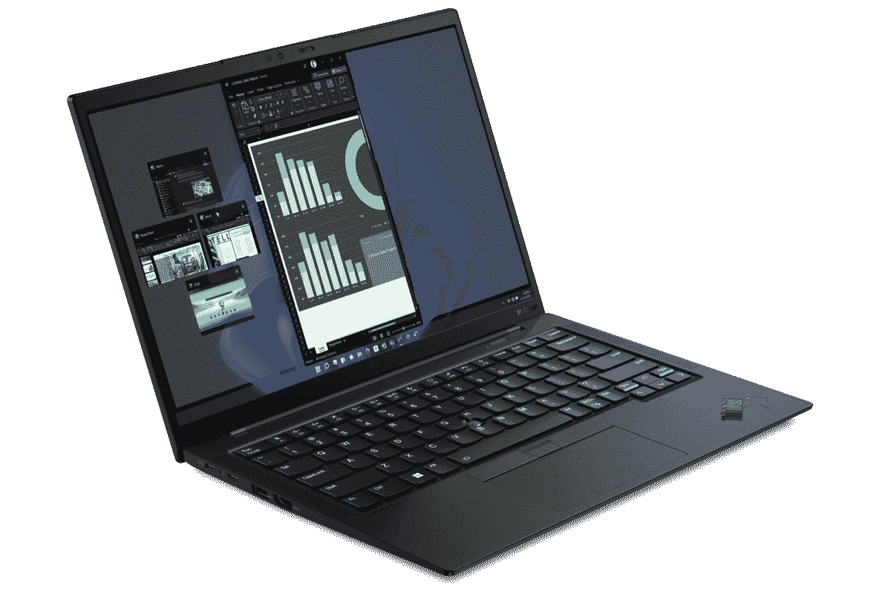

# 联想 ThinkPad X1 Carbon Gen 10 vs MacBook Pro 14:该买哪个？

> 原文：<https://www.xda-developers.com/lenovo-thinkpad-x1-carbon-gen-10-vs-macbook-pro/>

决定下一步买哪台电脑可能会令人困惑，特别是当你在你的设备上投资一大笔钱时。市面上有很多不错的苹果电脑和 T2 笔记本电脑，包括一些 T4 的 ThinkPad 和 T5 笔记本电脑——决定哪一款适合你可能会很困惑。为了简化您的选择过程，我们将对联想和苹果生产的两款功能强大的笔记本电脑进行细分。这是 ThinkPad X1 Carbon Gen 10 vs MacBook Pro 14:强者之战。

## 定价和可用性

联想 ThinkPad X1 Carbon Gen 10 只有一种颜色:深黑色。基本型号在美国的价格为 1，639 美元，根据您选择的不同配置(存储、显示器、处理器等)，价格可能会有所上涨。).至于 MacBook Pro 14 (2021)，它在美国的起价为 1999 美元，有太空灰和银色两种表面。同样，如果您选择更高端的内部设备，价格也会提高。

## 联想 ThinkPad X1 Carbon Gen 10 vs 苹果 MacBook Pro 14:规格

|  | 联想 ThinkPad X1 碳第 10 代 | 苹果 MacBook Pro 14 |
| --- | --- | --- |
| **CPU** | 

*   最高可配第 12 代英特尔酷睿 i7 博锐处理器，U 和 P 系列，最高可配 14 个内核

 | 

*   苹果 M1 专业版(8 核 CPU)
*   苹果 M1 专业版(10 核 CPU)
*   苹果 M1 Max (10 核 CPU)

 |
| **图形** |  | 

*   苹果 M1 专业版(14 核 GPU)
*   苹果 M1 专业版(16 核 GPU)
*   苹果 M1 Max (24 核 GPU)
*   苹果 M1 Max (32 核 GPU)

 |
| **正文** | 

*   起始尺寸为 14.95 x 315.6 x 222.50mm 毫米
*   起始重量为 1.12 千克

 | 

*   15.5 x 312.6 x 221.2mm 毫米
*   1.6 千克

 |
| **显示** | 

*   14 英寸 WUXGA 16:10 (1920×1200) IPS 低功耗、防眩光、400 尼特、100%sRGB
*   14 英寸 WUXGA 16:10 (1920×1200) IPS 低功耗、防眩光、触控、400 尼特、100%sRGB
*   14 英寸 WUXGA 16:10 (1920×1200) IPS 低功耗、防眩光、触摸、隐私保护、500 尼特、100%sRGB
*   14 英寸 2.2K 16:10 (2240×1400) IPS 防眩光，300 尼特，100% sRGB
*   14 英寸 2.8K 16:10 (2880×1800)有机发光二极管，防眩光、防反射、防污迹，400 尼特，100% DCI-P3
*   14 英寸 WQUXGA 16:10 (3840×2400) IPS 低功耗、防眩光、500 尼特、100% DCI-P3、HDR400、杜比视界
*   14 英寸 WQUXGA 16:10 (3840×2400) IPS 低功耗、触控、防眩光、防反射、防污迹、500 尼特、100% DCI-P3、HDR400、杜比视界

 | 

*   14.2 英寸 Liquid Retina XDR 显示屏(3024 x 1964)，峰值亮度高达 1600 尼特，True Tone 技术，自适应刷新率高达 120Hz 的提升技术

 |
| **端口** | 

*   2 个 USB-C(只有一个支持供电)
*   2 个 USB-A 3.2 第 1 代
*   HDMI 2.0b
*   3.5 毫米耳机插孔
*   Nano SIM 卡插槽

 | 

*   3 个 USB-C，带电源和显示端口
*   高清晰度多媒体接口
*   3.5 毫米耳机插孔
*   MagSafe 3
*   SD 卡插槽

 |
| **存储** |  |  |
| **闸板** |  |  |
| **电池** |  |  |
| **音频** | 

*   杜比 Atmos 扬声器系统

 | 

*   播放 Dolby Atmos 内容时，高保真六扬声器音响系统具有力抵消低音扬声器和空间音频支持

 |
| **摄像机** | 

*   720p 高清 RGB 网络摄像头
*   1080p 全高清 RGB 网络摄像头
*   1080p 全高清 RGB +红外网络摄像头
*   具有计算机视觉功能的 1080p 全高清 MIPI RGB +红外网络摄像头

 |  |
| **连通性** | 

*   Wi-Fi 6E
*   蓝牙 5.2
*   蜂窝选项:
    *   5G sub-6 Cat2o
    *   4G LTE Cat16

 |  |
| **颜色** | 

*   深黑色
    *   可选碳纤维编织罩

 |  |
| **价格** |  |  |

## 设计

设计是一件主观的事情，但是我们仍然可以做出客观的观察和判断。与 MacBook Pro 相比，ThinkPad 客观上具有经典、笨重的外观设计。后者的特点是完全重新设计，并包括一个缺口显示。正因为如此，它的边框比 ThinkPad 更薄。此外，ThinkPad X1 Carbon Gen 10 上的触控板有可见的左右点击按钮，而 MacBook Pro 14 没有。然而，突出的是 ThinkPad 的灵活性——显示器可以安全地移动 180°。虽然大多数人可能不需要它，但它仍然让联想赢得了额外的设计分数。

谈到端口，这两款笔记本电脑都有很多种。不过，值得注意的是，联想有一个 SIM 卡插槽，允许你利用 4G 或 5G 网络。此外，它还有 USB-A 端口，这是 Mac 所没有的。许多人已经改用 USB-C，但直到今天，一些小工具仍然附带 USB-A 电缆。与 ThinkPad 不同，MacBook Pro 有一个 SD 卡插槽，如果你是一名专业摄影师，这特别有用。

如果你不喜欢深色，那么你只能选择 MacBook Pro。这是因为联想笔记本电脑只有深黑色，并有一个可选的碳纤维编织盖，使其脱颖而出。它的竞争对手有银色和太空灰两种颜色。从美学角度来说，MacBook Pro 14 目前胜出。然而，如果你需要笔记本电脑上的移动数据或依赖 USB-A 端口，那么购买 ThinkPad 可能对你更有意义。

## 显示

说到显示器，这些设备各有优缺点。14 英寸 MacBook Pro 配备了令人惊叹的 3024 x 1964 分辨率屏幕，边角干净圆润。相反，联想 ThinkPad X1 Carbon Gen 10 的基本型号为 1920 x 1200。如果你愿意多付钱，你可以把联想笔记本电脑的分辨率提高到 3840×2400。

同样值得指出的是，你得到的 ThinkPad 是带触摸屏的。MacBooks 不支持触摸控制，所以如果这是一个交易破坏者，你只能选择联想。另外值得一提的是，Mac 电脑的亮度可以达到 1600 尼特，而 ThinkPad 的亮度不会超过 500 尼特。因此，如果你在户外环境中工作，并且想要一个真正明亮的屏幕，那么你可能需要考虑 MacBook Pro 14。

## 表演

根据您选择的配置，性能会有所不同。这两款笔记本电脑的基本型号都有强大的功能，但 MacBook Pro 在*达到最大值*时拥有 M1 Max 芯片的优势。联想 ThinkPad X1 Carbon Gen 10 尚未上市，因此日常任务中的基准测试结果和准确性能比较仍然有限。

谈到存储，MacBook Pro 的存储容量可以扩展到 8TB，而联想的存储容量则限制在 2TB。同样，ThinkPad 上的 RAM 也不能超过 32GB，被 MacBook 的 64GB 限制超过了。因此，根据你在本地存储的文件数量和你需要的内存，你可能会被迫选择 Mac。如果你不需要最大容量的 MacBook Pro 14，那么 ThinkPad X1 Carbon Gen 10 就足够了。

MacBook Pro 运行 [macOS Monterey](http://xda-developers.com/macos-monterey) ，而联想搭载 [Windows 11](http://xda-developers.com/windows-11) 。我们不会比较这两个操作系统，因为它们都提供了桌面操作系统所能提供的主要功能。哪一个更好取决于您的工作流、用例以及您所处的生态系统(假设您是)。macOS Monterey 和 Windows 11 分别是苹果和微软的最新产品。因此，无论购买哪种设备，你都可以利用每家公司提供的最新功能和安全补丁。不过，值得一提的是，macOS 和 Mac 都是由苹果公司开发和生产的，这导致了近乎完美的优化和兼容性。

## 结果

ThinkPad X1 Carbon Gen 10 和 MacBook Pro 14 的起价分别为 1639 美元和 1999 美元。因此，如果你预算紧张，那么联想笔记本电脑可能是你正在寻找的。如果你需要一台 macOS 驱动的笔记本电脑，那么你就必须使用 Mac。最终，这两款笔记本电脑都有自己独特的优势和劣势。哪一个最适合你取决于你自己。我们只是根据您的日常需求和使用情形，分解了它们的规格，以帮助您做出决定。

值得一提的是，联想 ThinkPad X1 Carbon Gen 11 将于 2023 年 4 月发布，售价约为 1700 美元。如果你愿意等待，那么你可以利用更快的处理器。外观设计是一样的，笔记本电脑大部分会保持不变。因此，如果你不在乎这种增量升级，我不会等待更新的模式。

 <picture></picture> 

Lenovo ThinkPad X1 Carbon Gen 10

##### 联想 ThinkPad X1 碳第 10 代

ThinkPad X1 Carbon Gen 10 仍然无法购买，但你可以在联想的网站上查看它的列表，并在上市后立即购买。

 <picture></picture> 

MacBook Pro 14-inch (2021)

##### 苹果 MacBook Pro 14 (2021)

14 英寸的 MacBook Pro 是由苹果 M1 Pro 或 M1 Max 芯片驱动的强大怪兽。它运行的是 macOS Monterey，功能一流。

*您会购买哪种专业笔记本电脑，为什么？请在下面的评论区告诉我们。*