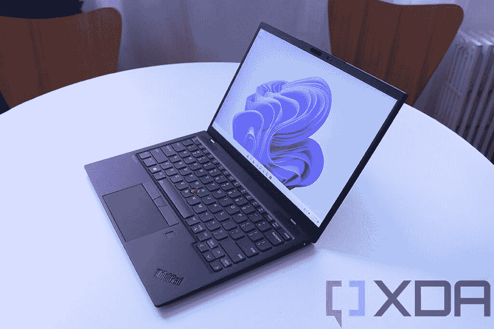
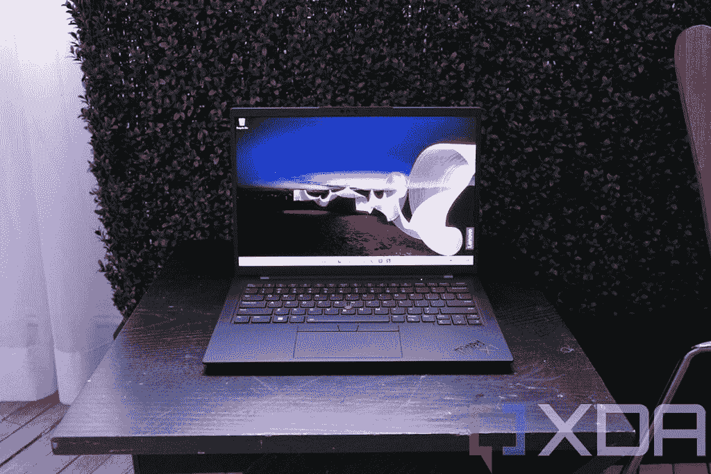
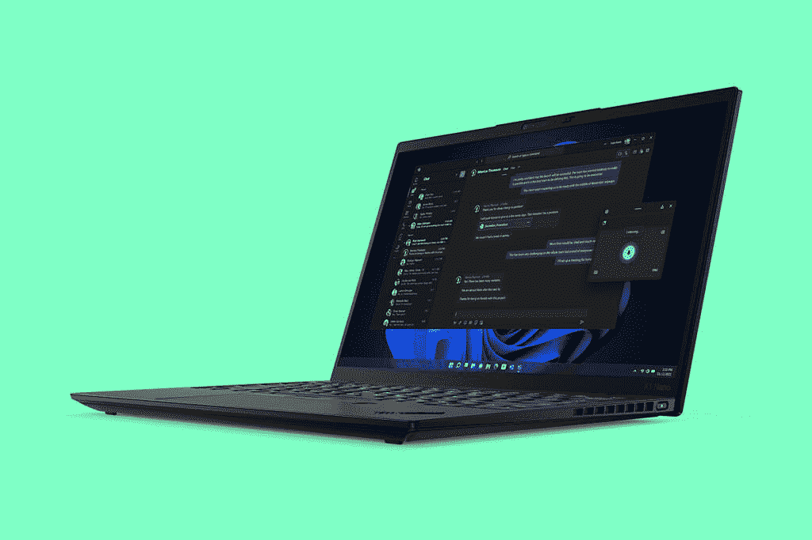
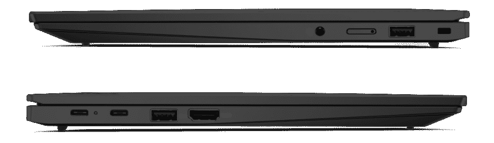
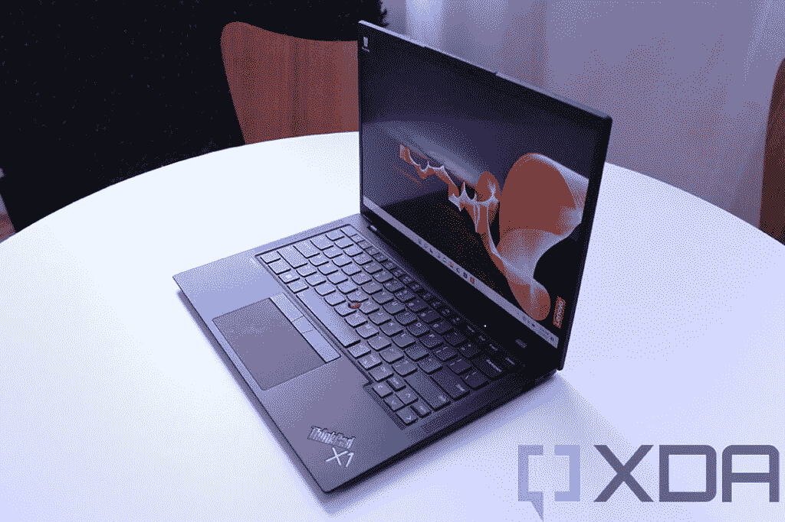

# 联想 ThinkPad X1 Carbon Gen 10 vs X1 Nano Gen 2:尺寸重要吗？

> 原文：<https://www.xda-developers.com/lenovo-thinkpad-x1-carbon-gen-10-vs-x1-nano-gen-2/>

在 CES 2022 上。联想刷新了其标志性的 ThinkPad X1 系列，包括经典的 ThinkPad X1 Carbon 和更近的 ThinkPad X1 Nano。前者多年来一直是最好的商务笔记本电脑之一，也是联想的旗舰产品。但有了 ThinkPad X1 Nano，联想变得更加轻便，创造了更适合移动工作者的东西。然而，为了适应更轻的封装，它牺牲了一些性能。

然而，通过这些更新的型号，ThinkPad X1 Nano 和 X1 Carbon 比以往任何时候都更接近了。如果你想知道哪一个是你的正确选择，让我们看看这两个模型之间的差异，从原始规格开始。

## 规范

|  | 

联想 ThinkPad X1 碳第 10 代

 | 

联想 ThinkPad X1 Nano Gen 2

 |
| --- | --- | --- |
| **操作系统** |  |  |
| **CPU** | 

*   英特尔 P 系列:
    *   第 12 代英特尔酷睿 i5-1240P (12 个内核，16 个线程，最高 4.4GHz，12MB 高速缓存)
    *   第 12 代英特尔酷睿 i5-1250P (12 个内核，16 个线程，最高 4.4GHz，12MB 高速缓存)
    *   第 12 代英特尔酷睿 i7-1260P (12 个内核，16 个线程，最高 4.7GHz，18MB 高速缓存)
    *   第 12 代英特尔酷睿 i7-1270P (12 个内核，16 个线程，最高 4.8GHz，18MB 高速缓存)
    *   第 12 代英特尔酷睿 i7-1280P (14 个内核，20 个线程，最高 4.8GHz，24MB 高速缓存)
*   英特尔 U15 系列
    *   第 12 代英特尔酷睿 i5-1235U (10 个内核，12 个线程，最高 4.4GHz，12MB 高速缓存)
    *   第 12 代英特尔酷睿 i5-1245U (10 个内核，12 个线程，最高 4.4GHz，12MB 高速缓存)
    *   第 12 代英特尔酷睿 i7-1255U (10 个内核，12 个线程，最高 4.7GHz，12MB 高速缓存)
    *   第 12 代英特尔酷睿 i7-1265U (10 个内核，12 个线程，最高 4.8GHz，12MB 高速缓存)

 | 

*   第 12 代英特尔酷睿 i5-1240P (12 个内核，16 个线程，最高 4.4GHz，12MB 高速缓存)
*   第 12 代英特尔酷睿 i5-1250P (12 个内核，16 个线程，最高 4.4GHz，12MB 高速缓存)
*   第 12 代英特尔酷睿 i7-1260P (12 个内核，16 个线程，最高 4.7GHz，18MB 高速缓存)
*   第 12 代英特尔酷睿 i7-1270P (12 个内核，16 个线程，最高 4.8GHz，18MB 高速缓存)
*   第 12 代英特尔酷睿 i7-1280P (14 个内核，20 个线程，最高 4.8GHz，24MB 高速缓存)

 |
| **图形** |  |  |
| **显示** | 

*   14 英寸 WUXGA 16:10 (1920×1200) IPS 低功耗、防眩光、400 尼特、100%sRGB
*   14 英寸 WUXGA 16:10 (1920×1200) IPS 低功耗、防眩光、触控、400 尼特、100%sRGB
*   14 英寸 WUXGA 16:10 (1920×1200) IPS 低功耗、防眩光、触摸、隐私保护、500 尼特、100%sRGB
*   14 英寸 2.2K 16:10 (2240×1400) IPS 防眩光，300 尼特，100% sRGB
*   14 英寸 2.8K 16:10 (2880×1800)有机发光二极管，防眩光、防反射、防污迹，400 尼特，100% DCI-P3
*   14 英寸 WQUXGA 16:10 (3840×2400) IPS 低功耗、防眩光、500 尼特、100% DCI-P3、HDR400、杜比视界
*   14 英寸 WQUXGA 16:10 (3840×2400) IPS 低功耗、触控、防眩光、防反射、防污迹、500 尼特、100% DCI-P3、HDR400、杜比视界

 | 

*   13 英寸 2K (2160 x 1350)，450 尼特，100% sRGB，杜比视界
*   13 英寸 2K (2160 x 1350)触摸屏，450 尼特，100% sRGB，杜比视界

 |
| **存储** | 

*   256GB PCIe 4.0 NVMe 固态硬盘
*   512GB PCIe 4.0 NVMe 固态硬盘
*   1TB PCIe 4.0 NVMe 固态硬盘
*   2TB PCIe 4.0 NVMe 固态硬盘

 | 

*   256GB PCIe 4.0 NVMe 固态硬盘
*   512GB PCIe 4.0 NVMe 固态硬盘
*   1TB PCIe 4.0 NVMe 固态硬盘

 |
| **RAM** | 

*   8GB LPDDR5 5200MHz
*   16GB LPDDR5 5200MHz
*   32GB LPDDR5 5200MHz

 | 

*   16GB LPDDR5 5200MHz
*   32GB LPDDR5 5200MHz

 |
| **电池** | 

*   57 瓦时电池
*   高达 65W 的 USB Type-C 电源适配器

 | 

*   49.6 瓦时电池
*   高达 65W 的 USB Type-C 电源适配器

 |
| **港口** | 

*   2 个 Thunderbolt 4(USB C 型)
*   2 个 USB 3.2 第 1 代 A 型
*   1 个 HDMI 2.0b 接口
*   3.5 毫米耳机插孔
*   Nano SIM 卡插槽

 | 

*   2 个 Thunderbolt 4(USB C 型)
*   3.5 毫米耳机插孔
*   Nano SIM 卡插槽

 |
| **音频** | 

*   杜比 Atmos 扬声器系统

 | 

*   杜比 Atmos 扬声器系统

 |
| **摄像机** | 

*   720p 高清 RGB 网络摄像头
*   1080p 全高清 RGB 网络摄像头
*   1080p 全高清 RGB +红外网络摄像头
*   具有计算机视觉功能的 1080p 全高清 MIPI RGB +红外网络摄像头

 | 

*   1080p 全高清 RGB 网络摄像头
*   1080p 全高清 RGB +红外网络摄像头
*   具有计算机视觉功能的 1080p 全高清 MIPI RGB +红外网络摄像头

 |
| **Windows Hello** | 

*   红外网络摄像头(可选)
*   指纹传感器

 | 

*   红外网络摄像头(可选)
*   指纹传感器

 |
| **连通性** | 

*   英特尔无线 6E
*   蓝牙 5.2
*   蜂窝选项:
    *   5G sub-6 Cat2o
    *   4G LTE Cat16

 | 

*   英特尔无线 6E
*   蓝牙 5.2
*   蜂窝选项:
    *   5G sub-6 Cat2o
    *   4G LTE Cat16

 |
| **颜色** | 

*   深黑色
    *   可选碳纤维编织罩

 | 

*   深黑色
    *   可选碳纤维编织罩

 |
| **尺寸(WxDxH)** | 

*   高清网络摄像头:315.6 x 222.50 x 14.95 毫米(12.42 x 8.76 x 0.59 英寸)
*   全高清网络摄像头:315.6 x 222.50 x 15.36 毫米(12.42 x 8.76 x 0.60 英寸)

 | 

*   非触控:293.2 x 208.0 x 14.47 毫米(11.5 x 8.19 x 0.57 英寸)
*   触摸:293.3 x 208.1 x 14.77 毫米(11.5 x 8.19 x 0.58 英寸)

 |
| **尺寸** | 起始重量为 1.12 千克(2.48 磅) | 起始重量为 970 克(2.13 磅) |
| **价格** | 起价 1639 美元 | 起价 1659 美元 |

查看这些规格表，您可以清楚地看出这些是非常相似的笔记本电脑，但也有一些值得注意的差异。让我们更深入地了解这两种设备之间的差异。

## 性能:ThinkPad X1 Nano 已经赶上了

当联想去年首次推出 ThinkPad X1 Nano 时，它做出的牺牲之一是使用英特尔的 9W 处理器，以使它尽可能小。与此同时，ThinkPad X1 Carbon Gen 9 拥有 15W 处理器，因此它在性能上有一点优势。现在，这似乎已经被抛到了窗外，因为这两款笔记本电脑都配备了第 12 代英特尔酷睿处理器，最高可配 28W P 系列酷睿 i7。这些 28W 处理器对英特尔来说并不是全新的，但对 Windows PCs 来说是全新的，与典型的 15W 处理器相比，它们应该能够提供更高的性能。不过，这两种型号都有配备 15W CPUs 的型号。

 <picture></picture> 

Lenovo ThinkPad X1 Nano

这两款笔记本电脑都依赖于英特尔 Iris Xe 集成显卡，因此在前端，事情也应该相当均匀。唯一可能影响性能的是，X1 Carbon Gen 10 更大的尺寸可能会为更好的冷却腾出空间，从而实现更持续的性能。

新的第 12 代英特尔处理器还支持 LPDDR5 RAM，这也包含在两款笔记本电脑中。同样，ThinkPad X1 Nano Gen 2 已经赶上来了，现在还配备了高达 32GB 的内存，而不是 16GB，与 X1 Carbon 相匹配。ThinkPad X1 Carbon 可能具有优势的一个领域是存储，因为它配备了高达 2TB 的 PCIe 第四代固态硬盘。对于 ThinkPad X1 Nano，联想没有提到 PCIe Gen 4 支持，尽管你得到了相同的 2TB 容量。

最后，谈到电池，ThinkPad X1 Carbon 的电池容量为 58 瓦时，比 X1 Nano 的 49.6 瓦时大。但电池寿命将取决于你的配置，包括 X1 Carbon 上更大的显示屏。很多配置分辨率也更高，所以用的电池更多。

## 显示器:它们都很棒，但 ThinkPad X1 Carbon 有很多选择

显示器是 ThinkPad X1 Carbon Gen 10 和 ThinkPad X1 Nano Gen 2 之间的差异开始真正显现的地方。两款笔记本电脑都有很棒的 16:10 显示屏，但它们在几乎所有其他方面都不同。首先，它们的尺寸不同，ThinkPad X1 Carbon 的显示屏为 14 英寸，而 X1 Nano 的显示屏为 13 英寸。

 <picture></picture> 

Lenovo ThinkPad X1 Carbon

凭借 ThinkPad X1 Carbon Gen 10，联想提供了比以往更多的选择。基本型号配备了 400 尼特的全高清+ (1920 x 1200)面板，您可以添加触摸支持和隐私保护。还有一个 2.2K IPS 面板选项，可以增加一点额外的清晰度(以 300 尼特的较低亮度为交换)，加上第 10 代更新中引入的新的 2.8K OLED 面板。这是联想第一次在 ThinkPad X1 Carbon 上使用 OLED 面板，它肯定会是一个伟大的显示器。我们还有 4K+ IPS 面板，这也是该型号首次提供可选的触摸支持。此外，4K+和有机发光二极管型号覆盖了 P3 DCI 的 100%，而其他选项则覆盖了 sRGB 的 100%。

与此同时，ThinkPad X1 Nano 为您提供了与去年型号完全相同的选项。这是一个 13 英寸的 2K (2160 x 1350)面板，亮度为 450 尼特，sRGB 覆盖率为 100%。你得到的唯一选择是你是否想要在面板上增加触摸支持。就其尺寸而言，这仍然是一个很棒的显示器，但你肯定可以通过 ThinkPad X1 Carbon 获得更多选择，其中一些比 X1 Nano 的显示器有趣得多。

 <picture></picture> 

ThinkPad X1 Nano

在显示器上方，这两款笔记本电脑现在都配备了全高清摄像头，这很棒。一些 ThinkPad 已经有了这个选项，但这是这两款机型第一次得到它，事实上，它是 ThinkPad X1 Nano 现在的默认配置。如果你不在乎更好的质量，ThinkPad X1 Carbon 仍然可以让你选择 720p 相机。两者都有 Windows Hello 面部识别选项和一个新的可选功能，称为计算机视觉，让你的相机更智能。例如，摄像头可以检测到是您走近笔记本电脑使用它，还是有人刚刚走过它，因此笔记本电脑只有在要被使用时才会被唤醒。

对于音频，联想正在宣传这两款机型的杜比 Atmos 扬声器系统，尽管我们还不知道扬声器的确切规格。这两款手机都配备了四阵列麦克风，提高了通话时的拾音能力。

## 设计和端口:最重要的是尺寸

联想的 ThinkPad 系列拥有标志性的设计传统，这两款笔记本电脑都如你所料地传承了这一传统。就外观而言，它们几乎是一样的:深黑色的机箱，带有标志性的 ThinkPad 红色点缀，包括 TrackPoint 和触摸板上方的复制鼠标按钮等功能。他们甚至都可以在盖子上选择碳纤维编织盖。

 <picture></picture> 

Keyboard on the ThinkPad X1 Nano

这两者的区别与大小有关。顾名思义，ThinkPad X1 Nano 很小。由于显示屏较小，它在每个维度上都更小，而且也略薄，尺寸为 14.47 毫米(非触摸版本)，而 ThinkPad X1 Carbon Gen 10 的尺寸为 14.95 毫米(带高清摄像头)。X1 Nano 的触控版尺寸为 14.57 毫米，而 X1 Carbon 的尺寸为 15.36 毫米，配有全高清网络摄像头。

重量差异可能更明显，ThinkPad X1 Nano 的起始重量仅为 2.13 磅，而 X1 Carbon 的起始重量为 2.48 磅。它们都仍然是非常便携的笔记本电脑，但 ThinkPad X1 Nano 只是稍微更便携一些。

然而，这种大小差异对您可用的端口起着很大的作用。ThinkPad X1 Carbon Gen 10 提供了一整套端口，包括两个 Thunderbolt 4 连接、两个 USB Type-A 端口、HDMI、一个耳机插孔和一个可选的 nano-SIM 插槽。ThinkPad X1 Nano Gen 2 只有两个 Thunderbolt 4 端口和一个耳机插孔(加上可选的 nano-SIM)，所以所有其他连接都必须来自一个 [Thunderbolt dock](https://www.xda-developers.com/best-thunderbolt-docks/) 。为了额外的便携性，这可能是值得的，但我个人更愿意内置额外的端口。Thunderbolt 坞站可能很贵，所以并不适合所有人。

 <picture></picture> 

Ports on the ThinkPad X1 Carbon

当然，正如我们提到的那样，这两款笔记本电脑都提供了添加蜂窝连接的选项，您可以在 4G LTE (Cat16)或 sub-6GHz 5G (Cat20)之间进行选择。为此，您还可以使用 eSIM 或物理 nano-SIM 插槽。两款机型也都支持 Wi-Fi 6E 和蓝牙 5.2。

## 一句话:便携性值得权衡吗？

联想 ThinkPad X1 Nano 旨在成为一款超便携的 ThinkPad，起始重量不到一公斤，可以说它在这方面取得了成功。在第二代产品中，联想解决了尺寸较小的一些大缺点，与 ThinkPad X1 Carbon 一样，内置了同样强大的处理器和同样多的内存。它也是一台屏幕很棒的笔记本电脑，现在，它还拥有一个很棒的网络摄像头。

然而，仍然有缺点。首先，ThinkPad X1 Carbon Gen 10 拥有更快的 PCIe Gen 4 存储，更大的尺寸意味着它可能也有更好的冷却能力。此外，更大的屏幕还提供了 ThinkPad X1 Nano 所没有的大量变体和选项。您可以添加一个隐私保护装置，配一个漂亮的有机发光二极管显示屏，或者选择一个 100% DCI-P3 彩色覆盖的超清晰 4K+面板。

 <picture></picture> 

ThinkPad X1 Carbon

还有端口的问题，ThinkPad X1 Carbon 具有完整的设置，包括 Thunderbolt、USB Type-A 和 HDMI。ThinkPad X1 Nano *只有*有 Thunderbolt，所以坞站或集线器几乎是强制性的。

当然，大小和重量的差异是否值得这些牺牲取决于你的个人需求。如果你已经依赖迅雷码头，那么你在这里不会损失太多。此外，X1 Nano 仍然拥有出色的显示屏，即使它没有 X1 Carbon 的所有选项。就我个人而言，我更喜欢更大的笔记本电脑，它仍然非常轻薄，但这取决于你。

截至发稿时，仅有 ThinkPad X1 Carbon 可供订购，且仅提供部分配置。不过，你也可以看看下面的 ThinkPad X1 Nano，看看在你读这篇文章的时候它是否还在。这些肯定是联想制造的一些[最好的 ThinkPad](https://www.xda-developers.com/best-thinkpads/)，当然也是你可以为工作购买的一些[最好的笔记本电脑](https://www.xda-developers.com/best-laptops/)，所以任何一款都不会错。一旦笔记本可供购买，我们一定会尽快更新这篇文章。

 <picture></picture> 

Lenovo ThinkPad X1 Carbon Gen 10

##### 联想 ThinkPad X1 碳第 10 代

联想 ThinkPad X1 Carbon Gen 10 配备了第 12 代英特尔酷睿处理器、新的有机发光二极管显示屏和全高清网络摄像头。

 <picture></picture> 

Lenovo ThinkPad X1 Nano Gen 2

##### 联想 ThinkPad X1 Nano Gen 2

联想 ThinkPad X1 Nano Gen 2 是一款超轻商务笔记本电脑，采用第 12 代英特尔处理器，支持 5G。