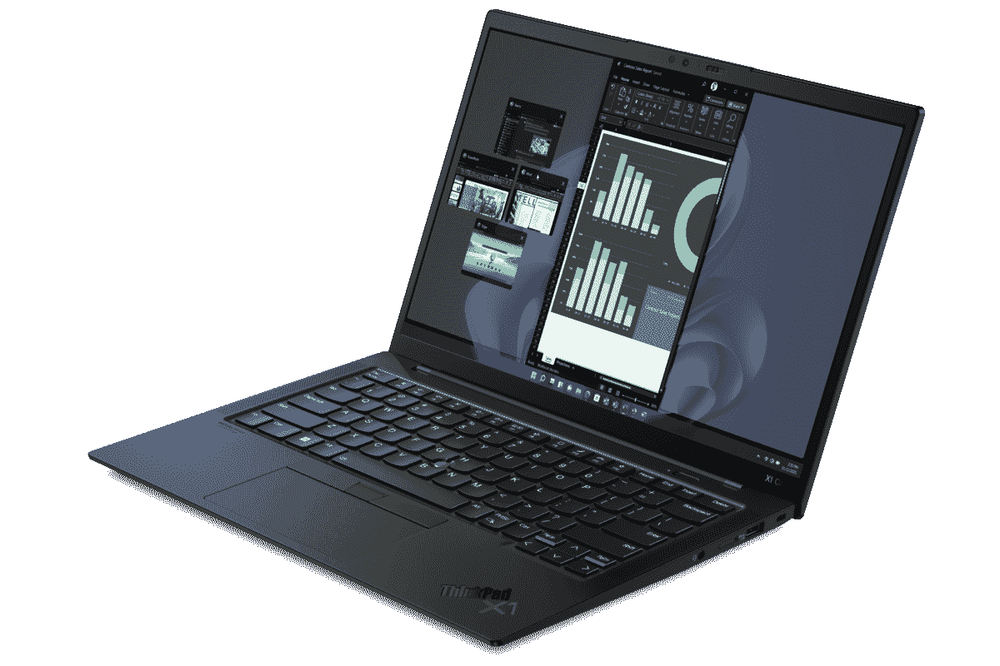

# 联想 ThinkPad X1 Carbon Gen 10 的网络摄像头好吗？

> 原文：<https://www.xda-developers.com/lenovo-thinkpad-x1-carbon-gen-10-webcam/>

现在，在笔记本电脑上安装一个高质量的网络摄像头变得比以往任何时候都更加重要。在远程和混合工作的时代，我们很难推荐一款配备低质量网络摄像头或根本没有网络摄像头的笔记本电脑。幸运的是，几乎所有的商务笔记本都配有网络摄像头，因此您不必担心购买单独的摄像头。事实上，联想 ThinkPad X1 Carbon Gen 10 附带了一些网络摄像头选项。

## 联想 ThinkPad X1 碳 Gen 10 网络摄像头

联想 ThinkPad X1 Carbon Gen 10 的基本型号配备了 720p 摄像头。虽然这不是特别好，但我们认为它仍然是可用的，并且与市场上的许多其他笔记本电脑一致。如果你不是一个经常视频通话或参加在线会议的人，那么这应该绰绰有余。

但是，如果拥有一台高质量的相机对你来说很重要，那么我们建议你考虑购买一款配备 1080p 相机的 ThinkPad X1 Carbon Gen 10。它不仅拥有更高的分辨率计数，还配备了升级的 1.4μm 传感器和 f/2.0 光圈。这意味着从技术上来说，你应该得到比基本型号更好的图像质量。还有一个可选的红外摄像头变体，您可以利用 Windows Hello 身份验证。

如果这对你来说还不够，那么这款新相机甚至可以添加计算机视觉支持。它基本上增加了智能功能，比如解释你是否正在接近你的笔记本电脑使用，或者是否有其他人只是从它面前经过。笔记本电脑只会在即将使用时被唤醒，而不会在人们随意走过它的时候被唤醒。

关于联想 ThinkPad X1 Carbon Gen 10 上的网络摄像头，另一个有趣的事情是，它配有一个网络摄像头快门，可以在不使用时隐藏摄像头传感器。这是一个很好的隐私功能，我们认为现在应该成为所有笔记本电脑的一部分。

## 最后的想法

那么，联想 ThinkPad X1 Carbon Gen 10 的网络摄像头好吗？是的，它是！你不仅有一个很好的网络摄像头可供选择，而且我们认为额外的功能，如红外支持，计算机视觉和网络摄像头快门，使它成为一个可靠的产品。市场上有很多商用笔记本电脑，但我们认为 ThinkPad X1 Carbon Gen 10 是其中的佼佼者。您可以前往我们的 [ThinkPad X1 Carbon Gen 10](https://www.xda-developers.com/lenovo-thinkpad-x1-carbon-gen-10/) 主页，了解更多关于功能和规格的信息。

如果你对这款笔记本电脑不感兴趣，那么我们建议你看看我们的其他文章，包括[最佳商务笔记本电脑](https://www.xda-developers.com/best-business-laptops/)和[最佳 ThinkPad 笔记本电脑](https://www.xda-developers.com/best-thinkpads/)。联想 ThinkPad X1 Carbon Gen 10 商务笔记本现在可以购买，起价为 1，639 美元。我们会留下直接从联想购买这款笔记本电脑的链接，请务必查看。

 <picture></picture> 

Lenovo ThinkPad X1 Carbon Gen 10

##### 联想 ThinkPad X1 碳第 10 代

联想 ThinkPad X1 Carbon Gen 10 配备了第 12 代英特尔酷睿 P 系列处理器、新的有机发光二极管显示屏和全高清网络摄像头。