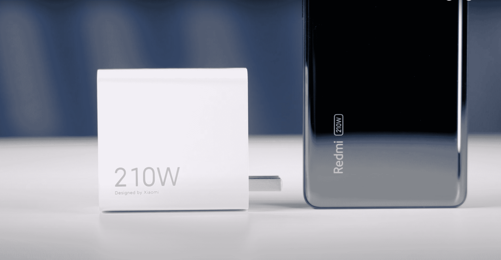
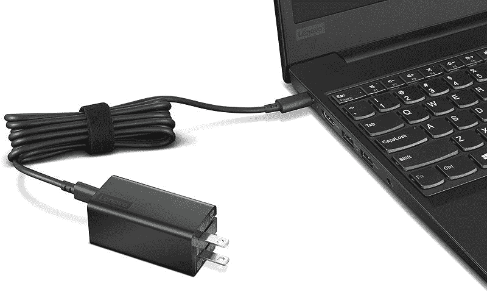

# 联想 ThinkPad X1 Carbon Gen 11 最佳充电器

> 原文：<https://www.xda-developers.com/lenovo-thinkpad-x1-carbon-gen-11-chargers/>

# 联想 ThinkPad X1 Carbon Gen 11 最佳充电器

你可以使用 Anker、Lenovo 和其他品牌的这九款充电器中的任何一款为你的联想 ThinkPad X1 Carbon Gen 11 充电。

 <picture></picture> 

xiaomi's 210W charger launched alongside the Redmi Note 12

电池寿命对于联想 ThinkPad X1 Carbon Gen 11 来说至关重要，因为它是一款商务笔记本电脑。当一整天的网络浏览和会议让你精疲力竭的时候，你会想尽快给你的 [ThinkPad](https://www.xda-developers.com/best-thinkpads) 充电，重新投入工作。当然，联想在盒子里为你准备了一个 65W 的充电器，可以插入你笔记本电脑上的 USB-C 端口，但如果你碰巧丢失了它或想要一个替代品，还有许多其他充电器可以使用。

请注意，您的 ThinkPad X1 Carbon Gen 11 附带的 65W 联想充电器只能为您的笔记本电脑或单个 USB-C 设备充电。我们推荐的许多替代充电器都比联想自己的好，因为借助额外的 USB-C 或 USB-A 端口，你可以用它同时为多台设备充电。其中一些充电器还提供更快的 100 瓦充电速度，有助于更快地为您的笔记本电脑供电。然而，对于其中一些，您需要提供自己的 USB-C 电缆。说了这么多，让我们更深入地了解一下你可能想要为你的新 ThinkPad X1 Carbon Gen 11 配备的九种充电器。

*   <picture></picture>

    联想 65W GaN 充电器

    ##### 联想 65W USB-C GaN 电源适配器

    这是 ThinkPad X1 Carbon Gen 11 的官方 USB-C 充电器。它与包装盒中的原装产品相同，提供高达 65W 的功率，无需购买额外的 USB-C 电缆。

*   ##### Anker 715 充电器(Nano II 65W)

    Anker 是最好的充电器，所以很难不建议将 Anker 715 作为第三方 ThinkPad X1 Carbon Gen 11 充电器。它提供 65W 的功率，就像联想的原装产品一样，但你必须单独购买 USB-C 电缆。

*   ##### Ukor 65W 通用笔记本充电器

    这款充电器类似于 ThinkPad X1 Carbon Gen 11 自带的原装。它有一根很长的 USB-C 电缆，可提供高达 65W 的功率。

    T17
*   ##### Anker 525 充电站

    这款 ThinkPad X1 Carbon Gen 11 充电器与其说是充电器，不如说是集线器。你可以用这个同时给 7 个不同的设备供电，但你必须使用自己的 USB-C 电缆。

*   ##### Insignia 65W 双端口壁式充电器

    这款 Insignia 充电器板载有两个 USB-C 端口。两者都提供高达 65 瓦的功率，因此如果你有自己的 USB-C 电缆，你可以同时为 ThinkPad X1 Carbon 和另一台设备充电。

    T37
*   ##### Baseus 100W 4 口 GaN II 快速充电站

    这款 Baseus 充电站配有 USB-C 线，因此您可以轻松为您的 ThinkPad X1 Carbon 充电。有两个 C 型端口和两个 A 型端口，因此您也可以使用 ThinkPad X1 Carbon 为其他设备充电。

*   ##### UGREEN 四端口充电器

    这款 UGREEN 充电器有四个端口，可以同时用您的 ThinkPad X1 Carbon 为两台以上的设备充电。你还可以获得 100 瓦的快速充电功率。

    

*   ##### Ugreen 140 w Nexode GaN 三端口充电器

    这款 u green 充电器配有一根超长 6 英尺 USB-C 电缆，使您可以同时为多达三个设备充电。

*   ##### Hyphen-X 100W 4 端口 PD GaN 充电器

    这款 HyperX 充电器板载四个 USB 端口，功率高达 100W。请记住，如果在给 ThinkPad X1 Carbon 充电时同时连接太多设备，充电速度可能会变慢。

无论你选择哪一个，这些充电器中的任何一个都可以为你的 ThinkPad X1 Carbon Gen 11 和其他[联想笔记本电脑](https://www.xda-developers.com/best-lenovo-laptops/)供电。正如你所知，有很多选项可供选择，但你真的不能错过联想的原始产品，因为它是为你的设备设计的，并附带 USB-C 电缆。Anker 和 Insignia 的第三方选项也同样适用，不过，考虑到你将获得一个额外的端口，但你必须额外考虑并提供自己的电缆。这些第三方产品也可能更紧凑，使旅行更容易，电缆更少，充电盘更薄，可以很好地塞进你的包里。