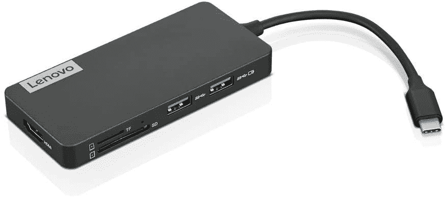

# 2023 年联想 ThinkPad X1 Carbon Gen 11 的最佳坞站

> 原文：<https://www.xda-developers.com/lenovo-thinkpad-x1-carbon-gen-11-docking-stations/>

# 2023 年联想 ThinkPad X1 Carbon Gen 11 的最佳坞站

想在联想 ThinkPad X1 Carbon Gen 11 上扩展端口吗？看看这些迅雷或 USB 坞站。

ThinkPad X1 Yoga(第 7 代)

相比其他许多[联想笔记本电脑](https://www.xda-developers.com/best-lenovo-laptops/)，面向商务用户的 ThinkPad 阵容的强项一直是端口选择。这就是为什么即将推出的 [ThinkPad X1 Carbon Gen 11](https://www.xda-developers.com/lenovo-thinkpad-x1-carbon-gen-11/) 具有过多端口的原因，包括 Thunderbolt 4、USB-A、耳机插孔和 HDMI。但如果你想要更多，也许是 VGA 端口，以太网端口，或用于连接其他附件的显示端口，那么坞站将是必须的。只需将它插入正确的端口并开始连接。

随着 [ThinkPad](https://www.xda-developers.com/best-thinkpads) 如此受欢迎，当然有很多坞站选项。联想生产 Thunderbolt 4 坞站，但惠普、Razer、CalDigit、Anker 和许多其他品牌也生产 Thunderbolt 4 坞站。这九个选项中的一个可能正是你所需要的！

*   ##### 联想 ThinkPad Universal Thunderbolt 4 Dock

    这是联想 ThinkPad X1 Carbon Gen 11 的事实上的 Dock。它由联想制造，可以为你提供多个额外的 USB 端口和多个显示输出，以及高达 100W 的笔记本电脑充电功率。

    T13
*   ##### CalDigit TS4 Thunderbolt 4 Dock

    CalDigit 的 TS4 Thunderbolt 4 Dock 是另一种用于 ThinkPad X1 Carbon Gen 11 等 Windows 电脑的流行坞站。它很贵，但你会得到 18 个配件端口，高达 98W 的功率，和一个优质的铝制外壳。

*   ##### 联想迷你坞站

    这与其说是一个坞站，不如说是一个加密狗，但它非常适合在旅途中添加端口。尽管它很小，但你仍然可以获得 HDMI、VGA、USB-C、USB 3.1、USB 2、3.5 毫米音频和以太网端口。

*   <picture></picture>

    CalDigit Element Hub

    ##### CalDigit Element Thunderbolt 4 Dock

    这个来自 CalDigit 的可逆 Dock 比我们前面提到的 TS4 要紧凑一点。它可以更好、更平地放在桌子上，并为你的 ThinkPad X1 Carbon Gen 11 增加了 USB-A 和 Thunderbolt 4 端口。

    T34
*   ##### 惠普 Thunderbolt Dock G4

    我们为联想的产品推荐惠普 Dock 可能看起来很奇怪，但惠普 Thunderbolt Dock G4 很受使用 Windows 笔记本电脑的人的欢迎。您可以获得 DisplayPort 1.4、HDMI 2.0 和高达 120W 的功率。该坞站还可以为多达四台 4K 外部显示器供电。

*   <picture></picture>

    联想 USB-C 7 合 1 集线器

    ##### 联想 USB-C 7 合 1 集线器

    这款小巧的 7 合 1 集线器为您的 ThinkPad X1 Carbon Gen 11 增加了 7 个额外的端口。你会得到一些额外的 USB-A 端口，HDMI 和读卡器。甚至还支持直通充电。

*   ##### Anker 扩展坞

    从 Anker 开始用这个扩展坞不会错的。您的 ThinkPad X1 Carbon Gen 11 有 13 个额外的端口，包括 USB-A、USB-C、以太网和读卡器。你甚至可以给你的笔记本电脑充电。

    T34
*   <picture></picture>

    雷蛇迅雷 4 Dock

    ##### 雷蛇迅雷 4 Dock Chroma

    这款雷蛇迅雷 4 Dock 是为关心 RGB 灯光的人准备的。它可能不适合商业设置，但是如果你喜欢 RGB 效果并且需要额外的 10 个端口，这是你的一个选择。它配有 SD 读卡器、3.5 毫米音频插孔、Thunderbolt 4 端口等。

*   ##### Anker 777 霹雳 4 坞

    我们最后挑的是 Anker 777 霹雳 4 坞。这个坞站有金属外壳，绝对是高级的。你还会得到两个额外的 HDMI 端口，两个 Thunderbolt 4 端口，3.5 毫米音频和读卡器。

就这样，我们的列表结束了。我们希望您找到了适合 ThinkPad X1 Carbon Gen 11 的坞站。有许多选项，但所有这些产品都添加了您可能需要的额外端口。不过，在所有选择中，我们强烈建议选择联想 ThinkPad Universal Thunderbolt 4 坞站，因为它直接来自联想，但像 CalDigit TS4 这样的第三方选项也一样好，并且带有更多端口。当然，如果那些太贵，那么联想 Mini Dock 或联想 USB-C 7-in-1 Hub 都没有问题。