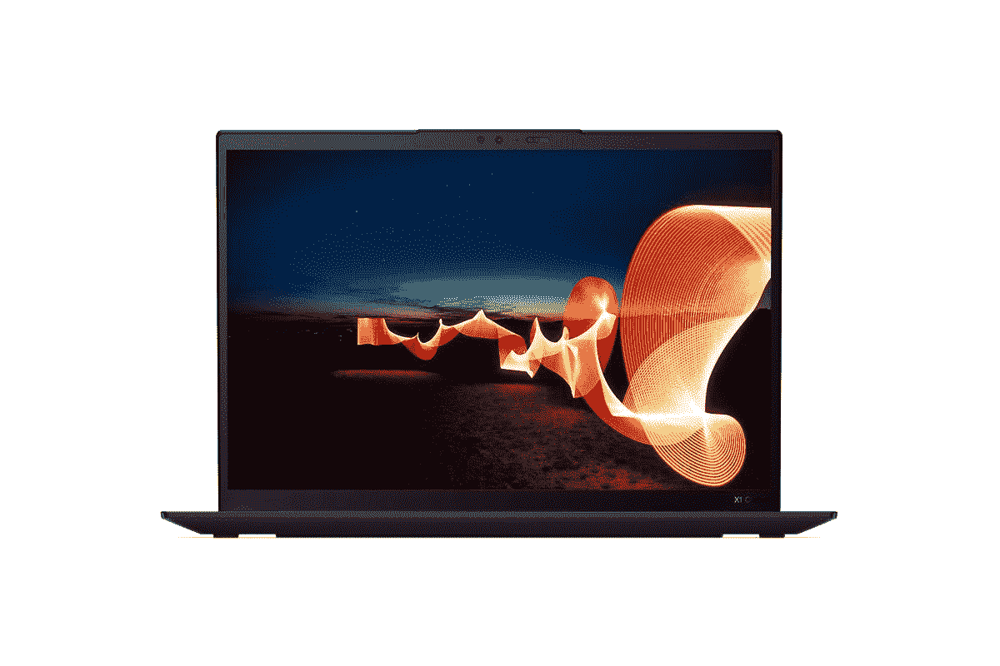

# 联想 ThinkPad X1 Carbon 保修好吗？

> 原文：<https://www.xda-developers.com/lenovo-thinkpad-x1-carbon-warranty/>

一般来说，产品保证是非常重要的。即使在电子产品类别之外，保修也证明了特定公司对其产品的充分信任。保修服务对于确保您不会因硬件或软件故障而损失投资非常重要。幸运的是，所有笔记本电脑都有限时保修，以确保你的设备在出现问题时得到维修甚至更换。

## 联想 ThinkPad X1 Carbon Gen 10 保修

ThinkPad X1 Carbon Gen 10 还附带一年保修。这种有限时间保修涵盖了车厂和送修服务，这是美国大多数消费品的标准。只要你有购买凭证，该公司就可以非常容易地要求对笔记本电脑进行保修。如果您认为一年有限保修不够，您还可以将其延长至五年。

除了延长有限时间保修之外，您还可以升级到现场支持或选择高级支持，以优先获得某些部件。在联想 ThinkPad X1 Carbon Gen 10 笔记本外壳中，您可以将保修延长至长达五年。当然，你将不得不在笔记本电脑的原始成本上花费更多，但我们认为它值得购买，尤其是考虑到你在笔记本电脑上花了多少钱。

除了延长保修期，联想还提供意外损坏保护(ADP ),以涵盖您的 ThinkPad 的意外损坏费用。如果你想知道，意外损坏保护(ADP)是一种固定成本、固定期限的保护计划，可将意外维修的成本降至最低。这是一个完全可选的计划，您可以选择在任何时候为您的笔记本电脑购买。

联想还提供额外的“卓越支持”服务，让您可以直接联系工程师，帮助您解决笔记本电脑的任何问题。这是您可以为您的机器选择的另一项可选服务。

回到手头的主要问题，联想 ThinkPad X1 Carbon Gen 10 开箱后提供一年保修。这更符合你在美国和其他一些市场的大多数笔记本电脑。如果您认为一年的保修期不够，您可以选择支付更多费用并延长保修期。

 <picture></picture> 

Lenovo ThinkPad X1 Carbon Gen 10

##### 联想 ThinkPad X1 碳第 10 代

联想 ThinkPad X1 Carbon Gen 10 开箱即可享受一年有限保修。

* * *

点击了解有关联想 ThinkPad X1 Carbon Gen 10 保修[的更多信息。](https://shop-links.co/link/?exclusive=1&publisher_slug=xda&article_name=Does+the+Lenovo+ThinkPad+X1+Carbon+have+a+good+warranty%3F&article_url=https%3A%2F%2Fwww.xda-developers.com%2Flenovo-thinkpad-x1-carbon-warranty%2F&u1=UUxdaUeUpU40724&url=https%3A%2F%2Fwww.lenovo.com%2Fus%2Fen%2Fp%2Flaptops%2Fthinkpad%2Fthinkpadx1%2Fthinkpad-x1-carbon-gen-10-14-inch-intel%2Flen101t0009)