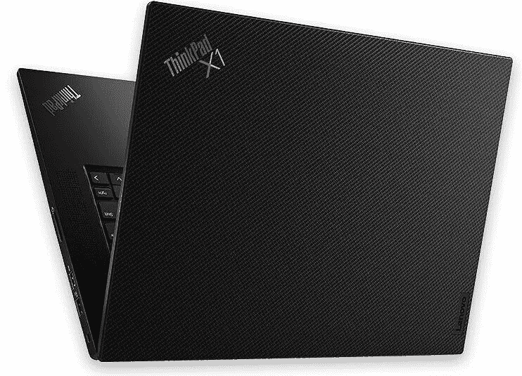

# 联想 ThinkPad X1 Extreme Gen 4 评测:将功率调高至 3080

> 原文：<https://www.xda-developers.com/lenovo-thinkpad-x1-extreme-gen-4-review/>

联想的新 ThinkPad X1 Extreme Gen 4 比 Gen 3 更强大。说真的，这次不仅仅是规格提升。X1 Extreme 旨在成为联想 X1 家族的高级成员，但它也是第一款配备强大 H 系列处理器和专用显卡的产品。但由于它仍在努力变得轻薄，它所能获得的力量是有限的。

随着第四代的出现，事情发生了变化。图形一直到现在的 NVIDIA GeForce RTX 3080，所以为了达到这一目标，必须完成一些工程设计。这也不全是新的，因为 ThinkPad X1 Extreme Gen 4 配备了 16:10 显示屏、第 11 代英特尔处理器等。

**浏览此评论:**

### 联想 ThinkPad X1 Extreme Gen 4 规格

| 

中央处理器

 | 英特尔酷睿 i7-11800H(2.3Ghz) |
| 

制图法

 | 英伟达 GeForce RTX 3060 |
| 

身体

 | 14.15 英寸 x 9.99 英寸 x 0.7 英寸(359.5 毫米 x 253.8mm 毫米 x 18.2mm 毫米)，3.99 磅(1.81 千克) |
| 

显示

 | 16 英寸(16:10) WQXGA (2560x1600) IPS 防眩光- 400 尼特 |
| 

记忆

 | 1x16GB (DDR4 3200) |
| 

储存；储备

 | 512GB 固态硬盘 M.2 2280 PCIe 4.0x4 性能 NVMe Opal2 |
| 

港口

 | 1 个 USB 3.2 Gen 11 个 USB 3.2 Gen 1(始终开启)2 个 Thunderbolt 4/USB 4 40 Gbps(支持数据传输、电源传输 3.0 和 display port 1.4)1 个 SD 卡读卡器 1 个耳机/麦克风组合插孔(3.5 毫米)1 个电源连接器可选:1 个 Nano-SIM 卡插槽(WWAN 型号)、1 个 HDMI 2.0(带有集成显卡的型号)、1 个 HDMI 2.1(带有独立显卡的型号) |
| 

照相机

 | 红外照相机和 FHD 1080p 照相机，定焦 |
| 

键盘

 | 6 排防溅多媒体 Fn 键，带统一通信控制、LED 背光跟踪点指示设备和玻璃表面多点触控触摸板 |
| 

声音的

 | 2W x 2 立体声扬声器、杜比全景声扬声器系统、双远场麦克风 |
| 

安全性

 | 开机密码、硬盘密码、管理员密码、安全钥匙孔独立 TPM 2.0、TCG 认证、可选英特尔博锐技术 |
| 

电池

 | 90 瓦时，支持 135 瓦交流适配器快速充电 |
| 

颜色

 | 黑色 |
| 

材料

 | 显示屏盖:碳纤维(黑色或编织图案)+ PC + PPS 混合底部:铝+ PC / ABS |
| 

价格

 | $2,497 |

## 设计:ThinkPad X1 Extreme Gen 4 是一样的，但也完全不同

联想 ThinkPad X1 Extreme 已经完全重新设计。机箱进行了更改，为 16:10 屏幕腾出了空间，内部也进行了重新设计，以允许将 NVIDIA GeForce RTX 3080 装入此尺寸的笔记本电脑所需的热量。但是如果你把第三代和第四代的型号放在一起看，你可能会分不清哪个是哪个，除非你去寻找。

联想的[ThinkPad](https://www.xda-developers.com/best-thinkpads/)有一个标志性的设计。如果你看到一个，你知道它是什么。这是一款全黑色的方形笔记本电脑，尽管它也有黑色编织碳纤维外观。虽然事情发生了变化，但这款设备的手感并没有改变。这就是 ThinkPad 的方式。事情的变化非常缓慢，重点是构建质量。

联想发给我的型号是平面黑色，当然，它在顶角有高级 ThinkPad 标志。这是一个有光泽的黑色，而不是扁平的银色。它是为 X1 和 P1 系列保留的。

联想的 ThinkPads 有标志性的设计。

它有大量的端口，这使得一些有趣的用例，再加上权力。在左侧，有两个 Thunderbolt 4 端口，以及 HDMI 2.1、3.5 毫米音频插孔和交流电源端口。我相信这是我在笔记本电脑上看到的第一个 HDMI 2.1 端口，非常酷。当然，虽然这意味着你可以连接 8K 显示器或类似的东西，但你也可以用任何一个 Thunderbolt 端口做同样的事情。

值得注意的是，笔记本电脑确实可以通过 Thunderbolt 端口充电，尽管不是由内置充电器提供的 230W(第三代为 135W)。我使用联想 ThinkPad X1 Extreme Gen 2 的大部分时间都是将它连接到一个带有双显示器的基座上，这样就可以毫无问题地保持充电。当你启动电脑时，它确实会发出可怕的警告，说充电器供电不足，但在正常工作负载下似乎可以正常工作。

右侧有一个全尺寸 SD 读卡器和两个 USB 3.2 Gen 1 Type-A 端口。这显然可以让你插入鼠标等外围设备，但它让游戏变得有趣，因为许多游戏配件仍然使用 USB Type-A。这台机器肯定足够强大，至少可以玩休闲游戏。

联想 ThinkPad X1 Extreme Gen 4 由碳纤维、聚碳酸酯和铝的组合制成。它类似于 ThinkPad X1 Carbon，但更大，重量为 3.99 磅。对于这种强大的东西来说，这是超轻的，而且真的很酷。

## 显示器:ThinkPad X1 Extreme Gen 4 的屏幕大了很多

在新的联想 ThinkPad X1 Extreme 上，屏幕要大得多。它现在是 16 英寸而不是 15.6 英寸，但纵横比是 16:10 而不是 16:9，使它更高。屏幕是按对角线测量的，所以考虑到长宽比的变化，额外的 0.4 英寸意味着很多。

联想曾经告诉我，这个团队认为 [16:10 是笔记本电脑](https://www.xda-developers.com/lenovo-thinkpad-x1-titanium-nano-interview/)的完美宽高比。我们一直使用 16:9 的唯一原因是因为这是高清时代使用的宽高比。电视时间是 16:9，监视器紧随其后。16:10 更高，提供了更多的屏幕空间，在整个行业中越来越受欢迎。

联想发给我的是 2，560x1，600 型号，它位于中间，因为它也提供 UHD+选项，支持杜比视觉。正如你所看到的，它有一个非常坚实的色域，支持 100% sRGB，78% NTSC，83% Adobe RGB 和 84% P3。

根据我的测试，屏幕比广告中的 400 尼特更亮，这非常酷。除此之外，这里真的没有任何惊喜。

在顶部挡板中，你会发现一个 1080p 网络摄像头，这总是很好。事实上，它甚至不包括在一些当前的 ThinkPad X1 笔记本电脑中，所以这是值得注意的。事实上，许多笔记本电脑仍然配备 720p 网络摄像头，如果你碰巧在家工作，这是一个真正的痛点。

## 键盘:联想 ThinkPad X1 Extreme Gen 4 拥有 1.8 毫米的按键

联想的 ThinkPad 以键盘质量著称，ThinkPad X1 Extreme Gen 4 也不例外。键盘是准确的，但从我的使用体验来看，1.8mm 有点深，公司不喜欢在键盘上做大的改变，现在真的感觉有点过时了。

我还知道，联想的 ThinkPad 团队非常关注按一个键需要多大的压力。例如，如果您使用 ThinkPad X1 Titanium Yoga 上的 1.35 毫米按键，ThinkPad X1 Carbon 上的 1.5 毫米键盘，或者 ThinkPad X1 Extreme 上的 1.8 毫米键盘，感觉应该基本相同。

我只是不认为有关系。如果离开 ThinkPad 生态系统，找到一台 1.8mm 键盘的笔记本电脑其实很有挑战性。其他的就浅多了。

当然，臭名昭著的 TrackPoint 仍然存在。我认为联想保留这些是有原因的，而惠普和戴尔只在特定范围的商用笔记本电脑上保留这些。十几个型号的每一台 ThinkPad 都配有一个跟踪点。它只是一个让你控制指针的小块。

这也是为什么触摸板虽然可以点击，但上面有物理按钮。尽管我使用触摸板而不是 TrackPoint，但我仍然喜欢那些物理按钮。

总的来说，联想 ThinkPad X1 Extreme Gen 4 的键盘非常出色。它只是特别深，让它感觉过时了。

右上角还有一个电源按钮，可以兼作指纹传感器。它实际上是在你第一次按下它的时候扫描你的指纹，这样你就不用在它启动后再按了。

键盘旁边还有扬声器，从上图可以看出。向你开火，他们听起来很棒。

## 性能:英特尔老虎湖 H 和 RTX 图形

是的，ThinkPad X1 Extreme 采用了新的设计，而且屏幕更大，采用了新的宽高比。然而，对我来说，最大的变化是规格凸起。它配备了英特尔的第 11 代 H 系列处理器，联想发给我的是酷睿 i7-11800H。更重要的是，它配备了高达 NVIDIA GeForce RTX 3080。

请注意，这仍然不是一台游戏 PC。它没有 TDP 或热气流。当然，有了 45W 处理器和 RTX 显卡，你完全可以玩游戏。我只是不想让你有错误的印象，因为游戏笔记本电脑确实配备了 45W 处理器和 RTX 3080 显卡。但是那些更厚，更重，更有力。

将 RTX 3080 放在像 ThinkPad X1 Extreme 这样的机器上，真的是改变了游戏规则。

把这个想象成一台[创造性工作的机器](https://www.xda-developers.com/best-creator-laptops/)。在 ThinkPad X1 Extreme 出现之前，没有屏幕大于 14 英寸的高端 ThinkPad，也没有任何*ThinkPad 拥有 45W 处理器和专用显卡。该团队真的全力以赴，创造了一个强大的机器，也适合在一个约四磅重的底盘。*

但在过去，X1 Extreme 与 NVIDIA GeForce GTX 1650 或之前的 GTX 1050 类似。这是我们第一次在 X1 Extreme 上看到 RTX 图形，非常酷。

从内部来看，要实现这一目标，需要做出很多改变。风扇不一样，它们实际上是通过键盘吸入空气，然后从通风口排出。

对于基准测试，我使用了 PCMark 8、PCMark 10、3DMark、Geekbench、Cinebench 和 VRMark。

|  | 

ThinkPad X1 Extreme Gen 4 core i7-11800h，RTX 3060

 | 

ThinkPad X1 Extreme Gen 3 core i7-10850h，GTX 1650 Ti

 | 

[联想军团 7 Slim](https://www.xda-developers.com/lenovo-legion-slim-7-review/) 锐龙 7 5800H，RTX 3060

 | 

[戴尔 XPS 17 9710](https://www.xda-developers.com/dell-xps-17-9710-review/) 酷睿 i7-11800H，RTX 3060

 |
| --- | --- | --- | --- | --- |
| 

PCMark 8:主页

 | 4,241 | 3,258 | 5,322 | 4,037 |
| 

PCMark 8:创意

 | 6,110 | 4,526 | 6,223 | 6,100 |
| 

PCMark 8:工作

 | 3,919 | 3,161 | 4,504 | 3,564 |
| 

PCMark 10

 | 6,403 | 4,968 | 6,428 | 6,379 |
| 

3DMark:时间间谍

 | 6,871 | 3,618 | 8,316 | 7,158 |
| 

极客工作台

 | 1,520 / 7,371 |  | 1,446 / 7,335 | 1,561 / 8,775 |
| 

电影院长凳

 | 1,516 / 11,232 |  | 1,415 / 11,833 | 1,515 / 11,652 |
| 

橙色

 | 8,563 | 4,427 | 9,012 | 9,194 |
| 

VRMark:青色

 | 2,754 |  | 6,114 | 2,752 |
| 

VRMark:蓝色

 | 2,325 |  | 1,928 | 2,152 |

至于电池寿命，考虑到强大的硬件，这是相当令人印象深刻的。在中等亮度下，打开推荐设置的电源，我可以持续使用五到六个小时。

## 结论:该不该买联想 ThinkPad X1 Extreme Gen 4？

我很想告诉你，这里发生了一些激进和令人惊讶的事情，但这不是 ThinkPad 品牌的意义所在(嗯，[在很大程度上是](https://www.xda-developers.com/lenovo-thinkpad-x1-fold-hands-on/))。ThinkPad 代表质量，在绝大多数设备上，它不会试图修复没有坏的东西。所以，是的，你仍然可以得到深键盘，跟踪点，等等。

这是一台伟大的机器。正如我之前所说，对我来说，最大的升级是你现在可以获得高达 NVIDIA GeForce RTX 3080 GPU。现在，你可以买到配备 RTX 3050 Ti 的戴尔 XPS 15，也可以买到配备 RTX 3060 的戴尔 XPS 17。将它们视为相互竞争的设备，这是一件大事。

但这还不是全部。它有 QHD 和 UHD 供应的 16 英寸 16:10 杜比视觉显示器，还有 1080p 网络摄像头。它为一台优秀、强大的机器检查所有正确的框。

 <picture></picture> 

Lenovo ThinkPad X1 Extreme Gen 4

##### 联想 ThinkPad X1 至尊第四代

ThinkPad X1 Extreme 集强大和高端于一身，提供高达 RTX 3080 GPU 和更多功能