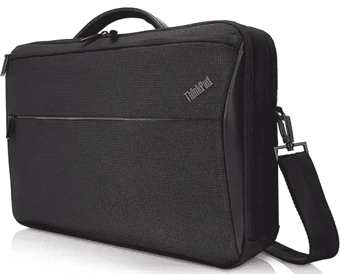
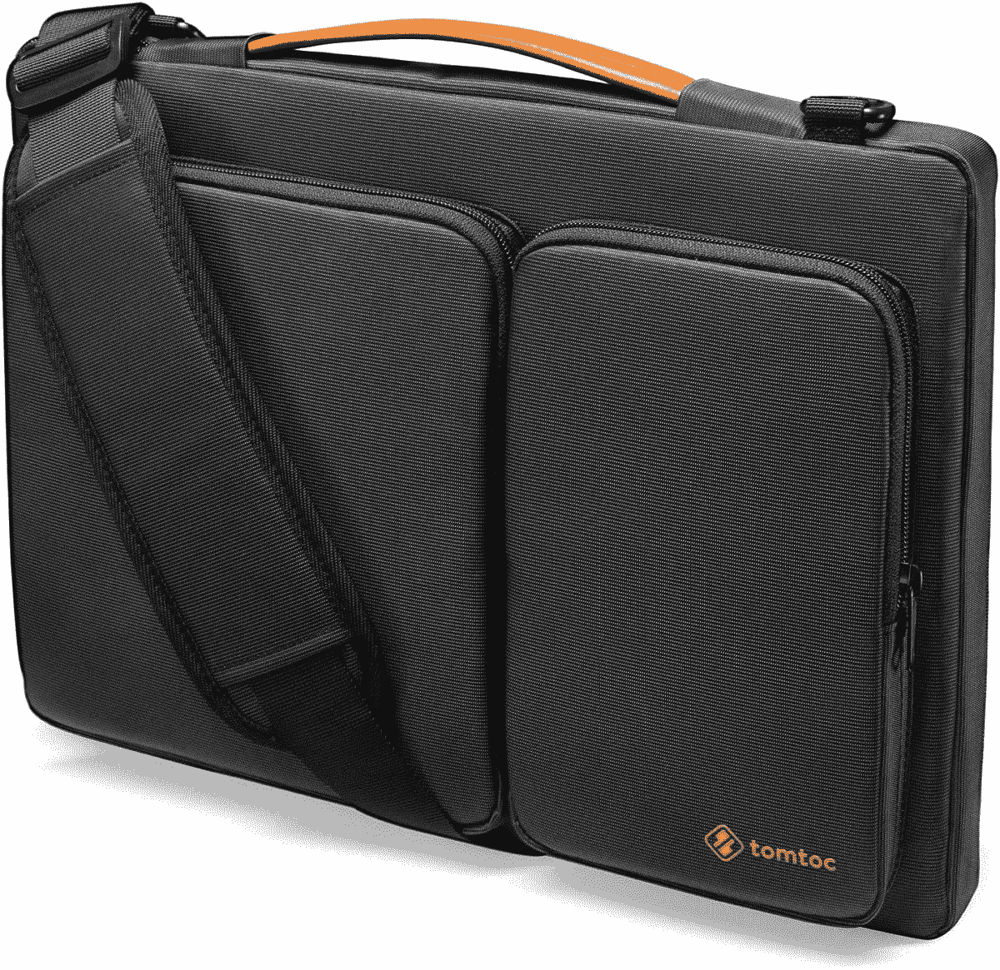
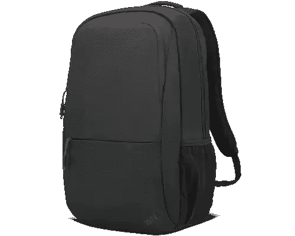

# 联想 ThinkPad X1 Extreme Gen 5 的最佳案例

> 原文：<https://www.xda-developers.com/lenovo-thinkpad-x1-extreme-gen-5-cases/>

[联想 ThinkPad X1 Extreme Gen 5](https://www.xda-developers.com/lenovo-thinkpad-x1-extreme-gen-5-review/) 是联想[最好的 ThinkPad](https://www.xda-developers.com/best-thinkpads/)之一，也是最昂贵的一款。包装强大的规格，包括第 12 代英特尔酷睿 H 系列处理器，Nvidia GeForce RTX 显卡和一些奇妙的显示选项，这是一款价格相称的笔记本电脑。当你花这么多钱的时候，你想要的是能持续很长时间的东西。因此，如果你想确保你的联想 ThinkPad X1 Extreme 尽可能长时间地使用，你会想要购买一个外壳。

我们是来帮你的。我们已经收集了您可以为联想 ThinkPad X1 Extreme 购买的最佳包包，无论您是需要时尚低调的包包，还是更多功能的包包。这是一款相对较大的笔记本电脑，因此找到一个合适的包可能比其他型号更困难，但这里有一些你可以找到的最佳选择。

*   <picture></picture>

    Inateck 笔记本电脑套

    ##### Inateck 笔记本电脑套

    如果你正在寻找一个稍微苗条一点并且具有不同外观的东西，这款 Inateck 套是一个很好的替代选择它有一个小侧袋，用于存放额外物品，还有一个双色设计，放在哪里都好看。它还有很多填充物，而且防水。

*   <picture></picture>

    DOMISO 笔记本电脑保护套

    ##### DOMISO 防震笔记本电脑保护套

    如果您的笔记本电脑往往会遭受一些较硬的跌落和碰撞，像这样的硬壳保护套可能是您的理想选择。坚硬的外壳可以承受打击，保护您的笔记本电脑安全，而不会过于笨重。这种材料也是防水的。

*   <picture></picture>

    Ytonet 笔记本电脑套

    ##### Ytonet 笔记本电脑套

    这款来自 Ytonet 的笔记本电脑套看起来相当简单，但它使用了多层保护来保护您的笔记本电脑安全，并且它在内部有一些额外的空间来放置附件。如果你想要不同的东西，它还有几种颜色可供选择。

*   <picture></picture>

    ThinkPad Professional top load Case

    ##### 联想 ThinkPad Professional top load Case

    如果你需要用你的 ThinkPad X1 Extreme 携带大量额外物品，这款来自联想的 Case 就是为你准备的。这是一个大袋子，有大量的空间来存放配件和优质材料。它花费相当多，但是这是旅行的一个伟大的选择。

*   <picture></picture>

    Tomtoc 360 笔记本电脑套

    ##### Tomtoc 360 防护型笔记本电脑单肩包

    这款 Tomtoc 套是一个很棒的选择，原因有很多。首先，两个外部口袋为您提供了大量的配件空间。此外，这款保护套有多层保护，包括加固的边角和大量减震填料。

*   <picture></picture>

    deal case 笔记本电脑套

    ##### deal case 笔记本电脑套

    如果你打算用笔记本电脑携带配件，这款套是一个不同的选择，它为你提供了一个单独的配件袋。笔记本电脑套本身提供了坚实的保护和防水，而袋子可能是一种更容易的方式来组织您的项目。

*   <picture></picture>

    Casematix 笔记本电脑硬套

    ##### Casematix 笔记本电脑硬套

    没有多少人会需要这个，但 Casematix 笔记本电脑硬套是一个又大又重的箱子，有坚硬的外壳和数吨泡沫填充物，您可以添加或移除以适应不同的笔记本电脑并获得更多保护，此外它还具有防水功能。如果你需要极端的保护，这就是它。

*   <picture></picture>

    ThinkPad 必备双肩包

    ##### 联想 ThinkPad 必备双肩包

    拿在手里的情况下可能会管用一些，但有时候，双肩包更容易携带。这款笔记本保留了标志性的 ThinkPad 外观，为您的笔记本电脑留出了空间，并配有多个口袋，包括一个水瓶架。

如果你想保护你的联想 ThinkPad X1 Extreme Gen 5 免受跌落、碰撞等影响，这些是你今天可以找到的一些最佳案例。有很多种类，谢天谢地，找到保护你的笔记本电脑安全的方法并不太难。其中，我个人最喜欢的可能是 Tomtoc 套，因为它为配件提供了足够的保护和空间，同时又不牺牲美观。不过，如果你喜欢 ThinkPad 的经典外观，联想的官方包包一定会非常适合你。

如果你还没有，你可以使用下面的链接购买联想 ThinkPad X1 Extreme Gen 5。联想的网站允许您从一些预设配置中进行选择，或者配置您自己的配置，以便您可以充分利用您的新笔记本电脑。不过，如果你觉得这不适合你，那就去看看今天你能买到的最好的联想笔记本电脑，或者 T2 最好的笔记本电脑，看看其他公司的一些选择。