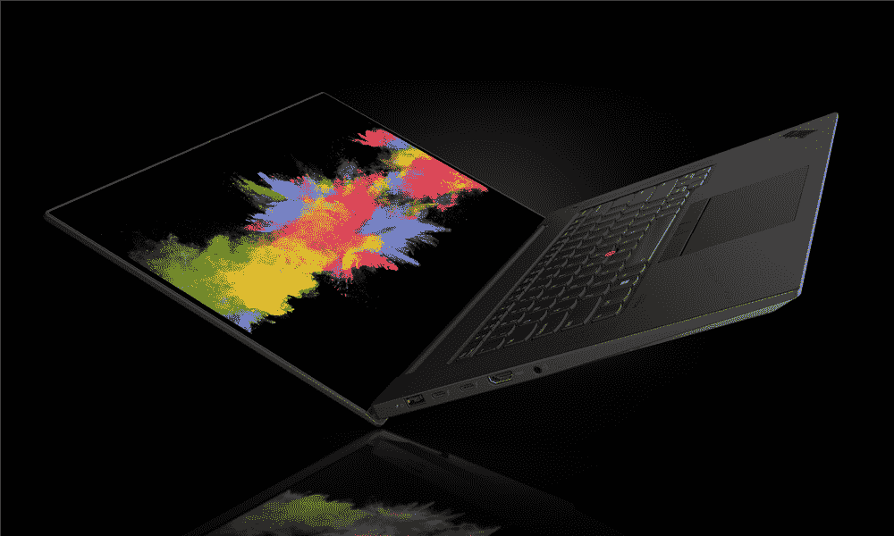
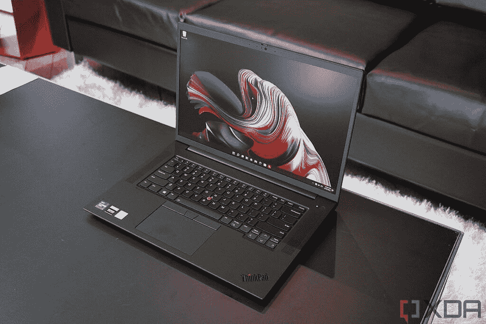
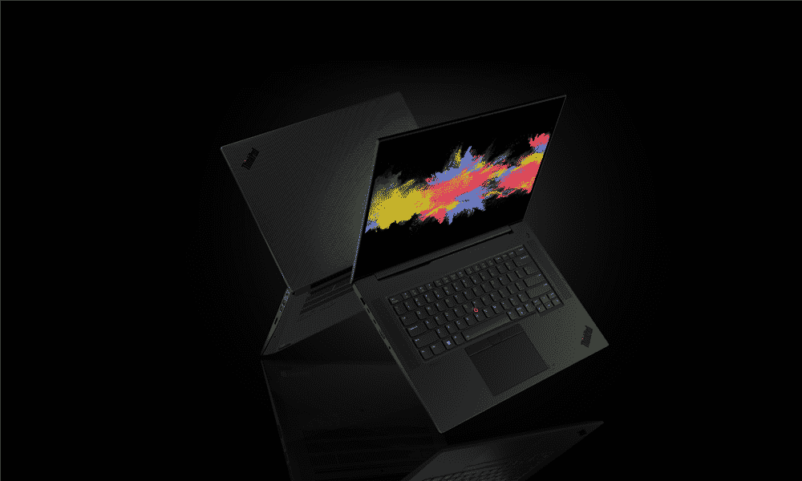
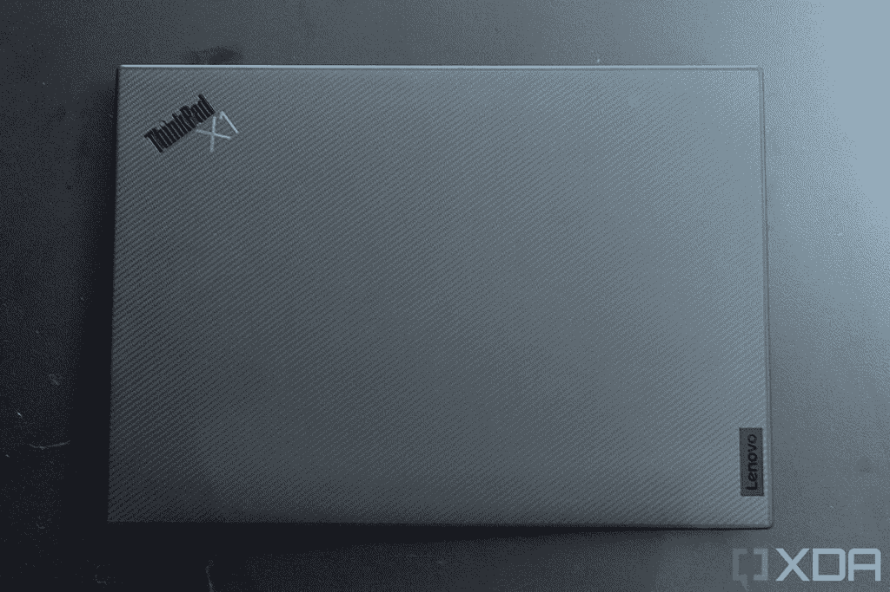
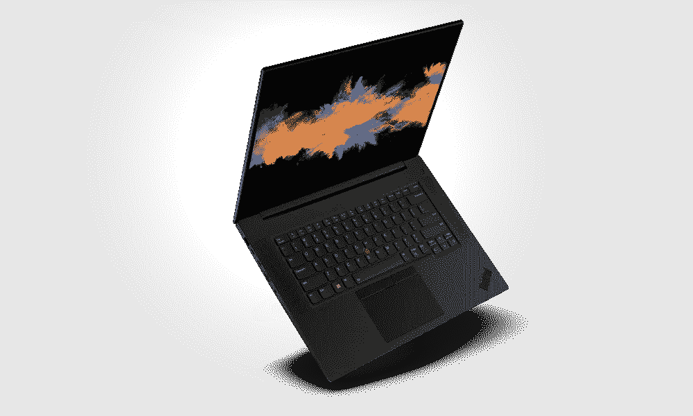

# 联想 ThinkPad X1 Extreme Gen 5 vs ThinkPad P1 Gen 5

> 原文：<https://www.xda-developers.com/lenovo-thinkpad-x1-extreme-gen-vs-thinkpad-p1-gen-5/>

联想制造了许多优秀的笔记本电脑，尤其是 T4 ThinkPad 品牌的 T2 商务笔记本电脑。但是，即使这个品牌特别专注于商业，也有很多设备是它的一部分，从轻薄的笔记本电脑到功能齐全的工作站。如果你想要更强大的东西，仍然有很多选择，如联想 ThinkPad X1 Extreme Gen 5 和 ThinkPad P1 Gen 5。如果你发现自己在这两者之间犹豫不决，我们会帮助你。

首先，值得澄清的是，这些笔记本电脑非常相似。以至于联想为这两款设备提供了单一的硬件维护手册。因此，在设计甚至规格方面，差异非常小。尽管如此，让我们仔细看看。

**浏览本文:**

## 联想 ThinkPad X1 Extreme Gen 5 与 ThinkPad P1 Gen 5:规格

|  | 

联想 ThinkPad X1 Extreme Gen 5

 | 

联想 ThinkPad P1 第五代

 |
| --- | --- | --- |
| **操作系统** |  | 

*   Windows 11
*   人的本质
*   一种男式软呢帽
*   红帽企业

 |
| **CPU** | 

*   英特尔酷睿 i7-12700H (14 个内核，20 个线程，最高 4.7GHz，24MB 高速缓存)
*   英特尔酷睿 i7-12800H 博锐处理器(14 个内核，20 个线程，最高 4.8GHz，24MB 高速缓存)
*   英特尔酷睿 i9-12900H 博锐处理器(14 个内核，20 个线程，最高 5GHz，24MB 高速缓存)

 | 

*   英特尔酷睿 i7-12700H (14 个内核，20 个线程，最高 4.7GHz，24MB 高速缓存)
*   英特尔酷睿 i7-12800H 博锐处理器(14 个内核，20 个线程，最高 4.8GHz，24MB 高速缓存)
*   英特尔酷睿 i9-12900H 博锐处理器(14 个内核，20 个线程，最高 5GHz，24MB 高速缓存)

 |
| **图形** | 

*   离散:
    *   NVIDIA GeForce RTX 3050 Ti(4GB gddr 6)
    *   英伟达 GeForce RTX 3060 (6GB GDDR6)
    *   NVIDIA GeForce RTX 3070 Ti(8GB gddr 6)
    *   英伟达 GeForce RTX 3080 Ti (16GB GDDR6)
*   集成:

 | 

*   离散:
    *   英伟达 RTX A1000 (4GB GDDR6，35W)
    *   英伟达 RTX A2000 8GB (8GB GDDR6，35W)
    *   英伟达 RTX A3000 12GB (12GB GDDR6 ECC，80W)
    *   英伟达 RTX A4500 (16GB GDDR6 ECC，80W)
    *   英伟达 RTX A5500 (16GB GDDR6 ECC，80W)
    *   NVIDIA GeForce RTX 3070 Ti(8GB gddr 6，80W)
    *   英伟达 GeForce RTX 3080 Ti (16GB GDDR6，80W)
*   集成:
    *   英特尔 Iris Xe 显卡/UHD 显卡

 |
| **显示** | 

*   16 英寸 16:10 全高清+ (1920 x 1200)，IPS，500 尼特，100% sRGB
*   16 英寸 16:10 四核高清+ (2560 x 1600)，IPS，400 尼特，100% sRGB，165 赫兹
*   16 英寸 16:10 超高清+ (3840 x 2400)，IPS，600 尼特，HDR400，100% Adobe RGB
*   16 英寸 16:10 超高清+ (3840 x 2400)，IPS，600 尼特，HDR400，100% Adobe RGB，触控

 | 

*   16 英寸 16:10 全高清+ (1920 x 1200)，IPS，500 尼特，100% sRGB
*   16 英寸 16:10 四核高清+ (2560 x 1600)，IPS，400 尼特，100% sRGB，165 赫兹
*   16 英寸 16:10 超高清+ (3840 x 2400)，IPS，600 尼特，HDR400，100% Adobe RGB
*   16 英寸 16:10 超高清+ (3840 x 2400)，IPS，600 尼特，HDR400，100% Adobe RGB，触控

 |
| **储存** | 

*   主 SSD:
    *   256GB PCIe 固态硬盘
    *   512GB PCIe 第四代高性能固态硬盘
    *   512GB PCIe 固态硬盘
    *   1TB PCIe 固态硬盘
    *   1TB PCIe 第四代高性能固态硬盘
    *   2TB PCIe 第四代高性能固态硬盘
    *   4TB PCIe 第四代高性能固态硬盘
*   辅助固态硬盘:
    *   256GB PCIe 固态硬盘
    *   512GB PCIe 固态硬盘
    *   1TB PCIe 固态硬盘
    *   1TB PCIe 第四代高性能固态硬盘
    *   2TB PCIe 第四代高性能固态硬盘
    *   4TB PCIe 第四代高性能固态硬盘

 | 

*   主 SSD:
    *   256GB PCIe 固态硬盘
    *   512GB PCIe 第四代高性能固态硬盘
    *   512GB PCIe 固态硬盘
    *   1TB PCIe 固态硬盘
    *   1TB PCIe 第四代高性能固态硬盘
    *   2TB PCIe 第四代高性能固态硬盘
    *   4TB PCIe 第四代高性能固态硬盘
*   辅助固态硬盘:
    *   256GB PCIe 固态硬盘
    *   512GB PCIe 固态硬盘
    *   1TB PCIe 固态硬盘
    *   1TB PCIe 第四代高性能固态硬盘
    *   2TB PCIe 第四代高性能固态硬盘
    *   4TB PCIe 第四代高性能固态硬盘

 |
| **RAM** | 

*   8GB DDR5 4800MHz
*   16GB DDR5 4800MHz
*   16GB (2 个 8GB) DDR5 4800MHz
*   32GB DDR5 4800MHz
*   32GB (2 个 16GB) DDR5 4800MHz
*   64GB (2 个 32GB) DDR5 4800MHz

 | 

*   8GB DDR5 4800MHz
*   16GB DDR5 4800MHz
*   16GB (2 个 8GB) DDR5 4800MHz
*   32GB DDR5 4800MHz
*   32GB (2 个 16GB) DDR5 4800MHz
*   64GB (2 个 32GB) DDR5 4800MHz

 |
| **电池** | 

*   90 瓦时电池，支持快速充电
    *   170 瓦/230 瓦充电器(取决于配置)

 | 

*   90 瓦时电池，支持快速充电
    *   135 瓦/170 瓦/230 瓦充电器(取决于配置)

 |
| **港口** | 

*   2 个 Thunderbolt 4(USB C 型)
*   2 个 USB Type-A (3.2 第 2 代)
*   HDMI 2.1
*   SD 读卡器(SD Express 7.0)
*   3.5 毫米组合耳机插孔
*   可选:Nano SIM 卡插槽

 | 

*   2 个 Thunderbolt 4(USB C 型)
*   2 个 USB Type-A (3.2 第 2 代)
*   HDMI 2.1(带有 Nvidia 显卡的型号上的 HDMI 2.0)
*   SD 读卡器(SD Express 7.0)
*   3.5 毫米组合耳机插孔
*   可选:Nano SIM 卡插槽

 |
| **音频** | 

*   2 个带杜比全景声的 2W 扬声器
*   2 个带杜比语音的远场话筒

 | 

*   2 个带杜比全景声的 2W 扬声器
*   2 个带杜比语音的远场话筒

 |
| **摄像机** | 

*   1080p 全高清+红外混合摄像头

 | 

*   1080p 全高清网络摄像头
*   1080p 全高清+红外摄像头

 |
| **Windows Hello** | 

*   红外网络摄像头
*   电源按钮中的指纹识别器

 | 

*   红外网络摄像头(可选)
*   指纹识别器电源按钮

 |
| **连通性** | 

*   英特尔 Wi-Fi 6E (2x2)，蓝牙 5.1
*   国家足球联盟
*   可选:5G Cat20 (Fibocom FM350-GL)

 | 

*   英特尔 Wi-Fi 6E (2x2)，蓝牙 5.1
*   国家足球联盟
*   可选:5G Cat20 (Fibocom FM350-GL)

 |
| **颜色** | 

*   黑色
    *   可选编织碳纤维盖

 | 

*   黑色
    *   可选编织碳纤维盖

 |
| **尺寸(WxDxH)** | 359.5 × 253.8 × 17.9 毫米(15.57 × 10 × 0.7 英寸) | **非触控:** 359.5 x 253.8 x 17.7 毫米(14.15 x 9.99 x 0.7 英寸)**触控:** 359.5 x 253.8 x 18.2 毫米(14.15 x 9.99 x 0.72 英寸) |
| **重量** | 起始重量为 1.88 千克(4.14 磅) | **非触控** **:** 起始重量 1.81 千克(3.99 磅)**触控:**起始重量 1.86 千克(4.1 磅) |
| **价格** | 起价 1，751.40 美元(各不相同) | 起价 2，059 美元(各不相同) |

## 性能:专业或 GeForce GPUs

你可能已经从上面的规格表中发现，联想 ThinkPad X1 Extreme Gen 5 和 ThinkPad P1 Gen 5 在性能方面几乎是一样的。它们有相同的英特尔处理器选项，尽管有一些差异值得指出。

 <picture></picture> 

Lenovo ThinkPad P1

由于联想 ThinkPad P1 是一个真正的工作站，它实际上配备了英伟达的专业 GPU，高达英伟达 RTX A5500。你仍然可以用高端 GeForce 卡获得它，但大多数频谱包括专业的 RTX 卡。在原始性能方面，英伟达 GeForce GPUs 和专业 GPU 没有什么不同——例如，英伟达 RTX A5500 和 GeForce RTX 3080 Ti 基于相同的 GPU。

一些专业 GPU 包括 ECC 内存。

然而，工作站 GPU 更适合计算、人工智能和其他类型的渲染等业务工作负载。一些专业 GPU 还包括纠错码(ECC)内存，可以帮助防止重要工作负载期间的崩溃和其他问题——以牺牲一些性能为代价。GeForce 卡针对游戏进行了更多优化，因此如果您想玩一些游戏，您可能会获得更好的体验。

另一个值得注意的区别是，在编写本文时，如果没有独立的 Nvidia 显卡，你就无法配置 ThinkPad X1 Extreme，而 ThinkPad P1 确实让你可以选择在某些配置中只使用英特尔 Iris Xe。这意味着，如果你使用 ThinkPad P1，你可以得到一台更专注于 CPU、耗电更少的机器，结果它实际上配备了一个更小的 135W 充电器。

 <picture></picture> 

Lenovo ThinkPad X1 Extreme

对于内存和存储，这两款笔记本电脑再次相同。两者都配备了高达 64GB 的 RAM 和类似的配置，以及跨两个 M.2 插槽的高达 8TB 的 SSD 存储。它们也有同样的限制，如果你使用两个 M.2 插槽，你就无法获得更强大的独立 GPU。在 ThinkPad X1 Extreme 上，你只能使用 GeForce RTX 3050 Ti，而在 ThinkPad P1 上，你最多只能使用英伟达 RTX A2000。

## 展示与设计

两台笔记本电脑之间的其他差异甚至更小。它们都提供了完全相同的显示器选项-16 英寸的面板，长宽比为 16:10，有全高清+、四高清+或超高清+分辨率。在这方面，或者在音频系统中，没有什么不同。

 <picture></picture> 

Lenovo ThinkPad P1

不过，网络摄像头的配置有一个小小的不同。联想 ThinkPad X1 Extreme Gen 5 始终包括一个支持 Windows Hello 的全高清红外网络摄像头，而 ThinkPad P1 则让您可以选择退出红外摄像头。

就设计而言，这两款笔记本电脑几乎完全相同。除了厚度和重量上的微小差异，这两款笔记本电脑在尺寸上是一样的。如果你想吹毛求疵，盖子上有一个微小的视觉差异。ThinkPad X1 Extreme 的 logo 上写着“ThinkPad X1”，而 ThinkPad P1 只写着“ThinkPad”，所以要干净一点。除此之外，颜色和材料都是一样的，如果您选择超高清+显示屏选项，两者的盖子上都有碳纤维编织图案。

 <picture></picture> 

Lenovo ThinkPad X1 Extreme

最后，就端口而言，这又是同一台笔记本电脑。两个 Thunderbolt 4 端口，两个 USB Type-A，HDMI，一个耳机插孔，一个 SD 读卡器，以及一个可选的 nano-SIM 卡插槽。唯一不同的是，如果你选择的是没有独立显卡的 ThinkPad P1，那么 HDMI 端口只支持 HDMI 2.0(60Hz 的 4K)，而有独立显卡的机型支持 HDMI 2.1。两款笔记本电脑都支持 NFC，不过 ThinkPad P1 提供了移除 NFC 的选项。两者的蜂窝连接支持(5G)也是可选的。

## 价格和最终想法

归根结底，最大的区别在于定价。联想 ThinkPad X1 Extreme 的起价远低于 ThinkPad P1，因此考虑到这两款笔记本电脑如此相似，它可能是许多人的显而易见的选择。

这里唯一的主要区别与 GPU 有关，这可能会也可能不会改变你的看法。ECC 内存是高端工作站中常见的一项功能，它基本上提供了一个防止错误的保护层，否则可能会导致崩溃。在商业环境中，可靠性极其重要，因此从长远来看，额外的成本可能是合理的。虽然值得一提的是，只有 GPU 内存支持 ECC，而不是一般的系统内存。

否则，这些笔记本电脑真的是一样的，如果你不认为你需要 ECC，你可能不需要。使用 ThinkPad X1 Extreme Gen 5 可以节省一些钱。无论你选择哪种方式，你都可以通过下面的链接买到这两款笔记本电脑。如果这两个都不是你喜欢的，也许可以看看[最佳联想笔记本电脑](https://www.xda-developers.com/best-lenovo-laptops/)来看看更多面向消费者的设备。

 <picture></picture> 

Lenovo ThinkPad X1 Extreme Gen 5

##### 联想 ThinkPad X1 Extreme Gen 5

联想 ThinkPad X1 Extreme Gen 5 是一款功能强大的商用笔记本电脑，采用英特尔 H 系列处理器和 NVIDIA GeForce RTX 显卡，可以处理要求苛刻的工作负载和游戏。

 <picture></picture> 

Lenovo ThinkPad P1

##### 联想 ThinkPad P1

联想 ThinkPad P1 是一款移动工作站，采用英特尔 H 系列处理器和英伟达 RTX GPU，并带有可选的 ECC 内存，可处理重要的业务工作负载。