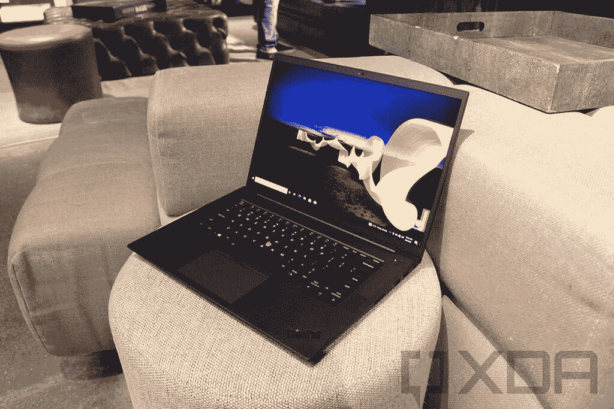
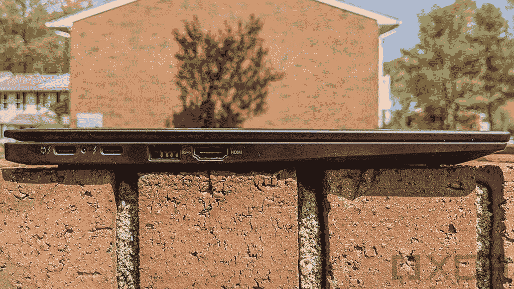

# 联想 ThinkPad X1 Extreme vs X1 Carbon:哪个适合你？

> 原文：<https://www.xda-developers.com/lenovo-thinkpad-x1-extreme-vs-carbon/>

联想是世界上最受欢迎的个人电脑制造商之一，该公司生产一些你能买到的最好的笔记本电脑。在商业用户中， [ThinkPad 家族](https://www.xda-developers.com/best-thinkpads/)尤其具有标志性。经典的柔和设计，红色的指点杆，这些都是它如此受欢迎的原因。但每台 ThinkPad 都有自己特定的用途，因此它们在某种程度上都有所不同。如果你无法在 ThinkPad X1 Extreme 和 X1 Carbon 之间做出选择，我们可以为你提供帮助。

我们将比较联想最强大的商用笔记本电脑 X1 Extreme 和最经典的 ThinkPad X1 Carbon。就像我们说的，每一款 ThinkPad 都是独特的，当我们了解它们之间的差异时，选择应该会变得非常清楚。

## 联想 ThinkPad X1 Extreme vs Carbon:规格

像往常一样，我们先来看看这两款笔记本电脑的规格。仅这一点就揭示了 X1 极端和 X1 碳之间的一些主要差异。

|  | 

联想 ThinkPad X1 至尊版

 | 

联想 ThinkPad X1 碳纤维

 |
| --- | --- | --- |
| **操作系统** | 

*   Windows 10 家庭版(可升级到 Windows 11)
*   Windows 10 专业版(可升级到 Windows 11)

 | 

*   Windows 10 家庭版(可升级到 Windows 11)
*   Windows 10 专业版(可升级到 Windows 11)
*   Fedora 33 工作站版
*   Ubuntu 20.04

 |
| **处理器** | 

*   英特尔酷睿 i7-11800H(最高 4.6GHz，8 核)
*   英特尔酷睿 i7-11850H 博锐处理器(最高 4.8GHz，8 核)
*   英特尔酷睿 i9-11950H 博锐处理器(最高 5GHz，8 核)

 | 

*   英特尔酷睿 i5-1135G7(最高 4.2GHz，四核)
*   英特尔酷睿 i5-1145G7 博锐处理器(最高 4.4GHz，四核)
*   英特尔酷睿 i7-1165G7(最高 4.7GHz，四核)
*   英特尔酷睿 i7-1185G7(最高 4.8GHz，四核)

 |
| **图形** | 

*   英特尔 UHD 显卡
*   NVIDIA GeForce RTX 3050 Ti 4GB GDDR6
*   英伟达 GeForce RTX 3060 6GB GDDR6
*   英伟达 GeForce RTX 3070 8GB GDDR6
*   英伟达 GeForce RTX 3080 16GB GDDR6

 |  |
| **闸板** | 

*   8GB
*   16GB
*   16GB (2x8GB)
*   32GB
*   32GB(2 个 16GB)
*   64GB

 |  |
| **存储** | 

*   插槽 1 (PCIe 第四代):
    *   256GB (PCIe 第三代)
    *   512GB (PCIe 第三代)
    *   512GB (PCIe 第四代)
    *   1TB(第三代 PCI3)
    *   1TB (PCIe 第四代)
    *   2TB (PCIe 第四代)
*   插槽 2 (PCIe 第三代，可选):
    *   256GB (PCIe 第三代)
    *   512GB (PCIe 第三代)
    *   1TB (PCIe 第三代)
    *   2TB (PCIe 第四代)

 |  |
| **显示** | 

*   16 英寸 WQXGA (2560 x 1600) IPS，防眩光，400 尼特
*   16 英寸超高清+ (3840 x 2400) IPS，防眩光，杜比视觉，HDR 400，600 尼特
*   16 英寸超高清+ (3840 x 2400) IPS，触摸，防反光，杜比视觉，HDR 400，600 尼特

 | 

*   14 英寸全高清+ (1920 x 1200) IPS，防眩光，低功耗，400 尼特
*   14 英寸全高清+ (1920 x 1200) IPS，触摸，防眩光，低功耗，400 尼特
*   14 英寸全高清+ (1920 x 1200) IPS，触摸，防眩光，低功耗，隐私保护，500 尼特
*   14 英寸超高清+ (3840 x 2400) IPS，HDT，500 尼特

 |
| **音频** | 

*   双立体声扬声器(2 个 2W)

 | 

*   四声道立体声扬声器(2 个 2W + 2 个 0.8 瓦)

 |
| **网络摄像头** |  |  |
| **生物认证** | 

*   指纹读取器
*   可选:红外摄像头

 | 

*   指纹读取器
*   可选:红外摄像头
    *   可选项:人体存在检测

 |
| **电池** | 

*   4 芯 90 瓦时电池
    *   长达 10 小时(MobileMark 18)

 | 

*   4 芯 57 瓦时电池
    *   长达 16.7 小时(MobileMark 18)

 |
| **港口** | 

*   2 个 Thunderbolt 4(USB C 类)端口
*   2 个 USB 3.2 第 1 代 A 类端口
*   HDMI 2.1 (2.0 适用于英特尔 UHD 显卡)
*   SD 读卡器
*   3.5 毫米耳机插孔
*   可选:SIM 卡插槽

 | 

*   2 个 Thunderbolt 4(USB C 类)端口
*   2 个 USB 3,2 第 1 代 A 类端口
*   HDMI 2.0
*   3.5 毫米耳机插孔
*   可选:nano SIM 卡插槽

 |
| **连通性** | 

*   英特尔 Wi-Fi 6/6E AX210 (2x2)，蓝牙 5.2
*   可选:5G(高通骁龙 X55，目前不提供)

 | 

*   英特尔 Wi-Fi 6 AX201，蓝牙 5.2
*   可选:4G LTE (Quectel EM120R-GL，第 12 类)
*   可选:5G(高通骁龙 X55)

 |
| **颜色** | 

*   黑色
*   黑色，带编织碳纤维罩

 | 

*   黑色
*   黑色碳纤维盖罩

 |
| **尺寸(WxDxH)** | 14.13 x 9.99 x 0.7 英寸(359.5 x 253.8 x 17.7 毫米) | 12.38 x 8.72 x 0.59 英寸(314.5 x 221.6 x 14.9 毫米) |
| **重量** | 起始重量为 3.99 磅(1.81 千克) | 起始重量为 2.49 磅(1.13 千克) |
| **起始价格** | 1 639.20 美元(各不相同) | 1 401.60 美元(各不相同) |

## 操作系统

联想 ThinkPad X1 Extreme 和 X1 Carbon 之间的一个显著区别是，Carbon 可以在开箱后配置 Linux。由于 Linux 发行版通常是免费的，所以没有什么可以阻止你自己在 ThinkPad X1 Extreme 上安装它，但有了 X1 Carbon，你就可以获得联想的官方支持，而且你也不必经历自己安装它的麻烦。

如果你更喜欢 Windows 版本，这两款机型都将在 10 月 5 日推出后支持升级到 Windows 11。

## 性能:ThinkPad X1 Extreme 性能强劲

从上面的规格列表中可以明显看出，联想 ThinkPad X1 Extreme 无疑是这两款笔记本电脑中最强大的。名字不会说谎，ThinkPad X1 Extreme 在其纤薄的机箱中集成了令人难以置信的强大规格。这从英特尔的 45W Tiger Lake 处理器开始，一直到英特尔酷睿 i9-11950H。ThinkPad X1 Extreme 中的所有处理器都比 X1 Carbon 拥有更多的内核，而且它们的时钟速度也更快。

为了让您有个概念，下面是 X1 Carbon 上最好的 CPU 与 X1 Extreme 上最差的 CPU 的比较:

|  | 

英特尔酷睿 i7-1185G7

 | 

英特尔酷睿 i7-11800H

 |
| --- | --- | --- |
| Geekbench 分数(单核/多核) | 1,419 / 4,857 | 1,492 / 8,053 |

当然，当你考虑到 ThinkPad X1 Extreme 也有专用显卡时，这种差异会变得更大。不仅仅是任何专用显卡，你可以通过高达 NVIDIA GeForce RTX 3080 获得它，考虑到它的尺寸，这是令人难以置信的。这种规格组合意味着 ThinkPad X1 Extreme 除了轻松完成日常任务外，还可以处理从[视频编辑](https://www.xda-developers.com/best-laptop-for-video-editing/)到游戏的任何事情。如果你只是需要浏览网页、写文档和发送电子邮件，ThinkPad X1 Carbon 也很好。

这种规格组合意味着 ThinkPad X1 Extreme 除了轻松完成日常任务外，还可以处理从视频编辑到游戏的任何事情。

不出所料，内存和存储是 ThinkPad X1 Extreme 领先的另外两个领域。您可以为这台笔记本电脑配置高达 64GB 的内存，由于它使用 SODIMM 插槽，您可以在以后自己升级内存。同样，您可以为它配置多达两个固态硬盘，最大总存储容量为 4TB，或者您可以在以后升级它。此外，其中一个插槽支持 PCIe Gen 4，因此您可以为它配备超快固态硬盘。

然而，这里有一个很大的警告——如果你得到一个 NVIDIA GeForce RTX 3060 或更高的，你不能得到两个 SSD 插槽。NVIDIA 最新的 GPU 需要大量的电力和大量的冷却，所以如果你升级到更强大的型号，固态硬盘的空间就会被占用。尽管如此，你还是可以通过这种方式获得高达 2TB 的存储空间。

相比之下，ThinkPad X1 Carbon 可以配置高达 32GB 的内存和 1TB 的固态硬盘。那个 RAM 也是焊接上去的，所以你以后不能升级。现在，这远不是一个薄弱的配置，但如果你需要大量的内存来完成特定的任务或存储大量的大文件，ThinkPad X1 Extreme 是一个更好的选择。

 <picture></picture> 

Inside of a Lenovo ThinkPad X1 Extreme

ThinkPad X1 Carbon 领先于 X1 Extreme 的地方是电池寿命。根据 MobileMark 18 测试，即使使用小得多的电池，ThinkPad X1 Carbon 充电后也可持续使用 16.7 小时。这比 X1 Extreme 承诺的最长 10 小时有很大优势。为什么会发生这种情况并不神秘。凭借 45W 处理器和专用显卡，ThinkPad X1 Extreme 的功耗要高得多，它应该比 X1 Carbon 更稳定一些。

## 显示和声音

再来看显示器，第一个主要区别是尺寸。ThinkPad X1 Carbon 拥有 14 英寸的显示屏，而 X1 Extreme 拥有更大的 16 英寸面板。一些用户会喜欢额外的屏幕空间，但其他人可能更喜欢较小设备的便携性。这两款笔记本电脑的一个共同点是 16:10 的宽高比，这意味着与典型的 16:9 显示屏相比，你可以获得更大的表面积。像这样的高长宽比给你更多的空间来查看文本等内容或应用程序中的更多 UI 元素。

 <picture></picture> 

ThinkPad X1 Carbon

另一个很大的区别是分辨率，至少在基本型号中是这样。联想 ThinkPad X1 Extreme 拥有 WQXGA(或 Quad HD+)，而不是 X1 Carbon 的全高清+分辨率。Quad HD+无疑是笔记本电脑显示屏分辨率的最佳选择。它明显比全高清+更清晰，而且它增加的功耗几乎没有 4K 面板多。

然而，如果你想要 4K，你可以选择超高清+显示屏，X1 Extreme 和 X1 Carbon 都提供了升级。但这也带来了另一个不同之处 ThinkPad X1 Carbon 的超高清+显示屏不支持触摸，而 X1 Extreme 则可以作为一个选项。相反，X1 Extreme 在 Quad HD+型号中不支持触摸，但您可以获得 X1 Carbon 的全 HD+版本的触摸支持。

（...)X1 Extreme 也没有提供隐私保护选项，这是一些商业用户可能会喜欢的功能。

两款笔记本电脑在基本配置中都提供 400 尼特的亮度，但如果您添加了隐私保护选项或选择了超高清+型号，您可以在 X1 Carbon 上升级到 500 尼特。ThinkPad X1 Extreme 更进一步，如果你有超高清+面板，可以升级到 600 尼特的亮度。最后，值得注意的是，X1 Extreme 也没有提供隐私保护选项，这是一些商业用户可能会喜欢的功能。

 <picture></picture> 

ThinkPad X1 Extreme

还有声音的问题，尽管 ThinkPad X1 Carbon 的尺寸较小，但实际上它在这方面有优势。它配备了一个四扬声器立体声系统，包括两个底部发射低音扬声器和两个顶部发射高音扬声器。与 ThinkPad X1 Extreme 相比，这应该有助于您获得更详细和身临其境的声音，ThinkPad X1 Extreme 只有两个顶部发射扬声器。尽管如此，这两款笔记本电脑都支持杜比全景声。

至于网络摄像头，ThinkPad X1 Extreme 稍微好一点，因为与 X1 Carbon 上的 720p 摄像头相比，你有一个全高清 1080p 摄像头。这两款笔记本电脑都包括隐私快门，并提供可选的 Windows Hello 支持，尽管 X1 Carbon 还提供了 X1 Extreme 所没有的人类存在检测选项。此外，X1 Carbon 有四个麦克风用于录音和通话，而 X1 Extreme 有两个麦克风。

## 设计和端口:ThinkPad X1 Carbon 更加便携

最后，我们来看看 ThinkPad X1 Carbon 最大的优势之一，那就是便携性。正如你可能对更小的显示屏和低功耗组件的预期，ThinkPad X1 Carbon 比 X1 Extreme 更小、更薄、更轻。X1 Carbon 的起始重量为 2.49 磅，足够轻，您可以更轻松地将它背在背上或拿在手中，而且由于体积更小，它也更容易放入背包中。

 <picture></picture> 

Ports on the ThinkPad X1 Carbon

它在端口方面也没有错过太多。两款笔记本电脑都有两个 Thunderbolt 4 端口、两个 USB Type-A 端口、HDMI 和一个耳机插孔。ThinkPad X1 Extreme 增加了一个全尺寸的 SD 卡读卡器，另外它还有一个专有的充电端口，因为它需要的电量超过了 USB 可以提供的电量。除此之外，在端口方面没有任何大的差异。

（...)X1 Carbon 不仅包括 5G 选项，如果你认为 5G 还不值得投资，你也可以选择 4G LTE。

至于无线连接，两款笔记本电脑都支持 Wi-Fi 6，X1 Extreme 还支持 Wi-Fi 6E 及其 6GHz 频段，以及蓝牙 5.2。如果你需要蜂窝连接，这两款笔记本电脑还包括 5G 选项，至少在规格列表上是这样。ThinkPad X1 Extreme 的配置页面上似乎没有 5G 附加功能，但这应该会在不久的将来发生变化。然而，如果你使用英伟达 GeForce RTX 3060 或更高的 GPU，你将无法添加 5G。与此同时，X1 Carbon 不仅包括 5G 选项，如果你认为 5G 还不值得投资，你也可以选择 4G LTE。

最后，我们来看看外观，但这两款笔记本电脑都非常忠实于 ThinkPad 系列的标志性设计。它们都有黑色款，配有碳纤维盖，如果你想要更独特的东西，你也可以给它们都配一个碳纤维编织盖。要做到这一点，你必须升级到超高清+显示屏，这也适用于两台笔记本电脑。

## ThinkPad X1 Extreme vs X1 Carbon:底线

现在应该很明显，联想 ThinkPad X1 Extreme 和 X1 Carbon 是非常不同的笔记本电脑。它们都是商务笔记本电脑，具有经典柔和设计等商务功能，为不喜欢触摸板的人提供指点杆，以及带隐私快门的网络摄像头。但是它们是为完全不同类型的用户设计的。

携带 ThinkPad X1 Extreme 更麻烦，因为它更重，而且充电时间不会太长。

ThinkPad X1 Extreme 拥有 45W 处理器、独立显卡和其他强大的配置选项，非常适合执行要求苛刻的任务。如果您从事内容创建、大型编码项目，或者您想在空闲时间玩游戏，它都可以处理得很好。默认情况下，它还具有更清晰的显示屏。但这一切都是以便携性为代价的。携带 ThinkPad X1 Extreme 更麻烦，因为它更重，而且充电时间不会太长。如果你要去工作一天，你可能也需要带上你的充电器。

另一方面，ThinkPad X1 Carbon 使用低功耗 15W 处理器，没有专用显卡，其配置也没有给人留下深刻印象。但你可以更容易地将它带到任何地方，并且可以通过 4G LTE 或 5G 保持连接。此外，电池的使用时间会更长，您可以在远离插座的地方工作一天，而不会有太多顾虑。有了隐私保护选项，您不必担心其他人会监视您。虽然它不太适合高要求的任务，但它仍然可以撰写报告或电子邮件，浏览网页。

这最终归结为一个问题:您需要可以带回家的强大的办公工作站硬件吗？还是需要一些旅行时可以一直用的东西？如果是前者，ThinkPad X1 Extreme 适合你，但如果是后者，你可能会更喜欢 X1 Carbon。如果你已经做出决定，你可以使用下面的链接购买你喜欢的笔记本电脑。

 <picture></picture> 

Lenovo ThinkPad X1 Extreme

##### 联想 ThinkPad X1 至尊版

联想 ThinkPad X1 Extreme 是一款功能强大的 16 英寸笔记本电脑，采用高端英特尔 CPU 和 NVIDIA GeForce RTX 显卡。它可以配备高达 64GB 的内存和 4TB 的存储空间，外加超高清+显示屏。

 <picture></picture> 

Lenovo ThinkPad X1 Carbon

##### 联想 ThinkPad X1 Carbon Gen 9

联想 ThinkPad X1 Carbon 配备了英特尔 Tiger Lake CPUs、高达 32GB 的内存和可选的蜂窝连接，使其成为一款功能强大的笔记本电脑，可以随身携带。