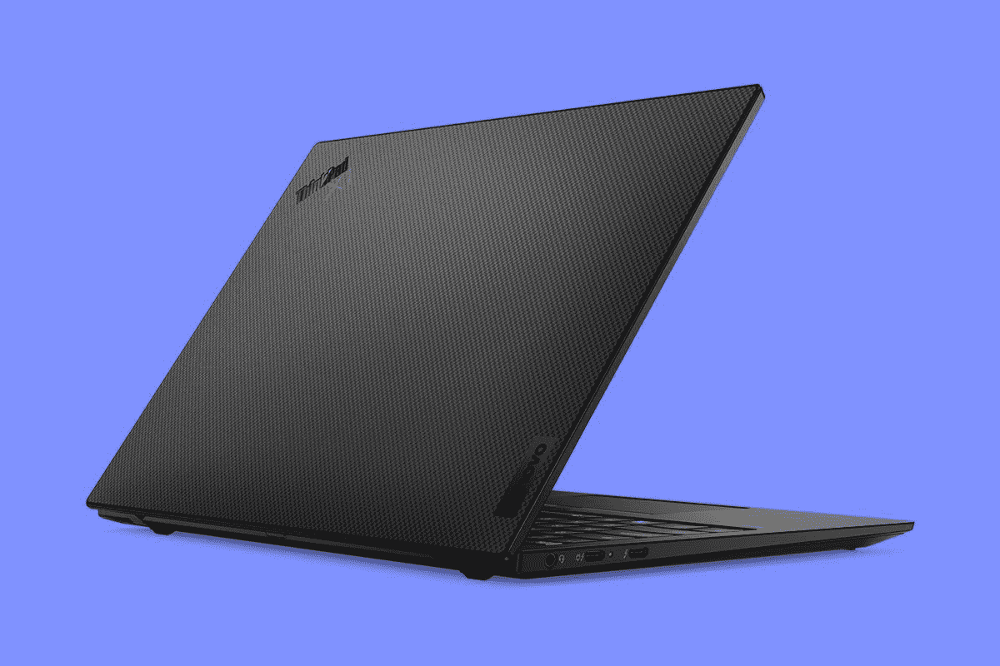

# 联想 ThinkPad X1 Nano Gen 2 评测:更强劲！

> 原文：<https://www.xda-developers.com/lenovo-thinkpad-x1-nano-gen-2-review/>

ThinkPad X1 Nano 背后的想法很创新，但很简单。这是为了制造一款轻薄小巧的商务笔记本电脑。联想 ThinkPad X1 Nano Gen 2 的目标是更强大的功能。这里最大的升级是从英特尔的 9W U 系列处理器到其 mch 更强大的 28W P 系列处理器。

它也是一台很棒的笔记本电脑。它有一个 1.35 毫米的键盘，这是我最喜欢的 ThinkPad 键盘。显示器超出了标准的 FHD+，所以分辨率刚刚好。当然，它的重量不到一公斤。

当然，虽然英特尔的第 12 代 P 系列处理器的功率有所提高，但这确实会影响电池寿命。还值得记住的是，这款产品的显示屏只有 13 英寸，有点小，如果还不够的话，你真的应该看看 ThinkPad X1 Carbon。

但是，如果您的使用案例适合这款笔记本电脑，那就太棒了。

 <picture></picture> 

Lenovo ThinkPad X1 Nano Gen 2

##### 联想 ThinkPad X1 Nano Gen 2

联想 ThinkPad X1 Nano 重量不到 1 千克，外形紧凑，性能不打折扣。

## 联想 ThinkPad X1 Nano Gen 2 定价和供货情况

*   联想 ThnkPad X1 Nano Gen 2 在 Lenovo.com 的起价为 1，511.40 美元
*   其他零售商也有售

联想 ThinkPad X1 Nano Gen 2 于今年早些时候发布，现在已经广泛上市。在 Lenovo.com，起价为 1511.40 美元，尽管这些价格经常波动。基本型号包括酷睿 i5、16GB 内存和 512GB 固态硬盘。如果你选择定制你的电脑，实际上会有 256GB 的存储空间，但要贵 60 美元。不要让我解释 ThinkPad 在 Lenovo.com 的价格。就像我说的，它们确实在波动，而且几乎总是有交易在运行。

还有其他零售商也销售这种产品。百思买似乎仍在销售第一代产品，尽管在撰写本文时打折了 200 美元。联想发给我的这款产品在沃尔玛的售价为 1699 美元，比它目前在 Lenovo.com 的售价 2147.40 美元低了不少。它包括酷睿 i7-1280P、32GB 内存和 1TB 固态硬盘。

如果你是为一家企业购买，你可能已经有了销售渠道，你会有一个销售代表给你定价。

## 联想 ThinkPad X1 Nano Gen 2 规格

| 

处理器

 | 支持博锐技术的英特尔酷睿 i7-1280 处理器 |
| 

制图法

 | 英特尔 Iris Xe |
| 

身体

 | 293.2 x 208.0 x 14.4 毫米(11.54 x 8.19 x 0.57 英寸)，966.5 克(2.13 磅) |
| 

显示

 | 13.0 英寸，2K (2160x1350)，IPS，450 尼特，防眩光，16:10，100% sRGB，可选触控 |
| 

记忆

 | 32GB LPDDR5-5200 |
| 

储存；储备

 | 1TB M.2 2242 固态硬盘 |
| 

电池

 | 49.5 瓦时，快速充电(1 小时可充电 80%) |
| 

港口

 | 2 个 Thunderbolt 4，Type-C(电源，DP 1.4，数据，始终打开)1 个 3.5 毫米耳机/麦克风组合音频插孔 1 个可选的 Nano-SIM 卡插槽(WWAN 型号) |
| 

连通性

 | 英特尔 Wi-Fi 6 AX201 +蓝牙 5.0 可选:WWAN LTE 5G CAT 20 或 LTE 4G CAT9 |
| 

声音的

 | 杜比 Atmos 扬声器系统认证(2W x 2 低音扬声器和 1W x 2 高音扬声器)四个阵列麦克风，360°远场，杜比语音 |
| 

照相机

 | 高达红外+ FHD 1080p MIPI，带隐私快门和计算机视觉 |
| 

投入

 | 6 排防溅多媒体 Fn 键，LED 背光玻璃表面多点触控触摸板 56 x 110mm 毫米(2.20 x 4.33 英寸)，跟踪点 |
| 

安全性

 | 分立 TPM 2.0，TCG 认证，Kensington Nano 安全插槽，2.5 x 6 毫米，掌托上的触摸式指纹识别器，片上匹配 BIOS 安全性:开机密码，管理员密码，系统管理密码，NVMe 密码，USB FIDO(快速身份在线)设备集成，基于证书的 BIOS 认证，固件弹性 3.0 其他安全性:摄像头隐私快门，(可选)用于 Windows Hello 的红外摄像头，(可选)基于计算机视觉的用户存在感测，包括离开时锁定，Mirametrix Glance，Tile ready |
| 

颜色

 | 黑色或碳纤维编织 |
| 

材料

 | 顶部:碳纤维底部:镁合金 |
| 

操作系统（Operating System）

 | Windows 11 专业版 |
| 

价格

 | $1,699 |

## 设计:它的重量不到一公斤

*   ThinkPad X1 Nano Gen 2 的重量为 2.13 磅，比去年稍重
*   它有两个雷电 4 端口

联想 ThinkPad X1 Nano 无疑是一款 ThinkPad。它有你想要的任何颜色，只要是黑色，尽管有碳纤维编织选项。它也是由高端 ThinkPad 的传统材料制成的，盖子是碳纤维和底座是镁合金的混合物。不同之处在于，它被设计得轻巧紧凑。

它紧凑的部分是关键。去年，当第一台 X1 Nano 推出时，我的问题是，为什么？ThinkPad X1 Carbon 应该是该系列中重量最轻的型号，重量为 2.49 磅。但这是*超轻*，就像我说的，它很小。

ThinkPad X1 Nano Gen 2 轻薄小巧

它的重量为 2.13 磅，比去年 1.99 磅的型号重约 7.5%。很多时候，公司设置了一个障碍，很明显，对于最初的模型，这个障碍是在两磅以下，至少对于非触摸 Wi-Fi 唯一的变体。不过不要担心。2.13 磅仍然轻得离谱，尤其是对于一台感觉不像许多超轻产品那样柔软的笔记本电脑来说。

它的厚度也只有 0.57 英寸，所以没有任何 USB Type-A 端口也就不足为奇了。事实上，除了耳机插孔，Thunderbolt 4 只有两个端口。USB Type-C only 方法在新设计的笔记本电脑中变得很常见。我们已经在 ThinkPad Z13、戴尔 XPS 13 等产品中看到了这一点。Thunderbolt 4 就是这么万能，你可以用它做任何你想做的事情。如果你想插 USB 型线，你只需要一个加密狗。

我确实在包里放了一个这样的加密狗，但是如果你使用鼠标，只使用蓝牙会变得越来越普遍。使用过许多没有 USB Type-A 的笔记本电脑，在旅途中很容易做到这一点，如果你看到这样的笔记本电脑，你可能会花很多时间在路上。

Thunderbolt 4 也为扩展打开了大门，鉴于这款笔记本电脑中更强大的 CPU，有一些有趣的选项。你可以连接一个外部显卡，在上面玩游戏，这是我在上一代机型上用 U9 处理器时不会做的事情。当然，你也可以在家里使用 Thunderbolt dock 来适当扩展成桌面设置。

我从设计中得到的最大收获是，这是一款适合在旅途中携带的完美笔记本电脑。当你把它放在包里的时候，感觉那里什么都没有。说真的，我最后反复检查，以确保我没有忘记我的笔记本电脑。

## 显示:2K 屏幕没变

*   显示屏为 13 英寸，分辨率为 2，160x1，350
*   网络摄像头已经升级到 1080p

联想 ThinkPad X1 Nano Gen 2 的显示屏与 Gen 1 型号的显示屏相同。分辨率为 2,160x1,350，屏幕尺寸为 13 英寸，亮度承诺为 450 尼特。很结实。我真的很高兴联想使用了比 16:10 笔记本电脑更传统的 1，920x1，200 更好的分辨率。这种轻微的提升带来了更好的体验，而且它不会对电池寿命产生 2，560x1，600 或 3，840x2，400 的影响。

唯一的问题是大小。它是 13 英寸，而大多数 13 英寸的笔记本电脑实际上只有 13.3 英寸。这三分之一英寸听起来可能不算多，但当它变得太小时，你就会看到使用全屏应用程序。同时拥有两个应用程序并不太现实。记住，这是 16:10 的宽高比，所以它甚至没有 13 英寸 16:9 显示器宽。

在我的显示器测试中，色域相当一般。它在 99% sRGB、71% NTSC、77% Adobe RGB 和 76% P3 下进行了测试。这是一台生产力机器，所以这可能不会对你产生太大影响。

亮度达到 477 尼特，考虑到联想只承诺 450 尼特，这是非常出色的。屏幕如此明亮，非常适合户外使用。事实上，这里没有低端的 250 尼特选项。

网络摄像头已经提升到 1080p，与去年的 720p 摄像头相比，这是一个可喜的变化。今年大多数 ThinkPads 都得到了这种升级。在这个在家工作的时代，这是很重要的一点。

值得注意的是，在在家工作热潮之前，人们真的不关心网络摄像头的质量。这就是这方面的创新停滞不前的原因，我们甚至看到许多笔记本电脑的摄像头在显示屏下面。当在家工作变得流行时，市场也花了一段时间才跟上。大多数个人电脑花了整整 12-18 个月的时间在流水线上。这一点以及英特尔将 FHD 摄像头添加到 Evo 规格中的事实意味着更多笔记本电脑将配备高质量的网络摄像头。

## 键盘:1.35 毫米的按键应该成为 ThinkPads 的标准

*   它有一个带 1.35 毫米按键的全尺寸键盘

联想 ThinkPad X1 Nano Gen 1 实际上与 ThinkPad X1 Titanium Yoga 几乎同时推出，如果你将 Nano 与 Carbon 进行比较，你会将 Titanium Yoga 与 X1 Yoga 进行比较。与 X1 Titanium Yoga 和 Z13 等其他新推出的 ThinkPads 不同，X1 Nano 没有触觉触摸板等花哨的新功能，但它确实有一个 1.35 毫米按键的键盘，而且很棒。

ThinkPads 以键盘质量著称；我们都知道。但是在检查了许多笔记本电脑后，其中一些的按键深度太大了。X1 Carbon 和 X1 Yoga 的厚度为 1.5 毫米，其他一些为 1.8 毫米。我觉得 ThinkPad X1 Nano Gen 2 的 1.35 毫米键盘令人耳目一新。

1.35mm 键盘上的打字体验很精致。

实际上，我已经和联想就这个问题进行了详细的讨论。ThinkPad 团队在设计一种更浅的键盘方面做了大量工作，这种键盘需要与 1.5 毫米按键相同的力度。其结果是精致的打字体验，我真的希望看到联想在它的其他产品上采用这一点。

刚刚评测了 [ThinkPad Z13](https://www.xda-developers.com/lenovo-thinkpad-z13-review/) ，我有点被现代 ThinkPad 的功能宠坏了。Z13 有一个触觉触摸板，它的顶部既可以作为按钮与 TrackPoint 一起使用，也可以作为触摸板本身的扩展。它还将 Ctrl 按钮放在 Fn 键的左侧，就像其他笔记本电脑一样。

ThinkPad X1 Nano Gen 2 在这方面更加传统。你仍然会发现一个机械精密触摸板，物理按钮，当然，不幸的是，Fn 键在 Ctrl 键的左边。但是，您可以在 Lenovo Commercial Vantage 应用程序中更改这两个键的布局。

## 性能:英特尔的 P 系列向前迈进了一大步

*   英特尔的 28W 处理器很棒，但可能不应该放在这么薄的笔记本电脑中
*   电池寿命是有代价的

一代又一代的重大变化是 ThinkPad X1 Nano Gen 2 采用了英特尔的 28W P 系列处理器。酷睿 i7-1280P 有 14 个内核，包括 6 个性能内核和 8 个效率内核，共 20 个线程。相比之下，第一代型号使用了英特尔的 9W U 系列芯片，除了功能明显较弱之外，它还有四个内核和八个线程。这里区别很大。

这种提升体现在 CPU 性能上。英特尔的 Iris Xe 一代又一代的变化是微不足道的，尽管您确实会在更强大的层上获得更多。换句话说，你真的没有得到比去年更好的图形性能，或者至少没有任何有意义的方式。

28W 处理器意味着 X1 Nano 不再是折衷之选。

虽然 Iris Xe 非常适合编辑照片，但我仍然认为这是一台生产力机器。这就是为什么我倾向于质疑新 P 系列的存在。实际上，我觉得这款笔记本电脑配备 15W U 系列处理器会更好，这对于生产力任务来说同样不错。当然，更耗电的 28W 处理器使用更长的电池寿命，我们稍后会谈到这一点。

我的工作流程包括在任何给定时间在 Chromium 浏览器中打开十几个标签，然后使用其他生产力应用程序，如 Microsoft To Do、OneNote、Slack 和 Skype。ThinkPad X1 Nano Gen 2 丝毫没有错过。我还用 Adobe Photoshop 编辑了我的照片，那也很棒。这是这里的关键要点。更强大的处理器意味着这种紧凑的设计不再是一种妥协。

|  | 

ThinkPad X1 Nano Gen 2 酷睿 i7-1280P

 | 

ThinkPad X1 Nano 第 1 代酷睿 i7-1160G7

 | 

ThinkPad X1 碳第十代酷睿 i7-1260P

 |
| --- | --- | --- | --- |
| 

PCMark 10

 | 5,345 | 4,586 | 5,178 |
| 

3DMark:时间间谍

 | 1,754 |  | 1,761 |
| 

Geekbench 5(单/多)

 | 1,753 / 10,243 | 1,346 / 4,891 | 1,622 / 8,207 |
| 

Cinebench(单人/多人)

 | 1,624 / 8,221 | 1,296 / 4,052 | 1,309 / 7,115 |
| 

交叉标记(总体/生产力/创造力/响应能力)

 | 1,766 / 1,610 / 2,072 / 1,443 |  | 1,547 / 1,436 / 1,771 / 1,292 |

基准测试分数给我留下了深刻的印象，因为我实际上预计 X1 Carbon 会击败它，尽管它使用的 CPU 较少。根据我对今年的超极本的体验，超极本可以包含从 9W 到 45W 的各种处理器，做得最好的是那些使用最适合其设计的处理器的超极本。像这样一台轻薄小巧的笔记本电脑不应该如此出色地处理 28W 芯片。

至于电池寿命，它不是很好，这就是我对 28W 处理器的问题真正发挥作用的地方。我的最好成绩是 290 分钟，也就是 4 小时 50 分钟。这是在电源滑块设置为平衡的情况下(事实上，在不连接电源的情况下使用它作为平衡不会对性能产生有意义的牺牲，不像在一些笔记本电脑上)。不过，我的平均成绩更像是 242 分钟，也就是 4 个多小时。这可不好。49.5 瓦时的电池应该有足够的容量做得更好。

## 谁应该购买联想 ThinkPad X1 Nano Gen 2？

联想有多种 ThinkPads 可供选择。让我们看看 X1 Nano 是否适合您。

**你应该购买联想 ThinkPad X1 Nano 如果:**

*   你经常忙忙碌碌
*   你的任务与生产力相关
*   您经常打字，并且想要出色的键盘体验

**你不应该购买联想 ThinkPad X1 Nano 如果:**

*   您使用分屏应用程序
*   你真的关心电池寿命
*   您在旅途中会使用大量 use a 型外围设备

就像我马上说的，联想已经有了轻薄的 ThinkPad 是 ThinkPad X1 Carbon Gen 10。它重 2.49 磅，有一个 14 英寸的屏幕，并有更多种类的端口。如果因为端口或屏幕尺寸的限制，ThinkPad X1 Nano 不适合你，X1 Carbon 可能是正确的选择。

 <picture></picture> 

Lenovo ThinkPad X1 Nano Gen 2

##### 联想 ThinkPad X1 Nano Gen 2

联想 ThinkPad X1 Nano 重量不到 1 千克，外形紧凑，性能不打折扣。