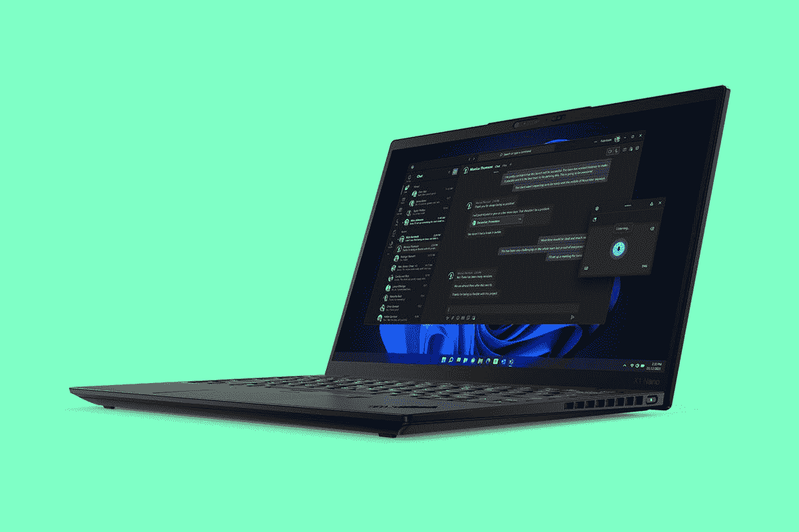
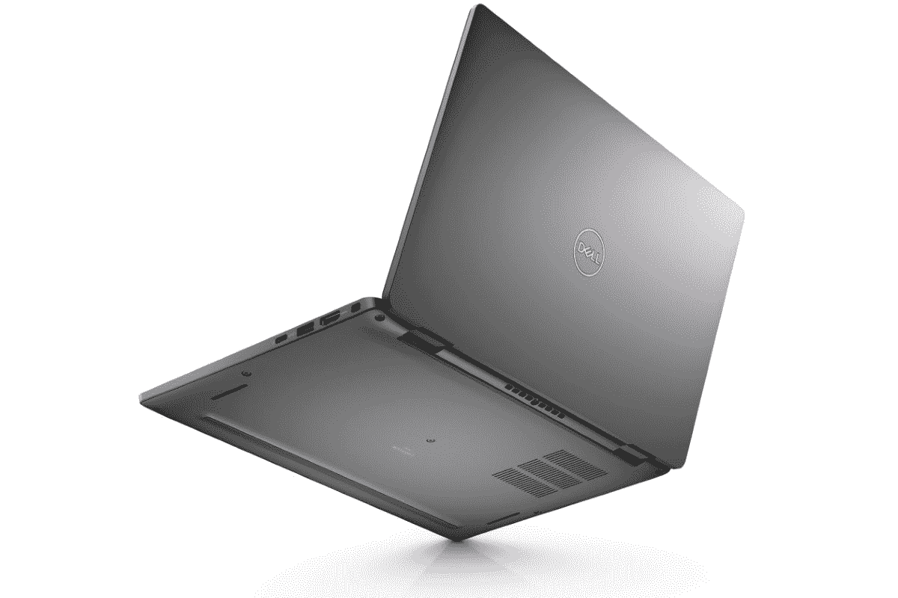

# 联想 ThinkPad X1 Nano Gen 2 与戴尔 Latitude 7330 超轻

> 原文：<https://www.xda-developers.com/lenovo-thinkpad-x1-nano-gen-2-vs-dell-latitude-7330-ultralight/>

我们开始看到越来越多的笔记本电脑采用英特尔最新的第 12 代处理器，其中有一些超轻选项。其中之一是戴尔最近发布的名副其实的 Dell Latitude 7330 Ultralight，但另一个受欢迎的选择是联想 ThinkPad X1 Nano Gen 2。

这两个[商务笔记本电脑](https://www.xda-developers.com/best-business-laptops/)都是关于紧凑和便携，但他们仍然包装一拳。尽管两者都很轻，但它们在一些方面仍然有很大的不同，有很好的理由选择其中之一。同样值得注意的是，Dell Latitude 7330 Ultralight 并不完全是它自己的型号，它更像是 Latitude 7330 的一种轻量级配置。Dell Latitude 7330 有 2 合 1 型号，但没有超轻标志。

**浏览这篇文章:**

## 联想 ThinkPad X1 Nano Gen 2 与戴尔 Latitude 7330 超轻:规格

|  | 

联想 ThinkPad X1 Nano Gen 2

 | 

戴尔 Latitude 7330(超轻)

 |
| --- | --- | --- |
| **操作系统** |  |  |
| **CPU** | 

*   第 12 代英特尔酷睿 i5-1240P (12 个内核，16 个线程，最高 4.4GHz，12MB 高速缓存)
*   第 12 代英特尔酷睿 i5-1250P (12 个内核，16 个线程，最高 4.4GHz，12MB 高速缓存)
*   第 12 代英特尔酷睿 i7-1260P (12 个内核，16 个线程，最高 4.7GHz，18MB 高速缓存)
*   第 12 代英特尔酷睿 i7-1270P (12 个内核，16 个线程，最高 4.8GHz，18MB 高速缓存)
*   第 12 代英特尔酷睿 i7-1280P (14 个内核，20 个线程，最高 4.8GHz，24MB 高速缓存)

 | 

*   第 12 代英特尔酷睿 i5-1235U (10 个内核，12 个线程，最高 4.4GHz，12MB 高速缓存)
*   第 12 代英特尔酷睿 i5-1245U 博锐企业版(10 个内核，12 个线程，最高 4.4GHz，12MB 高速缓存)
*   第 12 代英特尔酷睿 i7-1255U (10 个内核，12 个线程，最高 4.7GHz，12MB 高速缓存)
*   第 12 代英特尔酷睿 i7-1265U 博锐企业版(10 个内核，12 个线程，最高 4.8GHz，12MB 高速缓存)

 |
| **图形** |  |  |
| **显示** | 

*   13 英寸 16:10 2K (2160 x 1350)，450 尼特，100% sRGB，杜比视界
*   13 英寸 16:10 2K (2160 x 1350)触摸屏，450 尼特，100% sRGB，杜比视界

 | 

*   13.3 英寸 16:9 全高清(1920 x 1080)，400 尼特，100% sRGB，防眩光，超低功耗

 |
| **存储** | 

*   256GB PCIe 4.0 NVMe 固态硬盘
*   512GB PCIe 4.0 NVMe 固态硬盘
*   1TB PCIe 4.0 NVMe 固态硬盘

 | 

*   256GB PCIe 固态硬盘
*   256GB PCIe 自加密固态硬盘
*   512GB PCIe 固态硬盘

 |
| **闸板** | 

*   16GB LPDDR5 5200MHz
*   32GB LPDDR5 5200MHz

 | 

*   16GB DDR4 3200MHz
*   32GB DDR4 3200MHz

 |
| **电池** | 

*   49.6 瓦时电池
    *   高达 65W 的 USB Type-C 电源适配器

 | 

*   3 芯 41 瓦时电池
    *   高达 90W 的 USB Type-C 电源适配器

 |
| **港口** | 

*   2 个 Thunderbolt 4(USB C 型)
*   3.5 毫米耳机插孔
*   Nano SIM 卡插槽(可选)

 | 

*   2 个 Thunderbolt 4(USB C 型)
*   1 个 USB 3.2 第 1 代 A 型
*   1 个 HDMI 接口
*   3.5 毫米耳机插孔
*   Nano SIM 卡插槽(可选)
*   智能卡读卡器(可选)

 |
| **音频** | 

*   杜比 Atmos 扬声器系统

 | 

*   Waves MaxxAudio Pro 的双扬声器设置
*   双降噪麦克风

 |
| **摄像机** | 

*   1080p 全高清 RGB 网络摄像头
*   1080p 全高清 RGB +红外网络摄像头
*   具有计算机视觉功能的 1080p 全高清 MIPI RGB +红外网络摄像头

 | 

*   720p 高清摄像头
*   1080p 全高清+红外摄像头，带快速登录和环境光传感器

 |
| **视窗你好** | 

*   红外网络摄像头(可选)
*   指纹传感器

 | 

*   红外网络摄像头(超轻配置中不提供)
*   指纹识别器(超轻配置中不提供)

 |
| **连通性** | 

*   英特尔无线 6E
*   蓝牙 5.2
*   蜂窝选项:
    *   5G sub-6 Cat2o
    *   4G LTE Cat16

 | 

*   英特尔无线 6E
*   蓝牙 5.2
*   (蜂窝选项在超轻配置中不可用)

 |
| **颜色** | 

*   深黑色
    *   可选碳纤维编织罩

 |  |
| **尺寸(WxDxH)** | 

*   非触控:293.2 x 208.0 x 14.47 毫米(11.5 x 8.19 x 0.57 英寸)
*   触摸:293.3 x 208.1 x 14.77 毫米(11.5 x 8.19 x 0.58 英寸)

 | 

*   306.5 x 199.95 x 16.96 毫米(12.07 x 7.67 x 0.67 英寸)

 |
| **尺寸** | 起始重量为 970 克(2.13 磅) | 起始重量为 967 克(2.13 磅) |
| **价格** | 起价 1659 美元 | 起价 1899 美元 |

在性能和设计方面，一些大的变化突然出现。让我们仔细看看它们，看看你应该选择哪种笔记本电脑。

## 性能:ThinkPad X1 Nano Gen 2 配有 P 系列处理器

这两款笔记本电脑都搭载了英特尔第 12 代酷睿处理器，但这并不意味着它们是一样的。ThinkPad X1 Nano Gen 2 是对其前代产品的重大升级，它配备了英特尔新的 P 系列处理器，具有 28W 的 TDP。虽然它们使用更多的功率，但这些处理器也可以提供更高的性能，它们总共可以有多达 14 个内核。联想还没有具体说明将推出哪些型号的处理器，但它有可能会更快。

这是因为，与联想不同，戴尔坚持使用英特尔的 U15 系列(之前称为 U 系列或 UP3)。新的 U 系列处理器也具有混合架构，但它们的 TDP 较低，为 15W，最大拥有 10 个内核和 12 个线程。这意味着您应该可以期待 ThinkPad X1 Nano 有明显更好的性能，尤其是在使用多个内核的任务中。

我们通常使用 Geekbench 来比较整体 CPU 性能，尽管这远远不能说明全部情况。不过，这是直观显示整体性能差异的最简单方法，所以让我们来看看 P 系列和 U 系列处理器的一些比较示例:

|  | 

英特尔酷睿 i7-1280P( [参见测试](https://browser.geekbench.com/v5/cpu/13331030))

 | 

英特尔酷睿 i7-1265U( [参见测试](https://browser.geekbench.com/v5/cpu/12860514))

 | 

英特尔酷睿 i5-1250P( [参见测试](https://browser.geekbench.com/v5/cpu/13897072))

 | 

英特尔酷睿 i5-1245U( [参见测试](https://browser.geekbench.com/v5/cpu/13777559))

 |
| --- | --- | --- | --- | --- |
| Geekbench 5 分数 | 1,790 / 9,312 | 1,232 / 6,336 | 1,522 / 9,142 | 1,560 / 5,414 |

请记住，这些都是来自个别结果的早期测试，如果这些 CPU 的平均分数可用，我们将有一个更准确的描述。第 12 代英特尔处理器仍处于早期阶段，因此还没有上市。不过，您可以看到 P 系列处理器的性能优势有多大，尤其是在多核性能方面。如果你想要最快的速度，那当然是最好的方法，尽管你会牺牲电池寿命。P 和 U 系列之间的图形性能不会有太大差异，尽管 P 系列的速度稍快。

联想 ThinkPad X1 Nano 的另一个优势是它配备了新的 LPDDR5 内存，而不是戴尔 Latitude 73330 超轻中的 DDR4 内存。它们的主频也非常不同，ThinkPad 为 5200MHz，Latitude 7330 为 3200MHz。LPDDR5 可能有更高的延迟，但它应该仍然优于 DDR4。两款笔记本电脑的内存都高达 32GB，所以这部分是相似的。至于存储，您可以在 ThinkPad 上获得高达 2TB 的存储，在 Latitude 7330 Ultralight 上获得 512GB 的存储(在其他 Latitude 7330 配置中为 1TB)。无论如何，这都是足够的存储空间，但你可能会喜欢联想提供的更大的最大容量。

Dell Latitude 7330 拥有更大的电池和更高效的处理器。

不过，Dell Latitude 7330 超轻的一个优势是电池。您可以为这款笔记本电脑配置高达 58 瓦时的电池，这比 ThinkPad X1 Nano 上的 49.6 瓦时电池大得多。其中一个原因是 P 系列处理器需要更好的冷却，因此散热解决方案占用了原本可以容纳更大电池的空间。这对 ThinkPad X1 Nano 来说是双重损失，因为它不仅有更小的电池，还有更耗电的 CPU，所以它肯定会更快地耗尽电荷。对于注重便携性的笔记本电脑来说，这可能是一个很大的不利因素。

## 显示屏和声音:ThinkPad X1 Nano 采用 16:10 显示屏

联想的 ThinkPad X1 Nano 在显示器部分不断得分。笔记本电脑没有提供大量的配置选项，但也不需要。这是一款 13 英寸的显示器，长宽比为 16:10，联想称之为 2K 分辨率，即 2160 x 1350。这种高长宽比在高端商务笔记本电脑中很常见，它有助于提高工作效率，因为您可以获得更多的内容表面积。你唯一可以改变的是显示器是否支持触摸，但这没关系，因为基本配置已经很好了。

另一方面，Dell Latitude 7330 配备了更传统的 13.3 英寸 16:9 显示屏，超轻配置仅提供全高清(1920 x 1080)分辨率，不支持触摸。这仍然是一个很好的分辨率和清晰度，但你错过了更高的显示器的好处。此外，一些用户可能会欣赏联想 2K 显示屏带来的额外清晰度。

ThinkPad X1 Nano 在网络摄像头方面还有另一个优势，默认情况下是全高清摄像头，可以选择为 Windows Hello 添加红外传感器，甚至是计算机视觉支持。Dell Latitude 7330 在超轻配置中仍然配备了 720p 网络摄像头，但如果您选择其他配置，也可以升级到全高清摄像头。在这一点上，如果你喜欢以这种方式登录，这两款笔记本电脑也可以有指纹读取器-但同样，如果你走超轻路线，Latitude 7330 不会给你这个选项。

ThinkPad X1 Nano 默认有一个 1080p 网络摄像头。

至于音频，ThinkPad X1 Nano 和 Dell Latitude 7330 都有双扬声器和双麦克风设置，推动了媒体消费和通话。这大概是你对 13 英寸笔记本电脑的期望，它应该可以很好地完成工作。

## 设计:它们的重量几乎一样

戴尔表示，Latitude 7330 超轻配置是最轻的优质商用 13 英寸笔记本电脑，这可能仅指配有 15W 或更高处理器的笔记本电脑。它的重量为 967 克，仅比联想 ThinkPad X1 Nano 轻 3 克，而且仍然更宽更厚，所以在便携性方面的差异并不是很大。实际上它的厚度为 16.96 毫米，对于采用 U 系列处理器的笔记本电脑来说，这并不令人印象深刻。

与此同时，ThinkPad X1 Nano 的重量几乎相同，但它薄了很多，只有 14.47 毫米(或 14.77 毫米，取决于你是否添加了触摸屏)。考虑到它可用于 P 系列处理器，这一点更令人印象深刻。

就外观而言，这两款笔记本电脑都没有赢得任何创意奖项。ThinkPad X1 Nano 拥有经典的 ThinkPad 设计，大部分是黑色的机箱，到处都是红色。尽管它的尺寸很小，但它仍然具有红色跟踪点和触摸板上方的重复鼠标按钮等功能，所以如果你是 ThinkPad 的长期粉丝，它是理想的选择。

Dell Latitude 7330 超轻系列外观更加现代，没有任何装饰，采用银色机箱。银色是笔记本电脑中最常见的颜色之一，所以它同样无趣，但它非常适合工作环境。两台笔记本电脑都是。

## 端口和连接性:Dell Latitude 7330 功能更加丰富

到目前为止，联想 ThinkPad X1 Nano 一直是最好的笔记本电脑，但戴尔 Latitude 7330 在端口方面表现出色。尽管 Latitude 7330 采用了超轻设计，但它配备了两个 Thunderbolt 4 端口、USB Type-A、HDMI 和一个耳机插孔，此外，您还可以选择接触式智能卡读卡器。对于这种尺寸的笔记本电脑来说，这是非常令人印象深刻的。

ThinkPad X1 Nano 更符合你对轻薄笔记本电脑的期望。它只有两个 Thunderbolt 4 端口和一个耳机插孔，所以你将更加依赖于一个 [Thunderbolt dock](https://www.xda-developers.com/best-thunderbolt-docks/) 或某种适配器。

两款笔记本电脑都支持 Wi-Fi 6E 和蓝牙 5.2，并且都提供蜂窝连接选项。然而，Dell Latitude 7330 不支持 5G，仅支持 4G LTE。有了 ThinkPad X1 Nano，你可以选择任何一个选项。

## 联想 ThinkPad X1 Nano 与戴尔 Latitude 7330 超轻:最终想法

毕竟，可以说联想 ThinkPad X1 Nano Gen 2 在大多数方面都是更好的笔记本电脑。默认情况下，它拥有更强大的处理器、更新的内存、更好的显示屏和更好的网络摄像头。这有很多优点，很难忽视。它也是两台笔记本电脑中唯一一台为您提供 5G 连接选项的。

ThinkPad X1 Nano 在大多数方面都优于 Latitude 7330 Ultralight。

Dell Latitude 7330 具有更现代的设计，您可能喜欢也可能不喜欢，它有更多的端口。这是一个真正的好处，但你很难说它弥补了它的缺点。尽管如此，如果你真的欣赏额外的港口，它可能是值得的。另外，你可以选择更大的电池，更高效的 CPU，如果你想要一个不需要充电器就能持续一整天的东西，它会成为一个更好的选择。

还有价格问题，戴尔 Latitude 7330 超轻实际上比 ThinkPad X1 Nano 的起价更高。不过，公平地说，我们还不知道每个型号的入门级配置规格。

最终，哪种笔记本电脑最符合您的需求取决于您。不管怎样，在撰写本文时，这两款笔记本电脑都还不能购买。你可以看看下面的联想 ThinkPad X1 Nano，看看它是否同时推出。如果你等不起，也许可以看看你今天能买到的最好的 ThinkPads，或者如果你对这个品牌更感兴趣的话，看看 T2 戴尔最好的笔记本电脑。

 <picture></picture> 

Lenovo ThinkPad X1 Nano Gen 2

##### 联想 ThinkPad X1 Nano Gen 2

联想 ThinkPad X1 Nano Gen 2 是一款超轻商务笔记本电脑，采用第 12 代英特尔处理器，支持 5G。

 <picture></picture> 

Dell Latitude 7330 Ultralight

##### 戴尔 Latitude 7330

Dell Latitude 7330 Ultralight 是您能找到的最轻的商用笔记本电脑之一，它采用第 12 代英特尔处理器和高达 32GB 的内存。