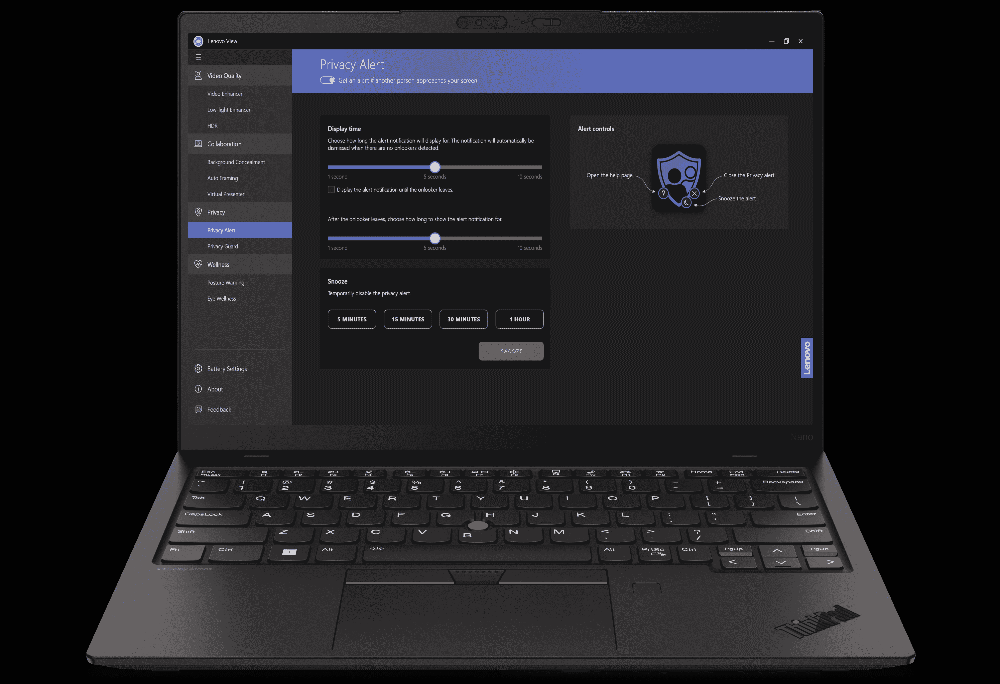

# 联想 ThinkPad X1 Nano Gen 3:价格、发布日期和其他信息

> 原文：<https://www.xda-developers.com/lenovo-thinkpad-x1-nano-gen-3/>

ThinkPad X1 Nano Gen 3 是已经[流行的型号](https://www.xda-developers.com/lenovo-thinkpad-x1-nano-gen-2-review/)的后续产品，是联想 2023 年[最新的笔记本电脑之一。再次延续轻薄的设计传统，2023 的设备是一款相当便携的](https://www.xda-developers.com/best-lenovo-laptops/)[商务笔记本电脑](https://www.xda-developers.com/best-business-laptops/)，但它带来了一些更小的设计变化，更注重可持续性。除此之外，还有一个跳转到新的尚未宣布的英特尔酷睿处理器的引擎盖下。

如果你想知道所有这些，以及还有什么变化，这里有一个关于 ThinkPad X1 Nano Gen 3 的更深入的探究。我们将了解定价、规格等更多信息。

## 联想 ThinkPad X1 Nano Gen 3:规格

| 

处理器

 | 最新英特尔酷睿处理器 |
| 

制图法

 | 英特尔 Iris Xe 显卡 |
| 

身体

 | 11.5 x 8.19 x 0.58 英寸& 2.13 磅 |
| 

显示

 | 13 英寸窄边框，高达 2K 分辨率，450 尼特，可选 AOFT 触控 |
| 

记忆

 | 最高 16GB LPDDR5 |
| 

储存；储备

 | 高达 2TB 的第四代 PCIe NVMe 固态硬盘 |
| 

电池

 | 49.6 Wh |
| 

港口

 | 2 个 Thunderbolt 4，Type-C(电源，DP 1.4，数据，始终打开)2 个 USB-A 3.2，1 个 HDMI 2.0，1 个 3.5 毫米音频插孔 |
| 

连通性

 | Wi-Fi 6E 802.11 AX (2x2)蓝牙 5.2、5G sub 6 (CAT20)、4G LTE (CAT16)、4g LTE (CAT4) eSIM 和 Nano SIM 就绪 |
| 

声音的

 | 带有杜比语音和四阵列 360 度麦克风的杜比 Atmos 音频 |
| 

照相机

 | 高达红外+ FHD 1080p MIPI，带隐私快门和计算机视觉 |
| 

安全性

 | 片上匹配开机指纹识别器、相机快门、Kensington 锁插槽、磁贴应用就绪、MIL-STD 810H、dTPM 2.0 |

## 联想 ThinkPad X1 Nano Gen 3:价格、发布日期、上市时间

据联想称，ThinkPad X1 Nano Gen 3 将于 2023 年 4 月上市。价格将从 1649 美元起。像往常一样，您可以在 Lenovo.com 配置您的设备，包括 RAM、CPU 和存储。在撰写本指南时，我们还没有这方面的信息。定价与之前的第二代机型大致相同。据我们了解，这款设备的定价为 1659 美元，尽管它不是基本款。

## 联想 ThinkPad X1 Nano Gen 3 有什么新功能？

如果你只是从外表看，新的联想 ThinkPad X1 Nano Gen 3 与之前的 Gen 2 [联想笔记本电脑](https://www.xda-developers.com/best-lenovo-laptops/)没有太大的不同。今年有三个主要变化，你不会马上发现——可持续发展、软件调整和最新的(在撰写本文时尚未公布)英特尔酷睿 CPU。否则，你仍然会购买一台体积小巧、功能强大的笔记本电脑。

### 更可持续的笔记本电脑

联想 ThinkPad X1 Nano Gen 3 最大的设计变化是材料。联想在掌托和底盖中使用了 90%的回收镁混合材料，以帮助提高产品的可持续性。然而，这仍然保持了设备的轻薄。尺寸为 11.5 x 8.19 x 0.58 英寸& 2.13 磅，与上一代机型相同。就连包装都比较环保。包装由 100%竹子和甘蔗纤维制成，棕色盒子包装由 90%回收成分的无塑料成分制成。

### 软件改进

至于软件调整，X1 Nano Gen 3 上有一些新东西可以享受。Lenovo View 软件中新增了基于摄像头的数字健康功能。其中一个是隐私卫士和隐私警报，当检测到未经授权的人脸时，它可以激活隐私模糊来覆盖屏幕。还有姿势警告和眼睛健康警告，可以改善你的健康。此外，不要忘记自动取景、背景模糊和虚拟演示者更新，它们可以帮助您在团队通话时提升体验。甚至还有人工智能的改进，可以在任何照明环境下提高集成网络摄像头的图像质量。

### 全新英特尔 CPU

最后，还有 CPU 的碰撞。联想没有提供特定的性能声明或代际改进，但 ThinkPad X1 Nano Gen 3 采用了他们所谓的“最新英特尔酷睿处理器”。在撰写本文时，英特尔尚未宣布这些处理器，但人们可以假设这些处理器是[第 13 代“猛禽湖”](https://www.xda-developers.com/intel-13th-gen-raptor-lake/)处理器。

## 哪里可以买到联想 ThinkPad X1 Nano Gen 3？

正如我们之前提到的，你目前不能购买 ThinkPad X1 Nano Gen 3。联想还没有为它建立一个产品页面。不过，到 2023 年 4 月，你将能够通过联想的网站购买它，我们一定会为你添加一个购买链接。不过，我们并不指望亚马逊(Amazon)或百思买(Best Buy)等其他零售商最初会销售这款设备，因为 ThinkPad 系列通常是面向商业用户的，但如果他们碰巧提供这款产品，我们也会尽最大努力与这些受欢迎的零售商建立联系。

与此同时，你可以购买去年的 Gen 2 型号，或者看看其他一些[最好的笔记本电脑](https://www.xda-developers.com/best-laptops/)。惠普、戴尔和其他公司有很多很好的替代产品。