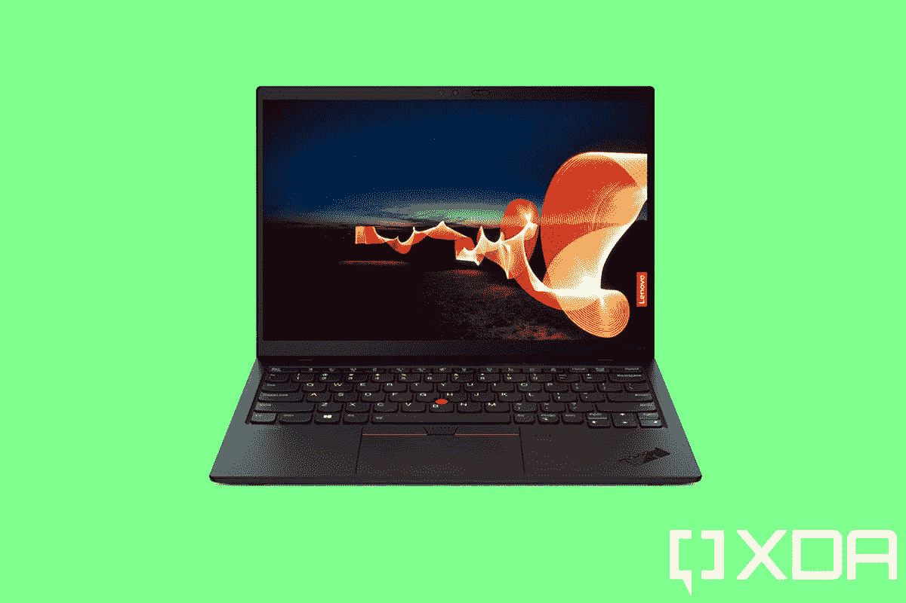

# 联想 ThinkPad X1 Nano 评测:疯狂的光，也疯狂的好

> 原文：<https://www.xda-developers.com/lenovo-thinkpad-x1-nano-review/>

联想的 ThinkPad X1 Nano 是一款现象级的 PC。当[我将它与 ThinkPad X1 Carbon](https://www.xda-developers.com/thinkpad-x1-carbon-vs-thinkpad-x1-nano/) 进行比较时，我已经说过很多了。它们都被认为是[高端、轻薄的商务笔记本电脑](https://www.xda-developers.com/best-laptops/)，但是 ThinkPad X1 Nano 是*轻薄笔记本电脑的下一代*。这实际上是我看过的第二个，因为联想很友好地发送了多点触控模型。

。bestawarddiv {

浮动:对；

宽度:20%；

边距:0.75em

边距-顶部:0；

}

ThinkPad X1 Nano 仅重 2.14 磅。这是那种如果你把它放在背包里，你必须检查并确保它在里面的东西。最好的一点是，它并没有为了轻薄而做出妥协，因为引擎盖下的英特尔处理器真的很好。

这也是第一款 16:10 ThinkPad，在 12 月份首次宣布时，这是一件大事。然后，CES 在 1 月份到来，16:10 屏幕对每个人来说变得更加常见。

**浏览此评论:**

## 联想 ThinkPad X1 Nano:规格

| 

中央处理器

 | 英特尔酷睿 i7-1160G7 |
| 

制图法

 | 虹膜 Xe |
| 

身体

 | 292.9 x 207.8 x 14.27-17.2 毫米(11.53 x 8.18 x 0.56-0.68 英寸)，969 克(2.14 磅) |
| 

显示

 | 13.0 英寸 2K (2160 x 1350) IPS、防反光、防污迹、带杜比视觉的触摸屏、450 尼特、100% sRGB |
| 

记忆

 | 16GB LPDDR4x 4266MHz(焊接) |
| 

储存；储备

 | 512GB PCIe 固态硬盘 |
| 

电池

 | 48 瓦时，长达 13 小时 |
| 

安全性

 | 

*   离散可信平台模块(dTPM) 2.0
*   使用 Windows Hello & IR 摄像头检测人的存在
*   片上匹配指纹读取器
*   网络摄像头隐私保护罩

 |
| 

声音的

 | 

*   杜比 Atmos 扬声器系统
*   4 个 360 度麦克风

 |
| 

照相机

 | 混合红外(IR) / 720p 高清，带网络摄像头隐私保护盖 |
| 

连通性

 | 

*   可选:WWAN LTE 5G / LTE 4G CAT9
*   无线局域网:WiFi 6 AX201 802.11AX (2 x 2)
*   蓝牙 5.2
*   基于博锐处理器的博锐技术

 |
| 

港口

 | 

*   2 个 USB4 Thunderbolt 4(电力输送)
*   耳机/麦克风组合

 |
| 

键盘

 | 

*   抗溢出
*   背光，带白色 LED 照明
*   呼叫控制键(F9-F11)

 |
| 

材料

 | 顶部:碳纤维底部:镁合金 |
| 

颜色

 | 黑色，顶盖采用碳纤维编织 |
| 

操作系统（Operating System）

 | Windows 10 专业版 |
| 

价格

 | $1,315.85 |

我列出的 ThinkPad X1 Nano 的价格是基于 Lenovo.com 的产品页面，但这个价格总是在波动。联想实际上从未对 ThinkPad 收取全价费用，而且“即时节省”和电子优惠券也总是不同。

请注意，该型号的重量为 2.14 磅。我之前评测的非触摸型号的重量为 1.99 磅，因此触摸和非触摸型号之间确实有所不同。增加手机功能也会增加一点重量。

## 设计:ThinkPad X1 Nano 重约两磅，具体取决于你的配置

ThinkPad X1 Nano 有两种颜色:黑色和另一种黑色。联想发给我的是后者，其实是碳纤维编织设计。碳纤维编织是触摸屏型号的专属，所以如果你想要 1.99 磅的非触摸版本，你必须得到普通的黑色。

当谈到 ThinkPad 的总体设计时，没有太多可谈的。这是一个非常标准的外观和感觉，延伸到大多数产品系列。事实上，几乎所有的产品都是黑色的，它们都有方形的边角，并且在边角上印有 ThinkPad 的标志。对于高端机型，有我们在这里看到的光滑的黑色 ThinkPad 标志。

我非常喜欢 ThinkPad X1 Nano 的碳纤维编织设计，显然，我在许多 ThinkPad 上都见过它。只是有些不同而已。我有点惊讶联想把它留给了触控机型，因为我认为非触控机型是更理想的配置。这款笔记本的实际重量不到 2 磅，这是 ThinkPad X1 Nano 的一个重要特点。

这个只有两磅多一点，仍然轻得令人难以置信。正如我所说的，这是一种设备，如果你在背包里带着笔记本电脑走出家门，你必须检查并确保你记得把它放在包里。ThinkPad X1 Nano 非常轻，你甚至不能确定它是否在里面。

ThinkPad X1 Nano 是这样一种设备，如果你把它放在背包里走出家门，你必须检查并确保你确实记得把它放在包里。

在右边，只有一个电源按钮。只有当你对 ThinkPad 设计感兴趣时，这才是有趣的，因为联想过去常常在键盘上为这样的蛤壳式键盘放置一个圆形电源按钮。几年前，联想将按钮移到了一边，使其与敞篷车保持一致。今年对于 ThinkPad X1 系列，该公司将按钮移回到甲板上，使其兼作指纹传感器。但由于这款笔记本电脑是在 12 月份发布的，而不是与其他产品一起发布，ThinkPad X1 Nano 错过了这个备忘录。期待在第二代上看到这一点。

左侧有两个 Thunderbolt 4 端口和一个 3.5mm 音频插孔。如果你需要更多的端口，我建议[看看 ThinkPad X1 Carbon](https://www.xda-developers.com/lenovo-thinkpad-x1-carbon-review/) 。这两款笔记本电脑都属于高端 ThinkPads，它们被设计得又薄又轻，但碳保持了很多传统的支持。

凭借 ThinkPad X1 Nano 上的 [Thunderbolt 4](https://www.xda-developers.com/best-thunderbolt-4-laptops/) 支持，您可以在单个端口上连接双 4K 显示器，也可以连接外部 GPU。这里有一个更好的计划。您可以将外部 GPU 连接到其中一个 Thunderbolt 端口，将双 4K 显示器连接到外部 GPU，然后使用另一个 Thunderbolt 4 端口连接 dock 并添加一些端口。这就是我实际上曾经做过的事情，我坐在一台 2.14 磅重的笔记本电脑上，在超图形设置下玩 *Forza Horizon 4* 。

## 显示和音频:它有一个 2K 屏幕和杜比全景声

联想 ThinkPad X1 Nano 不像一些更成熟的 ThinkPad 那样有很多显示器选项。你几乎可以接触和不接触。它们都有 13 英寸 2160 x 1350 450 尼特的面板，支持杜比视觉 HDR。除了支持触摸，一个关键的区别是，非触摸机型有一个防眩光屏幕，而多点触摸机型有一个光滑的屏幕。

显示器的长宽比为 16:10，正如我前面所说，ThinkPad X1 Nano 是第一款使用更高长宽比的现代 ThinkPad。在过去，他们有 4:3 的宽高比，但后来随着高清技术的普及，行业发展到了 16:9。人们一直普遍认为，更高的屏幕有利于提高工作效率，我们终于看到行业朝着这个方向发展。

ThinkPad X1 Nano 肯定有一个漂亮的屏幕，我真的很欣赏它的分辨率是 2160 x 1350，而不是 1920 x 1200。这些额外的像素肯定会有所不同。在我的测试中，它支持 99%的 sRGB、72%的 NTSC、77%的 Adobe RGB 和 77%的 DCI-P3。

我非常欣赏 ThinkPad X1 Nano 拥有 2160 x 1350 分辨率的屏幕。这些额外的像素肯定会有所不同。

可悲的是，网络摄像头是一个半身像。它的分辨率只有 720p，在这个在家办公的时代，这真是一个耻辱。它确实有内置的隐私保护装置，所以你不必担心用胶带或其他东西盖住它。我只是希望联想有一个 1080p 的网络摄像头。幸运的是，联想在 ThinkPad X1 Nano 上添加了一个红外摄像头，以支持 [Windows Hello](https://www.xda-developers.com/best-laptops-with-windows-hello/) ，所以你可以获得内置的面部识别功能。

最后，我们在 ThinkPad X1 Nano 上安装了杜比 Atmos 音频，键盘上方有两个扬声器，设备下方有两个扬声器。它拥有杜比全景声闻名的清晰度，但音量并不特别大。放在办公桌上听音乐没问题，但不会占满房间。当然，它也非常适合通话，尤其是它的四个 360 度麦克风。

## 键盘:ThinkPad X1 Nano 拥有 1.35 毫米的新按键

联想的 ThinkPads 以拥有一些最好的键盘而闻名，但如果我告诉你这个键盘与其他键盘不同会怎样？是的，我个人认为这样更好。

我认为 X1 Nano 的键盘比其他 ThinkPad 键盘好得多。

ThinkPad X1 Nano 有 1.35 毫米的按键，而不是大多数 ThinkPad 上的 1.5 毫米按键。虽然联想 ThinkPads 在舒适性和准确性方面一直拥有令人惊叹的键盘，但按键总是感觉有点长，即使竞争对手的笔记本电脑键盘更浅。

其实是一样的键盘，只是更浅一些。这台电脑的每一部分都融入了大量的工程设计。在不改变手感的情况下让键盘变得更浅是其中很大一部分。

很显然，ThinkPad X1 Nano 仍然拥有标志性的 ThinkPad TrackPoint，即。让你控制指针的红色小块。这是 Windows 触摸板很糟糕的时代的遗物，但在 ThinkPads 上，它不会去任何地方。爱它，就可以用它；如果你讨厌它，就忽略它。

请注意，触摸板旁边有一个指纹传感器。这一点至少在一些 ThinkPad 上已经消失，但在 ThinkPad X1 Nano 上仍然存在。正如我上面提到的，电源按钮正在转移到新款 ThinkPads 的键盘上，在那里它可以兼作指纹传感器。令我着迷的是，这台笔记本电脑从一开始就是全新的 ThinkPad X1，但它仍然缺少一两个月后上市的一些功能。

最后，还有微软 Precision 触摸板，上面有物理按钮。我喜欢物理按钮——它使拖放更容易。尽管如此，它们是为 TrackPoint 设计的，因为 TrackPoint 不会去任何地方，这些按钮也不会。

## 性能:Y 系列？不是吗？

联想发给我的 ThinkPad X1 Nano 配有英特尔酷睿 i7-1160G7 和 16GB 内存，与该公司发给我的第一台设备规格完全相同。处理器来自 Tiger Lake UP4 家族。

UP4 是 Y 系列的继任者，甚至在此之前，它被称为 Core M，我知道；我在这里说了很多脏话。但是，不要因为我说了“Y 系列”和“Core M”之类的话，就马上离开。这些英特尔 CPU 其实不错。

与第八代“琥珀湖”(第十代“冰湖”几乎没有发货)相比，有一些主要区别。TDP 得到了提升，有四个核心，而不是两个，图形也好得多。现在，我们有 Iris Xe 显卡，主频为 1.1GHz，有 96 个执行单元。老实说，第八代 Y 系列上的集成显卡是一个笑话。

y 系列是为没有风扇的电脑设计的，是的，联想 ThinkPad X1 Nano 确实有风扇。但是虎湖 UP4 这么好的事实才是这台 PC 能够存在的原因。事实上，ThinkPad X1 Titanium Yoga 也是如此。如果这种笔记本电脑在两年前问世，我不会推荐它。不过，如果你一开始没有看到徽章，我认为 ThinkPad X1 Nano 是最佳选择。

随着老虎湖 UP4，似乎没有什么有意义的妥协了。

英特尔酷睿 i7-1160G7 有助于提高工作效率，但它还能做更多。在 Photoshop 中编辑图像不会有任何问题，你甚至可以在这里做一些轻松的视频编辑。就性能而言，如果你不知道它是 Y 系列的继任者，你甚至不会猜到它不是普通的 15W U 系列芯片。

电池寿命也很棒，就像*不可思议地*棒极了。我可以用这个东西连续使用 10 个小时。这是因为电源滑块比节电模式高一档，屏幕亮度为 25%。之所以这么诡异是因为电池只有 48WHr，所以不是特别大。真的很棒。

电池寿命也很棒，就像《T2》和《T3》一样棒。

对于基准测试，我使用了 PCMark 8、PCMark 10、Geekbench 5 和 Cinebench。

|  | 

ThinkPad X1 NanoCore i7-1160G7

 | 

[ThinkPad X1 碳素](https://www.xda-developers.com/lenovo-thinkpad-x1-carbon-review/)酷睿 i7-1185G7

 | 

惠普 Spectre FolioCore i7-8500Y

 | 

[惠普精英版](https://www.xda-developers.com/hp-elite-folio-review/)骁龙 8cx Gen 2

 |
| --- | --- | --- | --- | --- |
| 

PCMark 8:主页

 | 3,919 | 4,532 | 2,727 | 不适用的 |
| 

PCMark 8:创意

 | 4,419 | 4,910 | 2,773 | 不适用的 |
| 

PCMark 8:工作

 | 3,864 | 4,144 | 3,242 | 不适用的 |
| 

PCMark 10

 | 4,586 | 5,168 | 2,940 | 不适用的 |
| 

极客工作台

 | 1,346 / 4,891 | 1,489 / 5,280 | 954 / 1,579 | 801 / 3,150 |
| 

电影院长凳

 | 1,296 / 4,052 | 1,303 / 4,224 | 605 / 867 | 不适用的 |

## 结论:该不该买联想 ThinkPad X1 Nano？

我不断回想起的一点，也是我如此喜爱 ThinkPad X1 Nano 的原因，是因为就在一年前，这种组合根本不可能实现。直到今年，如果你想要这样轻薄的笔记本电脑，你有两个选择:你必须满足于英特尔 Y 系列处理器或高通骁龙处理器。两者都有妥协。随着老虎湖 UP4，似乎没有什么有意义的妥协了。

当然，我敢打赌，对于一台商用电脑来说，许多人会说缺少 USB Type-A 和 HDMI 端口是一种妥协。老实说，这就是 ThinkPad X1 Carbon 存在的原因。碳的重量不到 2.5 磅，所以它仍然很轻。然而，凭借 ThinkPad X1 Nano，联想将事情发挥到了极致。

不过有一个大缺点，那就是 720p 的网络摄像头。在过去的一年里，许多人开始在家工作，这也促进了个人电脑的销售。但是，如果你因为转而在家工作而购买电脑，你可能需要一个 FHD 摄像头。

不过，我仍然认为联想 ThinkPad X1 Nano 非常适合在旅途中工作。如果你想找些东西放在办公桌上，那就买一台台式机或者更结实的笔记本电脑。这是你将随身携带的东西，然后当你回家时，你可以使用单电缆解决方案将其插入 Thunderbolt 坞站。

ThinkPad X1 Nano 无疑是目前市场上我最喜欢的笔记本电脑之一，尽管坦率地说，今年联想的所有 ThinkPad X1 笔记本电脑都在扼杀它。

 <picture></picture> 

Lenovo ThinkPad X1 Nano

##### 联想 ThinkPad X1 Nano

这款笔记本电脑超薄超轻，同时仍然是一款 ThinkPad。它重约两磅，但性能丝毫不打折扣。