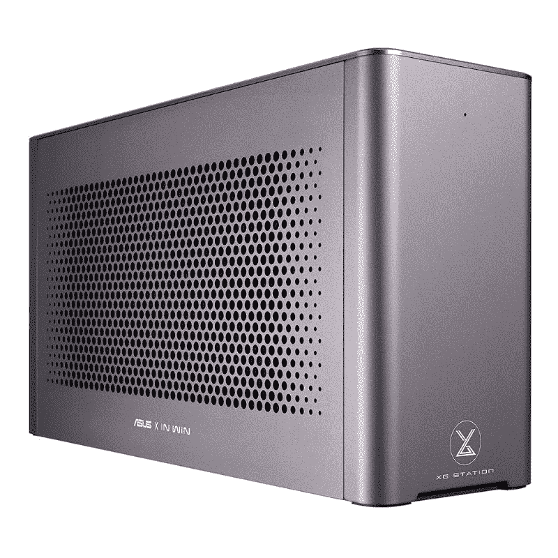
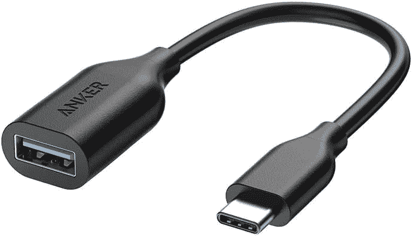
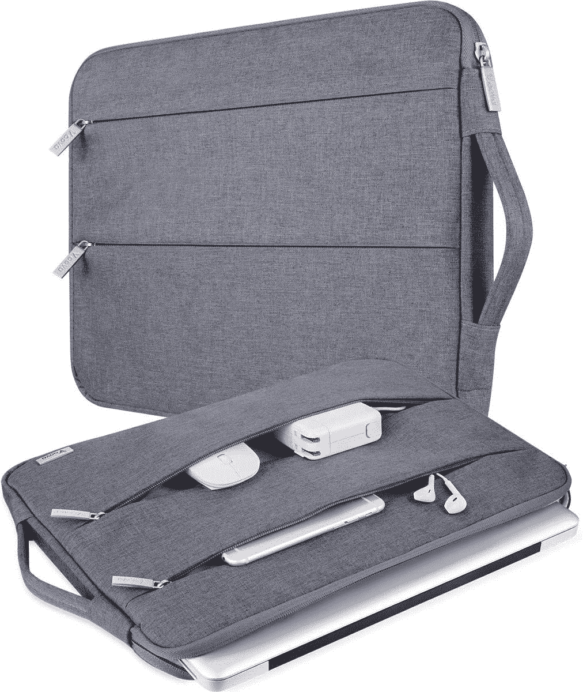
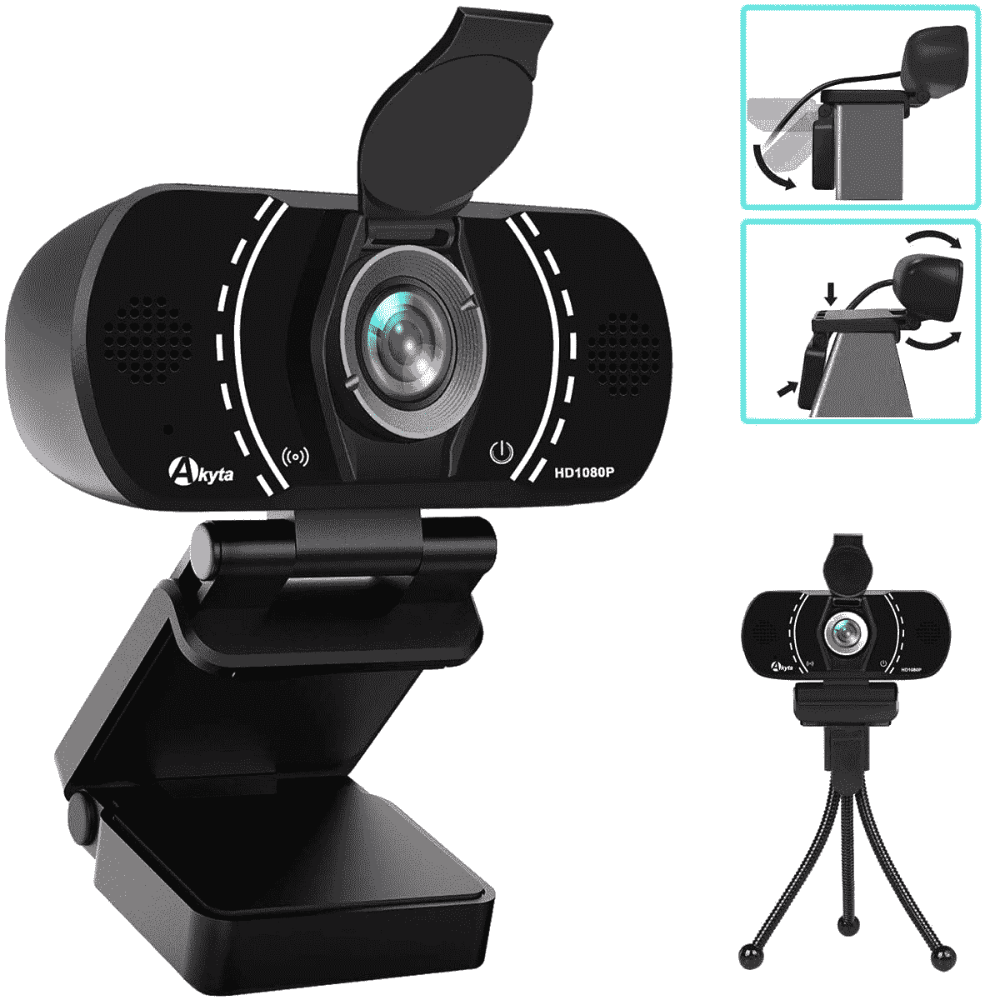

# 联想 ThinkPad X1 Yoga Gen 7 最佳配件

> 原文：<https://www.xda-developers.com/lenovo-thinkpad-x1-yoga-gen-7-accessories/>

你现在能买到的最好的商务笔记本电脑之一是联想 ThinkPad X1 Yoga Gen 7。从令人惊叹的 4K 有机发光二极管显示屏和 5G 连接，我们发现它拥有一个严肃的商务人士可能需要的一切。然而，仍然有一些额外的东西可以帮助提升你的体验。

这些涵盖了各种类别，从显示器，坞站，鼠标，耳机，耳塞，网络摄像头，案件，等等。我们为我们最喜爱的联想 ThinkPad X1 Yoga Gen 7 配件整理了一个简单的指南，因此您可以准确地找到有助于提升您的新 ThinkPad 体验的所需配件。点击上面的导航链接，按类别进行跟进。

## 用于联想 ThinkPad X1 Yoga Gen 7 的显示器

虽然联想 ThinkPad X1 Yoga Gen 7 上的 4K 有机发光二极管显示屏是该笔记本电脑的最佳功能之一，但没有什么比拥有一个专用显示器更好的了。专用显示器为您提供更多空间来处理多任务和打开您喜爱的应用程序，让您可以完成更多工作。别忘了，你还可以连接其他设备，比如游戏机、iPad，甚至是有线电视盒。这里有一些我们最喜欢的。

*   ##### 戴尔 U2723QE UltraSharp 4K USB-C 集线器显示器

    这款高端戴尔 UltraSharp 显示器是 ThinkPad X1 Yoga Gen 7 的最佳选择之一。它有 4K 分辨率，并为内容创作者提供专用的 sRGB 模式。

*   ##### 戴尔 27 英寸视频会议显示器

    除了 ThinkPad 自带的网络摄像头之外，这款戴尔显示器是提升您网络会议体验的完美之选。它有一个内置的扬声器系统，并在一个身临其境的 27 英寸显示面板

*   ##### 联想 ThinkVision P27h-20

    这款来自联想的 27 英寸 QHD 显示器是您新 ThinkPad 的绝佳选择。它有非常薄的边框，甚至有一个地方可以让你拿着手机。

*   <picture></picture>

    惠普 27f 1080p 27 英寸显示器

    ##### 惠普 27f 1080p 27 英寸显示器

    想要一台基本的显示器和一个额外的屏幕而不超出预算？这正是这款联想 FHD 27 英寸显示器的用途。

*   ##### 华硕 ProArt PA329C 32 英寸 4K 显示器

    这款 4K 分辨率的华硕 ProArt 显示器将为您的 ThinkPad 带来最佳的色彩准确度。它涵盖了 100%的 Adobe RGB、sRGB 色域。

    T34
*   ##### Arzopa 便携式显示器

    想要一台显示器放在办公桌上，但空间有限？这就是 Arzopa 的显示器的用途。它甚至拥有清晰的 2K 分辨率。

## 用于联想 ThinkPad X1 Yoga Gen 7 的外部 GPU 外壳

ThinkPad X1 Yoga Gen 7 配备了 2 个 Thunderbolt 4 端口，可以与外部 GPU 配合工作。这意味着您可以超越随附的英特尔 Iris Xe 显卡，玩一些真正的游戏，或者在企业中处理 Excel 数据和运行虚拟机。当然，前提是你有一个受支持的外部 GPU，这并不包括在这些机箱中。查看下面我们的最佳选择。

*   <picture></picture>

    华硕 XG Station Pro eGPU 机箱

    ##### 华硕 XG Station Pro eGPU 机箱

    这款外置 GPU 对于你的 ThinkPad 来说是最精简的一款，它与新旧 GPU 配合也非常棒。

*   ##### 雷蛇 Core X Chroma

    这款来自雷蛇的外置 GPU 是最受欢迎的一款。它甚至有一个 RGB 照明选项，这将使您的设置感觉花哨。

    T34

## 联想 ThinkPad X1 Yoga Gen 7 的坞站和适配器

尽管 ThinkPad X1 Yoga Gen 7 配备了过多的端口，包括 USB-A、USB-C 和 HDMI，但你可能需要考虑一个坞站或适配器。这将有助于您将更多附件插入新电脑，而不必担心占用设备附带的端口空间。当然，对于多显示器设置，也需要一个扩展坞。我们有一些建议。

*   <picture></picture>

    联想 ThinkPad 雷电 3 坞

    ##### 联想 ThinkPad 雷电 3 坞

    最适合您的 ThinkPad 的坞站直接来自联想。这是 ThinkPad 雷电 3 坞站，它可以为您的设备添加额外的 USB-A 端口和各种其他端口。

*   <picture></picture>

    肯辛顿雷电 3 坞站

    ##### 肯辛顿 SD5300T Thunderbolt 4 坞站

    虽然这个坞站是为 MacBooks 准备的，但对于 ThinkPad 来说还是很棒的。它增加了双显示器支持，可以为你的 ThinkPad 供电，并为你提供了一个 SD 读卡器和五个 USB-A 3.1 Gen 1 端口。

*   <picture></picture>

    Razer Thunderbolt 4 Dock

    ##### Razer Thunderbolt 4 Dock Chroma

    这款来自 Razer 的 Dock 不仅能为你的 ThinkPad 提供额外的端口，还能让你的办公桌带上 RGB 灯光。

*   <picture></picture>

    Baseus 17 合 1 USB-C 坞站

    ##### Baseus 17 合 1 USB-C 坞站

    这款 Baseus 坞站可为您的 ThinkPad 添加多达 17 个不同的端口。我们发现，在列表中的所有其他端口中，这个端口提供的可能性最大。

*   <picture></picture>

    Anker 777 雷电 4 坞

    ##### Anker 777 雷电坞

    这款 Anker 雷电坞是最简单的一款。这是一个高级坞站，并提供了金属设计。

*   ##### CalDigit TS4 Thunderbolt 4 Dock

    这是来自 CalDigit 的一款较新的 Thunderbolt dock，支持 Thunderbolt 4 协议。它为您的设备提供了多达 18 个端口，包括 USB-C、USB-A 和 5Gb 以太网。

*   <picture></picture>

    Anker power expand 8-in-1 USB-C 适配器

    ##### Anker power expand 8-in-1 USB-C Hub

    这款 Anker USB-C hub 是为那些随身携带笔记本电脑的人准备的。它为您提供额外的 USB-A、USB-C 和 HDMI 端口，以及访问微型 SD 卡插槽和以太网连接。

    T34
*   <picture></picture>

    Anker USB-C OTG 线

    ##### Anker USB-C OTG 线

    这是一款简单化的 Anker USB-C 转 USB-A 适配器。它只是给你的 ThinkPad 增加了一个 USB-A 端口。

*   <picture></picture>

    Anker power expand 6-in-1

    ##### Anker power expand 6-in-1 USB-C Hub

    需要一个纤薄的 USB-C Hub？这正是 Anker 的这个的目的。它很小，但有两个 USB A 类端口，以太网、HDMI 和 USB c 类端口。

## 联想 ThinkPad X1 Yoga Gen 7 的鼠标和键盘

你不能否认联想制造了一些最好的笔记本电脑键盘和触控板。ThinkPads 在这方面领先于笔记本电脑。然而，如果你打算在办公桌上使用 ThinkPad X1 Yoga Gen 7，甚至在家里使用多显示器设置，你会希望通过键盘和鼠标来提升体验。更大的键盘会让你享受数字键盘，鼠标会让滚动更容易，甚至放松你的手。看看这些选项。

*   <picture></picture>

    罗技 MX Mechanical

    ##### 罗技 MX Mechanical

    机械键盘往往是专业打字员的首选，罗技 MX Mechanical 是一个很棒的选择。它将多种设备的使用等生产力功能与触摸按键和多种模式的纯白色 LED 背光等游戏功能相结合。

*   ##### 罗技 MX 键

    罗技 MX 键对于任何 ThinkPad 来说都是一个很棒的外接键盘。它可以与多达三种不同的设备配合使用，甚至还有背光。

    T34
*   ##### 罗技 MX Master 3S

    罗技制造了一些最好的鼠标，这款也不例外。它超级舒适，会很好地适合你的手。它甚至可以通过 USB-C 充电。

*   ##### 微软 Surface Precision 鼠标

    这款微软鼠标模仿了罗技 MX Master 3S。它拥有超级舒适和符合人体工程学的设计，还可以使用 USB-C 充电。

*   <picture></picture>

    联想选择无线现代键盘和鼠标

    ##### 联想选择无线现代键盘和鼠标

    正在为您的 ThinkPad 寻找一体化解决方案？该套装为您提供联想键盘和联想鼠标。

*   <picture></picture>

    罗技升降式垂直人体工学鼠标

    ##### 罗技升降式垂直人体工学鼠标

    罗技升降式垂直人体工学鼠标是市面上最符合人体工学的鼠标之一。当滚动和移动时，它会将您的手抬高到一个更舒适的角度，以帮助避免常见的疼痛点。

*   <picture></picture>

    联想军团 KM300 RGB 游戏键鼠组合

    ##### 联想军团 KM300 RGB 游戏键鼠组合

    如果你是那种喜欢的类型，这款联想键鼠组合很适合你。键盘是为了游戏而设计的，有 RGB 照明。鼠标也符合外观。

*   ##### 亚马逊基础无线电脑键盘鼠标组合

    这是你的 ThinkPad 笔记本电脑最便宜的键盘鼠标组合之一。

*   ##### 微软移动鼠标

    微软移动鼠标是我们能找到的最小巧的鼠标之一。它非常适合放在桌子上，并且有一个金属滚轮。

    

## 用于联想 ThinkPad X1 Yoga Gen 7 的耳机或耳塞

在 ThinkPad X1 Yoga Gen 7 上，您会发现 4 个杜比 Atmos 扬声器，它们都面向您。这些通常是联想笔记本电脑上最好的一些，有助于使电影和其他多媒体感觉身临其境。如果你想要更多的个人音频，耳机或耳塞可以派上用场。这可以帮助你更专注于会议，也有助于让你听起来更好。我们有一些建议。

*   <picture></picture>

    Surface 耳机 2

    ##### 微软 Surface 耳机 2

    微软的 Surface 耳机结合了舒适的贴合感和有趣的可触摸耳套，您可以使用它来控制音乐的音量，跳过或暂停歌曲。

*   <picture></picture>

    索尼 WHXB900N 降噪耳机

    ##### 索尼 WHXB900N 降噪耳机

    这些耳机是为那些想要最好的音乐质量和降噪，以及长达 30 小时的超长电池寿命的人准备的。

*   ##### 谷歌 Pixel Buds Pro

    Pixel Buds Pro 对于任何不喜欢挂耳式耳机手感的人来说都是非常棒的。这些位于您的空气中，具有智能噪音消除功能。由于蓝牙支持，它还可以快速与 Windows 11 配对。

    T34

## 联想 ThinkPad X1 Yoga Gen 7 的保护套

如果你要带着你的新 ThinkPad 在路上旅行，你需要一个包来保护它。你不会想刮伤笔记本电脑的铝表面，尽管它非常耐用。这就是箱子和袖子发挥作用的地方。你会发现很多这些出售，但我们最喜欢的一些在下面。

*   <picture></picture>

    沃特菲尔德设计 PC sleeve case

    ##### 沃特菲尔德设计 PC Sleevecase

    这款机箱符合你 ThinkPad 的高级感。它是用最好的材料定做的。

*   ##### 亚马逊基础款 15.6 寸笔记本电脑保护套

    作为亚马逊最畅销的笔记本电脑保护套，这款保护套绝对不会错。它为您在旅途中携带 ThinkPad 的那些时刻提供了一个方便的手柄。

*   ##### iCozzier 15 英寸手机套

    这款笔记本电脑套除了为您的 ThinkPad 留出空间外，还可以存放充电器和其他重要配件。

    T17
*   <picture></picture>

    KINGSLONG 便携包

    ##### KINGSLONG 便携包

    虽然是为 MacBooks 设计的，但这是另一款非常适合在旅途中使用的笔记本电脑包它有填充口袋，可以让你的 ThinkPad 保持舒适。

*   <picture></picture>

    V Voova 超薄笔记本电脑便携包

    ##### V Voova 超薄笔记本电脑便携包

    这款笔记本电脑包除了有保护您的 ThinkPad 的衬垫内部之外，前面还有拉链，用于放置您喜欢的配件。

*   <picture></picture>

    Casematix 笔记本电脑硬套

    ##### Casematix 笔记本电脑硬套

    我们怀疑是否有人会走到这个极端，但这款笔记本电脑硬套是最坚固的一款。它有衬垫和坚硬的外壳，甚至可以防水。

## 联想 ThinkPad X1 Yoga Gen 7 的网络摄像头

作为一款商务笔记本电脑，视频会议是联想 ThinkPad X1 Yoga Gen 7 的首要功能之一。附带的 1080p 网络摄像头将为您完成业务，让您看起来体面，但您可以找到更好的选项，让您在通话中看起来更清晰。有很多选择，这里有一些建议。

*   ##### 联想 Essential FHD 网络摄像头

    联想 Essential FHD 网络摄像头顾名思义。这是一个分辨率为 1080p 的网络摄像头。

*   ##### 戴尔专业网络摄像头

    戴尔专业网络摄像头提供 2K 分辨率的图像。它还拥有非常棒的设计和许多智能功能，如人工智能噪音消除和自动取景..

    T17
*   ##### 戴尔 UltraSharp 4K 网络摄像头

    与戴尔 Pro 网络摄像头相比，这是一款更贵的网络摄像头。它有一个类似 DSLR 的大传感器和 4K 分辨率。

*   ##### 罗技 C920S Pro 高清网络摄像头

    这款罗技网络摄像头凭借 FHD 分辨率成为最受欢迎的商务摄像头之一。它还具有自动对焦功能和光线校正功能。

    T37
*   ##### 罗技 4K 专业网络摄像头

    这款网络摄像头提供了市场上任何带有 4K 传感器的网络摄像头的最佳分辨率。

    

*   <picture></picture>

    Akyta 带三脚架的广角网络摄像头

    ##### Akyta 带三脚架的广角网络摄像头

    如果您想在一个群组视频通话中容纳更多人，这款网络摄像头适合您。它有一个 110 度的大视野，并配有一个隐私保护盖和一个三脚架，以防你不想将其安装在显示器上。

## 联想 ThinkPad X1 Yoga Gen 7 的外部存储

联想 ThinkPad X1 Yoga Gen 7 配备了配置高达 1TB 存储的选项，但在结账时跳跃存储选项可能会很昂贵。这就是您应该投资外部存储的原因。通过我们列表中的这些选项，您可以将重要文件从 ThinkPad 上移走，放在外部存储设备上，并在不同的设备之间移动它们。

*   ##### 闪迪 1TB 至尊便携固态硬盘

    这是一款小巧的固态硬盘，你可以在旅途中使用。它非常耐用，可以防止跌落和碰撞，因此里面的数据会保持安全。

    

*   ##### 三星 T5 便携 SSD

    这是一款来自三星的紧凑型迷你外置 SSD。它适合你的手掌。

*   ##### 三星 T7 便携式 SSD

    这是三星的又一款紧凑型 SSD。不同的是，你可以用你的指纹来保护数据。

*   <picture></picture>

    WD Black 2TB P50 便携 SSD

    ##### WD Black P50 便携 SSD

    打算在你的 Xbox 或 ThinkPad 上玩游戏吗？这是一款便携式固态硬盘，专为游戏和工作而设计。

*   <picture></picture>

    LaCie Rugged Mini

    ##### LaCie Rugged Mini HDD

    这是一款速度较慢的传统外置 HDD 它耐摔，最高可配 5TB 存储空间。

*   ##### WD Elements 台式 HDD

    这是流行品牌西数的又一款外置 HDD。它装在一个盒子里，价格低廉，储物空间丰富。

## 用于联想 ThinkPad X1 Yoga Gen 7 的充电器

用于充电联想 ThinkPad X1 Yoga Gen 7 支持快速充电。这意味着您可以以比包装盒中的速度更快的速度给笔记本电脑充电。联想卖一个 65W 的 PSU 适配器，可以用。下面来看看吧。

*   ##### 联想 65W USB-C 充电器

    这款 USB-C 充电器是直接来自联想的。它为你提供了 ThinkPad 设备所能提供的快速充电速度。

*   ##### 亚马逊基础 60W 充电器

    这款亚马逊基础 65W 充电器给你的充电速度比大多数 45W 充电器略快。它还有一个额外的端口，可以为安卓手机或平板电脑充电。

    

*   ##### u green 100 w Nexode GaN 2 口充电器

    这个 100 瓦的充电器对于一个只支持 65W 充电的笔记本电脑来说有些大材小用，但是对于其他支持的设备来说会给你超级快充。

*   ##### Baseus 100W 4 口 GaN II 快速充电站

    这款 Baseus 充电器价格相当实惠，它提供了 4 个不同的端口，可以为其他设备快速充电，同时还很小巧。

*   <picture></picture>

    汤森 65W 充电器为 Surface

    ##### 汤森 65W PD 充电器

    这是一款相当有趣的充电器，因为它的形状更像一个立方体它提供 65W 快速充电。

*   ##### sate chi 165 w USB-C 4 口 PD 充电器

    这其实不是一个充电器，而是一个 USB hub。但是，它可以为你的 ThinkPad 充电。

    T34

## 联想 ThinkPad X1 Yoga Gen 7 的杂项

联想 ThinkPad X1 Yoga Gen 7 还有很多其他配件可以使用。其中包括支架，甚至屏幕清洁器。下面来看看吧。

*   ##### Eveo 屏幕清洁套件

    当你的 ThinkPad 屏幕变脏时，你可以用这个套件来清洁它。

    

*   <picture></picture>

    Xbox 无线手柄

    ##### 微软 Xbox 无线手柄

    打算在你的 ThinkPad 上通过外部还是通过云端进行游戏？看看这款 Xbox 控制器，让您可以更轻松地玩游戏。

我们的 ThinkPad X1 Yoga Gen 7 配件清单现已告罄。这些配件应该有助于提高生产力和更多。当然，并不是每个配件都能满足你的需求，这也是为什么我们的清单很长的原因。如果您还没有购买，请通过下面的链接查看联想 ThinkPad X1 Yoga Gen 7。定价从 1，590 美元起，但你也可以以高达 2，734 美元的价格购买最高端的型号。如果 ThinkPad 不符合你的需求，看看我们的指南[一些最好的笔记本电脑](https://www.xda-developers.com/best-laptops/)。

##### 联想 ThinkPad X1 Yoga Gen 7

联想的 ThinkPad X1 Yoga 拥有您需要的所有功能，如可选的 5G、可选的 4K 有机发光二极管显示器、第 12 代处理器、LPDDR5 和整体出色的构建质量。