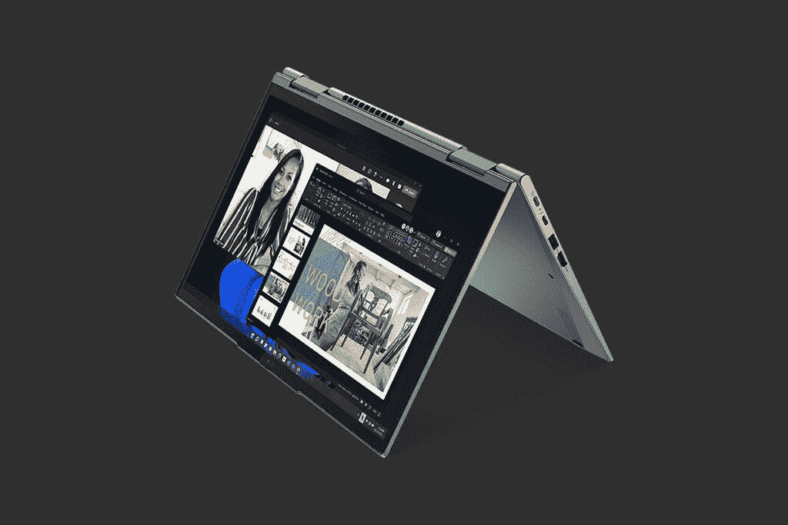
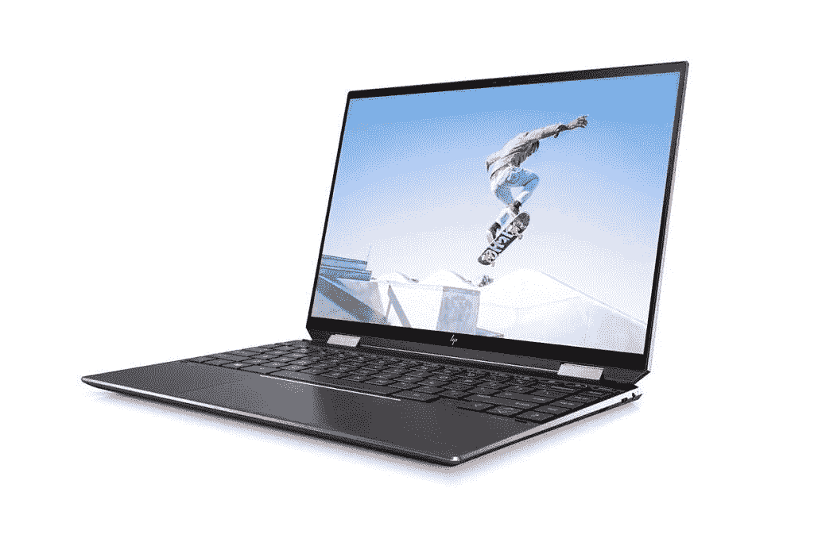
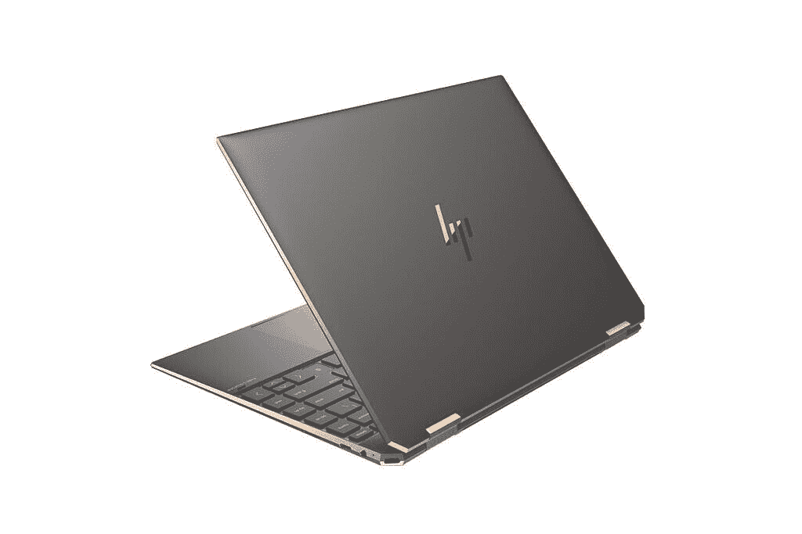
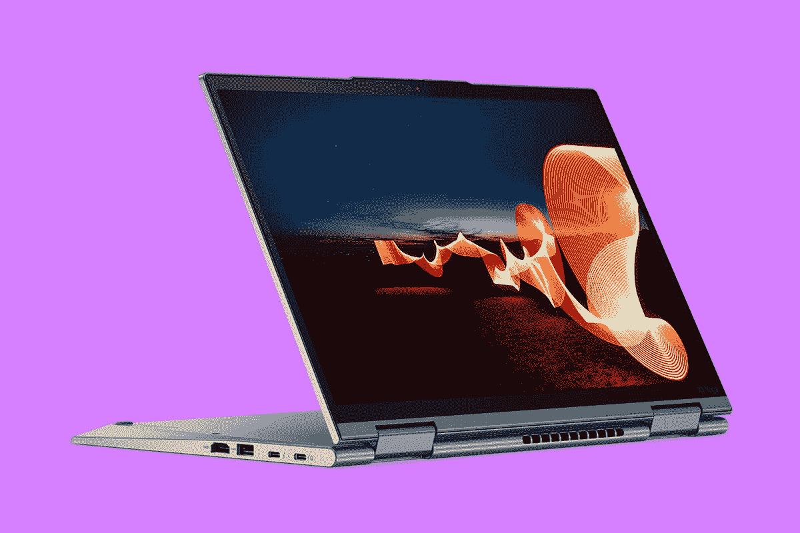

# 联想 ThinkPad X1 Yoga Gen 7 vs 惠普 Spectre x360:哪个更好？

> 原文：<https://www.xda-developers.com/lenovo-thinkpad-x1-yoga-gen-7-vs-hp-spectre-x360/>

联想的 [ThinkPad X1 Yoga Gen 7](https://www.xda-developers.com/lenovo-thinkpad-x1-yoga-gen-7/) 是该公司商务敞篷车系列中的最新产品，也是一款[的超棒笔记本电脑](https://www.xda-developers.com/best-laptops/)。新型号配备了英特尔的第 12 代处理器，特别是 P 系列，具有 28W 的基本功率和混合架构，允许装入更多内核。此外，它还具有改进的网络摄像头、新的显示选项等。但最新的联想 ThinkPad X1 Yoga 与惠普 Spectre x360 相比如何呢？惠普 Spectre x360 是最受欢迎的敞篷车之一。

嗯，在某些方面，不可否认它更好，这是因为惠普还没有为 2022 年更新 Spectre x360。这意味着惠普笔记本电脑的最新型号都有较旧的处理器，从这个意义上说，它们会更差一些。尽管如此，还是有必要看看这两款笔记本电脑之间的其他差异，看看为什么你会更喜欢其中一款。惠普最终会更新 Spectre 系列，因此一些用户可能会发现等待更新版本是值得的。在我们开始之前，最后需要注意的一点是，惠普 Spectre x360 有几种不同的型号，规格各异，但我们将重点关注 Spectre x360 14，它与联想的笔记本电脑最相似。

**浏览这篇文章:**

## 联想 ThinkPad X1 Yoga Gen 7 vs 惠普 Spectre x360 14:规格

|  | 

联想 ThinkPad X1 Yoga Gen 7

 | 

惠普 Spectre x360 14

 |
| --- | --- | --- |
| **CPU** | 

*   第 12 代英特尔酷睿 i5-1240P (12 个内核，16 个线程，最高 4.4GHz，12MB 高速缓存)
*   第 12 代英特尔酷睿 i5-1250 处理器博锐(12 个内核，16 个线程，最高 4.4GHz，12MB 高速缓存)
*   第 12 代英特尔酷睿 i7-1260 处理器(12 个内核，16 个线程，最高 4.7GHz，18MB 高速缓存)
*   第 12 代英特尔酷睿 i7-1270P (12 个内核，16 个线程，最高 4.8GHz. 18MB 高速缓存)
*   第 12 代英特尔酷睿 i7-1280P (14 个内核，20 个线程，最高 4.8GHz，24MB 高速缓存)

 | 

*   第 11 代英特尔酷睿 i5-1135G7 (4 核、8 线程、最高 4.2GHz、8MB 高速缓存)
*   第 11 代英特尔酷睿 i7-1165G7 (4 核、8 线程、最高 4.7GHz、12MB 高速缓存)
*   第 11 代英特尔酷睿 i7-1195G7 (4 核、8 线程、最高 5GHz、12MB 高速缓存)

 |
| **图形** |  |  |
| **显示** | 

*   14 英寸 WUXGA 16:10 (1920 x 1200) IPS 低功耗、触摸、防眩光、400 尼特、100% sRGB
*   14 英寸 WUXGA 16:10 (1920 x 1200) IPS 低功耗、触摸、防反光、防污染、400 尼特、100% sRGB
*   14 英寸 WUXGA 16:10 (1920 x 1200) IPS 低功耗、触摸、防眩光、隐私保护、500 尼特、100% sRGB
*   14 英寸 WQUXGA 16:10 (3840 x 2400)有机发光二极管低功耗、触摸、防反光、防污染、500 尼特、100% DCI-P3、杜比视界

 | 

*   13.5 英寸全高清+ (1920 x 1280)，触控，400 尼特
*   13.5 英寸全高清+ (1920 x 1280)，惠普 Sure View Reflect，触控，1000 尼特
*   13.5 英寸 3K2K (3000 x 2000)有机发光二极管，触摸，400 尼特，防反光

 |
| **存储** | 

*   256GB PCIe 4 NVMe 固态硬盘
*   512GB PCIe 4 NVMe 固态硬盘
*   1TB PCIe 4 NVMe 固态硬盘
*   2TB PCIe 4 NVMe 固态硬盘

 | 

*   256GB PCIe NVMe 固态硬盘
*   512GB PCIe NVMe 固态硬盘
*   512GB PCIe NVMe 固态硬盘+ 32GB 英特尔 Optane
*   1TB PCIe NVMe 固态硬盘
*   1TB PCIe NVMe 固态硬盘+ 32GB 英特尔 Optane
*   2TB PCIe NVMe 固态硬盘

 |
| **RAM** | 

*   8GB LPDDR5 5200MHz(焊接)
*   16GB LPDDR5 5200MHz(焊接)
*   32GB LPDDR5 5200MHz(焊接)

 | 

*   8GB LPDDR4x 4266MHz(焊接)
*   16GB LPDDR4x 4266MHz(焊接)

 |
| **电池** | 

*   57 瓦时电池
    *   65W USB Type-C 电源适配器

 | 

*   4 芯 52 瓦时电池
    *   45W USB Type-C 电源适配器

 |
| **端口** | 

*   2 个 Thunderbolt 4(USB C 型)
*   2 个 USB 型端口(也用于充电)
*   HDMI 2.0
*   3.5 毫米组合音频插孔
*   Nano SIM 卡插槽(可选)

 | 

*   2 个 Thunderbolt 4(USB C 型)
*   1 个 USB (3.2 第 1 代)类型 A
*   1 个耳机(耳机和麦克风组合)端口
*   microSD 读卡器

 |
| **音频** | 

*   杜比 Atmos 四声道扬声器系统(2 个 2W 低音扬声器，2 个 0.8 瓦高音扬声器)
*   360 度四阵列麦克风

 | 

*   四声道立体声扬声器
*   双阵列麦克风

 |
| **摄像机** | 

*   1080p 全高清 RGB 网络摄像头
*   1080p 全高清 RGB +红外网络摄像头
*   具有计算机视觉功能的 1080p 全高清 MIPI RGB +红外网络摄像头

 | 

*   720p 高清网络摄像头+红外摄像头

 |
| **Windows Hello** | 

*   红外网络摄像头(可选)
*   指纹传感器

 | 

*   红外网络摄像头
*   指纹传感器

 |
| **连通性** | 

*   英特尔 Wi-Fi 6 AX201 或 Wi-Fi 6E AX211 (2x2)
*   蓝牙 5.2
*   瓷砖整合
*   蜂窝连接(可选):
*   可选:NFC

 | 

*   英特尔无线 6E
*   蓝牙 5.2

 |
| **颜色** |  | 

*   天然银
*   夜幕降临
*   波塞冬蓝

 |
| **尺寸(WxDxH)** | 314.4 x 222.3 x 15.53 毫米(12.38 x 8.75 x 0.61 英寸) | 298.45×220.2×17.02 毫米(11.75×8.67×0.67 英寸) |
| **重量** |  | 起始重量为 1.34 千克(2.95 磅) |
| **价格** | $1,749 | 起价 1，099 美元(各不相同) |

## 性能:英特尔第 12 代处理器是一大飞跃

这应该是相当明显的，但联想 ThinkPad X1 Yoga 在性能方面将对惠普 Spectre x360 具有不可否认的优势。毕竟，它有新一代的处理器，所以这是可以预料的。英特尔的第 12 代 CPU 带来了一些超出你预期的重大升级。

 <picture></picture> 

Lenovo ThinkPad X1 Yoga Gen 7

首先，英特尔正在使用一种结合了高性能(P)和高效(E)内核的新架构。这有点类似于基于 Arm 的处理器已经做了一段时间，它的一个主要好处是，它允许英特尔将更多的核心装入 CPU 芯片。此外，它还能为要求较低的任务带来更高的能效。联想在这方面的另一大优势是它使用了全新的 P 系列处理器，这在上一代产品中是不存在的。P 系列处理器的 TDP 为 28W，比 U 系列的 15W TDP 大幅提高，这也是 Spectre x360 使用的 TDP。

当比较这两款笔记本电脑时，所有这些都导致了性能上的显著差异，如下所示。我们应该注意，Geekbench 测量的原始 CPU 性能并不总是等同于您在使用笔记本电脑时看到的真实性能，但它应该会让您知道会发生什么。

|  | 

英特尔酷睿 i5-1135G7(平均)

 | 

英特尔酷睿 i5-1240P( [参见测试](https://browser.geekbench.com/v5/cpu/14637873))

 | 

英特尔酷睿 i7-1195G7(平均)

 | 

英特尔酷睿 i7-1280P( [参见测试](https://browser.geekbench.com/v5/cpu/14599527))

 |
| --- | --- | --- | --- | --- |
| Geekbench 5(单核/多核) | 1,241 / 4,169 | 1,468 / 7,870 | 1,447 / 4,808 | 1,806 / 8,200 |

我们还应该注意到，我们仍然处于英特尔第 12 代处理器的早期阶段，还没有足够的分数来产生准确的平均测量值。我们使用单独测试进行比较，而第 11 代分数是基于平均结果。

ThinkPad 中的 28W 处理器会更快地耗尽电池。

不过，额外的性能也有另一面，那就是 28W 处理器带来的额外热量输出和功耗。联想 ThinkPad X1 Yoga 的电池比惠普 Spectre x360 更大，但由于 CPU 的额定功率更高，您可能仍然会注意到电池电量下降得更快。

在 GPU 方面，两款笔记本电脑都使用了英特尔的集成 Iris Xe 显卡，它们没有明显的变化。联想可能会快一点，但不会有太大的不同。

 <picture></picture> 

HP Spectre x360 14

至于其余的性能规格，两款笔记本电脑的内存大小相似，但 ThinkPad 使用的是更新更快的 LPDDR5 内存，而 Spectre 仍然使用 LPDDR4x。在存储方面，两款笔记本电脑都有高达 2TB 的固态硬盘，但 ThinkPad 受益于更快的 PCIe 4.0 速度。

## 显示器:两者都有很棒的屏幕

转到显示器上，这两款笔记本电脑的竞争更加激烈。联想 ThinkPad X1 Yoga Gen 7 拥有 14 英寸的显示屏，长宽比为 16:10，高于典型的 16:9 显示屏。这对生产力来说非常受欢迎，联想还提供了一些配置选项供选择。基本型号具有全高清+ (1920 x 1200)分辨率，您可以为其添加隐私屏幕或抗反射涂层。如果你想要最好的体验，还有一个超高清+ (3840 x 2400) OLED 面板，看起来棒极了。令人欣慰的是，有机发光二极管显示器在笔记本电脑上越来越普遍，它们具有真正的黑色、高对比度和非常鲜艳的颜色等优点。无论是工作、媒体消费还是内容创作，这款面板一定会给您带来梦幻般的体验。

与此同时，惠普 Spectre x360 14 拥有略小的 13.5 英寸显示屏，但它的长宽比更高，为 3:2。在这种情况下，更高的显示器的优势更加明显。基本型号类似于 ThinkPad X1 Yoga，具有全高清+ (1920 x 1280)分辨率，并可选择隐私屏幕，以防止敏感数据被窥探。这里的高级选项也是 OLED 面板，但它的分辨率为 3K2K (3000 x 2000)。这听起来可能是一件坏事，但在这种规模下，你真的不需要更多的东西来获得奇妙的体验。事实上，略低的分辨率可能会节省一些电池寿命，所以它实际上可能是一个好处。

当然，这两款笔记本电脑都是敞篷的，所以它们支持 Windows Ink 的触摸和笔输入。两者的包装中都包括一支笔，但联想笔的一个好处是它存放在笔记本电脑内部，所以更容易确保你不会丢失它。

在显示屏上，联想仍然名列前茅，这要归功于默认情况下包含的 1080p 网络摄像头。惠普 Spectre x360 14 仍然有一个 720p 网络摄像头，它使用了一个非常小的 2.2 毫米传感器，这意味着它的性能并不出色，尤其是在光线较暗的情况下。这可能会随着 Spectre 笔记本电脑的更新而改变，因为我们已经看到惠普在其 2022 年的笔记本电脑中使用了更好的网络摄像头。这两款笔记本电脑都支持 Windows Hello 面部识别(尽管这是 ThinkPad 的可选升级)，以及指纹识别。

惠普 Spectre x360 只有一个 720p 网络摄像头和一个小传感器。

至于声音，这两款笔记本电脑都有一个四扬声器系统，当谈到媒体消费时，它们应该会提供一个坚实的整体体验。不过，联想 ThinkPad X1 Yoga 确实拥有更先进的麦克风阵列，这应该使它更适合打电话。

## 设计:古典还是现代？

这可以说是这种比较中最主观的部分，但是让我们从什么不是开始。得益于较小的显示屏和超薄的边框，HP Spectre x360 14 在大多数尺寸上都是两款笔记本电脑中较小的一款，其基本配置也略轻(2.95 磅比 3 磅)。不过，它比 ThinkPad X1 Yoga 略厚，为 17.05 毫米，而联想笔记本电脑的厚度为 15.53 毫米。就便携性而言，这两款笔记本电脑相距不远，但你可能更喜欢较小尺寸的 Spectre。

在整体外观方面，差异变得更加明显。联想 ThinkPad X1 Yoga 完全符合您的预期。它没有像 X1 Carbon 那样的哑光黑色底盘，但经典的 ThinkPad 设计在这里。单色表面，ThinkPad 徽标上的红色点缀，以及红色 TrackPoint 和重复触摸板按钮等功能都在这里。它不是黑色，而是风暴灰色，这仍然是一种非常柔和的颜色。如果你在商业环境中，你可能更喜欢这样，但这并不令人兴奋。

另一方面，惠普 Spectre x360 14 是目前最酷的笔记本电脑之一。它仍然有非常微妙(和无聊)的银色，但它都是关于夜幕黑色和波塞冬蓝色模型。这两个版本采用了双色设计，大部分表面是黑色或深蓝色(取决于型号)，但它们分别由铜或金边缘突出。这使得笔记本电脑看起来和感觉都很好，同时看起来也很漂亮。此外，锋利的边缘和修剪过的边角是 Spectre 系列的标志性特征，它们有助于笔记本电脑脱颖而出。

 <picture></picture> 

Spectre x360 14 in Nightfall Black

这完全是个人选择，但我们肯定会在这一类别中给惠普 Spectre x360 打分，而不是联想 ThinkPad X1 Yoga。同样，这真的取决于你使用笔记本电脑的目的和你是什么样的人。

## 端口和连接:联想 ThinkPad X1 Yoga 具有蜂窝功能

众所周知，商用笔记本电脑擅长几件事，连接是其中之一。因此，联想 ThinkPad X1 Yoga 在这一类别中领先也就不足为奇了，因为它的功能更加丰富。在物理端口方面，你将获得两个 Thunderbolt 4/USB-C 连接、两个 USB Type-A 端口、HDMI 2.0、一个耳机插孔和一个可选的 nano SIM 卡插槽(稍后会详细介绍)。

联想的笔记本电脑有一个额外的 USB 端口，加上 HDMI。

另一方面，惠普 Spectre x360 的设置更加有限，尽管对于其大小的笔记本电脑来说仍然不错。你有两个 Thunderbolt 4/USB-C 端口，一个 USB Type-A 端口，一个耳机插孔和一个 microSD 读卡器，这是 ThinkPad 实际上没有的。公平地说，你可能会从联想的笔记本电脑上获得一些更有用的端口，而且总体来说只是更多而已。

不过，ThinkPad 最大的优势是它有蜂窝连接作为可选升级。你可以选择 4G LTE 或 5G 支持，但无论哪种方式，蜂窝网络都允许你从几乎任何地方连接到互联网，并且安全地进行连接，所以如果你需要在办公室以外的地方工作，你不必担心找到 Wi-Fi 网络-或者最重要的是，安全的 Wi-Fi 网络。不过，这两款笔记本电脑都支持 Wi-Fi 和蓝牙，所以这些选项仍然存在。

## 最后的想法

让这两台笔记本电脑互相竞争几乎有点不公平。显然，联想 ThinkPad X1 Yoga 已经采用英特尔的最新硬件更新到 2022 年，而惠普 Spectre x360 还没有得到这种待遇。在这一点上，事情明显偏向于联想。

如果你想要尽可能好的性能，ThinkPad X1 Yoga 应该是你的首选，它还具有多几个端口的优势，另外你还可以选择蜂窝连接，如果你打算在旅途中工作，这是一笔很大的交易。你可能还会喜欢 ThinkPad 的一些功能，比如多年来一直是该系列产品的主打产品的 TrackPoint。

然而，这并不是说这是一个明显的胜利。惠普的笔记本电脑更加便携，显示屏虽然没有那么清晰，但可能更适合这种尺寸的笔记本电脑，而且有机发光二极管型号的电池续航时间更长。此外，如果你喜欢的话，它的 3:2 宽高比略高。还有一个事实是，HP Spectre x360 的设计感觉更加现代和高端，尽管我们承认不是每个人都会有同样的感觉。

我们还需要提到价格，这可能是 HP Spectre x360 的最大优势之一。这款笔记本电脑的起价已经比联想的低得多，但它是一款较旧的笔记本电脑。惠普 Spectre x360 的价格甚至更低。在撰写本文时，你可以用不到 1200 美元的顶级英特尔酷睿 i7-1195G7 获得它，这是一笔非常划算的交易。在联想这边，你会为一个英特尔酷睿 i5 多花几百美元，所以这是值得注意的。

如果你确实觉得惠普的笔记本电脑更有趣，也许你会想再等一会儿，因为我们肯定会在今年的某个时候看到一款更新的机型。这款新车型应该可以弥补性能上的差异，并且可以进行其他改进，使其成为更好的选择(尽管它也会更贵，因为它是全新的)。不过，如果你想要这两款笔记本电脑中的任何一款，你可以在下面购买。否则，看看你今天能买到的惠普的[最好的笔记本电脑或者 T2](https://www.xda-developers.com/best-hp-laptops/)的最好的 ThinkPads，看看有没有其他你感兴趣的。

 <picture></picture> 

HP Spectre x360 14

##### 惠普 Spectre x360 14

HP Spectre x360 14 拥有令人惊叹的高端设计和高达 3K2K 的 OLED 面板，是目前最好的 Windows 变形本之一，即使它仍然使用第 11 代英特尔处理器。

 <picture></picture> 

Lenovo ThinkPad X1 Yoga Gen 7

##### 联想 ThinkPad X1 Yoga Gen 7

联想的 ThinkPad X1 Yoga Gen 7 配备了 28W TDP 的强大英特尔 P 系列处理器，并配备了最高超高清+有机发光二极管显示屏。