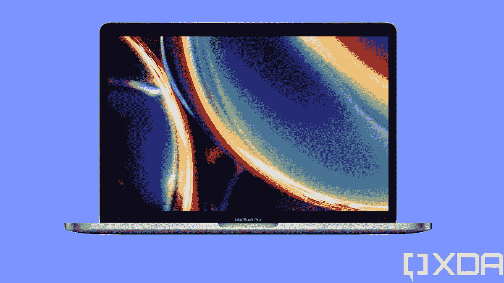

# 联想 ThinkPad X1 Yoga Gen 7 vs MacBook Pro:最好的笔记本电脑是什么？

> 原文：<https://www.xda-developers.com/lenovo-thinkpad-x1-yoga-gen-7-vs-macbook-pro/>

新一代笔记本电脑开始进入市场，其中包括新的联想 ThinkPad X1 Yoga Gen 7 。这款可转换的[商务笔记本电脑](https://www.xda-developers.com/best-business-laptops/)相比其前代产品进行了一些重大升级，最显著的是性能方面，这要归功于增加了英特尔的 28W P 系列处理器。但这回避了一个问题——联想 ThinkPad X1 Yoga Gen 7 是不是比你可能已经在考虑的另一款笔记本电脑(如苹果的 MacBook Pro)更好的选择？

在本文中，我们将在几个类别中对这两款笔记本电脑进行比较，以帮助您准确地做出决定。现在，重要的是要记住，MacBook Pro 有两个截然不同的版本——13 英寸的苹果 M1 处理器，或者 14/16 英寸的 [MacBook Pro，搭配苹果 M1 Pro 或 M1 Max](https://www.xda-developers.com/apple-macbook-pro-2021-m1-max-review/) 。坦率地说，将后者纳入这一比较可能没有太大意义，因为它是一台更强大、更昂贵的机器，几乎无法在同一类别中竞争。因此，我们将重点比较联想 ThinkPad X1 Yoga Gen 7 和采用苹果 M1 芯片组的 13 英寸 MacBook Pro。

**浏览本文:**

## 联想 ThinkPad X1 Yoga Gen 7 vs MacBook Pro:规格

|  | 

联想 ThinkPad X1 Yoga Gen 7

 | 

MacBook Pro 13 英寸(M1)

 |
| --- | --- | --- |
| **操作系统** |  |  |
| **CPU** | 

*   英特尔酷睿 i5-1240P (12 个内核，16 个线程，最高 4.4GHz，12MB 高速缓存)
*   英特尔酷睿 i5-1250P (12 个内核，16 个线程，最高 4.4GHz，12MB 高速缓存)
*   英特尔酷睿 i7-1260 处理器(12 个内核，16 个线程，最高 4.7GHz，18MB 高速缓存)
*   英特尔酷睿 i7-1270P (12 个内核，16 个线程，最高 4.8GHz，18MB 高速缓存)
*   英特尔酷睿 i7-1280P (14 个内核，20 个线程，最高 4.8GHz，24MB 高速缓存)

 | 

*   苹果 M1 (8 核，最高 3GHz)

 |
| **图形** |  |  |
| **显示** | 

*   14 英寸 WUXGA 16:10 (1920 x 1200) IPS 低功耗、触摸、防眩光、400 尼特、100% sRGB
*   14 英寸 WUXGA 16:10 (1920 x 1200) IPS 低功耗、触摸、防反光、防污染、400 尼特、100% sRGB
*   14 英寸 WUXGA 16:10 (1920 x 1200) IPS 低功耗、触摸、防眩光、隐私保护、500 尼特、100% sRGB
*   14 英寸 WQUXGA 16:10 (3840 x 2400)有机发光二极管低功耗、触摸、防反光、防污染、500 尼特、100% DCI-P3、杜比视界

 | 

*   13.3 英寸四核高清+ (2560 x 1600)视网膜(IPS)，500 尼特，P3 宽色彩，真实色调

 |
| **存储** | 

*   256GB PCIe 第四代固态硬盘
*   512GB PCIe 第四代固态硬盘
*   1TB PCIe 第四代固态硬盘
*   2TB PCIe 第四代固态硬盘

 | 

*   256GB 固态硬盘
*   512GB 固态硬盘
*   1TB 固态硬盘
*   2TB 固态硬盘

 |
| **闸板** | 

*   8GB LPDDR5 5200MHz(焊接)
*   16GB LPDDR5 5200MHz(焊接)
*   32GB LPDDR5 5200MHz(焊接)

 | 

*   8GB 统一内存
*   16GB 统一内存

 |
| **电池** | 

*   57 瓦时电池
    *   高达 65W 的 USB Type-C 电源适配器

 | 

*   58.2 瓦时电池
    *   61W USB Type-C 电源适配器

 |
| **端口** | 

*   2 个 Thunderbolt 4(USB C 型)
*   2 个 USB 3.2 第 1 代 A 型
*   1 个 HDMI 2.0b 接口
*   3.5 毫米耳机插孔
*   Nano SIM 卡插槽

 | 

*   2 个雷电 3 (USB 4 Type-C)
*   3.5 毫米耳机插孔

 |
| **音频** | 

*   2 个带杜比全景声的 2W 立体声扬声器
*   带杜比语音的四麦克风(远场)阵列

 | 

*   具有高动态范围和杜比全景声的立体声扬声器
*   三麦克风阵列

 |
| **相机** | 

*   720p 高清 RGB 网络摄像头
*   1080p 全高清 RGB 网络摄像头
*   1080p 全高清 RGB +红外网络摄像头
*   具有计算机视觉功能的 1080p 全高清 MIPI RGB +红外网络摄像头

 |  |
| **生物认证** | 

*   红外网络摄像头(可选)
*   指纹传感器

 |  |
| **连通性** | 

*   英特尔无线 6E
*   蓝牙 5.2
*   蜂窝选项:
    *   5G sub-6 Cat2o
    *   4G LTE Cat16

 | 

*   英特尔无线网络 6
*   蓝牙 5

 |
| **颜色** |  |  |
| **尺寸(WxDxH)** | 

*   314.4 x 222.3 x 15.53 毫米(12.38 x 8.75 x 0.61 英寸)

 | 

*   304.1 x 212.4 x 15.6 毫米(11.97 x 8.36 x 0.61 英寸)

 |
| **尺寸** | 起始重量为 1.38 千克(3 磅) | 起始重量为 1.4 千克(3 磅) |
| **价格** | 起价 1749 美元 | 起价 1299 美元 |

这两款笔记本电脑之间有一些主要的不同之处，但它们也有很多共同点，这一点应该很明显。让我们仔细看看为什么你可能更喜欢其中一个。

## 操作系统

我们必须首先解决这个问题，因为这很有可能是几乎所有人的最大决定因素。联想 ThinkPad X1 Yoga 和 MacBook Air 运行完全不同的操作系统，仅此一点就能为你做出决定。

对于 ThinkPad X1 Yoga，最受欢迎的选择可能是 Windows 11，这是大多数人都习惯使用的操作系统。大多数应用程序和软件都是为 Windows 设计的，或者说 Windows 经常是开发者的首选，因为它太受欢迎了。此外，Windows 11 对以前的版本进行了一些改变，使操作系统在视觉上更具吸引力，更容易为经验不足的用户导航。如果你不想要 Windows，你也可以选择在笔记本上安装 Ubuntu，这是最流行的 Linux 发行版之一。如果您是一名开发人员，或者您更喜欢依赖与 Microsoft 帐户无关的开源软件，您可能会更喜欢这种方式。

另一方面，MacBook Pro 运行 macOS，最新版本是 macOS Monterey。许多人普遍认为这是一个更加用户友好的操作系统，但它最出名的是它在内容创作者中的受欢迎程度。Apple 开发了 Final Cut Pro，这是专业人士最受欢迎和最强大的视频编辑工具之一。如果你不喜欢花钱，如果你想免费编辑一些视频，iMovie 也非常受欢迎。macOS 也是你为 iPhone 和 iPad 开发应用程序的唯一途径，所以这是你更喜欢它的另一个原因。

在一天结束的时候，这个聚会完全取决于你，你的需求和你熟悉的东西。两种操作系统都有各自的优势和劣势，有些人会选择一种，而有些人会选择另一种。

## 性能:英特尔的第 12 代处理器给苹果 M1 带来了压力

当苹果在 2020 年末首次推出 M1 处理器时，这是一件大事。它提供了比英特尔当时提供的任何产品都高得多的性能功耗比，使 MacBook Pro 和其他苹果产品既强大又高效。不过现在，英特尔拥有了第 12 代处理器，还推出了具有 28W TDP 的新 P 系列，性能更加强大。

这些处理器之所以有趣，有两个原因。首先，他们有一个混合架构，类似于苹果 M1，承诺更高的性能和效率。但它们也很有趣，因为它有 28W 的 TDP。英特尔的 28W 处理器并不是全新的，但直到 2020 年，它们都是苹果 13 英寸 MacBook Pro 的专属——你永远不会在 Windows 笔记本电脑上看到它们。随着苹果用自己的内部芯片取代英特尔 CPU，英特尔现在将这些 28W 型号带到了 Windows，使这场比赛更加合适。

|  | 

英特尔酷睿 i5-1250P( [参见测试](https://browser.geekbench.com/v5/cpu/14261198))

 | 

英特尔酷睿 i7-1280P( [参见测试](https://browser.geekbench.com/v5/cpu/14479944))

 | 

MacBook Pro(普通)

 |
| --- | --- | --- | --- |
| Geekbench 5(单核/多核) | 1,500 / 9,241 | 1,679 / 11620 | 1,707 / 7,394 |

我们仍然处于英特尔第 12 代处理器的早期阶段，因此我们还没有综合基准分数来与苹果的 MacBook Pro 进行性能比较，但我们可以使用我们所拥有的早期结果来进行比较。这不是一个完全公平的比较，但你可以知道会发生什么。从上面我们看到的情况来看，英特尔的处理器有望在 CPU 部门显著提高速度，尤其是在多核性能方面。

然而，重要的是要记住，除了 CPU 之外，还有很多因素影响着性能。英特尔第 12 代处理器中的集成显卡没有太大变化，这意味着你仍然有可能从苹果 M1 内部的 GPU 获得更好的 GPU 性能。你还必须注意性能功耗比。苹果的 M1 处理器不仅速度快，还能达到这样的速度，同时使用更少的功率，产生更少的热量。这意味着与 ThinkPad X1 Yoga 相比，MacBook Pro 的电池续航时间可能要长得多。

MacBook Pro 应该提供更好的电池寿命和 GPU 性能。

联想 ThinkPad X1 Yoga 还配备了新的更快的 LPDDR5 内存，最高可配置 32GB。与此同时，MacBook Pro 的最大容量为 16GB，但它确实受益于其芯片组的统一架构。内存内置于苹果 M1 芯片中，因此速度快，延迟少，内存可以由 CPU 和 GPU 平等访问，从而获得更好的性能。在存储方面，这两款笔记本电脑都可以配备高达 2TB 的固态硬盘。

## 显示屏和声音:ThinkPad X1 Yoga 有一个有机发光二极管显示屏

在观看和媒体体验方面，这两款笔记本电脑都有自己的优势。联想 ThinkPad X1 Yoga 配备了 14 英寸的显示屏和 16:10 的宽高比，在商务笔记本电脑上看起来非常棒。由于额外的垂直空间和更大的整体表面积，更高的显示器通常对生产力更好。这意味着您可以在不滚动的情况下阅读网页的更多内容，或者在 Adobe Premiere 等应用程序中查看更多 UI 元素。

基本型号具有全高清+分辨率(1920 x 1200)，您可以选择添加防反射涂层和隐私保护装置，以在您工作时保护信息免受窥探。然而，最大的升级是超高清+ (3840 x 2400) OLED 面板。这不仅是一个令人难以置信的清晰显示器，OLED 面板意味着你可以获得真正的黑色，生动的色彩和非常高的对比度，从而带来梦幻般的视觉体验。因为它是一个可转换的，所有的配置还包括触摸和笔支持，然后笔甚至包括和存储在笔记本电脑内，所以你永远不会丢失它。

与此同时，MacBook Pro 13 英寸的显示屏略小，为 13.3 英寸，尽管它仍然受益于 16:10 的高纵横比，这意味着它仍然有利于提高工作效率。它不提供任何配置选项，但基本型号配备了 Quad HD+分辨率(2560 x 1600)，因此它对任何人来说都足够好了。此外，凭借 500 尼特的峰值亮度和 P3 宽色彩，它将在户外看起来很棒，也非常适合创意专业人士。

联想 ThinkPad X1 Yoga 可以提供更好的体验，但获得 OLED 面板会花掉你一大笔钱，而 MacBook Pro 的起价已经低得多。如果你想在不花太多钱的情况下获得出色的体验，MacBook Pro 可能是更好的选择。然而，如果你想要触摸支持，ThinkPad X1 Yoga 是你唯一的选择。

在显示屏上，联想也凭借新的和改进的网络摄像头遥遥领先。大多数型号都包括一个新的全高清传感器，你甚至可以选择支持“计算机视觉”的 MIPI 摄像头，这样它就可以判断你何时靠近笔记本电脑，何时远离它。除了指纹识别器之外，它还可以选择支持 Windows Hello 面部识别——这是解锁 PC 最方便的方式。

ThinkPad X1 Yoga 有一个完整的 HH 网络摄像头，可选配 Windows Hello。

与此同时，MacBook Pro 有一个 720p FaceTime 高清摄像头，所以它并不令人印象深刻，但苹果公司正在利用苹果 M1 处理器内部的神经引擎来提高图像质量。MacBook Pro 没有面部识别功能，但如果你想更容易地解锁笔记本电脑，可以使用电源按钮内置的触控 ID 传感器。

至于声音，这两款笔记本电脑都有一个支持杜比 Atmos 的立体声系统，总体上应该会给你一个坚实的体验。MacBook 通常以其出色的声音而闻名，虽然这不会像更大的 MacBook Pro 机型那样好，但应该仍然很棒。至于音频录制，联想 ThinkPad X1 Yoga Gen 7 有一个四麦克风阵列，而 MacBook Pro 使用三个麦克风。两者的经历应该不会相差太远。

## 设计:两台有点无聊，但时尚的笔记本电脑

就外观而言，这两款笔记本电脑都不是特别令人兴奋，但这可能不是你想要的。联想 ThinkPad X1 Yoga 继承了 ThinkPad 家族的传统，但包装更加现代。你得到了标志性的红色口音和功能，如跟踪点，虽然不是黑色，底盘是银色的。它也是一款敞篷车，这增加了这是一款更现代的设备的感觉，但它仍然完全像一款 ThinkPad，而且它主要迎合了该品牌的现有粉丝。

与此同时，MacBook Pro 是一款外观更现代的笔记本电脑，但看起来也没有什么特别的意思。它有银色或太空灰两种配色，除了非常干净和具有标志性之外，它的外观没有任何值得注意的地方。这款机型也可能是最后一款采用苹果 Touch Bar 取代键盘顶部物理功能行的机型。

从更技术性的角度来看，两款笔记本电脑的厚度(约 0.61 英寸)和重量(3 磅)相似，因此便携性应该不是两者之间的一个重要决定因素。当然，由于更大的显示屏，ThinkPad 的宽度和高度都更大，但这是意料之中的。实际上值得注意的是，尽管更小，拥有更高效的处理器，并且没有可转换的设计，MacBook Pro 仍然像联想 ThinkPad X1 Yoga 一样重。苹果的设计没有想象中的轻巧，但最终也不会有太大的不同。

## 端口和连接:联想 ThinkPad X1 Yoga 的功能更加丰富

再加上端口，这是联想 ThinkPad X1 Yoga 非常有说服力地战胜 MacBook Pro 的一个方面。正如你可能对商务笔记本电脑的期望一样，这款笔记本电脑功能非常丰富，如果你选择蜂窝模式，你可以获得两个 Thunderbolt 4 端口、两个 USB Type-A 端口、HDMI、一个耳机插孔和一个 nano-SIM 卡插槽(稍后会详细介绍)。这不仅是一个可靠的端口集合，而且 Thunderbolt 支持还意味着当您需要额外的图形处理能力时，您可以连接更多的外围设备，如 Thunderbolt 坞站、外部显示器，甚至是一个[外部 GPU](https://www.xda-developers.com/best-external-gpus-for-your-laptop/) 。

至于 MacBook Pro，它配有两个雷电 3 端口和一个耳机插孔，仅此而已。开箱后的设置非常有限，虽然你可以使用 Thunderbolt dock 来连接额外的外围设备，但 MacBook Pro 上的端口只支持一个外部显示器。此外，由于苹果硅架构，没有外部 GPU 支持。

除了端口，ThinkPad 还在无线连接方面胜出，主要是因为它让你可以选择 4G LTE 或 5G 支持。蜂窝网络支持在商用笔记本电脑中相当普遍，它允许您从任何地方连接到互联网，而不必在公共场所求助于不安全的 Wi-Fi 网络。当你使用 Wi-Fi 时，ThinkPad X1 Yoga 也支持比 MacBook Pro 上的 Wi-Fi 6 更高的 Wi-Fi 6E 标准。两款笔记本电脑也都支持蓝牙 5。

## 联想 ThinkPad X1 Yoga Gen 7 vs MacBook Pro:最终想法

考虑到这些，你应该买哪一款笔记本电脑呢？正如我们提到的，这个决定很有可能落在操作系统上。如果你喜欢 Windows，你会更喜欢 ThinkPad，如果你喜欢 macOS，MacBook Pro 是显而易见的选择。

在其他方面，笔记本电脑交易失败。联想 ThinkPad X1 Yoga 可能会提供更好的 CPU 性能，此外还有更大的 RAM、可转换的设计和更加多功能的端口设置。此外，您可以为它配置非凡的超高清+有机发光二极管显示屏，这比您在 MacBook Pro 上获得的体验要好得多。

但所有这些都是有代价的，即使是配备较慢处理器、更基本显示屏和类似规格的基本配置，成本也远远高于 MacBook Pro 的基本价格。如果你想在 ThinkPad 上增加手机连接和有机发光二极管显示屏等功能，你的花费可能会远远超过 2000 美元。

MacBook Pro 可能没有商业用户可能欣赏的所有功能，但它的基本价格提供了很多功能，而且价格也便宜得多。你可以在每种配置中获得超清晰的显示器，一个非常高效的处理器和一个更强大的 GPU，所有的基本功能都还在。你错过了蜂窝支持和端口，但这取决于你有多重要。

在一天结束时，这两款笔记本电脑都不会出错，如果你认为其中一款会给你带来良好的体验，它很可能会。你可以在下面购买你最喜欢的一款，但是如果你不相信其中任何一款，也许可以看看我们对[最佳笔记本电脑](https://www.xda-developers.com/best-laptops/)的总结，或者如果你想看看联想还能提供什么的话，可以看看[最佳 ThinkPad](https://www.xda-developers.com/best-thinkpads/)。如果你对苹果电脑更感兴趣，我们也有一份[最佳苹果电脑](https://www.xda-developers.com/best-macs/)的综述。

 <picture></picture> 

Lenovo ThinkPad X1 Yoga Gen 7

##### 联想 ThinkPad X1 Yoga Gen 7

联想 ThinkPad X1 Yoga Gen 7 是一款功能强大的敞篷电脑，采用第 12 代英特尔处理器，最高可配超高清+有机发光二极管显示屏。此外，您可以通过全高清网络摄像头获得它。

 <picture></picture> 

MacBook Pro 13-inch (M1)

##### 苹果 MacBook Pro 13 英寸(M1，2020 年)

13 英寸的 MacBook Pro 由苹果 M1 芯片组驱动，提供了大多数其他笔记本电脑所没有的性能和效率。