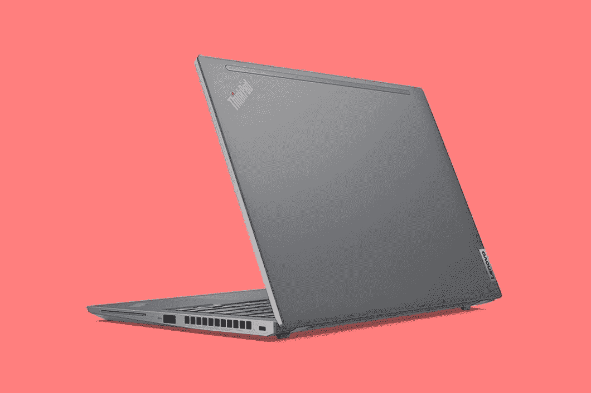

# 联想 ThinkPad X13 评测:16:10 显示屏的主流 ThinkPad

> 原文：<https://www.xda-developers.com/lenovo-thinkpad-x13-gen-2-review/>

联想 ThinkPad X13 本应位于 ThinkPad 系列的高端。虽然它通常应该很轻，就像更紧凑的 ThinkPad T14s 或类似的东西，但这款电脑的重量超过 3 磅。这是因为它是由铝，而不是碳纤维或镁制成的。

对于这一代人来说，有两件重要的事情是新的，而且都很重要。一个是这个产品现在有 16:10 的显示屏，所以比以前高了。另一件事更明显，因为它配备了英特尔的第 11 代“老虎湖”处理器。这意味着你还可以获得 Iris Xe 显卡、[《霹雳 4》](https://www.xda-developers.com/best-thunderbolt-4-laptops/)等等。

### 联想 ThinkPad X13 规格

| 

处理器

 | 英特尔酷睿 i5-1335G7 处理器(4C/8T，2.4/4.2 GHz，8MB) |
| 

制图法

 | 英特尔 Iris Xe 显卡 |
| 

记忆

 | 8GB LPDDR4x-4266 双通道 |
| 

显示

 | 13.3 英寸 WUXGA (1920 x 1200) IPS，300 尼特 |
| 

身体

 | 305.8 x 217.89 x 18.06 毫米(12.04x8.58x0.71 英寸)，1.38 千克(3.04 磅) |
| 

储存；储备

 | 256GB M.2 2280 固态硬盘 |
| 

连通性

 | 英特尔 Wi-Fi 6 AX210 +蓝牙 5.2 |
| 

港口

 | (1) USB 3.2 Gen 1(1) USB 3.2 Gen 1(始终开启)(2) Thunderbolt 4(1) HDMI 2.0(1)耳机/麦克风组合插孔(1)侧面坞站连接器 |
| 

声音的

 | 杜比音频扬声器系统认证 2W x 2 立体声扬声器双阵列麦克风，远场 |
| 

投入

 | 6 排多媒体 Fn 键、LED 背光、防溅聚酯薄膜表面多点触控触摸板、跟踪点 |
| 

安全性

 | 匹配芯片指纹识别器、带隐私快门的 720p 摄像头、开机密码、独立 TPM 2.0、TCG 认证、Kensington Nano 安全锁插槽 |
| 

电池

 | 54.7 瓦时电池，快速充电 |
| 

颜色和材料

 | 风暴灰:铝(顶部和底部) |
| 

操作系统

 | Windows 10 专业版 |
| 

价格

 | $1,345.99 |

显然，你可以选择更高端的选项，比如更多内存、更多存储、5G 等等。这只是联想发给我的模型。

## 设计和显示:ThinkPad X13 感觉很像 X1 Yoga

联想 ThinkPad X13 的外观和感觉都很像 ThinkPad X1 Yoga，主要是因为它由铝制成，并有风暴灰色。这在 ThinkPadss 上并不常见，ThinkPad 更出名的是黑色，由碳纤维等材料制成。不过，与 X1 Yoga 不同的是，你可以买到黑色的 ThinkPad X13，而且重量会减轻约四分之一磅。毕竟，铝是笔记本电脑机箱中最重的材料之一。

显然，从外观上来看，区分这款电脑和 X1 Yoga 的一个简单方法是，它使用了银色的 ThinkPad 标志，这是为主流电脑保留的。事实上，一台主流的个人电脑正是如此。它有一些像 Thunderbolt 这样的好东西，但它缺少一些花里胡哨的东西，比如用于 [Windows Hello](https://www.xda-developers.com/best-laptops-with-windows-hello/) 的红外摄像头。

在笔记本电脑的左侧有两个 Thunderbolt 4 端口，其中一个可以与联想的机械坞站配合使用。然而，如果你没有使用坞站，你可以单独使用任何一个端口来做你使用 Thunderbolt 4 的任何事情，无论是连接多个 4K 显示器还是只是充电。同样在左侧，有一个 HDMI 2.0 端口和一个 USB 3.2 Gen 1 Type-A 端口，这意味着它可以获得 5Gbps。

右边还有一个 USB 3.2 Gen 1 Type-A 口，没问题。你还可以在那一侧找到一个可选的智能卡读卡器。

[sc name = " pull-quote-left " quote = "联想表示 16:10 是最理想的宽高比。"]今年联想 ThinkPad X13 的一大亮点是它拥有 16:10 的显示屏。联想[告诉我，它认为 16:10 是最完美的宽高比](https://www.xda-developers.com/lenovo-thinkpad-x1-titanium-nano-interview/)，我们已经在高端 X1 系列上看到了它，但这是第一个主流 ThinkPad 获得它。期待明年二月阵容刷新的时候，其余的也能拿到 16:10 的屏幕。

新的长宽比有助于更高的显示器，由于它的对角线仍然是 13.3 英寸，它实际上提供了更多的表面积。分辨率为 1,920 x 1,200，相当于全高清。分辨率很好，颜色也很好。在 100% sRGB 的情况下，这很好，但在 77% Adobe RGB 和 77% P3 的情况下，这并没有真正超出预期。我还是会用“很好”这个词来形容它。

我对显示器最大的问题是亮度，最大值为 300 尼特。对于室内使用，我把它保持在 75%左右，这比我在其他笔记本电脑上需要的要高，其他笔记本电脑有更亮的显示屏。对于户外使用，这几乎是不可能的。事实上，如果你愿意，你可以配置 5G 连接，但如果你在旅途中使用它，请确保你将在室内使用它。

它也有相对较大的边框，这实际上有点奇怪。我认为 X 系列比高级 X1 系列低一步，甚至侧挡板也比预期的大。顶部挡板包括 720p 网络摄像头，很遗憾 FHD 不是标准配置。它*配备了一个 1080p 的网络摄像头，这很好，这是今年的一个重要增加。如果你得到了 [FHD 的网络摄像头](https://www.xda-developers.com/best-laptops-1080p-webcam)，你还会得到一个用于 Windows Hello 的红外摄像头。正如我前面提到的，这些东西不是标准的，因为这不是旗舰级的产品。*

如果你有 1080p 网络摄像头和红外摄像头，还有另一个选项，即人类存在检测。这是一个很好的功能，可以检测你何时在笔记本电脑前。当您坐下时，它会将其唤醒，然后红外摄像头可用于识别是您登录，因此您可以登录到您的 PC，而无需触摸它。它还可以知道在你离开时锁定你的电脑。

## 键盘和触摸板:这是你对 ThinkPad 的期望

键盘相当标准，尽管它比全尺寸的小一点。这是一款紧凑型笔记本电脑，记住，因为屏幕更高，所以也更窄。按键的深度也很舒服，尽管联想没有说具体是什么。它不会超过 1.5 毫米，这是肯定的，我确实喜欢 ThinkPads 的键盘像这样稍微浅一点。该公司在确保按键力度相同方面做得很好，但与此同时，更短的按键感觉更现代。

让我想到 X1 Yoga 的一件事是联想 ThinkPad X13 去掉了红色。全是风暴灰色，看起来更加精致。

显然，它仍然拥有 TrackPoint，这是 Windows 触摸板糟糕透顶的时代的遗物。如果你愿意，你可以用它来控制指针。我个人就是无视。不过，这是 ThinkPad 的主打产品，不会有任何发展。

还有一个微软精密触摸板，上面有物理按钮。这些本来是要和 TrackPoint 一起使用的，但即使和触摸板一起使用也很方便。不过就我个人而言，我认为是时候让联想放弃一些传统的输入设备了。至少，它可以停止在每一台 ThinkPad 上使用它们。

电源按钮位于键盘的左上方，它还可以充当指纹传感器。事实上，扬声器格栅中有一个小 LED，可以指示电源或指纹传感器的状态。

键盘顶部有一个条形音箱，包括两个使用杜比音频的 2W 扬声器。声音不是特别强，但是很清晰。它非常适合打电话，或者在办公桌上听音乐。

## 性能和电池寿命:联想 ThinkPad X13 配有英特尔 Tiger Lake 处理器

联想发给我的型号包括英特尔酷睿 i5-1135G7，8GB 内存和 256GB 固态硬盘，所以这是一个非常主流的配置。当然，你可以用酷睿 i7-1185G7、16GB 内存、1TB 固态硬盘、1080p 网络摄像头和 [5G 连接](https://www.xda-developers.com/best-5g-laptops/)来配置它。这款笔记本电脑甚至可以配备 AMD 锐龙 5000 处理器，如果你更感兴趣的话。联想发给我的是一款基于英特尔技术的基本型号。

正如你所期待的，性能是体面的，但我会给你我一贯的建议。选择 16GB 内存。你不会后悔的。

由于 Iris Xe 显卡，英特尔的 Tiger Lake 处理器比第十代 CPU 有了很大的改进。然而，对于商用电脑来说，这是比消费电脑更大的升级，这要归功于第十代“彗星湖”仍然是基于 14 纳米工艺和使用 UHD 图形。

事实上，酷睿 i5-1135G7 比你在联想 ThinkPad X13 Gen 1 中找到的酷睿 i5-10210U 要好得多。不过，这种配置仍然是入门级配置。这意味着当我在 Slack、Skype 和 OneNote 打开的情况下最小化我的十几个浏览器标签时，当我在 Photoshop 中编辑图像时，它会有点堵塞。但它完成了工作。

电池寿命相当不错，因为我能够正常使用超过六个小时(电源滑块比节电模式高一个档次，屏幕亮度为 75%)。然而，我之前在 ThinkPads 上确实遇到过一个奇怪的 bug。偶尔，当电池电量不足时——可能只有三分之一——它会很快死去。我注意到节电图标亮了——这意味着电量下降到了 20%。我在 10%的时候冲向充电器，在我插上之前它就没电了。很少，但是发生了就很烦。

对于基准测试，我使用了 PCMark 8 和 PCMark 10。

|  | 

ThinkPad X13Core i5-1135G7

 | 

ThinkPad X13 Gen 1Ryzen PRO 4650U

 | 

联想 Yoga C740Core i5-10210U

 |
| --- | --- | --- | --- |
| 

PCMark 8:主页

 | 4,406 | 3,987 | 3,578 |
| 

PCMark 8:创意

 | 4,614 | 4,281 | 3,705 |
| 

PCMark 8:工作

 | 4,012 | 3,641 | 3,714 |
| 

PCMark 10

 | 4,854 | 4,859 | 4,124 |

对于去年的 ThinkPad X13，我回顾了 AMD 锐龙 PRO 型号，在 PCMark 10 测试中，两者几乎相同。在 PCMark 8 测试中，今年的英特尔模型表现得更好。相比于 Yoga C740 中的彗星湖处理器，11 代是冒烟的。

## 结论:该不该买联想 ThinkPad X13 Gen 2？

联想 ThinkPad X13 Gen 2 是一款出色的主流商务笔记本电脑。联想发给我的基本型电脑有点简陋，但这并不意味着它是台糟糕的电脑。它仍然有坚固的铝制外壳和最好的键盘之一。

[sc name = " pull-quote-right " quote = "在主流笔记本电脑中，联想 ThinkPad X13 提供了 5G 和 1080p 网络摄像头等高级功能。"我真希望键盘能大一点。它的左右两边都有空间，所以肯定有空间放它。我也希望屏幕亮一点，至少默认是这样。

不过，最酷的是。在主流笔记本电脑中，联想 ThinkPad X13 提供了 5G 和 1080p 网络摄像头等高级功能。首先，1080 像素的网络摄像头是“在任何地方工作”这种生活方式的主要组成部分。两年前，网络摄像头的质量并不像今天这样重要。尽管如此，它有点令人失望的 FHD 网络摄像头不是标配。我会批评 5G 没有成为标准，但可悲的是，这些天没有笔记本电脑在基本型号中包括蜂窝连接，即使是高通供电的笔记本电脑，在圣地亚哥公司承诺这是一个价值主张后。

它不像联想 ThinkPad X1 笔记本电脑那样轻薄，正如我前面所说，它没有一些花哨的功能，至少不是标准的，但有了这些选项，ThinkPad X13 肯定有很多功能。

 <picture></picture> 

Lenovo ThinkPad X13 Gen 2

##### 联想 ThinkPad X13 Gen 2

联想 ThinkPad X13 Gen 2 是一款主流商务笔记本电脑，具有坚固的外形和卓越的功能。