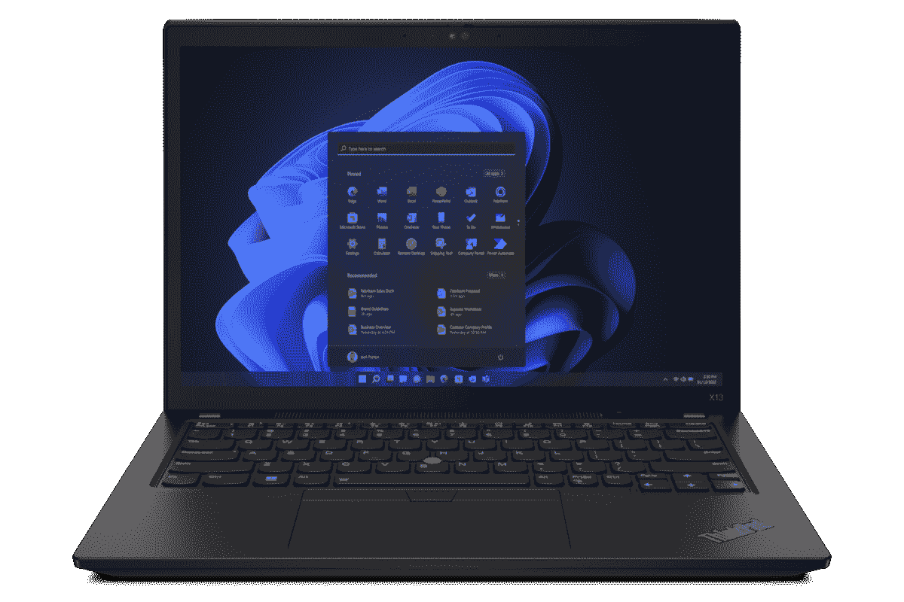

# 联想 ThinkPad X13 Gen 3:发布日期、价格和其他信息

> 原文：<https://www.xda-developers.com/lenovo-thinkpad-x13-gen-3/>

联想最近推出了 ThinkPad X13 笔记本电脑的最新版本，被恰当地称为 ThinkPad X13 Gen 3。像今年推出的大多数其他笔记本电脑一样，这款笔记本电脑采用第 12 代英特尔博锐处理器，如果您喜欢，还可以选择 AMD 锐龙 PRO 6000 处理器。它还配备了可选的全高清网络摄像头，支持 Windows Hello，16:10 显示屏，以及其他规格，使其成为一款出色的商用笔记本电脑。

如果你想知道关于联想 ThinkPad X13 Gen 3 的一切，你来对地方了。我们收集了规格、价格、发布日期等信息，你可以在下面查看。

## 规范

|  | 

联想 ThinkPad X13 Gen 3

 |
| --- | --- |
| **操作系统** |  |
| **处理器** | 

*   最高可配第 12 代英特尔酷睿 i7 博锐处理器
*   高达 AMD 锐龙 PRO 6000 系列

 |
| **图形** | 

*   英特尔 Iris Xe 显卡(集成)
*   AMD 镭龙 600M 显卡(集成)

 |
| **撞锤** |  |
| **存储** |  |
| **显示** | 

*   13.3 英寸，16:10，最高可达 Quad HD+ (2560 x 1600)，400 尼特，杜比视界
    *   提供触摸、隐私保护选项

 |
| **音频** | 

*   杜比音频扬声器系统
*   杜比语音话筒

 |
| **网络摄像头** | 

*   高达全高清 1080p +红外网络摄像头，带隐私快门

 |
| **安全** | 

*   指纹识别器(可选)
*   红外摄像机(可选)
*   磁贴就绪(英特尔型号)
*   安全核心电脑

 |
| **电池** | 

*   41 瓦时电池(长达 11.5 小时)
*   54.7 瓦时电池(长达 15.5 小时)

 |
| **端口** | 

*   **英特尔:** 2 个迅雷 4 (USB Type-C)
*   **AMD:** 1 个 USB 4(C 型)，1 个 USB 3.2(C 型)
*   2 个 USB 3.2 第 1 代 A 型
*   1 个 HDMI 2.0b 接口
*   3.5 毫米耳机插孔
*   Nano SIM 卡插槽

 |
| **连通性** | 

*   Wi-Fi 6E
*   蓝牙 5.2
*   蜂窝选项:

 |
| **颜色** |  |
| **尺寸(WxDxH)** | 

*   305.8 x 217.56 x 18.1 毫米(12.04 x 8.56 x 0.71 英寸)

 |
| **重量** | 起始重量为 1.19 千克(2.62 磅) |
| **起始价格** | 1119 美元(AMD)/1179 美元(英特尔) |

## 联想 ThinkPad X13 Gen 3 发布日期是什么时候？

联想在 3 月中旬宣布了 ThinkPad X13 Gen 3，但正式发布是在几个月后。英特尔和 AMD 驱动的型号都在 2022 年 6 月推出。但是，并非所有上述配置在发布时都可用。

随着时间的推移，新的配置将会推出，最终您也应该能够完全按照您想要的规格配置您的笔记本电脑。在首次发布后，所有型号可能需要几周时间才能上市。

造成这种情况的部分原因与供应短缺有关，供应短缺目前正影响着技术世界的许多方面。满足需求越来越困难，因此不同配置的缓慢推出使公司能够确保他们拥有可用模型所需的组件。

## 联想 ThinkPad X13 Gen 3 的价格会是多少？

AMD 和 Intel 型号的联想 ThinkPad X13 Gen 3 的起价不同。AMD 版本的正式起价为 1119 美元，而英特尔版本的起价为 1179 美元。然而，不同配置的价格差异很大，上市时提供的选项稍贵一些。

每种配置的价格很难说，因为联想只公布了起始价格。此外，联想经常对其许多型号进行销售，因此价格可能会随着时间的推移而发生很大变化，值得你亲自查看一下。

## 怎么样

正如你所料，新一代联想 ThinkPad X13 比上一代产品有了一些新的改进。这次升级大部分是迭代的，但是有一些值得注意的变化，特别是在内部方面。这是今年新款的所有新品或改进品。

### 新的英特尔和 AMD 处理器

ThinkPad X13 Gen 3 最大的升级在于处理器。这些新型号配备了第 12 代英特尔酷睿 T1 或 T2 AMD 锐龙 PRO 6000 系列 T3 处理器，并且在不同的方面都有很大的改进。

英特尔的第 12 代处理器在 CPU 方面有一些重大变化。英特尔现在使用混合架构，混合了高性能(P)内核和高效(E)内核。这允许更高的核心总数，特别是英特尔的移动处理器在 P 系列中有多达 14 个核心(6P + 8E)，或在 U 系列中有 10 个核心(2P + 8E)。虽然我们只看到了早期的基准测试结果，但结果非常有希望，尤其是多核性能，似乎比前几代产品好得多。不过集成显卡大多没变。

另一方面，AMD 的锐龙 6000 系列处理器对 CPU 进行了一些更小的改进。这些型号的大焦点是新的集成 GPU，镭龙 600M。这款新的 GPU 基于 AMD 的 RDNA2 架构，在图形方面有很大的性能提升。事实上，AMD 表示，它的集成 GPU 现在在许多游戏中比英伟达的 GeForce MX450 独立 GPU 更快。如果你想做一些游戏，或者如果你的工作需要更多的 GPU，这是一个很大的升级。

### 全高清网络摄像头和更好的麦克风

ThinkPad X13 Gen 3 是为协作而设计的，因此，联想对通信方面进行了一些改进。ThinkPad X13 Gen 3 配备了支持杜比语音的麦克风。这是一项旨在让通话中的声音更清晰的功能。内置麦克风可以过滤背景噪音，使您的声音更清晰，它们还可以拾取更安静的声音并放大它们，因此每个人都可以清楚地听到。

虽然这不是今年的全新产品，但 ThinkPad X13 Gen 3 还配备了全高清网络摄像头作为可选升级。这将显著提高视频通话质量，这在过去几年中变得更加重要。

### 磁贴集成(英特尔)

联想 ThinkPad X13 的英特尔型号采用了全新的 Tile 集成。如果你不熟悉它，Tile 是一家生产世界上最受欢迎的物品追踪器的公司，即使你已经在很远的地方，它也能让你找到你丢失的物品。通常，你必须在你的设备上安装一个追踪器，但是 ThinkPad X13 内置了追踪器。这样，即使笔记本电脑关机，您也可以随时找到它，这样，如果有人丢失或被盗，您可以更容易地找回它。

## 哪里可以买到联想 ThinkPad X13 Gen 3？

如果你有兴趣购买联想 ThinkPad X13 Gen 3，最好的地方是联想的网站。这是它首先启动的地方，也是您可以找到所有可用配置选项的地方。您可以在下面查看:

 <picture></picture> 

Lenovo ThinkPad X13 Gen 3

##### 联想 ThinkPad X13 Gen 3

联想 ThinkPad X13 采用了标志性的 ThinkPad 设计以及英特尔和 AMD 版本的强大规格。

更一般的零售商，如亚马逊或百思买，也可以提供某些配置，但它们通常需要一段时间才能出现在那里。另外，您只能使用少数几种配置，尽管公平地说，它们通常是最受欢迎的配置。当 ThinkPad X13 上市时，我们一定会在这一部分提供购买链接。与此同时，你可能想看看你现在能买到的最好的 ThinkPads。或者，如果你不喜欢联想，看看我们的[最佳笔记本电脑](https://www.xda-developers.com/best-laptops/)综合报道。