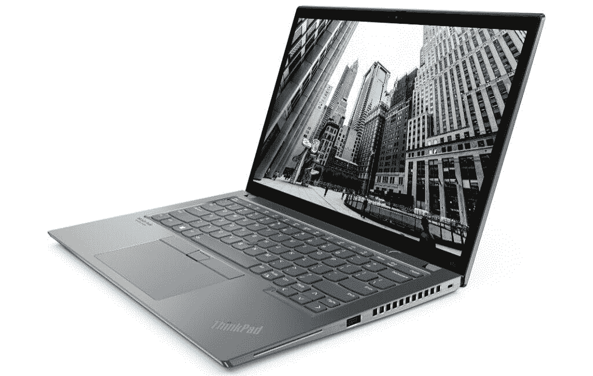

# 联想在其 ThinkPad 系列笔记本电脑下推出新机型

> 原文：<https://www.xda-developers.com/lenovo-thinkpad-x13-new-updates/>

联想为其 ThinkPad 系列带来了另一波升级，一系列型号获得了最新的[英特尔第 11 代 Tiger Lake CPU](https://www.xda-developers.com/intel-tiger-lake-11th-gen-core-i3-i5-i7-xe/)和 [AMD 锐龙 5000 系列 CPU。](https://www.xda-developers.com/amd-ryzen-5000-mobile-7nm-zen-3/)其中包括 ThinkPad X13、ThinkPad X13 Yoga、ThinkPad T14s 系列、ThinkPad T14 系列、ThinkPad T15、ThinkPad L14、ThinkPad L15、ThinkPad P14s 系列和 ThinkPad P15s。

最吸引人的更新似乎是 ThinkPad X13，它现在被称为 ThinkPad X13 Gen 2。它包括新的 AMD CPUs 和更新的英特尔处理器。虽然该公司目前只分享了英特尔变种的细节，但我们认为 AMD 版本也应该有相同的升级。更新的笔记本电脑采用 13.3 英寸 WUXGA (1920 x 1200 像素)IPS 显示屏，分辨率为 16:10，峰值亮度为 300 尼特，100%覆盖 sRGB 色彩空间。笔记本电脑的非触摸屏版本在 500 尼特时提供了更好的亮度。ThinkPad X13 Yoga 也将采用 16:10 的显示屏。

 <picture></picture> 

Lenovo ThinkPad X13 Gen 2

在内部，该笔记本电脑可以配置高达第 11 代英特尔酷睿 i7 博锐处理器和英特尔 Iris Xe 显卡，以及高达 32GB 的 LPDDR4x RAM(主频为 4，266Mhz)和高达 2TB 的 PCIe 第四代固态硬盘。有 Wi-Fi 6E/ Wi-Fi 6，还有可选的 5G 连接和 NFC。至于 I/O，你有两个 Thunderbolt 4 端口，两个 USB Type-A 3.2 端口，一个 HDMI 2.0 端口和一个耳机插孔。电池额定功率为 54.7 瓦时，一次充电可使用 15.5 小时。联想还将提供一种更小的 41 瓦时电池，额定使用时间为 12 小时。其他功能包括 1.5 毫米按键行程的背光键盘，带杜比音频的前置扬声器和两个远场麦克风。

除了英特尔和 AMD 的新处理器选项，其余型号预计将在英特尔变种上支持 Wi-Fi 6E，在 AMD 变种上支持 Wi-Fi 6。一些型号还将提供可选的 5G 连接。笔记本电脑也获得了新的杜比扬声器系统和安全功能，包括芯片匹配指纹读取器和一些英特尔变种上的人类存在检测传感器。

尽管联想尚未透露所有新款笔记本电脑的确切发布日期，但该公司透露，英特尔型号将于 3 月上市，AMD 型号将于 5 月上市。X13 Yoga 是唯一的例外，因为它将于 4 月上市。就定价而言，新款 ThinkPad X13 系列的 AMD 机型起价为 1139 美元，Intel 机型起价为 1299 美元。X13 Yoga 的起价为 1379 美元。ThinkPad T 系列的起价为 1159 美元，ThinkPad L 系列为 689 美元，ThinkPad P 系列为 1169 美元。您可以查看下表，了解所有更新型号的定价和暂定供货信息。

值得注意的是，该公司最近在 CES 2021 上宣布了一批新的 [ThinkPad](https://www.xda-developers.com/lenovo-thinkpad-2021-range-ces-2021/) 和 [ThinkBook](https://www.xda-developers.com/lenovo-thinkbook-series-launch-ces-2021/) 笔记本电脑，采用最新的英特尔第 11 代 Tiger Lake CPUs 和 AMD 锐龙 5000 系列 CPU。此外，该公司还[上个月用新的 AMD 锐龙处理器更新了其专注于游戏的军团阵容](https://www.xda-developers.com/lenovo-legion-7-legion-5-pro-legion-slim-7-gaming-notebooks-powered-by-amd-ryzen-processors/)。

| 

模型

 | 

价格

 | 

有效性

 |
| --- | --- | --- |
| ThinkPad T14s *i* | $1,499 | 2021 年 3 月 |
| ThinkPad T14s | $1,279 | 2021 年 5 月 |
| ThinkPad T14 *i* | $1,379 | 2021 年 3 月 |
| ThinkPad T14 | $1,159 | 2021 年 5 月 |
| ThinkPad T15 | $1,379 | 2021 年 3 月 |
| ThinkPad X13 Yoga | $1,379 | 2021 年 4 月 |
| ThinkPad X13 *i* | $1,299 | 2021 年 3 月 |
| ThinkPad X13 | $1,139 | 2021 年 5 月 |
| ThinkPad L14 | $689 | 2021 年 5 月 |
| ThinkPad L15 | $689 | 2021 年 5 月 |
| ThinkPad P14s *i* | $1,389 | 2021 年 3 月 |
| ThinkPad P14s | $1,169 | 2021 年 5 月 |
| ThinkPad P15s |  $1,389 | 2021 年 3 月 |

如果你有兴趣了解更多关于更新的联想 ThinkPad 阵容，你可以在这里找到官方发布的。