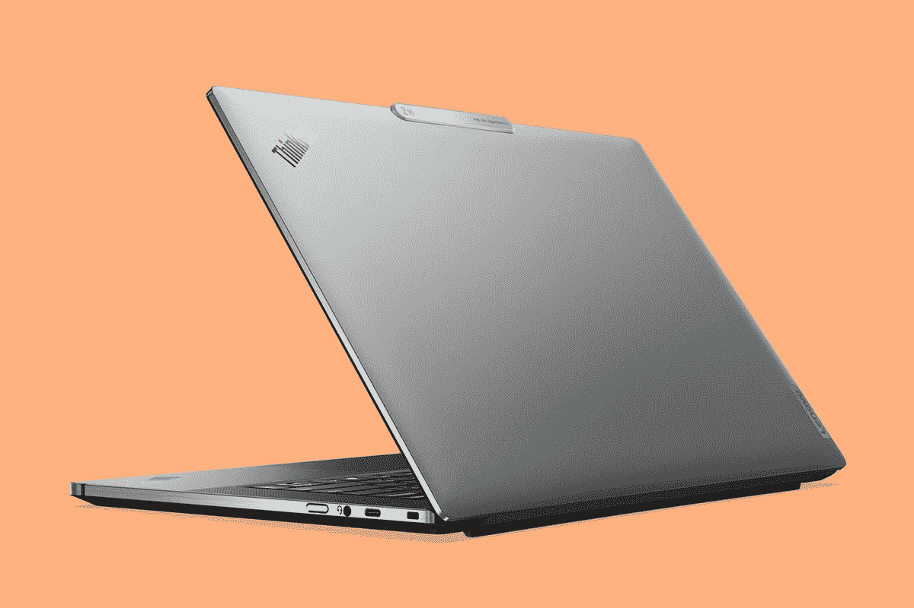

# 联想 ThinkPad Z16 评测:大锐龙能量

> 原文：<https://www.xda-developers.com/lenovo-thinkpad-z16-review/>

早在今年的 CES 上宣布，联想的 ThinkPad Z 系列是对 ThinkPad 的现代演绎，ThinkPad 是一个以保留传统组件而闻名的品牌，坦率地说，有点过时。联想 ThinkPad Z16 比 ThinkPad Z13 大，现在我已经对它们进行了评测，我实际上认为前者是更好的产品。

这是一台[伟大的商用笔记本电脑](https://www.xda-developers.com/best-business-laptops/)。它有一个 16 英寸的 16:10 显示屏，一个出色的 1.35 毫米键盘，和坚实的构建质量。

我最喜欢的是联想采取的措施，让它更现代，并在其他[联想笔记本电脑](https://www.xda-developers.com/best-lenovo-laptops/)中脱颖而出。例如，ThinkPad Z16 的触摸板上方没有按钮。取而代之的是一个更大的触觉触摸板，由于触觉触摸板的性质，如果你愿意，你可以将顶部用作 TrackPoint 的按钮。或者，它们可以用作触摸板的扩展。也有一些小事情。例如，Ctrl 键位于 Fn 键的左侧，这对于任何笔记本电脑来说都是正常的，但对于 ThinkPad 来说并不典型。

唯一真正的缺点是，AMD 锐龙移动处理器的性能受到影响时，它没有连接到电源。但相比 Z13，我更喜欢 ThinkPad Z16 的主要原因是，在现实世界的使用中，我没有发现这个问题。

**浏览此评论:**

## 联想 ThinkPad Z16 定价和供货情况

*   联想 ThinkPad Z16 于 2022 年底推出，目前起价为 1654.50 美元

虽然联想实际上在 2022 年 1 月的 CES 上宣布了其全新的 ThinkPad Z 系列，但 AMD 实际上直到当年晚些时候才开始发运锐龙 6000，远在英特尔开始发运其移动第 12 代芯片之后。不过，联想 ThinkPad Z16 现在已经上市，在 Lenovo.com 的起价为 1654.50 美元。当然，联想网站上的价格会有波动。

该公司发给我的型号售价 2196.95 美元，来自 B&H 和 CDW 等第三方零售商。它包括一个 AMD 锐龙 7 PRO 6850H，集成显卡，不像 Lenovo.com 上的设备，FHD+显示屏，16GB LPDDR5 和 512GB SSD。

## 联想 ThinkPad Z16 规格

| 

处理器

 | AMD 锐龙 7 PRO 6850H 处理器(3.20 GHz，最大提升高达 4.70 GHz，8 个内核，16 个线程，16 MB 高速缓存) |
| 

制图法

 | 集成 AMD 镭龙 600M 系列 |
| 

身体

 | 15.8 毫米 x 355mm 毫米 x 238mm 毫米/ |
| 

显示

 | 16 英寸 WUXGA (1920 x 1200) IPS，400 尼特，低功耗，100% sRGB，低蓝光显示屏 |
| 

记忆

 | 16GB LPDDR5(双通道，焊接) |
| 

储存；储备

 | 512GB PCIe 第四代高性能固态硬盘 |
| 

照相机

 | 红外和 FHD 1080p 独立，带电子相机快门 |
| 

电池

 | 长达 20.5 小时(MM18)，72Wh 支持快速充电(60 分钟内充电 80%)，配有 135 瓦适配器 |
| 

港口

 | 2 个 USB-C 4 USB-C 3.2 Gen 2 全尺寸 SD 卡插槽耳机/麦克风组合 |
| 

投入

 | 带集成导航按钮的防背光溢出玻璃触觉触摸板:120 毫米/ 4.72 英寸宽两用跟踪点:像鼠标一样导航或双击以打开通信快捷菜单 |
| 

连通性

 | WiFi 6E 802.11AX (2 x 2)蓝牙 5.1 或以上版本 |
| 

声音的

 | 杜比全景声扬声器系统杜比全景声耳机 2 个麦克风，配有杜比语音 2 个面向用户的 2W 扬声器 |
| 

安全性

 | 芯片级 AMD 内存防护微软 Pluton 芯片到云技术分立可信平台模块(dTPM)片上匹配(MoC)指纹读取器面部识别带红外摄像头摄像头电子快门(kill switch) F9 控制键 Kensington Nano 安全插槽 |
| 

材料

 | 再生铝 |
| 

颜色

 | 北极灰 |
| 

操作系统（Operating System）

 | Windows 11 专业版 |
| 

价格

 | $2,196.95 |

## 设计:ThinkPad 的现代版

*   联想 ThinkPad Z16 由铝制成，并有北极灰可选
*   它有三个 USB 型端口和一个全尺寸 SD 卡插槽

与较小的 ThinkPad Z13 不同，联想 ThinkPad Z16 只有一种颜色。它被称为北极灰，但你可能知道它的街名:银。事实上，这是一个非常标准的哑光银盖子，但它有抛光的边缘，让它看起来很漂亮。

它的顶部还有一个标签，我们在联想的几款新设计的 ThinkPads 上都可以看到。这样更容易打开笔记本电脑，也增加了几分格调。虽然这款设备是全银的，标签上有拉丝金属外观，但你会发现在 ThinkPad Z13 等型号上，它可以给它一个双色外观。我喜欢 ThinkPad 品牌的这一点，ThinkPad 因其设计沉闷而闻名。

这款笔记本电脑端口不多，对于 16 寸的笔记本电脑来说有点意外。当然，这款产品的一个关键原则是让 ThinkPad 更现代，而现代意味着没有 USB Type-A。

USB 4 意味着 AMD 笔记本电脑不需要 Thunderbolt。

其实三个 USB 口都是 USB Type-C，其中两个是 USB 4，还有一个是 USB 3.2 Gen 2。不幸的是，这些端口实际上都没有标记，所以如果你买了这台笔记本电脑，并且你真的需要 USB 4 提供的额外带宽，你只需猜测哪些端口有你需要的。好消息是你有三分之二的机会答对。

AMD 笔记本电脑没有配备 Thunderbolt，因为这是英特尔的专利，需要花钱才能包含，但 USB 4 在这里。我们再也不用把缺少 Thunderbolt 看作 AMD 的劣势了。USB 4 类似于雷电 3，它可以支持 20Gbps 或 40Gbps 的速度，所以你不会错过。

还有一个全尺寸的 SD 卡插槽，这在今天这个时代是罕见的，非常受欢迎。指出这一点很简单，如果这一段对你来说听起来很蠢，那也没关系。你可能不需要 SD 卡插槽，但使用数码相机的人需要。这使得 ThinkPad Z16 成为创作者的最佳选择。

最终，我喜欢这个设计。像 ThinkPad Z13 一样，它是 ThinkPad 的现代版，从头设计使用 AMD 的新锐龙处理器。作为 16 英寸的版本，它根本没有 13 英寸的主流，所以 ThinkPad Z16 只有一种颜色——最主流的颜色。我总是觉得银色笔记本有点沉闷，但它仍然是市场上最受欢迎的笔记本电脑颜色，有点像黑色智能手机。

## 显示:FHD 与 4K 有机发光二极管的一个选项

*   16 英寸显示屏有 1920 x 1200 和 3840 x 2400 两种尺寸
*   网络摄像头是 1080p

正如你所料，它有一个 16 英寸的 16:10 显示器，虽然联想给我的是 1920 x 1200 的显示器，但它实际上相当不错。这个是哑光的，很好的阻挡阳光直射的眩光。我正在审查的是非触摸，但也有一个触摸 FHD+选项。

然而，如果你想要最漂亮的屏幕，有一个 4K 有机发光二极管选项。正如我上面所说的，SD 卡插槽意味着这是一台[伟大的笔记本电脑](https://www.xda-developers.com/best-windows-tablets/)，适合编辑照片和视频的创作者。如果这听起来像你，值得看看 4K·有机发光二极管。坦率地说，我不认为 1920 x 1200 对于这种尺寸的屏幕来说是足够高的分辨率。

除了一些像素，屏幕是相当坚实的。16:10，这也意味着它比旧的 16:9 显示器高约 11%，所以你实际上得到的屏幕比几年前常见的 15.6 英寸 16:9 笔记本电脑大得多。

根据我的测试，这款显示器支持 100%的 sRGB、73%的 NTSC、78%的 Adobe RGB 和 78%的 P3。这些分数显然是平均水平，但正如我所说，如果你想要最好的，你去有机发光二极管。

亮度为 350.3 尼特，低于承诺，但我在阳光直射下使用它没有问题。对比度为 1，590:1，非常好。

网络摄像头是 FHD，因为它应该是。在这个在家工作的时代，高质量的网络摄像头至关重要，所以很高兴看到联想专注于这一点。还有一个内置的隐私保护装置，可以通过键盘访问。

当你按下按钮锁定摄像头时，屏幕上会显示一个图标，指示摄像头无法工作。相机本身没有物理指示器，但如果你试图使用它，你会得到一个警告，它被阻止了。

## 键盘:这是 ThinkPad 上最好的

*   Ctrl 键的位置是对的！
*   联想 ThinkPad Z16 的键盘为 1.35 毫米

作为一个大型笔记本电脑，键盘甲板很好，很宽敞。它是全黑色的，就像你对 ThinkPad 的期望一样，它给笔记本电脑本身带来了一个漂亮的银色外观的双色设计。此外，按键深度为 1.35 毫米，这是 ThinkPad 按键的合适深度。你只会在近年来设计的 ThinkPad 上找到它，例如 ThinkPad X1 Nano、ThinkPad X1 Titanium Yoga、 [ThinkPad X13s](https://www.xda-developers.com/lenovo-thinkpad-x13s/) 和 ThinkPad Z13，它非常棒。其他 ThinkPads 都是 1.5mm 甚至更深。换句话说，键盘使用起来很好，很舒服。

1.35 毫米键盘是 ThinkPads 的最佳选择。

也很准确。这里没有双重打字。当然，它在键盘中间有一个跟踪点，这是 ThinkPad Z16 不现代化的一点。但是你看，Ctrl 键连位置都是对的。与市场上的其他笔记本电脑不同，大多数 ThinkPads 都将 Fn 键放在最左侧，迫使新客户建立新的肌肉内存。

键盘两侧是 2W 扬声器，听起来相当有力。凭借扬声器和麦克风的质量，ThinkPad Z16 非常适合会议，但正如我们将在性能部分讨论的那样，您必须连接电源。

ThinkPad Z 系列的触摸板是全新的，它是使 ThinkPad 现代化的重要组成部分。多亏了触觉触摸板，它上面不需要按钮。以前，这些按钮需要与 TrackPoint 一起使用。但现在，这个空间可以用作按钮或触摸板的扩展。这是一个两全其美的创新解决方案，可以平衡新客户的加入和使用 TrackPoint 等传统功能的 ThinkPad 忠实用户。

## 性能:AMD 锐龙很棒...当它插上电源时

*   联想 ThinkPad Z16 使用 AMD 锐龙 6000 PRO H 系列处理器
*   有一个专用显卡选项
*   AMD 的笔记本电脑处理器在不连接电源的情况下仍然在挣扎

ThinkPad Z 系列是围绕 AMD 锐龙 6000 处理器设计的，因此与许多 AMD 笔记本电脑不同，它没有英特尔的味道。Z13 使用 15W U 系列处理器，而 ThinkPad Z16 使用 45W H 系列处理器。这台机器有专用显卡，但联想送了一台集成显卡，效果相当不错。

你会在下面看到 ThinkPad Z13 和 Z16 之间的基准几乎相同，但我经历了一些大的差异。Z16 肯定感觉动力更足，而且好像没那么快就慢下来了。一些 OEM 厂商也一直在推出采用英特尔 45W H 系列处理器和集成显卡的笔记本电脑，我在这里要说的是，ThinkPad Z16 比那些更好。

|  | 

联想 ThinkPad Z16 锐龙 7 PRO 6850H

 | 

[联想 ThinkPad Z13](https://www.xda-developers.com/lenovo-thinkpad-z13-review/) 锐龙 7 PRO 6850U

 | 

[戴尔 XPS 13 Plus](https://www.xda-developers.com/dell-xps-13-plus-review/) 酷睿 i7-1280P

 |
| --- | --- | --- | --- |
| 

PCMark 10

 | 6,328 | 6,281 | 5,481 |
| 

3DMark:时间间谍

 | 2,601 | 2,357 | 1,992 |
| 

Geekbench 5(单/多)

 | 1,530 / 9,205 | 1,507 / 8,697 | 1,700 / 10,293 |
| 

Cinebnech R23(单/多)

 | 1,511 / 12,611 | 1,504 / 10,092 | 1,629 / 10,121 |

正如你所看到的，ThinkPad Z16 的 45W 处理器和 Z13 的 15W 处理器之间的分数没有太大差异。锐龙 6000 非常好，但像所有锐龙移动芯片一样，它有一个主要缺陷:如果靠电池寿命运行，性能会明显下降。使用 PCMark 10，采用 45W 处理器的 ThinkPad Z16 得分为 6328，而采用 15W 处理器的 ThinkPad Z13 得分为 6281。当不连接电源时，该分数分别下降到 5254 和 5340。然而，有了 Z13，我*真的*感受到了性能上的差异。那东西很难用在电池寿命上，我对 ThinkPad Z16 没有那种感觉。

是的，我把电源滑块保持在最佳性能。这是一个必须使用电池寿命的锐龙机器。默认设置实际上是最佳电源效率，这是你必须关闭的。

在大多数类别中，这些分数确实让英特尔的第 12 代处理器相形见绌。英特尔在单核上还是赢的，这一点超级重要，当然，英特尔在不接电的情况下也是赢的。

联想 ThinkPad Z16 配备了全天电池续航时间，这就说明了很多问题。

电池寿命相当长，所以我想 AMD 在不连接电源时关闭这么多东西是一个胜利。正如我所说，与 AMD 锐龙，我必须保持电源滑块在最佳性能。我通常在英特尔机器上使用“平衡”，但最终，我的目标是在正常工作的同时，将性能和显示亮度保持在一个舒适的水平。

我得到的最好的电池续航时间是 500 分钟，实际上我达到了这个记录两次。这是 8 小时 20 分钟的*真正的*工作，而不是运行一些电池基准或循环播放视频。平均来说，我有大约六个半小时的时间。我得到的最低成绩是 3 小时 6 分钟，这显然是侥幸。

换句话说，电池寿命非常出色。如果你在这样的机器上工作 6.5 到 8.5 个小时，那就太好了，特别是考虑到强大的 CPU。

## 谁应该购买联想 ThinkPad Z16？

**你应该买联想 ThinkPad Z16 如果:**

*   你编辑照片和视频
*   你总是忙个不停
*   你想要一台大屏幕的商务笔记本电脑

**你不应该购买联想 ThinkPad Z16，如果:**

*   如果没有接通电源，您需要最佳性能
*   4K 60 FPS 视频编辑需要足够的功率

联想 ThinkPad Z16 绝对可以处理视频编辑，但即使有专用显卡选项，你也会想要更强大的 4K 60 FPS 视频编辑或游戏。此外，如果您在没有连接到电源的情况下需要电源，您需要使用英特尔。但对于创作者来说，你可以获得 SD 卡插槽、可选的有机发光二极管显示器和可选的镭龙专用显卡。

 <picture></picture> 

Lenovo ThinkPad Z16

##### 联想 ThinkPad Z16

联想 ThinkPad Z16 基于 AMD 的锐龙 6000 处理器，是一款完全现代化的 ThinkPad。