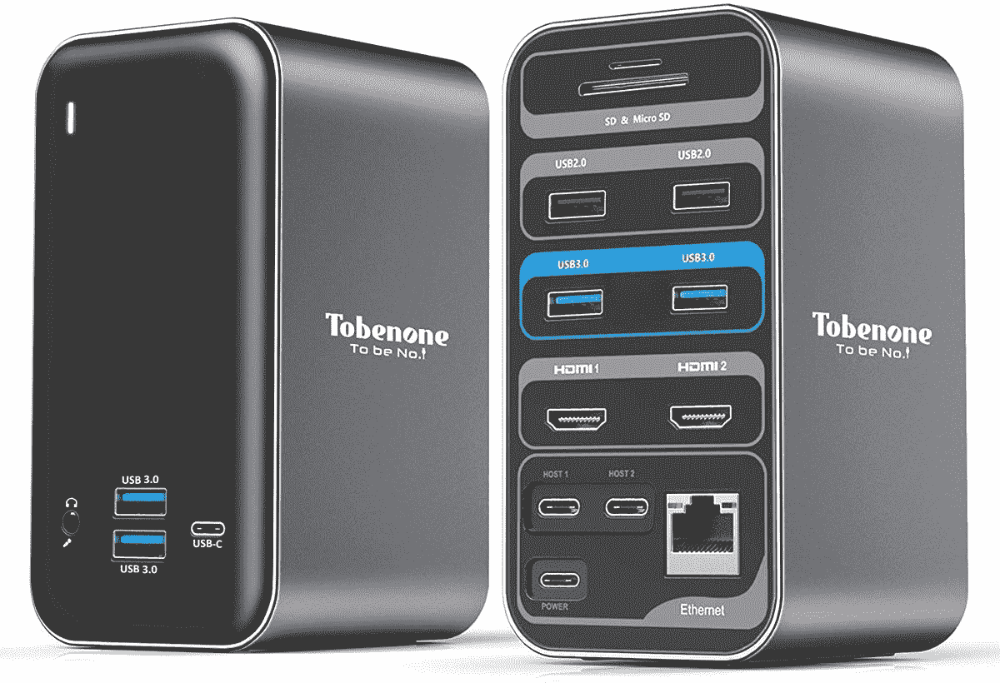

# 联想 Yoga 6 (2023)有迅雷吗？

> 原文：<https://www.xda-developers.com/lenovo-yoga-6-2023-thunderbolt/>

联想 Yoga 6 (2023) 将于今年四月晚些时候发布。它与上一代相比没有太大变化，但它仍有望成为一款 1000 美元以下的伟大的[笔记本电脑和去年型号的坚实后续。但是随着 AMD CPUs 在引擎盖下的轻微碰撞，这意味着 Yoga 6 (2023)仍然没有 Thunderbolt 4 端口。](https://www.xda-developers.com/best-laptops-under-1000/)

相反，Yoga 6 具有两个 USB 3.2 Gen 1 Type-C 端口、两个 USB 3.2 Gen 1 Type-A 端口、HDMI、3.5 毫米耳机插孔和 microSD 读卡器。所以在缺少 Thunderbolt 端口的情况下，你将无法为你的 Yoga 6 (2023)享受外部 GPU 外壳或 Thunderbolt 认证的扩展坞。话虽如此，如果你仍然想要一个坞站或[其他配件](https://www.xda-developers.com/best-accessories-lenovo-yoga-6-2023/)，还有很多选择。

## 迅雷 4 是什么，为什么不在联想 Yoga 6 (2023)上？

如果你还不知道，Thunderbolt 4 是 Thunderbolt 协议的最新版本，由英特尔开发和制造。不幸的是，尽管 Thunderbolt 使用 USB Type-C 连接器(你会在 Yoga 6 上看到)，但 Thunderbolt 本身仍然是一项专有技术，主要用于配备英特尔 CPU 的笔记本电脑和苹果的 MAC 电脑。因此，配备 AMD CPUs 的笔记本电脑，如联想 Yoga 6，无法利用它及其优势，如 PCIe 信号和以 60Hz 刷新率连接两个 4K 显示器的能力。未来采用 AMD CPUs 的笔记本电脑将拥有 USB 4，这使数据传输速度接近雷电 3，但它仍然不一样，也不支持 Yoga 6。

## 迅雷 4 的替代品

如果 Yoga 6 (2023)不支持雷电 4 也不用太担心。仍然有许多支持 USB-C 的坞站可以让您扩展端口，以及使用多个显示器的有限能力。下面有几个选项。

*   <picture></picture>

    可插拔的 UD-ULTC4K

    ##### 可插拔的 USB-C 4K 三显示器扩展坞

    这个扩展坞对于联想 Yoga 6 (2023)来说非常棒。这不是一个 Thunderbolt 坞站，但由于 DisplayLink 技术，它仍然可以让你享受三个 60Hz 的 4K 显示器。你还可以获得额外的端口，如 USB Type-A 和以太网，以及另一个 USB Type-C 端口，用于为 Yoga 6 充电。

*   ##### 肯辛顿三显示器 USB-C 扩展坞 SD4839P

    这是一款来自肯辛顿的紧凑型九合一扩展坞，支持三路视频输出。它还提供高达 85W 的功率和高达 10Gbps 的数据传输速度。

*   <picture></picture>

    tobe none USB-C 扩展坞

    ##### tobe none USB-C 扩展坞

    这款 USB-C 扩展坞是 Yoga 6 (2023)的终极端口集线器。您将获得多达 15 种不同的连接选项，包括对双显示器的支持。

    T34

虽然 Thunderbolt 可能有一些好处，但一旦 Yoga 6 (2023)在 4 月下旬上市，你仍然可以使用普通的 USB-C 配件享受它。在那之前，你可以看看我们的[最佳联想笔记本电脑](https://www.xda-developers.com/best-lenovo-laptops/)名单，其中许多都搭载了 Thunderbolt 4 技术。