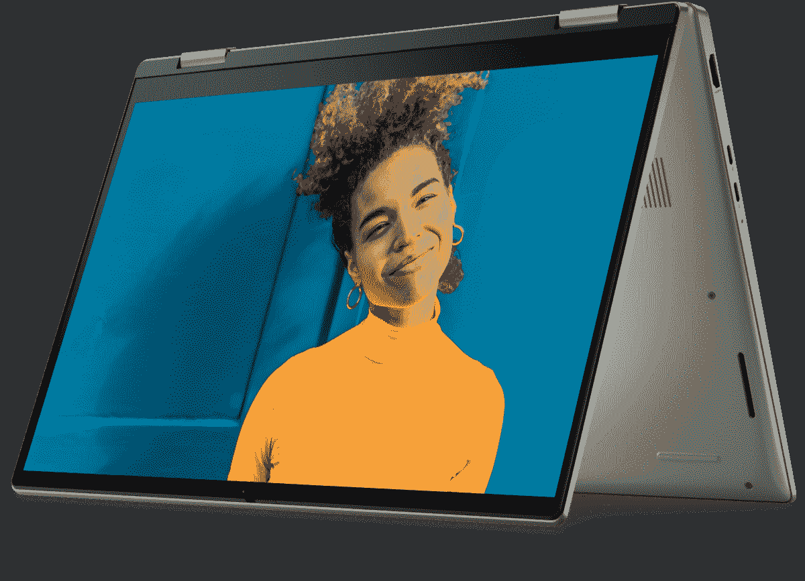

# 联想 Yoga 7i (2022)与戴尔 Inspiron 灵越 7000 二合一设备:两款主流二合一设备的比较

> 原文：<https://www.xda-developers.com/lenovo-yoga-7i-2022-vs-dell-inspiron-7000-2-in-1/>

联想 Yoga 7i T1 并不是唯一一款售价接近 1000 美元的 T2 2 合 1 Windows T3。戴尔还为那些想要更主流的 2 合 1 设备来处理网页浏览等日常任务的人提供了 Inspiron 灵越 7000 系列。对于许多人来说，这两款系统都具备成为[最佳笔记本电脑](https://www.xda-developers.com/best-laptops/)的条件，因为它们拥有相同的外形、设计，甚至 CPU 等级。然而，他们在一些领域存在分歧。我们将比较两者，看看哪一个适合你。一个更适合基本任务和预算内的任务，而另一个会给你更好的全面表现。

*   <picture></picture>

    联想 Yoga 7i

    ##### 联想 Yoga 7i (14 英寸)

    14 英寸型号的联想 Yoga 7i 包括第 12 代英特尔酷睿 U 系列处理器和 2.2K IPS 显示屏，在时尚的机箱中提供了性能和电池续航时间的完美平衡。

*   ##### 联想 Yoga 7i (16 寸英特尔 Arc)

    这款 16 寸联想 Yoga 7i 采用英特尔 Arc，该公司首款专用显卡。它为想要玩轻度游戏和编辑照片的用户提供了巨大的推动力。

    T34
*   <picture></picture>

    联想 Yoga 7i (16 英寸)带弧形显卡

    ##### 联想 Yoga 7i 二合一(16 英寸)

    联想 Yoga 7i 是一款出色的可转换笔记本电脑，拥有强大的处理能力和出色的 GPU，可用于轻度游戏以及照片和视频编辑。

*   <picture></picture>

    戴尔 Inspiron 灵越 14 二合一

    ##### 戴尔 Inspiron 灵越 14 二合一

    戴尔 Inspiron 灵越 14 是一款功能非常强大的可变形笔记本电脑，配有高屏幕和坚固的网络摄像头。

*   <picture></picture>

    戴尔 Inspiron 灵越 16 二合一设备(200 美元起)

    ##### 戴尔 Inspiron 灵越 16 二合一设备

    戴尔 Inspiron 灵越 16 二合一设备功能强大，配备 16 英寸大显示屏和英特尔酷睿 i7-1260P 处理器

## 联想 Yoga 7i (2022)与戴尔 Inspiron 7000 二合一设备:价格和可用性

您可以立即购买联想 Yoga 7i 或戴尔 Inspiron 7000 二合一设备。获得你想要的配置的最好方法是去他们各自制造商的网站购物——所以不是 Lenovo.com 就是 Dell.com。

有了联想 Yoga 7i，[有三种型号可以购买](https://www.xda-developers.com/lenovo-yoga-7i-2022-configurations/)。入门级型号有 14 英寸屏幕，中端有 16 英寸屏幕，高端有 16 英寸屏幕但添加了英特尔 Arc 专用移动 GPU。最便宜的 14 英寸 Yoga 7i 起价为 989 美元，中档为 1170 美元，高端型号为 1400 美元

在戴尔 Inspiron 7000 上，有四种型号可供选择。最便宜的是 Inspiron 灵越 14 二合一电脑，售价 600 美元。下一个是同样的型号，但是用了 800 美元的 AMD 芯片。中端产品是 Inspiron 灵越 16 二合一设备，售价为 749 美元。最后，还有最高端的 Inspiron 灵越 16 二合一设备，售价 1200 美元，配有有机发光二极管显示屏和 Nvidia MX550 显卡。

## 联想 Yoga 7i (2022)与戴尔 Inspiron 7000:规格

要进一步了解这些模型之间的区别，您可以查看下表。

|  | **联想 Yoga 7i (2022)** | **戴尔 Inspiron 灵越 7000 二合一设备** |
| --- | --- | --- |
| **操作系统** |  |  |
| **CPU** | 14 英寸:

*   英特尔酷睿 i5-1235U(最高 4.40 GHz，12MB 高速缓存，10 个内核 2 个 P 8 个 E，12 个线程)
*   英特尔酷睿 i7-1255U(最高 4.70 GHz，12MB 高速缓存，10 个内核，2 个处理器，8E，12 个线程)

16 英寸:

*   英特尔酷睿 i5-1240P(最高 4.40 GHz，12MB 高速缓存，12 个内核，4P，8E，16 个线程)
*   英特尔酷睿 i7-1260 处理器(最高 4.70 GHz，18MB 高速缓存，12 个内核，4 个处理器，8E，16 个线程)

采用英特尔 Arc 的 16 英寸:

*   英特尔酷睿 i5-12500H(最高 4.50 GHz，18MB 高速缓存，12 个内核，4P，8E，16 个线程)
*   英特尔酷睿 i7-12700H(最高 4.70 GHz，24 MB 高速缓存，14 个内核，6P，8 E，20 个线程)

 | Inspiron 灵越 14 二合一设备:

*   英特尔酷睿 i5-1235U(最高 4.40 GHz，12MB 高速缓存，10 个内核，12 个线程)
*   英特尔酷睿 i7-1255U(最高 4.70 GHz，12MB 高速缓存，10 个内核，12 个线程)
*   AMD 锐龙 7 5825U (8 个内核，20 MB 高速缓存)

Inspiron 灵越 16 二合一设备:

*   英特尔酷睿 i5-1235U(最高 4.40 GHz，12MB 高速缓存，10 个内核，12 个线程)
*   英特尔酷睿 i7-1260 处理器(最高 4.70 GHz，18MB 高速缓存，12 个内核，16 个线程)

 |
| **图形** | 14 英寸和 16 英寸采用英特尔 Arc 的 16 英寸:

*   英特尔 Arc A370M 4GB GDDR6

 | 

*   英特尔 Iris Xe
*   Nvidia GeForce MX550，2 GB GDDR6(仅限 Inspiron 灵越 16 2 合 1)

 |
| **显示** | 14 英寸:

*   14 英寸 2.2K LCD (2240 x 1400 分辨率)IPS，光滑触摸屏，300 尼特，100% sRGB，60 赫兹，16:10，低蓝光

16 英寸:

*   16 英寸 WQXGA (2560 x 1600 分辨率)IPS，光滑，带杜比视觉的触摸屏，400 尼特，100% sRGB，低蓝光

 | Inspiron 灵越 14 二合一设备:

*   14 英寸 FHD+ 1920 x 1200 分辨率，60 赫兹，触摸屏，窄边框，支持手写笔

Inspiron 灵越 16 二合一设备:

*   16 英寸 FHD+ 1920 x 1200 分辨率，60 赫兹，触摸，300 尼特，ComfortView Plus
*   16 英寸 UHD+ 3840 x 2400 分辨率，有机发光二极管，400 尼特，ComfortView Plus

 |
| **存储** | 14 英寸:

*   512GB M.2 2242 PCIe 第四代 TLC 固态硬盘
*   1TB 固态硬盘 M.2 2242 PCIe 第四代 TLC 固态硬盘

16 英寸:

*   256GB 固态硬盘 M.2 2242 PCIe 第四代 TLC 固态硬盘
*   512GB M.2 2242 PCIe 第四代 TLC 固态硬盘
*   1TB 固态硬盘 M.2 2242 PCIe 第四代 TLC 固态硬盘

采用英特尔 Arc 的 16 英寸:

*   512GB M.2 2242 PCIe 第四代 TLC 固态硬盘
*   1TB 固态硬盘 M.2 2242 PCIe 第四代 TLC 固态硬盘

 |  |
| **RAM** | 

*   8GB LPDDR5-4800MHz
*   16GB LPDDR5-4800MHz

 | 

*   8GB DDR 4 3200 MHz(2 个 4GB 记忆棒)
*   16GB DDR4 3200 MHz (2 个 8GB 记忆棒)

 |
| **电池** | 14 英寸:16 英寸:采用英特尔 Arc 的 16 英寸:

*   锂聚合物 99.99 瓦时电池

 | Inspiron 灵越 14 二合一设备:

*   4 芯 54 瓦时集成式

Inspiron 灵越 16 二合一设备:

*   集成 6 芯 87 瓦时电池

 |
| **港口** | 14 英寸:

*   2 个 USB-C Thunderbolt 4 1 个 HDMI 2.01 1 个 microSD 读卡器，1 个 USB-A，1 个音频组合插孔，

16 英寸:

*   2 个 USB-C Thunderbolt 4 1 个 HDMI 2.01 1 个 SD 读卡器，2 个 USB-A，1 个音频组合插孔，

 | Inspiron 灵越 14 二合一设备:

*   2 个 USB 3.2 Gen 2x1 Type-C、1 个 USB 3.2 Gen 1 Type-A 端口、1 个耳机端口、1 个 HDMI 1.4 端口(HDMI 支持的最大分辨率为 1920x1080 @60Hz。无 4K/2K 输出。)

Inspiron 灵越 16 二合一设备:

*   2 个 Thunderbolt 4，2 个 USB 3.2 Gen 1 Type-A 端口，1 个耳机端口，1 个 HDMI 1.4 端口(HDMI 支持的最大分辨率为 1920x1080 @60Hz。无 4K/2K 输出。)

 |
| **音频** | 14 英寸:

*   4 个扬声器(2 个 2W 高音扬声器，2 个 2W 低音扬声器)

16 英寸:

*   4 个扬声器(2 个 2W 高音扬声器 2 个 3W 低音扬声器)

 | Inspiron 灵越 14 二合一设备:

*   带 Waves MaxxAudio Pro 的立体声扬声器，2 瓦 x 2 = 4 瓦

Inspiron 灵越 16 二合一设备:

*   带 Waves MaxxAudio Pro 的四扬声器，2 瓦 x 4 = 8 瓦

 |
| **摄像机** | 

*   带隐私快门的 1080p FHD 红外照相机

 | Inspiron 灵越 14 二合一设备:

*   1080p，30 FPS，FHD 相机

Inspiron 灵越 16 二合一设备:

*   1080p，30 fps，FHD 摄像头，带 FHD+显示屏
*   1080p，30 fps，FHD+红外摄像头，带 UHD+有机发光二极管显示屏

 |
| **生物认证** | 

*   指纹识别器、Windows Hello 红外网络摄像头

 | 

*   指纹识别器、Windows Hello 红外网络摄像头

 |
| **连通性** | 

*   Wi-Fi 6E 2x2 AX
*   蓝牙 5.1

 | 

*   英特尔 Wi-Fi 6E (6GHz) AX211 2x2
*   蓝牙 5.2 无线网卡

 |
| **颜色** | 14 英寸:16 英寸:

*   北极灰或风暴灰

 | Inspiron 灵越 14 二合一设备:Inspiron 灵越 16 二合一设备:

*   铂金银
*   深绿色

 |
| **尺寸(WxDxH)** | 14 英寸:

*   12.47 x 8.67 x 0.68 英寸

16 英寸:

*   14.23 x 9.83 x 0.76 英寸

 | Inspiron 灵越 14 二合一设备:

*   12.36 x 8.96 x 0.70 英寸

Inspiron 灵越 16 二合一设备:

*   14.05 x 9.91 x 0.72 英寸

 |
| **重量** | 14 英寸16 英寸 | Inspiron 灵越 14 二合一设备:Inspiron 灵越 16 二合一设备:

*   5 磅，带 UHD+面板
*   4.62 磅，带 FHD+面板

 |
| **价格** | 14 英寸:16 英寸:采用英特尔 Arc 的 16 英寸 | Inspiron 灵越 14 二合一设备:

*   英特尔型号起价 600 美元
*   AMD 机型起价 800 美元

Inspiron 灵越 16 二合一设备:

*   起价 749 美元
*   英伟达显卡起价 1200 美元

 |

## 设计:这两款都是二合一设备

这些二合一设备之间的整体设计差异就不多说了。二者共享相同的外形和设计元素。这两款产品也有 14 英寸和 16 英寸两种尺寸。在重量、键盘设计和颜色选择方面有一些小差异，但都是小差异。

两种型号都由优质铝材制成，而不是塑料。键盘之间略有不同。虽然 Yoga 7i 上的键盘面板是金属的，但戴尔提供了碳纤维键盘面板，但仅限于配备 Nvidia 显卡的 Inspiron 16 2 合 1 设备。

至于颜色，Yoga 7i 的风暴灰或风暴蓝看起来更有活力。不过，16 英寸的 Yoga 7i 车型无论是北极灰还是风暴灰，看起来都要更平一些。戴尔的 Inspiron 有铂金银，但 16 英寸的型号有整洁的深绿色。

在便携性方面，这两款设备几乎旗鼓相当，除了重量 Yoga 7i 14 英寸型号重 3.1 磅，而 16 英寸型号重 4.19 磅。与 Inspiron 相比，你可能会感觉到不同。Inspiron 灵越 14 二合一重量为 3.61 磅，因此更重，而 Inspiron 灵越 16 二合一重量为 4.62 磅，比 16 英寸 Yoga 7i 更重。

## 显示屏:两者都是 16:10，但联想的像素更多

联想 Yoga 7i 和戴尔 Inspiron 灵越 7000 系列都采用相似的 16:10 宽高比全可变显示屏。这意味着无论您选择哪一款二合一设备，您都可以轻松地同时处理多项任务并并排堆叠多个窗口。你还可以在多种模式下使用这些设备:帐篷、支架、平板电脑或笔记本电脑。最后，由于两者都支持笔输入，您还可以使用可选的手写笔在屏幕上书写(两种型号都需要单独购买)。

从本文顶部的表格可以看出，联想的 14 英寸 Yoga 7i 标配了 14 英寸 2240 x 1400 分辨率的显示屏。16 英寸 Yoga 7i 的分辨率高达 2560 x 1600。与只有 1920 x 1200 分辨率的 Inspiron 灵越 14 二合一或 Inspiron 灵越 16 二合一相比，这些型号的像素更多，可用于多任务处理。如果您想要更高分辨率的戴尔 2 合 1 设备，您必须购买配备 OLED 面板的 Inspiron 灵越 16，它可以将分辨率提升至 3840 x 2400。

我们认为联想的显示屏会胜出，因为 Yoga 7i 拥有更高分辨率的面板标准。不过，戴尔在高端机型上有一个有机发光二极管选项，所以如果你想要最好的图像质量，这可能是你的选择。

## 端口和连接:14 英寸 Yoga 7i 拥有 Thunderbolt 和 microSD 存储

如果端口对您很重要，那么您应该记住，与戴尔 Inspiron 灵越 7000 系列相比，联想 Yoga 7i 有一个优势。你看，尽管 14 英寸 Yoga 7i 和戴尔 Inspiron 14 二合一设备上都有 USB-C、HDMI 和 USB-A，但 Yoga 上还有两个我们喜欢的端口:Thunderbolt 和 microSD 卡存储。

联想提供所有型号的 Yoga 7i 和 Thunderbolt 4 以及 microSD 卡存储。然而，由于戴尔 Inspiron 灵越 14 配备了 AMD 选项，所以你不会在更便宜的型号上获得 Thunderbolt。您只能在更高端的 Inspiron 16 二合一设备上获得它。Thunderbolt 对每个人来说都不重要，但它确实让你可以本机驱动双外部显示器，以及连接外部 GPU。

至于网络摄像头和 Wi-Fi，这两款设备都有 1080p 网络摄像头和 Wi-Fi 6E。但是，Windows Hello 对于 Dell Inspiron 7000 系列是可选的。在瑜伽上，这是标准的。

## 性能:联想 Yoga 7i 有更多的 CPU 选项

能够定制您的 CPU 选项是一个巨大的优势，这就是为什么我们让 Yoga 7i 在这里获胜。它有很多不同的 CPU 选项，包括 14 英寸型号上的英特尔 15 瓦 U 系列芯片，16 英寸型号上的英特尔 28 瓦 P 系列芯片，以及英特尔 Arc graphics 型号上的英特尔 H 系列 45 瓦芯片。所有这些芯片都具有性能和效率内核，可带来额外的性能优势。至于内存，这两款设备都有 8GB 或 16GB 的选项。

与 Yoga 7i 相比，Dell Inspiron 灵越 7000 系列唯一的优势是 AMD 选项，它可以延长电池寿命。它不提供英特尔的 H 级芯片，最大使用 28 瓦的 P 系列 CPU。

与戴尔 Inspiron 7000 系列相比，Lenovo Yoga 7i 在不同型号上提供了更多的 CPU 选项。

对于大多数人来说，基本型号 Yoga 7i 和戴尔 Inspiron 灵越 14 二合一设备中的 U 系列芯片将非常棒。这款 CPU 在两款入门级机型上都是完全一样的。考虑到 Inspiron 灵越 600 美元的价格更便宜，如果你不介意较低分辨率的屏幕，它将更适合网页浏览或办公室工作等日常任务。

如果您需要更高的性能来处理视频编辑或轻度游戏等任务，我们建议您购买采用英特尔 Arc 显卡的联想 Yoga 7i 16 英寸笔记本电脑。该型号有 45 瓦的芯片，而最高端的 Inspiron 灵越 16 二合一设备只有 28 瓦的芯片。由于 VRAM 更高，英特尔 Arc A370M 4GB GDDR6 显卡在 Inspiron 16 二合一设备上的性能也将优于 Nvidia 的 MX550 显卡。使用戴尔，您将错过有机发光二极管屏幕。

## 联想 Yoga 7i (2022) vs 戴尔 Inspiron 7000 二合一:该买哪个？

为了物有所值，你应该买联想 Yoga 7i。它拥有比 Dell Inspiron 7000 二合一显示器更高的分辨率，并集成了更好的端口和 CPU。不过，如果价格是你考虑的一个因素，那么戴尔 Inspiron 灵越 7000 二合一设备是值得购买的产品，因为它比 900 美元的 Yoga 7i 便宜 600 美元，而且基本型号仍应提供出色的性能，特别是对于日常任务。

*   <picture></picture>

    联想 Yoga 7i

    ##### 联想 Yoga 7i (14 英寸)

    14 英寸型号的联想 Yoga 7i 包括第 12 代英特尔酷睿 U 系列处理器和 2.2K IPS 显示屏，在时尚的机箱中提供了性能和电池续航时间的完美平衡。

*   ##### 联想 Yoga 7i (16 寸英特尔 Arc)

    这款 16 寸联想 Yoga 7i 采用英特尔 Arc，该公司首款专用显卡。它为想要玩轻度游戏和编辑照片的用户提供了巨大的推动力。

    T34
*   <picture></picture>

    联想 Yoga 7i (16 英寸)带弧形显卡

    ##### 联想 Yoga 7i 二合一(16 英寸)

    联想 Yoga 7i 是一款出色的可转换笔记本电脑，拥有强大的处理能力和出色的 GPU，可用于轻度游戏以及照片和视频编辑。

*   <picture></picture>

    戴尔 Inspiron 灵越 14 二合一

    ##### 戴尔 Inspiron 灵越 14 二合一

    戴尔 Inspiron 灵越 14 是一款功能非常强大的可变形笔记本电脑，配有高屏幕和坚固的网络摄像头。

*   <picture></picture>

    戴尔 Inspiron 灵越 16 二合一设备(200 美元起)

    ##### 戴尔 Inspiron 灵越 16 二合一设备

    戴尔 Inspiron 灵越 16 二合一设备功能强大，配备 16 英寸大显示屏和英特尔酷睿 i7-1260P 处理器