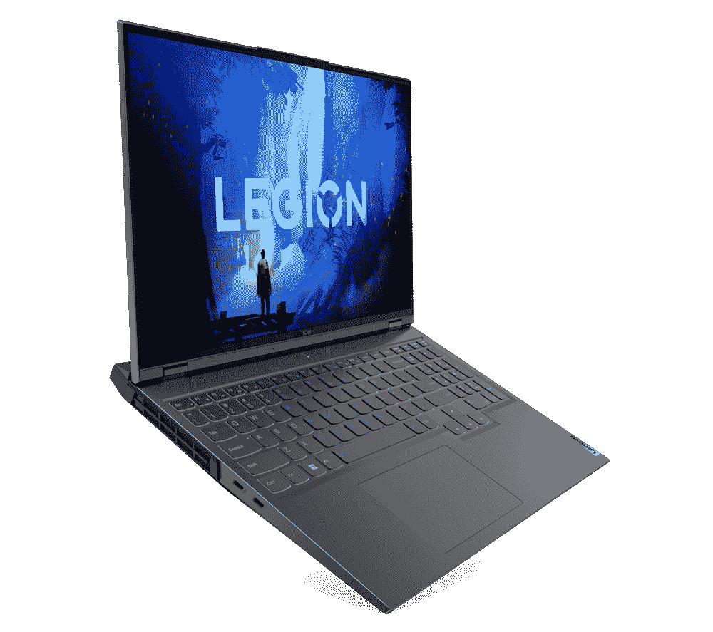

# 购买这款多功能的联想 Yoga 7i，仅售 865 美元

> 原文：<https://www.xda-developers.com/lenovo-yoga-7i-deal/>

##### 联想 Yoga 7i (2022)

14 英寸型号的联想 Yoga 7i 包括第 12 代英特尔酷睿 U 系列处理器和 2.2K IPS 显示屏，在时尚的机箱中提供了性能和电池寿命的完美平衡。

寻找搭载 Windows 11 的新二合一设备，迎接新的一年？你可能想去联想。从现在起到 1 月 29 日，该公司对 [Yoga 7i 二合一](https://www.xda-developers.com/lenovo-yoga-7i-2022-review/)提供折扣价。这意味着，你可以节省近 33%的多功能设备，非常适合工作、学校和其他场合，并且只需 865 美元就可以购买 Yoga 7i，而不是通常的 1300 美元。

正在销售的 Yoga 7i 型号配备了第 12 代英特尔酷睿 i5-12345U 处理器、16GB 内存和 512GB 固态硬盘。至于显示器，嗯，它是一个很棒的 16:10 纵横比的显示面板，分辨率为 2240 x 1400。我们审查了一个类似的模型，这个销售单位，并喜欢它。整体设计感觉很个性化，但不浮华，圆形磨砂边缘有助于将该设备与我们评论过的其他设备区分开来。别忘了，英特尔第 12 代 U 系列 CPU 提供舒适准确的键盘和稳定的性能，可满足网页浏览和工作等日常需求。

当然，如果你觉得瑜伽 7i 不适合你，那么不要太担心。联想还有其他设备在打折，大多数交易持续到 2 月 5 日，直到供应结束。我们收集了一些您可能会喜欢的联想笔记本电脑。有一些很棒的游戏笔记本电脑，ThinkPad 笔记本电脑，甚至是最好的 ChromeOS 平板电脑中的一款。

商务人士可能会喜欢 ThinkPad P16s 的 Nvidia T550 GPU(售价 1280 美元)。对于游戏玩家来说，16 英寸的 Legion 5i Pro Gen 7(售价 570 美元)非常划算，因为它采用了英伟达 RTX 3060 GPU，以及第 12 代英特尔 CPU 和 165Hz 屏幕。最后，还有一直受欢迎的联想 Chromebook Duet 5，现在降价 85 美元。所有这些优惠都不需要优惠券代码。

 <picture></picture> 

Lenovo Legion 5i Pro

##### 联想军团 5i Pro

联想军团 5i Pro 是一款功能非常强大的游戏笔记本电脑，具有顶级配置和出色的显示屏

##### 联想 Chromebook Duet 5

联想 Chromebook Duet 拥有充满活力的有机发光二极管显示屏和宽敞的键盘，是 ChromeOS 平板电脑的出差族

所有这些优惠都是在 ThinkPad X1 Carbon、ThinkPad X1 Yoga Gen 7 和其他受欢迎的 ThinkPad 型号已经降价的销售之上的[。您还可以在游戏显示器和游戏配件上找到折扣。只需前往](https://www.xda-developers.com/lenovo-thinkpad-january-2023-deals-x1-carbon/)[联想的门户网站登陆页面](https://shop-links.co/link/?exclusive=1&publisher_slug=xda&article_name=Grab+this+versatile+Lenovo+Yoga+7i+for+just+%24865+while+it+lasts&article_url=https%3A%2F%2Fwww.xda-developers.com%2Flenovo-yoga-7i-deal%2F&u1=UUxdaUeUpU1001872&url=https%3A%2F%2Fwww.lenovo.com%2Fus%2Fen%2Fd%2Fdeals%2Fdoorbusters%2F%3FsortBy%3DpriceDown)了解更多信息。