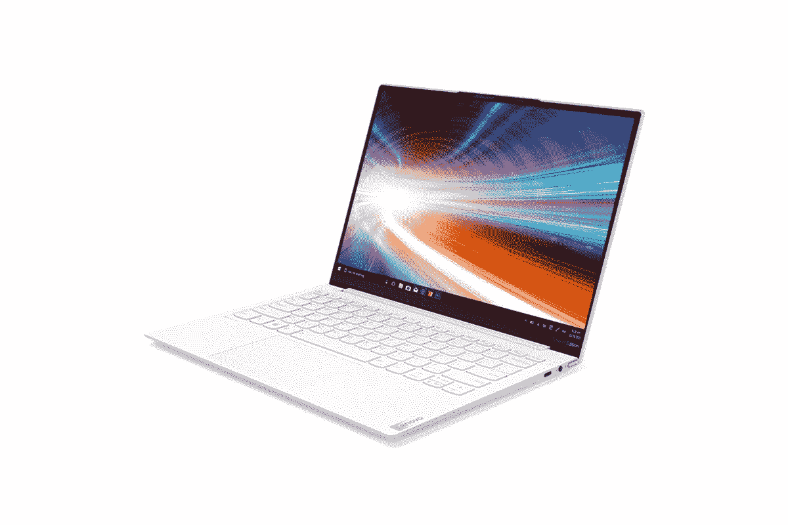

# 搭载英特尔第 11 代处理器的联想 Yoga Slim 7i Carbon 在印度发布

> 原文：<https://www.xda-developers.com/lenovo-yoga-slim-7i-carbon-india-launch/>

# 联想 Yoga Slim 7i Carbon 登陆印度，从₹1,19,990 开始定价

联想将把其超轻的 Yoga Slim 7i Carbon 笔记本电脑带到印度，该电脑采用最新的英特尔第 11 代处理器。请继续阅读！

联想在其 Yoga 系列下为印度客户推出了一款新的超极本。新的 Yoga Slim 7i Carbon 由坚硬但超轻的碳材料制成，具有独特的白色涂层。它的重量仅为 966 克，据联想称，它通过了严格的内部可靠性测试和九项军用级耐用性测试，符合 MIL-STD-810G 标准。新的 Yoga Slim 7i Carbon 还通过了英特尔 EVO 认证，这意味着它符合英特尔列出的优质超极本体验标准。期待更快的连接速度、改进的内存管理和更长的电池续航时间。说到这里，联想声称 50 瓦时的电池可以持续 15 个小时，但我们想自己测试一下。

## 联想 Yoga Slim 7i:规格

| 

规格

 | 

联想 Yoga Slim 7i

 |
| --- | --- |
| **尺寸&重量** | 

*   295.9×208.85×14.25 ~ 15 毫米
*   966 克

 |
| **显示** | 

*   13.3 英寸 2K (2560 x 1600) IPS
*   杜比视觉
*   300 尼特
*   百分百 sRGB

 |
| **处理器** | 

*   英特尔酷睿 i5-1135G7
*   英特尔酷睿 i7-1165G7

 |
| **GPU** |  |
| **内存&存储** | 

*   8GB/16GB LPDDR4X 4266MHz
*   高达 1TB 的 PCIe NVMe 固态硬盘

 |
| **电池&充电器** | 

*   50 瓦时(声称 15 小时)
*   65W 充电器

 |
| **输入/输出** | 

*   2 x 雷电 4
*   USB 3.2 Gen 2 Type-C(显示端口和 PD)
*   3.5 毫米耳机/麦克风组合插孔

 |
| **连通性** |  |
| **操作系统** |  |
| **其他功能** | 

*   Windows Hello 人脸识别
*   背光键盘
*   杜比大气
*   MIL-STD-810G 标准认证

 |

这款笔记本电脑采用 13.3 英寸 2.5K (2560x1600 像素)分辨率的 IPS 防眩光显示屏，提供 100%的 sRGB 覆盖率。它将由最新的英特尔第 11 代 Tiger lake 处理器提供动力，可以选择酷睿 i5-1135G7 或酷睿 i7-1165G7 。内存选项包括 8GB 或 16GB 的 LPDDR4X，主频为 4266MHz，但预计不可由用户升级。存储选项包括高达 1TB 的 PCIe 第三代 NVMe 固态硬盘，而图形功能则由新的第 11 代处理器上的英特尔集成 Xe 图形芯片处理。

在连接方面，你可以期待 Wi-Fi 6 和蓝牙 5.0，同时你还可以获得两个 [Thunderbolt 4](https://www.xda-developers.com/best-thunderbolt-4-laptops/) 端口，一个带 DisplayPort 和电源传输的 USB 3.2 Gen 2 Type-C 端口，以及一个标准的 3.5 毫米耳机和麦克风组合插孔。还有一个 720p 红外摄像头，支持 Windows Hello 人脸识别快速登录和 65W 充电，采用联想快速充电升压和标准 USB 供电。

### 定价和可用性

这款笔记本电脑将从今天开始在联想印度的官方网站上销售，而其他线下和在线零售商(包括[亚马逊](https://www.amazon.in/Lenovo-Carbon-Ultra-Light-Material-82EV003WIN/dp/B08ZCLMFHD?tag=xdaportalin-21))将从 3 月 25 日开始销售。联想 Yoga Slim 7i Carbon 在₹1,19,990 的起价约为 1655 美元。

 <picture></picture> 

Lenovo Yoga Slim 7i

##### 联想 Yoga Slim 7i

新的联想 Yoga Slim 7i 是最轻的笔记本电脑，重量仅为 966 克，采用实心碳纤维表面，带有特殊的白色涂层。